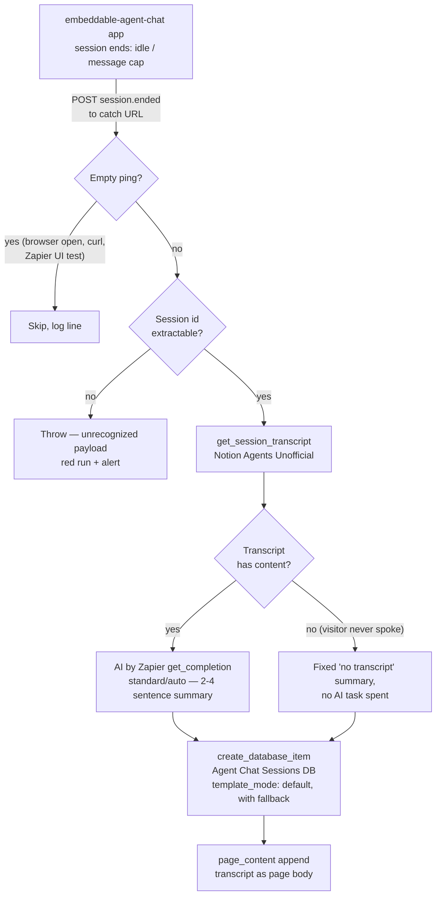

# agent-chat-session-to-notion

Logs every ended website-chat session to Notion. When the
[embeddable-agent-chat](https://github.com/work-flowers/embeddable-agent-chat)
Lovable app decides a widget session is over (idle rollover or message cap), it
POSTs a `session.ended` event to this Zap's catch URL. The Zap fetches the full
transcript through the **Notion Agents Unofficial** custom integration
(`App245513CLIAPI@1.0.0`), summarises it with AI by Zapier, and creates a record
in the **Agent Chat Sessions** Notion database with the transcript as the page
body.



## Trigger

`WebHookCLIAPI@1.1.1` / `hook_v2` catch hook. The sender is the
embeddable-agent-chat app's cron-driven webhook dispatcher
(`src/server/sessionWebhooks.server.ts`): session endings are queued in a
`widget_session_endings` table and drained by `POST /api/cron/close-sessions`,
with up to 5 retries and exponential backoff per delivery. The webhook URL is
configured **per widget** in that app's UI ("Webhook URL" field) — after first
publish, paste this Zap's `webhook_url` there.

Payload (metadata only — no message bodies):

```json
{
  "event": "session.ended",
  "event_id": "<uuid — dedupe key, also sent as X-Webhook-Event-Id>",
  "occurred_at": "<timestamptz>",
  "end_reason": "idle | message_cap",
  "widget": { "id": "…", "name": "…", "agent_id": "…", "agent_name": "…" },
  "session": {
    "notion_session_id": "<the id this Zap fetches the transcript with>",
    "visitor_id": "…",
    "message_count": 2,
    "started_at": "…", "last_message_at": "…", "ended_at": "…"
  }
}
```

The agent id rides along at `widget.agent_id` (nested, not top-level), but the
transcript fetch needs only `session.notion_session_id` — the custom
integration's `agent_id` input is just a dropdown filter.

The sender can HMAC-sign the body (`X-Signature: sha256=…`) when a signing
secret is set on the widget. This Zap does **not** verify the signature: the
payload carries only ids, and the transcript is re-fetched from Notion Agents,
so the worst a forged POST can do is create a junk log row (or a red run when
the session id doesn't resolve).

## Destination

**Agent Chat Sessions** Notion database, data source
`64e3a5e5-846c-4b95-bac6-d149e0284f39` (created 2026-08-26; filed under
Marketing → Databases). Properties written: Name (session title), Summary,
Session ID, Agent (select), Agent ID, Widget, End Reason (select), Session
Status (select), Visitor ID, Messages, Started At, Ended At, Model, Agent
Version, and Event ID (the sender's idempotency key, so duplicates are
findable). The full transcript is appended as the page body (capped at 40k
chars). Creation goes through `createItemWithTemplate`, so a default template
added to the data source later is picked up with no code change.

## Guards

- **Empty ping → skip** (`isEmptyPing`): pasting the catch URL into a config
  field, opening it in a browser, or curling it delivers an empty body — routine
  setup noise, logged and skipped.
- **Non-empty payload with no extractable session id → throw.** That's a real
  event whose shape we failed to understand (sender schema change or bug), and
  this repo's mechanism is the default: a red run and a Zapier error alert.
  Verified on 12 payload shapes including `{}`, `null`, `""`, wrapper-only,
  `{"data":{}}`, an empty-string id, and single/double-encoded real payloads.
- **Session with no messages → logged without an AI call**, with a fixed
  "no transcript content" summary. An empty ping can never reach the write path;
  there is no payload that means "do the default thing".
- **Absence stays absent**: missing counts/dates/names leave the Notion property
  empty rather than becoming `0` or `""`.

## AI step

AI by Zapier `get_completion` on built-in credentials, **`standard/auto`** (1×
task). Prompt lives in
[`agent-chat-session-to-notion-prompt.md`](agent-chat-session-to-notion-prompt.md)
(repo rule 6) — edit the markdown, then `node scripts/check-prompts.mjs --fix`.

### Verified behaviour (Standard tier, real sessions, 2026-08-26)

| Session | Shape | Standard-tier outcome |
| --- | --- | --- |
| "Definition of workFlowers" (2 msgs) | Simple Q&A | Accurate 2-sentence summary; correctly noted no follow-up signal. |
| "Help with Python script" (8 msgs) | Off-topic request + ToS question | Caught both topics, the agent's refusal/redirect, and the visitor's mild frustration — exactly the follow-up-signal analysis the prompt asks for. |
| "How to contact someone" (4 msgs) | Contact-info request | Named the contact form and scoping-call answers; correctly judged no strong buying intent. |

Re-run these (harness: `run-action` on `get_session_transcript` +
`get_completion`, no durable run needed) before changing tier.

## Idempotency

The sender retries failed deliveries up to 5 times, and a catch hook 200s
immediately, so duplicate deliveries are rare. Per this repo's default posture
the Zap accepts a rare duplicate page rather than pretending a check-then-write
is a lock; `Event ID` makes duplicates trivially findable.

## Testing

`run-durable` verified end-to-end 2026-08-26 (run `01a03cd6-56fc-7390-8d09-5932efa94d9c`)
with a real payload reaching the full main path: transcript fetched, Standard
summary produced, Notion page created with all properties and transcript body
(page `3c891b07-11ac-81e2-8b5f-d7a3ecf7a2e5` — a real test row in the database,
delete at will; its `Event ID` is `test-run-0001`).

## Cutover

1. Merge → the pipeline creates and publishes the Zap (enabled) and syncs the
   catch `webhook_url` into `zap.json`.
2. Paste that `https://hooks.zapier.com/hooks/catch/…` URL into the widget's
   "Webhook URL" field in the embeddable-agent-chat app (optionally set a
   signing secret there too — unverified here, see above).
