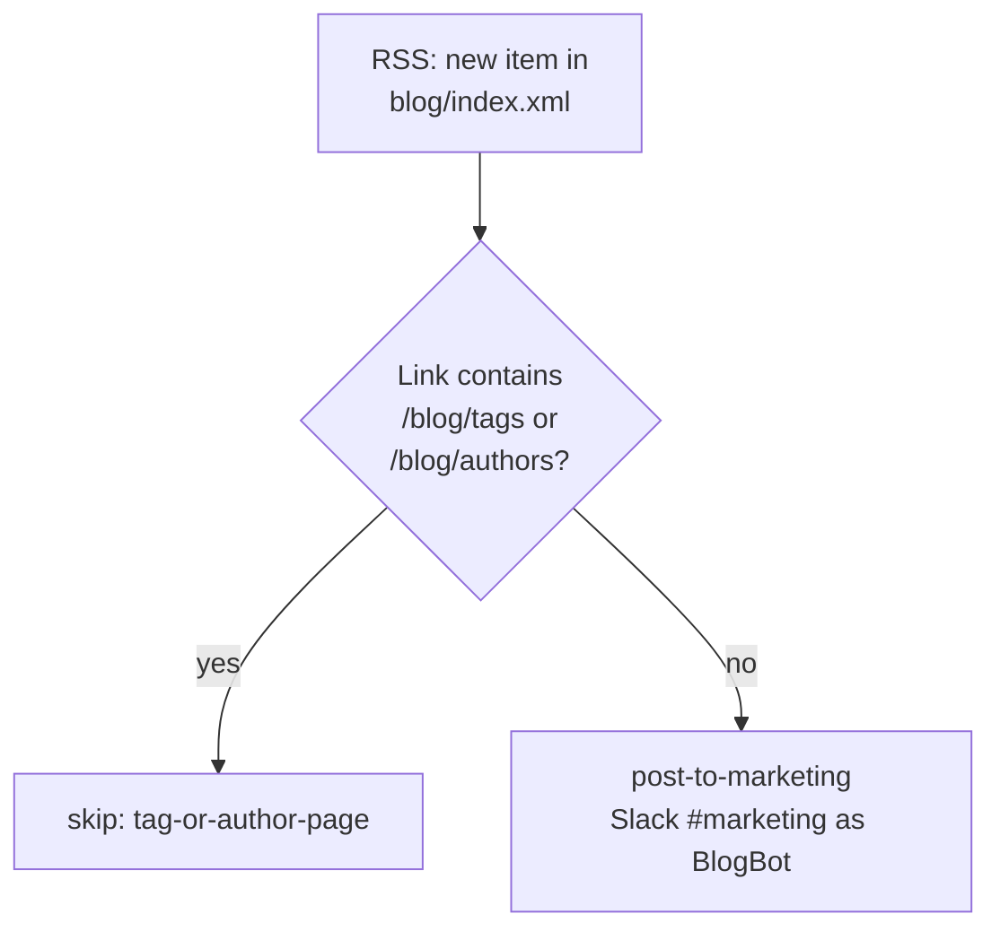

# blog-rss-to-slack

Durable that announces new work.flowers blog posts in Slack **#marketing**
(`C08GV0YNBK9`), posting as **BlogBot** (`:blogger:` icon, unfurl on):
`New <link|blog post> published`.

Replaces the classic Zap **"Share new Blog Posts in Slack"**.

- **Workflow ID:** `019fffd7-a3e5-733a-b85b-57bea38537c0` · account-visible ·
  **currently DISABLED** — see Cutover below
- **Trigger:** RSS by Zapier `new_feed` polling
  `https://www.work.flowers/blog/index.xml` (smart trigger style, default interval)
- **Editor:** https://zapier.com/durables-editor/019fffd7-a3e5-733a-b85b-57bea38537c0

## Behaviour notes

- The blog feed emits an entry when a new **tag** or **author** index page appears;
  those are filtered out exactly as the classic Zap did (substring match on
  `https://www.work.flowers/blog/tags` / `…/blog/authors`).
- A payload with content but no `link` throws loudly — that is a feed shape we failed
  to understand, not a non-event.
- Polling triggers never backfill: entries published while the workflow is disabled
  are not announced when it is re-enabled.

## Cutover checklist (from the classic Zap)

Running both Zaps double-posts every new entry, so this durable was published
**disabled**:

1. Turn **off** the classic Zap "Share new Blog Posts in Slack" in the Zapier UI.
2. Enable this durable:
   `zapier-sdk --experimental enable-workflow 019fffd7-a3e5-733a-b85b-57bea38537c0`
   (then update `enabled` in `zap.json`).

Do both together — the gap in between is a window where a new post goes unannounced
(no backfill), and overlap is a window of duplicates.

## Tested

- 2026-08-14 `run-durable`: tag-page payload skips (`tag-or-author-page`); real-post
  payload builds the exact classic message text (verified via `previewOnly`, no Slack
  post sent); empty-ping guard in place.
