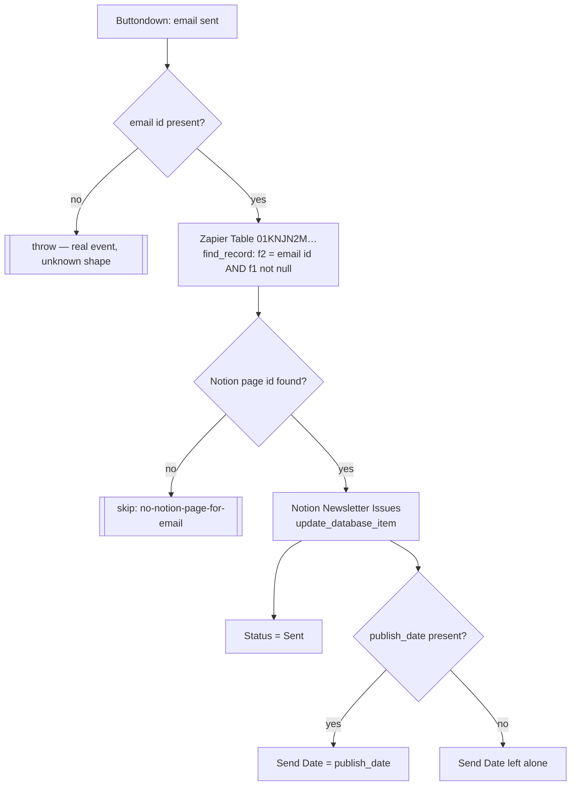

# buttondown-email-sent-to-notion-newsletter

A newsletter actually goes out in Buttondown → mark the Notion **Newsletter Issues** page `Sent` and stamp its **Send Date**.

The third leg of the newsletter loop:

| Zap | Direction | Fires when |
| --- | --- | --- |
| [`notion-newsletter-to-buttondown`](../notion-newsletter-to-buttondown/) | Notion → Buttondown | button pressed; creates the draft **and writes the mapping row the other two read** |
| [`update-notion-when-rescheduled-in-buttondown`](../update-notion-when-rescheduled-in-buttondown/) | Buttondown → Notion | send date set or changed while still scheduled |
| **this one** | Buttondown → Notion | the email is sent |

Migrated from the classic Zap **"Newsletter Sent -> Update Status in Notion"**.

## Trigger

Polling trigger `email` on the official Buttondown app (`ButtondownCLIAPI@2.0.4`), connection `workflowers`. Emits `id` and `publish_date`.

> **A durable trigger cannot set a polling interval.** Any custom interval the classic Zap had was silently dropped at migration.

## Workflow

## Why the miss is a skip, not a failure

**The trigger fires for every email Buttondown sends**, not only ones drafted from Notion. Anything composed directly in Buttondown has no mapping row, so a miss is a routine non-event — it logs and returns `{skipped: "no-notion-page-for-email"}`.

This is the exact trap that cost [`update-notion-when-rescheduled-in-buttondown`](../update-notion-when-rescheduled-in-buttondown/) 100% of its runs: the migrated code read `data[0].old.data.f1` unguarded, threw `TypeError: … reading 'old'`, and burned all five step retries raising alerts for events that were never ours.

A payload with **no email id** still throws, naming the keys it received.

The `f1 isnull false` half of the lookup is load-bearing: legacy rows exist with a null Page ID and must never match.

## What changed vs the classic Zap

| Change | Why |
| --- | --- |
| Miss on the Table → `skipped`, not a throw | See above. |
| `publish_date` is optional | A send event without one now still marks the issue `Sent`; the classic Zap would have written an empty date. |
| Missing email id throws with the keys received | Beats writing against `undefined`. |
| Returns ids only, not the Notion page echo | Keeps the step checkpoint small. |

## No conflict with the reschedule Zap

Both write `Send Date`, from the same `publish_date` source. They fire at different moments — that one while the email is still *scheduled*, this one when it *sends* — and write the same value, so the later write is a no-op. Only this Zap touches `Status`.

## Bindings

| Thing | Value |
| --- | --- |
| Notion connection | `02b73654-15c8-85c3-b16a-07304d2beb17` — **work.flowers**, never `Knoxx \| Dennis #2` |
| Notion data source | Newsletter Issues `0c691b07-11ac-82fa-bc1b-07d0186a095d` |
| Properties written | `Status` (status) → `Sent`; `Send Date` (date) — needs `use_zapier_datetime_fields: true` alongside it |
| Zapier Table | `01KNJN2MSBAJVXRME6M1Y65F5B` — f1 = Notion page id, f2 = Buttondown email id, f3 = created at |

Repo rule 5 (default templates) does not apply: this only ever updates an existing page.

## Verified 2026-08-10

| Path | Run | Result |
| --- | --- | --- |
| Main | `019febf6-f1f3-761d-bfb8-65cf43d8c456` | `em_1msefrj…` → page `93cdde00-…`, Status + Send Date written |
| Skip | `019febee-5990-744f-81b5-cf9c9ee7b3fa` | unmapped email id → `{skipped: "no-notion-page-for-email"}` |

The main-path issue ("What I Learned Optimising a Multi-Turn AI Agent") was picked because it was **already** `Sent` with Send Date `2026-04-07T01:00:00.000Z`, so the test wrote the values it found — a real end-to-end run against live data with no state change.

> One earlier main-path run (`019febe9-8c3f-…`) stalled in `started` with **zero** recorded operations and never completed. Identical code and input finished in seconds on retry, so this was a transient `run-durable` sandbox stall rather than a workflow defect. Worth recognising if it recurs.
