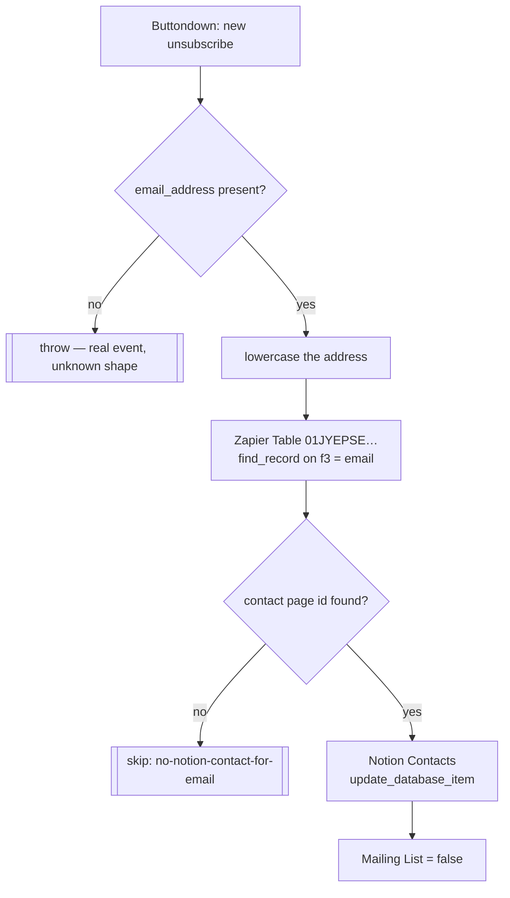

# buttondown-unsubscribe-to-notion-contact

Someone unsubscribes from the newsletter in Buttondown → untick **Mailing List** on their Notion contact.

The inbound mirror of [`new-buttondown-subscriber-update-in-notion`](../new-buttondown-subscriber-update-in-notion/), and it resolves the contact the same way: through the shared email → page-id Zapier Table, not a Notion query.

Migrated from the classic Zap **"Unsubscribe in Buttondown -> Update in Notion"**.

## Trigger

Polling trigger `new_unsubscribe` on the private **Buttondown Unofficial #2** app (`App240106CLIAPI@1.0.4`, source: `~/Repos/zapier-buttondown`) — the same app that carries `new_email_reschedule` for [`update-notion-when-rescheduled-in-buttondown`](../update-notion-when-rescheduled-in-buttondown/).

The official Buttondown app does expose an `unsubscriber` read, but it is `is_hidden` and therefore off the stable surface, so the private app stays.

Emits `email_address`.

> **A durable trigger cannot set a polling interval.** Any custom interval the classic Zap had was silently dropped at migration; this runs at the account default.

## Workflow

## Why the miss is a skip, not a failure

Buttondown holds addresses that were never CRM contacts — site sign-ups, imported lists, people who subscribed before a contact record existed. An unsubscribe from one of those is a **routine non-event**, so it logs and returns `{skipped: "no-notion-contact-for-email"}`.

The classic Zap got this right by accident: `_zap_search_success_on_miss: false` halts the Zap silently on a miss. A durable that read `data[0].old.data.f2` unguarded would instead throw and burn all five step retries — the bug that cost [`update-notion-when-rescheduled-in-buttondown`](../update-notion-when-rescheduled-in-buttondown/) 100% of its runs.

A payload with **no `email_address` at all** still throws, naming the keys it received. That is a real event whose shape we failed to understand, and silencing it would hide a bug.

## What changed vs the classic Zap

| Change | Why |
| --- | --- |
| Miss on the Table → `skipped`, not a throw | See above. |
| Lookup address is lowercased | The Table is indexed lowercase by [`contact-emails-to-zapier-table`](../contact-emails-to-zapier-table/); a mixed-case unsubscribe would have missed every row. |
| Missing `email_address` throws with the keys received | Beats writing against `undefined`. |
| Returns ids only, not the Notion page echo | `update_database_item` echoes the entire contact page — bio, cover, every relation. Keeps the step checkpoint small. |

## Bindings

| Thing | Value |
| --- | --- |
| Notion connection | `02b73654-15c8-85c3-b16a-07304d2beb17` — **work.flowers**, never `Knoxx \| Dennis #2` |
| Notion data source | Contacts `21991b07-11ac-81a6-a894-000be4a09a67` |
| Property written | `Mailing List` (checkbox) → `false` |
| Zapier Table | `01JYEPSEARXB2Z6BJRCMFGXBC2` — f2 = page id, f3 = email (lowercase) |

Repo rule 5 (default templates) does not apply: this only ever updates an existing page.

## Verified 2026-08-10

| Path | Run | Result |
| --- | --- | --- |
| Main | `019febe7-35e2-7a5c-a373-8bcb57cc1cd2` | `nitya@heyamos.com` → contact `04260295-…`, `Mailing List` written `false` |
| Skip | `019febf7-6119-7ccc-961f-e3836ee51929` | unmapped address → `{skipped: "no-notion-contact-for-email"}` |

The main-path contact was picked because its `Mailing List` was **already false**, so the test wrote the same value it found — a real end-to-end run against live data with no state change.
