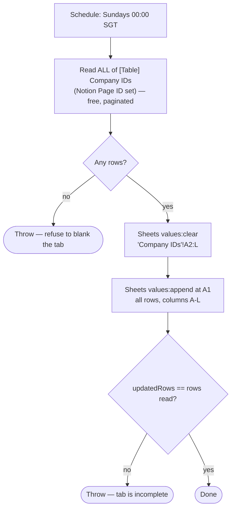

# company-ids-table-to-fivetran-sheet

Weekly schedule trigger → clear and rewrite the **"Company IDs"** tab of the
**Fivetran Sync Jobs** spreadsheet from every row of **[Table] Company IDs**.
That tab is what Fivetran syncs into the warehouse.

Migration of the classic Zap **"Refresh Company IDs Table in Fivetran Sheet"**.

- **Workflow ID:** _pending first publish_ (account-visible)
- **Trigger:** Schedule by Zapier `everyWeek`, Sundays at 12:00 AM
  Asia/Singapore (the account timezone — no override needed). No connection, no
  external URL.
- **Spreadsheet:** `1PzAG_XWwwmxFKo2LW9S8sJAnp8QVGndsnVhrSL8iQbo`, tab
  **"Company IDs"** (gid `288457717`), on the Work.Flowers HQ shared drive.
- **Table:** `01JM8PH8YM93A482M8BFZ6WKW6` — **read only**, owned by
  [`notion-companies-to-zapier-table`](../notion-companies-to-zapier-table/).

## Workflow

Columns, in header order, are declared as `COLUMNS` in
[`workflow.ts`](workflow.ts): `tables_record_id` (the Table's own record id,
Fivetran's key), then Harvest Client ID, Google Drive Folder ID, Company Name,
Slack Channel ID, Linear Customer ID, Domain, Slack Channel Is Archived, Notion
Company ID, Linear Team ID, Notion Page ID, Xero Contact ID.

## What changed vs the classic Zap

- **The delete range is no longer wrong.** The classic Zap computed
  `2-(N+1)` where `N` was the count of the *new* data, then appended. When the
  Table shrank, orphan rows survived below the new data; when it grew, it
  deleted rows it was about to rewrite. The durable clears `A2:L` outright, so
  the tab always matches the Table exactly.
- **The sheet can grow.** `values:append` extends the grid when the Table has
  outgrown it. The classic row-add path did not, and a plain `values.update`
  would have been rejected at the grid boundary.
- **An empty read aborts instead of wiping.** The mirror is never legitimately
  empty, so zero rows means the read failed — and blanking Fivetran's source on
  a failed read is exactly the mistake the "never blank what you failed to read"
  rule exists to stop.
- **A short write is caught.** The run throws if Sheets reports fewer written
  rows than were read, rather than leaving a silently truncated tab.
- **2 tasks instead of 4 steps.** Reading the Table goes through the SDK Tables
  API, which is free; only the two Sheets calls cost anything.

## Maintainer notes

- **The tab title is a contract.** The Sheets values API only accepts A1
  notation, so the workflow addresses the tab by name (`Company IDs`), not gid.
  Renaming it breaks this workflow — and Fivetran's own configuration.
- **Column order is a contract.** Fivetran keys on column A. If the tab's header
  row changes, update `COLUMNS` in `workflow.ts` in the same change.
- Sheets calls go through `GoogleSheetsV2CLIAPI` write `_zap_raw_request`
  (API Request (Beta)) rather than `sdk.fetch`, so they keep the connection's
  auth and Zapier's audit trail — see the raw-request note in `CLAUDE.md`.
- The whole refresh is **one** `ctx.step` on purpose: the ~1,000-row payload is
  never checkpointed, only the summary is, and a retry redoes the full refresh,
  which is idempotent because the Table is the source of truth.
- Link fields arrive as `{ link }` objects and booleans as real booleans; both
  are flattened to the strings the tab already holds (`TRUE`/`FALSE`).

## Cutover

**Pending.** The durable is published but **disabled**. To cut over:

1. Disable the classic Zap **"Refresh Company IDs Table in Fivetran Sheet"** in
   the Zapier UI.
2. `zapier-sdk --experimental enable-workflow <workflow_id>`
3. Record the date in `zap.json` under `cutover.classic_zap_disabled`.

Disable the classic Zap first if the two could fire in the same window — both
rewriting the same tab concurrently is the one way to get a mangled sheet.

## Testing

Not yet run. A run rewrites the production tab from the Table, so it is
idempotent and safe to trigger manually once the workflow exists
(`trigger-workflow <workflow_id>`), then check the tab's row count against the
Table. Read-only verification done so far: the tab's header and A-L layout, and
the Sheets `_zap_raw_request` GET path, were both confirmed against the live
spreadsheet.
