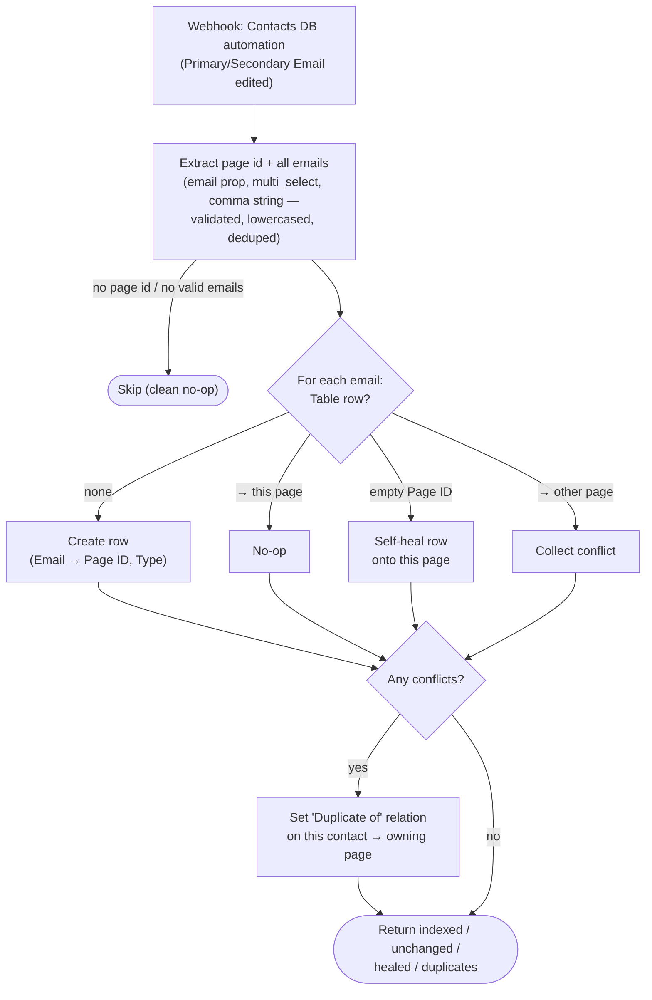

# Contact Emails → Zapier Table

Durable port of the classic Zap **"Update Zapier Table When Email Address Updated in
Contacts Database"**. Keeps the email → contact-page-id Zapier Table
(`01JYEPSEARXB2Z6BJRCMFGXBC2`) in sync whenever a contact's Primary or Secondary
Email changes in Notion.

This Table is load-bearing: the Luma guest workflows resolve contacts **exclusively**
through it (Secondary Email is a multi-select, which Notion's find action cannot
search). Any email on a contact that's missing from the Table produces a **duplicate
contact** the next time that person registers with it.

## Trigger

Notion DB automation on the **Contacts** DB (Primary Email or Secondary Email edited)
→ webhook (`WebHookCLIAPI@1.1.1` / `hook_v2`, no auth). Payload:
`{ data: { id, properties: { "Primary Email": { email }, "Secondary Email": { multi_select: [{ name }] } } } }`.

> ⚠️ **The Notion automation must POST to this workflow's webhook URL** (see
> `zap.json` → `trigger.webhook_url`). After deploying, repoint the automation and
> retire the old Zap.

## What it does

For every valid email on the contact (primary + each secondary, lowercased, deduped):

| Table state for that email | Action |
|---|---|
| No row | Create `{ Email, Page ID, Type: Primary/Secondary, Trigger Contact Creation: false }` |
| Row → this page | No-op |
| Row with empty Page ID | Self-heal: point the row at this page |
| Row → a **different** page | Leave the row (first owner keeps it); set this contact's `Duplicate of` relation to the owner (once, first conflict) |



## Gaps in the original Zap this port fixes

The predecessor is why 60 secondary emails went missing from the Table
(the root cause behind the 2026-07-24 duplicate-contact bug):

1. **Dead Secondary path** — the Zap mapped `properties["Secondary Email"].email`
   and comma-split it; that's the shape of an **email property**, but Secondary
   Email is a **multi-select** (`multi_select: [{ name }]`). After the property
   changed type, Path B's filter never matched and no secondary was ever indexed —
   silently. This port parses email / multi-select / array / comma-string shapes.
2. **The Zap was off** — the export shows every step `paused: true`; nothing at
   all was indexed while off.
3. **No lowercasing** — the Zap stored raw-case emails; the guest workflows look
   up lowercased, so those rows never matched (8 such rows found and fixed live).
   This port lowercases everything.
4. **`Merge Into` no longer exists** — Path B marked duplicates via a `Merge Into`
   relation that has since been removed from the Contacts schema (only
   `Duplicate of` / `Duplicated by` remain), so its dup-marking step would error.
   Both paths now use `Duplicate of`.
5. **Stale empty rows** — the original stopped when a matching row had an empty
   Page ID; this port self-heals such rows onto the triggering contact.

Dropped as unnecessary in a Durable: the two 1-minute **delay queues** (used to
serialize concurrent classic-Zap runs per email) and **Looping by Zapier** (a plain
loop over steps). Cross-run races can still theoretically double-create a Table row;
duplicate rows are benign (lookups take the first hit, both point at the same page).

## Known limitations

- **Removed emails leave their rows behind** (parity with the original). A stale row
  still points at the contact who once held the address — acceptable; delete manually
  if an address genuinely changes hands.
- The `Duplicate of` mark uses the **first** conflicting email only.

## Connections

| Alias | App key | Connection | Connection id |
|---|---|---|---|
| `notion_wf` | `NotionCLIAPI` | `work.flowers \| Dennis` | `02b73654-15c8-85c3-b16a-07304d2beb17` |

## Test

```bash
SOURCE_FILES="$(jq -n --rawfile workflow workflow.ts '{"workflow.ts": $workflow}')"
zapier-sdk --experimental run-durable "$SOURCE_FILES" \
  --dependencies '{"@zapier/zapier-sdk":"0.86.0","zod":"4.4.3"}' \
  --zapier-durable-version '0.9.1' \
  --connections '{"notion_wf":{"connectionId":"02b73654-15c8-85c3-b16a-07304d2beb17"}}' \
  --input '{"data":{"id":"<contact-page-id>","properties":{"Primary Email":{"email":"test@example.test"},"Secondary Email":{"multi_select":[{"name":"test2@example.test"}]}}}}' \
  --private
```

## Deploy

```bash
SOURCE_FILES="$(jq -n --rawfile workflow workflow.ts '{"workflow.ts": $workflow}')"
zapier-sdk --experimental create-workflow "contact-emails-to-zapier-table" \
  --description "Notion Contacts email edits -> index emails in the email->page-id Zapier Table." --private --json
# capture the workflow id, then:
zapier-sdk --experimental publish-workflow-version <workflow-id> "$SOURCE_FILES" \
  --dependencies '{"@zapier/zapier-sdk":"0.86.0","zod":"4.4.3"}' \
  --zapier-durable-version '0.9.1' \
  --connections '{"notion_wf":{"connectionId":"02b73654-15c8-85c3-b16a-07304d2beb17"}}' \
  --trigger '{"selected_api":"WebHookCLIAPI@1.1.1","action":"hook_v2","authentication_id":null,"params":{}}' \
  --enabled --json
```

Then point the Notion Contacts DB automation at the returned `webhook_url` and turn
off the predecessor Zap.
