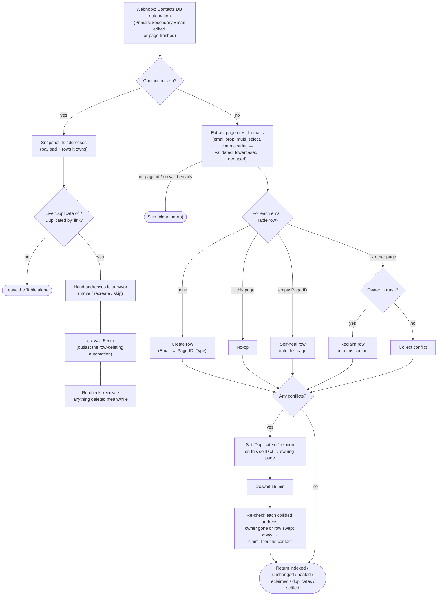

# Contact Emails → Zapier Table

Durable port of the classic Zap **"Update Zapier Table When Email Address Updated in
Contacts Database"**. Keeps the email → contact-page-id Zapier Table
(`01JYEPSEARXB2Z6BJRCMFGXBC2`) in sync whenever a contact's Primary or Secondary
Email changes in Notion.

This Table is load-bearing: the Luma guest workflows resolve contacts **exclusively**
through it (Secondary Email is a multi-select, which Notion's find action cannot
search). Any email on a contact that's missing from the Table produces a **duplicate
contact** the next time that person registers with it.

## Trigger

Notion DB automation on the **Contacts** DB (Primary Email or Secondary Email edited)
→ webhook (`WebHookCLIAPI@1.1.1` / `hook_v2`, no auth). Payload:
`{ data: { id, in_trash, properties: { "Primary Email": { email }, "Secondary Email": { multi_select: [{ name }] } } } }`.

The same webhook also accepts Notion's **integration-webhook** shape,
`{ type: "page.deleted", entity: { id } }`, so the `page.deleted` subscription can be
pointed here to drive the merge hand-over. It isn't today — see
[the trash-trigger note](#-the-trash-trigger-isnt-pointed-here-yet).

> ⚠️ **The Notion automation must POST to this workflow's webhook URL** (see
> `zap.json` → `trigger.webhook_url`). After deploying, repoint the automation and
> retire the old Zap.

## What it does

**If the triggering contact is in the trash** it's the losing half of a merge, so its
addresses are handed to the survivor — see [Merges](#merges) below. Otherwise, for every
valid email on the contact (primary + each secondary, lowercased, deduped):

| Table state for that email | Action |
|---|---|
| No row | Create `{ Email, Page ID, Type: Primary/Secondary, Trigger Contact Creation: false }` |
| Row → this page | No-op |
| Row with empty Page ID | Self-heal: point the row at this page |
| Row → a **trashed** page | Reclaim: point the row at this contact |
| Row → a different **live** page | Leave the row (first owner keeps it); set this contact's `Duplicate of` relation to the owner (once, first conflict) |

Page ids compare hyphen- and case-insensitively. The Table holds ids written by
several generations of automation, in both spellings; a mismatch used to read as
"someone else owns this address" and mark a contact a duplicate of itself.


```mermaid
flowchart TD
    A["Webhook: Contacts DB automation<br/>(Primary/Secondary Email edited,<br/>or page trashed)"] --> T{"Contact in trash?"}
    T -- yes --> M1["Snapshot its addresses<br/>(payload + rows it owns)"]
    M1 --> M2{"Live 'Duplicate of' /<br/>'Duplicated by' link?"}
    M2 -- no --> MS(["Leave the Table alone"])
    M2 -- yes --> M3["Hand addresses to survivor<br/>(move / recreate / skip)"]
    M3 --> M4["ctx.wait 5 min<br/>(outlast the row-deleting automation)"]
    M4 --> M5["Re-check: recreate<br/>anything deleted meanwhile"]
    T -- no --> B["Extract page id + all emails<br/>(email prop, multi_select, comma string —<br/>validated, lowercased, deduped)"]
    B -- "no page id / no valid emails" --> S(["Skip (clean no-op)"])
    B --> C{"For each email:<br/>Table row?"}
    C -- none --> D["Create row<br/>(Email → Page ID, Type)"]
    C -- "→ this page" --> E["No-op"]
    C -- "empty Page ID" --> F["Self-heal row<br/>onto this page"]
    C -- "→ other page" --> O{"Owner in trash?"}
    O -- yes --> R["Reclaim row<br/>onto this contact"]
    O -- no --> G["Collect conflict"]
    D --> H
    E --> H
    F --> H
    R --> H
    G --> H{"Any conflicts?"}
    H -- yes --> I["Set 'Duplicate of' relation<br/>on this contact → owning page"]
    I --> K["ctx.wait 15 min"]
    K --> L["Re-check each collided address:<br/>owner gone or row swept away →<br/>claim it for this contact"]
    L --> J
    H -- no --> J(["Return indexed / unchanged / healed /<br/>reclaimed / duplicates / settled"])
```

## Merges

Merging two contacts by hand means consolidating the addresses onto the survivor and
trashing the loser. Nothing in Notion tells the Table that happened, and **a separate,
older automation — not in this repo — deletes a contact's Table rows about 30–90s
after that contact is trashed.** For an ordinary delete that's right. For a merge it's
the bug: the loser's addresses now belong to the survivor, and once their rows are gone
the Luma guest workflows (which resolve contacts **only** through this Table) find
nothing and create a fresh duplicate the next time that person registers.

That is the loop behind the recurring Tun Shu duplicates. Measured on 2026-07-26, after
the pair was merged: `zuri@visibleone.com` — the surviving contact's *Primary Email* —
had no live row at all, and neither did either of Lim Le-Anne's work addresses.

Three paths converge on the fix, so it works whichever order the merge happens in:

- **Loser trashed** → its addresses are handed to the survivor. The survivor is read off
  the trashed page's own `Duplicate of` / `Duplicated by` relations — both ends, because
  which one holds the link depends on which contact got marked (and a merge that touched
  both contacts' emails ends up mutually linked). The first linked page that isn't itself
  trashed wins. The hand-over runs **twice**: immediately, then again after a 5-minute
  `ctx.wait`.
- **A collision is detected** → the run marks `Duplicate of` as before, then waits 15
  minutes and looks again. A collision is what a merge looks like from the inside: the
  addresses reach the survivor *before* the loser is trashed. If by then the other
  contact has gone to the trash, or its row has been swept away, the address is claimed
  for this contact; if it's still alive, nothing changes. **This is the path that
  currently does the work** — see the deploy note below.
- **Survivor's emails edited later** → any row whose owner is already in the trash is
  reclaimed onto the survivor.

### Why the hand-over runs twice

The deleting automation matches rows by **Page ID**, so re-pointing a row at the survivor
both fixes its ownership and takes it out of that automation's sights — verified live on
2026-07-26, where a row re-pointed just before the trash was still present four minutes
later, long after the deletion would have run. The immediate pass therefore usually wins
outright, and it closes the window in which an address belongs to nobody.

The second pass is the backstop for when the deleter wins anyway — this workflow queued
behind it, a retry, a slow tick. It re-checks each address and recreates any row that
went missing. Both passes are the same idempotent upsert (move the row / recreate it /
leave it alone if a *third* contact has since claimed the address), so running it twice
is harmless, and if the deleting automation is ever retired the second pass simply finds
everything already correct. The durable is suspended for the wait, so it costs nothing.

None of the paths guess. With no live duplicate link, the trashed contact's addresses
are left alone and the result says so; a collision whose owner is still alive is left
alone too. A missing or trash-pointed row is recoverable by the reclaim path, whereas a
row pointed at the *wrong* contact is silent, lasting corruption.

### ⚠️ The trash trigger isn't pointed here yet

Measured on 2026-07-26: the Contacts **DB automation** does not fire on trash — three
test contacts were trashed and not one produced a run here. Notion *is* emitting the
event, but as an **integration webhook** (`type: "page.deleted"`) aimed at the classic
Zap "Delete Contact, Company or Meeting Note Page from Zapier Table", which is what
sweeps the rows.

So the trash branch is correct but dormant, and the collision re-check is carrying the
load. That covers a merge done in one sitting (edit the survivor, trash the loser within
15 minutes); a merge where the loser is trashed hours later still strands its addresses.

To close the gap, **add this workflow's webhook URL as a second destination for that
`page.deleted` subscription**. No republish is needed: `extractContact` already reads
both payload shapes — the DB automation's `{ data: { id, properties } }` and the
integration webhook's `{ type: "page.deleted", entity: { id } }`, which carries the page
id on `entity` and no trash flag at all.

The longer-term shape is for this durable to own Contacts-table hygiene outright — merge
→ hand over, genuine delete → remove the rows — and for the classic Zap's Contacts branch
(path A) to be retired, leaving it Companies, Meeting Notes and Setup Sessions. That also
retires the settle wait, since nothing would be racing.

## Gaps in the original Zap this port fixes

The predecessor is why 60 secondary emails went missing from the Table
(the root cause behind the 2026-07-24 duplicate-contact bug):

1. **Dead Secondary path** — the Zap mapped `properties["Secondary Email"].email`
   and comma-split it; that's the shape of an **email property**, but Secondary
   Email is a **multi-select** (`multi_select: [{ name }]`). After the property
   changed type, Path B's filter never matched and no secondary was ever indexed —
   silently. This port parses email / multi-select / array / comma-string shapes.
2. **The Zap was off** — the export shows every step `paused: true`; nothing at
   all was indexed while off.
3. **No lowercasing** — the Zap stored raw-case emails; the guest workflows look
   up lowercased, so those rows never matched (8 such rows found and fixed live).
   This port lowercases everything.
4. **`Merge Into` no longer exists** — Path B marked duplicates via a `Merge Into`
   relation that has since been removed from the Contacts schema (only
   `Duplicate of` / `Duplicated by` remain), so its dup-marking step would error.
   Both paths now use `Duplicate of`.
5. **Stale empty rows** — the original stopped when a matching row had an empty
   Page ID; this port self-heals such rows onto the triggering contact.

Dropped as unnecessary in a Durable: the two 1-minute **delay queues** (used to
serialize concurrent classic-Zap runs per email) and **Looping by Zapier** (a plain
loop over steps). Cross-run races can still theoretically double-create a Table row;
duplicate rows are benign (lookups take the first hit, both point at the same page).

## Known limitations

- **Removed emails leave their rows behind** (parity with the original). A stale row
  still points at the contact who once held the address — acceptable; delete manually
  if an address genuinely changes hands.
- The `Duplicate of` mark uses the **first** conflicting email only.
- **A collision makes the run linger 15 minutes** (`CONFLICT_SETTLE_SECONDS`) before it
  finishes. The durable is suspended for the wait, so it costs nothing, but a bulk edit
  that collides on many contacts leaves that many runs open for a quarter of an hour.
- Trashing a contact that was never merged has no duplicate link to follow, so its
  addresses are left alone — and the other automation then deletes their rows. That is
  the correct outcome for a genuine delete.

## Connections

| Alias | App key | Connection | Connection id |
|---|---|---|---|
| `notion_wf` | `NotionCLIAPI` | `work.flowers \| Dennis` | `02b73654-15c8-85c3-b16a-07304d2beb17` |

## Test

```bash
SOURCE_FILES="$(jq -n --rawfile workflow workflow.ts '{"workflow.ts": $workflow}')"
zapier-sdk --experimental run-durable "$SOURCE_FILES" \
  --dependencies '{"@zapier/zapier-sdk":"0.86.0","zod":"4.4.3"}' \
  --zapier-durable-version '0.9.1' \
  --connections '{"notion_wf":{"connectionId":"02b73654-15c8-85c3-b16a-07304d2beb17"}}' \
  --input '{"data":{"id":"<contact-page-id>","properties":{"Primary Email":{"email":"test@example.test"},"Secondary Email":{"multi_select":[{"name":"test2@example.test"}]}}}}' \
  --private
```

To exercise the **merge hand-over**, point it at a trashed contact — the payload only
needs the id and the flag, since the addresses are also recovered from the Table:

```bash
--input '{"data":{"id":"<trashed-loser-page-id>","in_trash":true,"properties":{"Primary Email":{"email":"test@example.test"}}}}'
```

The **collision re-check** needs two live contacts sharing an address: run the workflow
against the survivor, wait for `mark-duplicate` to complete, trash the other contact
while the run sits in `conflict-settle`, and check the row 15 minutes later. Use
`get-durable-run <run-id>` to watch the operations list.

Both paths write to the real Table and real Notion — use throwaway `@example.test`
addresses and clean up afterwards.

## Deploy

```bash
SOURCE_FILES="$(jq -n --rawfile workflow workflow.ts '{"workflow.ts": $workflow}')"
zapier-sdk --experimental create-workflow "contact-emails-to-zapier-table" \
  --description "Notion Contacts email edits -> index emails in the email->page-id Zapier Table." --private --json
# capture the workflow id, then:
zapier-sdk --experimental publish-workflow-version <workflow-id> "$SOURCE_FILES" \
  --dependencies '{"@zapier/zapier-sdk":"0.86.0","zod":"4.4.3"}' \
  --zapier-durable-version '0.9.1' \
  --connections '{"notion_wf":{"connectionId":"02b73654-15c8-85c3-b16a-07304d2beb17"}}' \
  --trigger '{"selected_api":"WebHookCLIAPI@1.1.1","action":"hook_v2","authentication_id":null,"params":{}}' \
  --enabled --json
```

Then point the Notion Contacts DB automation at the returned `webhook_url` and turn
off the predecessor Zap.
