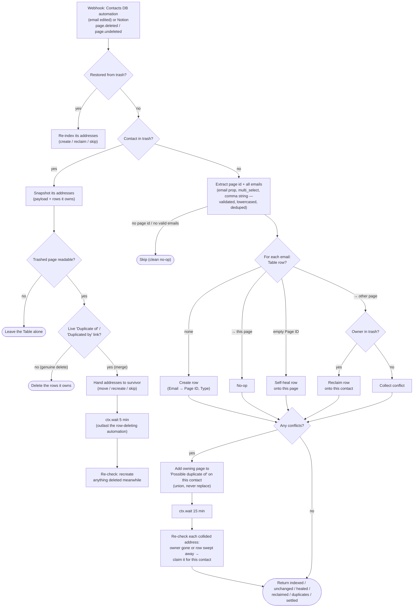

# Contact Emails → Zapier Table

Durable port of the classic Zap **"Update Zapier Table When Email Address Updated in
Contacts Database"**. Keeps the email → contact-page-id Zapier Table
(`01JYEPSEARXB2Z6BJRCMFGXBC2`) in sync whenever a contact's Primary or Secondary
Email changes in Notion.

This Table is load-bearing: the Luma guest workflows resolve contacts **exclusively**
through it (Secondary Email is a multi-select, which Notion's find action cannot
search). Any email on a contact that's missing from the Table produces a **duplicate
contact** the next time that person registers with it.

## Trigger

Notion DB automation on the **Contacts** DB (Primary Email or Secondary Email edited)
→ webhook (`WebHookCLIAPI@1.1.1` / `hook_v2`, no auth). Payload:
`{ data: { id, in_trash, properties: { "Primary Email": { email }, "Secondary Email": { multi_select: [{ name }] } } } }`.

The same webhook also accepts Notion's **integration-webhook** shape,
`{ type, entity: { id }, data: { parent: { data_source_id } } }`. The `page.deleted` and
`page.undeleted` subscriptions point here, which is what drives the merge hand-over, the
delete sweep and the restore.

> ⚠️ Those subscriptions are registered on the whole **Core CRM Objects** database, not
> just Contacts, so deletes and restores from every data source under it (Companies,
> Deals, …) arrive at this webhook. They are filtered out — see
> [Pages from other data sources](#pages-from-other-data-sources).

Notion's subscription-verification ping (`{ verification_token }`) has no page id, so it
lands as a clean skipped run. The token stays readable in that run's input, which is
where to fetch it when wiring a subscription up.

> ⚠️ **The Notion automation must POST to this workflow's webhook URL** (see
> `zap.json` → `trigger.webhook_url`). After deploying, repoint the automation and
> retire the old Zap.

## What it does

**If the triggering contact is in the trash**, it was either merged away (addresses go
to the survivor) or genuinely deleted (rows go with it). **If it was just restored from
the trash**, its addresses are re-indexed onto it. Both are covered in
[Merges, deletes and restores](#merges-deletes-and-restores) below.

Otherwise, for every valid email on the contact (primary + each secondary, lowercased,
deduped):

| Table state for that email | Action |
|---|---|
| No row | Create `{ Email, Page ID, Type: Primary/Secondary, Trigger Contact Creation: false }` |
| Row → this page | No-op |
| Row with empty Page ID | Self-heal: point the row at this page |
| Row → a **trashed** page | Reclaim: point the row at this contact |
| Row → a different **live** page | Leave the row (first owner keeps it); **add** the owner to this contact's `Possible duplicate of` relation (once, first conflict) |

Page ids compare hyphen- and case-insensitively. The Table holds ids written by
several generations of automation, in both spellings; a mismatch used to read as
"someone else owns this address" and mark a contact a duplicate of itself.


```mermaid
flowchart TD
    A["Webhook: Contacts DB automation<br/>(email edited) or Notion<br/>page.deleted / page.undeleted"] --> U{"Restored from trash?"}
    U -- yes --> RS["Re-index its addresses<br/>(create / reclaim / skip)"]
    U -- no --> T{"Contact in trash?"}
    T -- yes --> M1["Snapshot its addresses<br/>(payload + rows it owns)"]
    M1 --> M2{"Trashed page readable?"}
    M2 -- no --> MS(["Leave the Table alone"])
    M2 -- yes --> M2b{"Live 'Duplicate of' /<br/>'Duplicated by' link?"}
    M2b -- "no (genuine delete)" --> MD(["Delete the rows it owns"])
    M2b -- "yes (merge)" --> M3["Hand addresses to survivor<br/>(move / recreate / skip)"]
    M3 --> M4["ctx.wait 5 min<br/>(outlast the row-deleting automation)"]
    M4 --> M5["Re-check: recreate<br/>anything deleted meanwhile"]
    T -- no --> B["Extract page id + all emails<br/>(email prop, multi_select, comma string —<br/>validated, lowercased, deduped)"]
    B -- "no page id / no valid emails" --> S(["Skip (clean no-op)"])
    B --> C{"For each email:<br/>Table row?"}
    C -- none --> D["Create row<br/>(Email → Page ID, Type)"]
    C -- "→ this page" --> E["No-op"]
    C -- "empty Page ID" --> F["Self-heal row<br/>onto this page"]
    C -- "→ other page" --> O{"Owner in trash?"}
    O -- yes --> R["Reclaim row<br/>onto this contact"]
    O -- no --> G["Collect conflict"]
    D --> H
    E --> H
    F --> H
    R --> H
    G --> H{"Any conflicts?"}
    H -- yes --> I["Add owning page to<br/>'Possible duplicate of' on this contact<br/>(union, never replace)"]
    I --> K["ctx.wait 15 min"]
    K --> L["Re-check each collided address:<br/>owner gone or row swept away →<br/>claim it for this contact"]
    L --> J
    H -- no --> J(["Return indexed / unchanged / healed /<br/>reclaimed / duplicates / settled"])
```

## Why the flag is not `Duplicate of` (2026-07-28)

A shared address is a **hint**, not a verdict. Two people can share one — a shared
inbox, a typo, a founder's personal address on a colleague's record — so this
workflow writes `Possible duplicate of`, which nothing acts on automatically.

It used to write `Duplicate of`, and that property is the trigger for the **Contact
Merger** Notion Custom Agent, which merges the two records and deletes one. The two
readings of the same property fed each other:

```
this workflow sees one shared address
  → writes Duplicate of
    → Contact Merger merges the records
      → its merge writes Secondary Email
        → the Notion email automation fires
          → this workflow runs again, sees the newly-copied address
            → writes Duplicate of in the other direction …
```

On 2026-07-28 that ran six hops in three minutes on Sachin Kolekar (Knoxx Foods) and
Lionel Sim (The AI Capitol) — two unrelated people who shared exactly one address.
Lionel's bio, city, companies and event attendance were copied onto Sachin, Sachin's
meeting notes onto Lionel, and both records ended up pointing at each other. The
agent's next hop would have deleted a live contact. The same mechanism had already
consumed Leo Selie and a duplicate Lionel page over the preceding four days.

Two rules follow, and both matter:

- **Never write `Duplicate of` from a Zap.** It means "confirmed, merge this", and
  only a person should say that.
- **The write is a union, never a replacement.** `Possible duplicate of` is
  deliberately unlimited, and `mark-possible-duplicate` reads the current links
  before writing. Replacing would drop the record that an earlier pair was ever
  questioned — and a replacing write to a multi-value property is exactly what cost
  Sachin his own address. If the page can't be read, the step **throws and retries**
  rather than writing a union computed from unknown state.

The paired side, `Possible duplicates`, lists every contact flagged against a given
record — which is the view that makes a spreading cluster obvious. Lionel had three.

`duplicateLinks` in `readPageState` still reads **only** `Duplicate of` /
`Duplicated by`. A merge hand-over must follow a confirmed duplicate; handing a
contact's addresses to a page it merely collided with would re-create the same
false positive one layer down.

## Merges, deletes and restores

Merging two contacts by hand means consolidating the addresses onto the survivor and
trashing the loser. Nothing in Notion tells the Table that happened, and **a separate,
older automation — not in this repo — deletes a contact's Table rows about 30–90s
after that contact is trashed.** For an ordinary delete that's right. For a merge it's
the bug: the loser's addresses now belong to the survivor, and once their rows are gone
the Luma guest workflows (which resolve contacts **only** through this Table) find
nothing and create a fresh duplicate the next time that person registers.

That is the loop behind the recurring Tun Shu duplicates. Measured on 2026-07-26, after
the pair was merged: `zuri@visibleone.com` — the surviving contact's *Primary Email* —
had no live row at all, and neither did either of Lim Le-Anne's work addresses.

Three paths converge on the fix, so it works whichever order the merge happens in:

- **Loser trashed** → its addresses are handed to the survivor. The survivor is read off
  the trashed page's own `Duplicate of` / `Duplicated by` relations — both ends, because
  which one holds the link depends on which contact got marked (and a merge that touched
  both contacts' emails ends up mutually linked). The first linked page that isn't itself
  trashed wins. The hand-over runs **twice**: immediately, then again after a 5-minute
  `ctx.wait`.
- **A collision is detected** → the run flags `Possible duplicate of`, then waits 15
  minutes and looks again. A collision is what a merge looks like from the inside: the
  addresses reach the survivor *before* the loser is trashed. If by then the other
  contact has gone to the trash, or its row has been swept away, the address is claimed
  for this contact; if it's still alive, nothing changes. **This is the path that
  currently does the work** — see the deploy note below.
- **Survivor's emails edited later** → any row whose owner is already in the trash is
  reclaimed onto the survivor.

### Why the hand-over runs twice

The deleting automation matches rows by **Page ID**, so re-pointing a row at the survivor
both fixes its ownership and takes it out of that automation's sights — verified live on
2026-07-26, where a row re-pointed just before the trash was still present four minutes
later, long after the deletion would have run. The immediate pass therefore usually wins
outright, and it closes the window in which an address belongs to nobody.

The second pass is the backstop for when the deleter wins anyway — this workflow queued
behind it, a retry, a slow tick. It re-checks each address and recreates any row that
went missing. Both passes are the same idempotent upsert (move the row / recreate it /
leave it alone if a *third* contact has since claimed the address), so running it twice
is harmless, and if the deleting automation is ever retired the second pass simply finds
everything already correct. The durable is suspended for the wait, so it costs nothing.

### Merge vs genuine delete

A trashed contact with **no** live duplicate link wasn't merged into anything — it was
deleted — so its rows are deleted with it. That is the classic Zap's Contacts behaviour,
living here now that the merge case can be recognised first and spared.

The two are only told apart when Notion actually answers. If the trashed page can't be
read, nothing is touched: "no link" and "no answer" look identical from here, and only
one of them justifies deleting rows. A collision whose owner is still alive is likewise
left alone — two people can share an address. Nothing guesses; a row pointed at the
*wrong* contact is silent, lasting corruption, and is always the worse failure.

### Where the addresses come from

A trashed contact's addresses are gathered from three sources, unioned:

1. **The trashed page itself** (`GET /v1/pages/{id}`) — the only source that can't be
   raced. A page in the trash still answers with its full property set, so this works
   even when the webhook carried no properties and the rows are already gone.
2. **The webhook payload**, when it carries `properties` (the DB automation shape does;
   Notion's `page.deleted` integration event does not).
3. **Rows the Table still says it owns**, which catches an address that was indexed but
   has since been removed from the contact.

Source 1 is why the merge path is reliable regardless of which automation fires first.
Verified live: with the row already swept and a property-less `page.deleted` payload,
the hand-over still recovered the address and re-pointed it at the survivor.

## Pages from other data sources

The `page.deleted` / `page.undeleted` subscriptions cover the whole Core CRM Objects
database, so a deleted Company or Deal reaches this workflow exactly like a deleted
Contact. Two guards keep them out, in that order:

1. **Payload parent** — every event carries `data.parent.data_source_id` (both shapes do,
   in the same place). A page whose parent isn't the Contacts data source is dropped
   before a single API call.
2. **The page's real parent** — if a payload ever arrives without one, the trash and
   restore paths check the parent on the page they read and bail before writing.

The second guard is what stops the worst case rather than merely the wasteful one: a
restore reads `Primary Email` off the page and indexes it, so a sibling data source with
a same-named property could otherwise point a contact lookup at a Company or a Deal. An
unknown parent is never treated as a rejection — only a parent that is positively *not*
Contacts.

## Restores, and why there is no "deleted" flag

Deleting a contact's rows is already reversible: `sdk.deleteTableRecords` is a **soft
delete** in Zapier Tables. The row keeps its data, gains a `deleted_at`, and stays
readable with `--trash include` — while every ordinary lookup stops seeing it, because
`list-table-records` excludes trashed rows by default.

That is why this workflow does **not** add a "deleted" boolean of its own, even though
the sibling Meeting Note branch uses one. A native soft delete *fails safe*: every
consumer — the two Luma guest workflows, `enrich-contact-records`, the
`email-contact-page-zap` code step — stops resolving the address with no change at all.
An explicit flag would *fail open*: any consumer that forgot to filter on it would go on
resolving the address to a contact in the trash, which is the exact bug the sweep was
introduced to prevent. It would also mean touching four more places to get one behaviour.

What the flag would genuinely have bought is a contact that keeps working after being
restored. That is handled directly instead: `page.undeleted` re-indexes the addresses the
page still holds, read off the page itself (the event carries no properties). Rows are
written fresh rather than un-deleted — the SDK has no restore call — and an address a
*live* contact has claimed in the meantime is left alone.

## Cutover: complete (2026-07-26)

This durable is now the table's only owner. For the record, and in case any of it needs
reversing:

| Step | State |
|---|---|
| `page.deleted` / `page.undeleted` subscriptions point at this workflow's webhook | ✅ done — first live `page.deleted` received 12:59:40Z |
| Path A (Contacts) of "Delete Contact, Company or Meeting Note Page from Zapier Table" paused | ✅ done — paths B/C/D (Company, Meeting Note, Setup Sessions) migrated to [`notion-page-deleted-to-zapier-tables`](../notion-page-deleted-to-zapier-tables/) on 2026-08-14 (its cutover retires the whole classic Zap) |
| `MERGE_SETTLE_SECONDS` and `CONFLICT_SETTLE_SECONDS` set to `0` | ✅ done |

Both constants are guarded by a `> 0` check. They exist only to work around path A
sweeping rows and the trash event not arriving here; if either situation returns, set
them back to `300` and `900` and republish. Neither is ever a correctness risk — the
work they trigger is an idempotent upsert — only a cost.

## Gaps in the original Zap this port fixes

The predecessor is why 60 secondary emails went missing from the Table
(the root cause behind the 2026-07-24 duplicate-contact bug):

1. **Dead Secondary path** — the Zap mapped `properties["Secondary Email"].email`
   and comma-split it; that's the shape of an **email property**, but Secondary
   Email is a **multi-select** (`multi_select: [{ name }]`). After the property
   changed type, Path B's filter never matched and no secondary was ever indexed —
   silently. This port parses email / multi-select / array / comma-string shapes.
2. **The Zap was off** — the export shows every step `paused: true`; nothing at
   all was indexed while off.
3. **No lowercasing** — the Zap stored raw-case emails; the guest workflows look
   up lowercased, so those rows never matched (8 such rows found and fixed live).
   This port lowercases everything.
4. **`Merge Into` no longer exists** — Path B marked duplicates via a `Merge Into`
   relation that has since been removed from the Contacts schema (only
   `Duplicate of` / `Duplicated by` remain), so its dup-marking step would error.
   Both paths now use `Possible duplicate of` — see “Why the flag is not `Duplicate of`”.
5. **Stale empty rows** — the original stopped when a matching row had an empty
   Page ID; this port self-heals such rows onto the triggering contact.

Dropped as unnecessary in a Durable: the two 1-minute **delay queues** (used to
serialize concurrent classic-Zap runs per email) and **Looping by Zapier** (a plain
loop over steps). Cross-run races can still theoretically double-create a Table row;
duplicate rows are benign (lookups take the first hit, both point at the same page).

## Known limitations

- **Removed emails leave their rows behind** (parity with the original). A stale row
  still points at the contact who once held the address — acceptable; delete manually
  if an address genuinely changes hands.
- The `Possible duplicate of` flag uses the **first** conflicting email only.
- **A collision makes the run linger 15 minutes** (`CONFLICT_SETTLE_SECONDS`) before it
  finishes. The durable is suspended for the wait, so it costs nothing, but a bulk edit
  that collides on many contacts leaves that many runs open for a quarter of an hour.
  Goes away at step 3 of the cutover.
- **A restore only recovers addresses the contact still holds.** Rows are rebuilt from
  the page's own `Primary Email` / `Secondary Email`, so an address that was removed from
  the contact before it was trashed does not come back. That is the right outcome, but
  worth knowing if a row is missing after a restore.
- **Restoring does not un-delete the original rows**, it writes new ones. Zapier Tables
  keeps the originals soft-deleted (`deleted_at`), visible with `--trash include`; there
  is no restore call in the SDK.

## Connections

| Alias | App key | Connection | Connection id |
|---|---|---|---|
| `notion_wf` | `NotionCLIAPI` | `work.flowers \| Dennis` | `02b73654-15c8-85c3-b16a-07304d2beb17` |

## Test

```bash
SOURCE_FILES="$(jq -n --rawfile workflow workflow.ts '{"workflow.ts": $workflow}')"
zapier-sdk --experimental run-durable "$SOURCE_FILES" \
  --dependencies '{"@zapier/zapier-sdk":"0.86.0","zod":"4.4.3"}' \
  --zapier-durable-version '0.9.1' \
  --connections '{"notion_wf":{"connectionId":"02b73654-15c8-85c3-b16a-07304d2beb17"}}' \
  --input '{"data":{"id":"<contact-page-id>","properties":{"Primary Email":{"email":"test@example.test"},"Secondary Email":{"multi_select":[{"name":"test2@example.test"}]}}}}' \
  --private
```

To exercise the **merge hand-over**, point it at a trashed contact — the payload only
needs the id and the flag, since the addresses are also recovered from the Table:

```bash
--input '{"data":{"id":"<trashed-loser-page-id>","in_trash":true,"properties":{"Primary Email":{"email":"test@example.test"}}}}'
```

The **collision re-check** needs two live contacts sharing an address: run the workflow
against the survivor, wait for `mark-possible-duplicate` to complete, trash the other contact
while the run sits in `conflict-settle`, and check the row 15 minutes later. Use
`get-durable-run <run-id>` to watch the operations list.

Both paths write to the real Table and real Notion — use throwaway `@example.test`
addresses and clean up afterwards.

## Deploy

```bash
SOURCE_FILES="$(jq -n --rawfile workflow workflow.ts '{"workflow.ts": $workflow}')"
zapier-sdk --experimental create-workflow "contact-emails-to-zapier-table" \
  --description "Notion Contacts email edits -> index emails in the email->page-id Zapier Table." --private --json
# capture the workflow id, then:
zapier-sdk --experimental publish-workflow-version <workflow-id> "$SOURCE_FILES" \
  --dependencies '{"@zapier/zapier-sdk":"0.86.0","zod":"4.4.3"}' \
  --zapier-durable-version '0.9.1' \
  --connections '{"notion_wf":{"connectionId":"02b73654-15c8-85c3-b16a-07304d2beb17"}}' \
  --trigger '{"selected_api":"WebHookCLIAPI@1.1.1","action":"hook_v2","authentication_id":null,"params":{}}' \
  --enabled --json
```

Then point the Notion Contacts DB automation at the returned `webhook_url` and turn
off the predecessor Zap.
