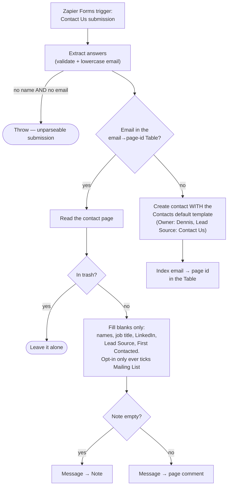

# contact-us-form-to-notion-contact

**Contact Us** form submission (Zapier Forms/Interfaces) → upsert the person in
Notion **Contacts**.

**Status:** enabled on Zapier. **Cutover pending and urgent** — the classic Zap
subscribes to the *same form*, so until it is turned off every submission is
processed twice (and the classic Zap creates blindly).

Migration of the classic Zap **"When a new Contact Us form submission is
created, save to Notion"**. The big behavioural upgrade: the classic Zap
created a contact unconditionally, which is exactly what feeds the
duplicate-contact merge loop. This durable resolves the submitter through the
shared email → page-id Zapier Table first, the same way
[`spot-project-request-to-notion`](../spot-project-request-to-notion/) does.

## What it does

**Existing contact** (email found in the Table):

- Fill-only writes — someone curated those fields, a web form did not: First
  Name, Last Name, Job Title, Linkedin, First Contacted, Lead Source are only
  written when empty.
- `Mailing List` only ever **ticks** (opt-in); unticking is the unsubscribe
  flow's job.
- The message goes into `Note` when Note is empty, otherwise it is added as a
  **page comment** so nothing is overwritten.
- A contact in the trash is left alone.

**New contact** (no email match, or no usable email at all):

- Created **with the Contacts default template** (repo rule 5,
  `createItemWithTemplate` two-call pattern).
- Name falls back `First + Last` → email local part; a submission with neither
  a name nor a valid email throws loudly.
- `Owner` = Dennis, `Lead Source` = `Contact Us`, `First Contacted` = the
  submission's `createdAt`.
- The address is **indexed into the email Table immediately** (`Trigger Contact
  Creation: false`), so a second submission from the same person resolves to
  this contact instead of creating another —
  [`contact-emails-to-zapier-table`](../contact-emails-to-zapier-table/) treats
  the resulting "row → this page" as a no-op.

Emails are lowercased and regex-validated before lookup (the Table is indexed
lowercased; the classic Zap stored raw case, which is how lookups used to miss).



## Trigger

`InterfacesCLIAPI@1.9.1` / `new_form_submission` on form
`cmgftzun0001zu2hlecmqnz3d` ("Contact Us"). Zapier manages the wiring — there is
no external URL to repoint. Answers arrive in `values` keyed by field id; the
field-id → meaning map lives in [`zap.json`](zap.json) under `form_fields`.

## Cutover (pending — urgent)

Turn the classic Zap **"When a new Contact Us form submission is created, save
to Notion"** off in the Zapier UI. Both Zaps receive every submission until
then; the classic one creates a duplicate contact each time.

## Connections

| Alias | App key | Connection | Connection id |
|---|---|---|---|
| `notion_wf` | `NotionCLIAPI` | `work.flowers \| Dennis` | `02b73654-15c8-85c3-b16a-07304d2beb17` |

## Maintainer notes

- The duplicate-merge Notion agent acts on `Duplicate of` — nothing here writes
  it (or `Possible duplicate of`); dedupe is structural, via the Table lookup.
- Notion property writes on an existing contact go through raw `sdk.fetch`
  PATCHes (the action schema cache goes stale on new properties); creates go
  through `create_database_item` so `template_mode: "default"` applies.
- Verified live 2026-08-14 via `run-durable` with a scratch address
  (`zaptest.scratch@example.test`, cleaned up after): create path used the
  default template and indexed the email; a second submission with the same
  address uppercased resolved to the same contact, filled only `Mailing List`,
  and landed its message as a comment.

## Test

```bash
SOURCE_FILES="$(jq -n --rawfile workflow workflow.ts '{"workflow.ts": $workflow}')"
zapier-sdk --experimental run-durable "$SOURCE_FILES" \
  --dependencies '{"@zapier/zapier-sdk":"0.99.0","zod":"4.4.3"}' \
  --zapier-durable-version '0.12.5' \
  --connections '{"notion_wf":{"connectionId":"02b73654-15c8-85c3-b16a-07304d2beb17"}}' \
  --input '{"values":{"cmgftzuof0025u2hl56jygp0u":"Test","cmggbzl3j000g3b6sw9n2oxid":"Person","cmgfu0k5800013b6siwlm7w7e":"test@example.test","cmgfu47jf00063b6s2cz23zhl":"Hello"},"createdAt":"2026-08-14T09:00:00.000Z"}' \
  --private
```

Use a throwaway `@example.test` address, then trash the created contact and
delete its email-Table row.
