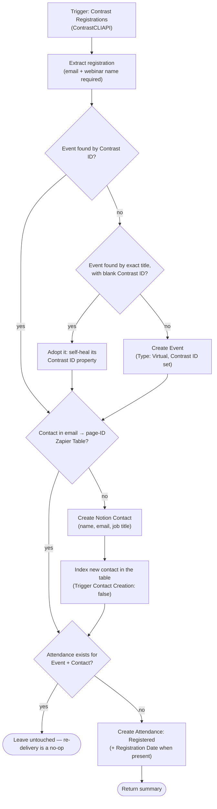

# contrast-registrations-to-event-attendance

Contrast webinar registrations → Notion Event Attendance upserts, resolving or creating the related Event and Contact along the way.

**Status:** enabled on Zapier.

## What it does

For each Contrast registration, it resolves the Notion Event (by Contrast ID, with a title-match fallback that self-heals a blank Contrast ID), resolves the Contact via the email → page-ID Zapier Table (creating and indexing a new Notion Contact on a miss), then creates an Attendance record ("Registered") deduped on the Event + Contact relation pair. Existing attendance records are left untouched, so re-deliveries are no-ops — "Attended" is never downgraded.

## Workflow

## Trigger

Contrast **Registrations** trigger (`ContrastCLIAPI@1.5.1`, authenticated connection). Verified payload (2026-07-21): `id`, `email`, `firstName`, `lastName`, `webinarName`, `registeredAt`, plus UTM/company fields. **No webinar id or slug** — `webinarName` is the only event identifier, so the Events DB "Contrast ID" property holds the exact Contrast webinar name (a real id still wins if Contrast ever adds one).

## Maintainer notes

- Connection alias `notion_wf` (Notion, work.flowers | Dennis), resolved at publish time via `--connections`.
- Notion targets: Events, Contacts, and Event Attendance data sources in the Marketing Events workspace (IDs in [workflow.ts](workflow.ts) constants).
- The email → page-ID Zapier Table (`01JYEPSEARXB2Z6BJRCMFGXBC2`) is shared with the [email-contact-page-zap](../email-contact-page-zap/) sub-Zap; one row per known address, covering Primary and Secondary emails.
- Attendance rows get no title — a native Notion database automation assigns `ATT-<ID>`.
