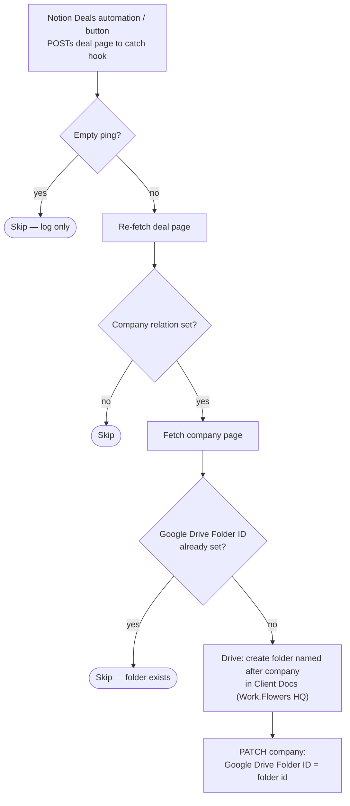

# deal-to-client-drive-folder

Deal webhook from Notion → create the client's Google Drive folder (named
after the company) under **Client Docs** in the Work.Flowers HQ shared drive,
and write the folder id back to the Company.

Migration of the classic Zap **"Create Google Drive Folder from Notion"**.
Supersedes the never-deployed
[`deal-won-set-up-client-workspace`](../deal-won-set-up-client-workspace/).

- **Workflow ID:** `019feb0a-9bff-7eed-9854-1759e13c9921` (account-visible)
- **Trigger:** Webhooks by Zapier catch hook —
  `https://hooks.zapier.com/hooks/catch/20495893/CpCVkwCvMa719a7BM/`
- **Editor:** <https://zapier.com/durables-editor/019feb0a-9bff-7eed-9854-1759e13c9921>

## Workflow

## What changed vs the classic Zap

- **The idempotence guard reads the Notion page, not [Table] Company IDs** —
  the Table is a mirror of this same property (fed by
  [`notion-companies-to-zapier-table`](../notion-companies-to-zapier-table/)),
  so the page is fresher and already in hand. The find-or-create table row is
  gone; the mirror materialises it.
- **No write to the `Google Drive Folder` url property** — it is now a formula
  on Companies rendering the URL from `Google Drive Folder ID`.
- Empty-ping skip per repo convention (the classic Zap filtered on a rollup
  being non-empty, which also silently swallowed malformed events; a payload
  with content but no page id now throws).

## Testing

`run-durable` on 2026-08-10 (guard path, no side effects): deal
`9ca1f339-617f-4e08-946b-7bb00a475fa9` (Tannin Road) → fetched deal + company,
returned `skipped: folder-already-exists` with the live folder id. The Drive
`folder` action inputs (`drive`, `folder`, `title`) are field-verified against
the live connection; watch the first live run after cutover.

## Cutover

**Complete as of 2026-08-10.** The Notion Deals sender was repointed to the
`webhook_url` above and the classic Zap **"Create Google Drive Folder from
Notion"** was disabled — confirmed by Dennis. Not machine-verifiable: classic
Zap and Notion automation config are exposed by neither the SDK CLI nor the
MCP connector.

## Maintainer notes

- Connections: `notion_wf` = work.flowers Notion
  (`02b73654-15c8-85c3-b16a-07304d2beb17`), `gdrive_wf` =
  `02eb8724-3fc7-8edc-9b30-be83af0b327f` (dennis@work.flowers).
- Fixed Drive targets are constants in [workflow.ts](workflow.ts): shared
  drive `0AHY_MJFjT0WtUk9PVA`, parent folder
  `109hgE0VmTpTFTGUXreEYCNf8xu-jSnc2`.
