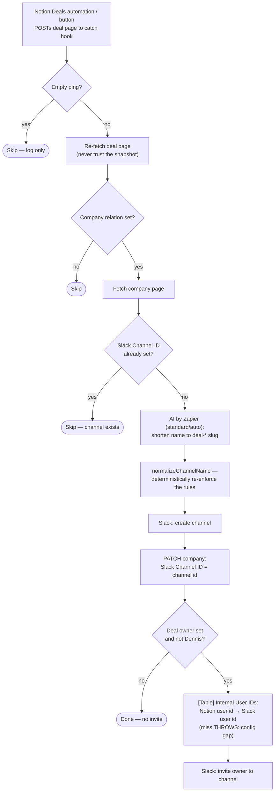

# deal-to-client-slack-channel

Deal webhook from Notion → create the client's Slack channel with an
AI-shortened `deal-*` name, write the channel id back to the Company, and
invite the deal owner (unless it's Dennis, whose Slack connection created the
channel and is therefore already in it).

Migration of the classic Zap **"Create Client Slack Channel from Notion"**.

- **Workflow ID:** `019feb0a-51c3-729c-9e8f-759eed70a2b2` (account-visible)
- **Trigger:** Webhooks by Zapier catch hook —
  `https://hooks.zapier.com/hooks/catch/20495893/C1a22fqjigbJS2n2t/`
  (this is the URL the Notion automation POSTs to; the workflow-level
  `trigger_url` is Zapier-internal)
- **Editor:** <https://zapier.com/durables-editor/019feb0a-51c3-729c-9e8f-759eed70a2b2>

## Workflow

## What changed vs the classic Zap

- **The idempotence guard reads the Notion page, not [Table] Company IDs.**
  The Table copy is fed *from* the `Slack Channel ID` property by
  [`notion-companies-to-zapier-table`](../notion-companies-to-zapier-table/),
  so the page is the fresher store and is already in hand. The classic Zap's
  find-or-create table row is no longer needed — the mirror materialises it.
- **No write to the long-gone `Slack Channel` url property.** It is now a
  formula on Companies that renders the URL from `Slack Channel ID`.
- **The AI's output is deterministically normalized** (`normalizeChannelName`):
  lowercase, hyphens only, forced `deal-` prefix, hard 20-char cap — so a
  sloppy completion can't produce an invalid channel name.
- **A missing owner→Slack mapping throws** instead of failing silently, since
  it means a teammate is missing from [Table] Internal User IDs.
- Empty-ping skip per repo convention (the classic Zap simply had no guard and
  errored on catch-URL tests).

## AI step (repo rule 6)

Prompt lives in
[`deal-to-client-slack-channel-prompt.md`](deal-to-client-slack-channel-prompt.md);
`node scripts/check-prompts.mjs` keeps it in sync with the embedded literal.
Tier is `standard/auto` (1x task): naming a channel is a trivial generation
task and every naming rule is re-enforced in code afterwards.

Verified cases (offline `run-action` harness, 2026-08-10):

| Company Name | Standard output | Valid |
| --- | --- | --- |
| Tannin Road Pty Ltd | `deal-tannin` | ✅ |
| Metropolitan YMCA Singapore | `deal-ymca` | ✅ |

## Testing

`run-durable` on 2026-08-10 (guard path, no side effects): deal
`9ca1f339-617f-4e08-946b-7bb00a475fa9` (Tannin Road) → fetched deal + company,
returned `skipped: channel-already-exists` with the live channel id. The
create/invite path is exercised offline by the AI harness above plus
field-verified `new_channel` / `channels_invite_v2` inputs; watch the first
live run after cutover.

## Cutover (pending)

1. In Notion, repoint the Deals automation/button that POSTs to the classic
   Zap's catch URL to the `webhook_url` above.
2. Disable the classic Zap **"Create Client Slack Channel from Notion"** in the
   Zapier UI (classic Zaps are not reachable from the CLI).
3. Record both in `zap.json` → `cutover`.

## Maintainer notes

- Connections: `notion_wf` = work.flowers Notion
  (`02b73654-15c8-85c3-b16a-07304d2beb17` — **never** the Knoxx connection),
  `slack_wf` = `020cae54-a27c-86d6-93a9-27b012c17e74`.
- Dennis's Notion user id is pinned in the source
  (`DENNIS_NOTION_USER_ID`) — the classic Zap held it in a Zapier component
  variable. It matches [Table] Internal User IDs / dennis@work.flowers.
- Slack rejects a duplicate channel name with `name_taken`; that's loud on
  purpose, because the guard said no channel exists for the company.
