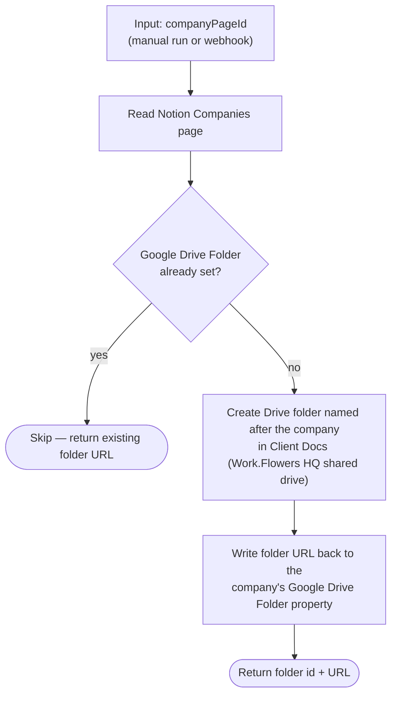

# deal-won-set-up-client-workspace

Sets up a client workspace when a deal is won: creates the company's Google Drive folder under Client Docs and links it back to the Notion Companies record.

**Status:** ⚠️ not deployed — no workflow with this name exists on Zapier as of 2026-07-23 (source only; no `zap.json`).

## What it does

Given a Notion Companies page ID, it reads the company record, stops if a Google Drive Folder is already set (idempotence guard), otherwise creates a folder named after the company in the Client Docs folder of the Work.Flowers HQ shared drive and writes the folder URL back onto the company record.

## Workflow

## Trigger

None wired yet — the durable takes `{ companyPageId }` as input (manual `run-durable` or a future webhook trigger).

## Maintainer notes

- Connection aliases `notion_wf` (Notion) and `gdrive` (Google Drive), resolved at test/publish time via `--connections`.
- Fixed targets carried over from the original classic Zap: Companies data source, shared drive `0AHY_MJFjT0WtUk9PVA`, parent folder `109hgE0VmTpTFTGUXreEYCNf8xu-jSnc2` (IDs in [workflow.ts](workflow.ts) constants).
- When this gets published, pull down its `zap.json` and update the root README index per the repo rules.
