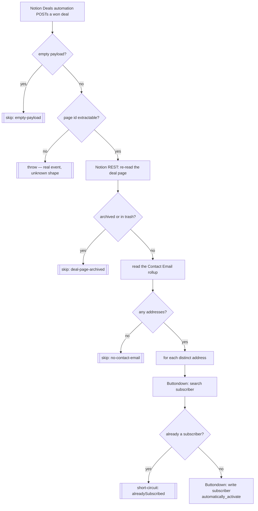

# deal-won-to-newsletter-subscriber

A deal is won in Notion → subscribe that deal's contact to the Buttondown newsletter.

Migrated from the classic Zap **"Deal Won -> Add Lead Contact to Mailing List"**.

Sibling of [`notion-contact-to-newsletter-subscriber`](../notion-contact-to-newsletter-subscriber/), which does the same thing from a manual button press on a Contact. They were deliberately kept separate rather than merged: each stays independently disableable, and each Notion sender posts to exactly one URL.

## Cutover complete (2026-08-10)

The Notion **Deals** automation posts here, and the classic Zap is off. This durable is the only thing serving that automation.

```
https://hooks.zapier.com/hooks/catch/20495893/CqdlciNMGmX51pfG/
```

Both confirmed by Dennis; the classic Zap's state is not machine-verifiable, since classic Zaps are exposed by neither the SDK CLI nor the MCP connector.

> Use `webhook_url` above — **never** the `trigger_url` in `zap.json`, which is Zapier-internal.

**First traffic** was run `019fedfe-5f17-…` (2026-08-10T23:24:58Z): the wiring-up test click, delivering `{"querystring":{}}`. It returned `{skipped: "empty-payload"}` and did **not** raise — the guard working in production. No real won-deal event has reached it yet.

## Workflow



## The Buttondown firewall finding

**Buttondown answers a re-subscribe of an existing address with `This subscriber was blocked by your firewall`** — a `partner_error` at HTTP 200, *not* an "already exists" message, and indistinguishable from a genuine firewall refusal of a brand-new address.

Reproduced live on 2026-08-10 (run `019febef-133f-…`): it burned all five step retries and failed the run. A re-won deal would have produced a hard error alert.

So the workflow **looks before it writes**: `search subscriber` first (a miss returns `{data: []}`, not an error), short-circuit if found, and only then create. Catching the message instead would have been wrong — it would also swallow a real firewall refusal, and a lead silently not subscribed is worse than an alert. Any refusal that survives the pre-check is real and fails loudly, by design.

The narrow `already exists` catch that remains covers one thing only: the race where the sibling button Zap subscribes the same address between the check and the write.

## Why the page is re-read

The webhook payload carries a property snapshot, but `Contact Email` is a **rollup** — computed downstream of the relation whose change triggered the automation, so the snapshot can be stale exactly when it matters. The durable re-reads the page over the Notion REST API and reads the rollup fresh. Nothing is written back to Notion.

## What changed vs the classic Zap

| Change | Why |
| --- | --- |
| Empty-payload guard | A catch URL is public and gets pinged during setup. An empty body returns `{skipped: "empty-payload"}` instead of raising. A payload with content but no page id still throws. |
| Subscribes **every** distinct address in the rollup | The classic Zap mapped the flattened `array[]email`; on a multi-contact deal that sends Buttondown one comma-joined, unusable string. |
| Re-reads the deal page | See above. |
| Empty rollup → `skipped`, not a halt | The classic `Contact Email Populated` filter halted silently. |
| Archived/trashed deal → `skipped` | New guard. |
| Subscriber pre-check | See the firewall finding. Makes a re-won deal idempotent. |

## Bindings

| Thing | Value |
| --- | --- |
| Notion connection | `02b73654-15c8-85c3-b16a-07304d2beb17` — **work.flowers**, never `Knoxx \| Dennis #2` |
| Notion data source | Deals `21a91b07-11ac-808d-9657-000b1390d20b` (read only) |
| Property read | `Contact Email` (rollup) |
| Buttondown connection | `02b2a81f-2fcf-8e3d-9219-826e4ffe4fbe` (`workflowers`) |

Repo rule 5 (default templates) does not apply: no Notion page is ever created.

## Verified 2026-08-10

| Path | Run | Result |
| --- | --- | --- |
| Main | `019febf5-e9d0-754c-aa5a-f60f32fdca31` | deal `1d8004ce-…` ("Terrascope — GTM Automation") → rollup gave `jochen@terrascope.com` → already subscribed, short-circuited |
| Ping | `019febf6-54e7-7468-af4c-5910010b2d0b` | `{"querystring":{}}` → `{skipped: "empty-payload"}` |

The main-path deal was chosen so the run exercised page fetch, rollup extraction and the subscriber pre-check end to end **without creating a subscriber**.

**Not tested: the create branch.** Every address reachable from a real won deal is already subscribed, and exercising it would have added a real person to the live mailing list. The first genuinely new lead is worth watching.
