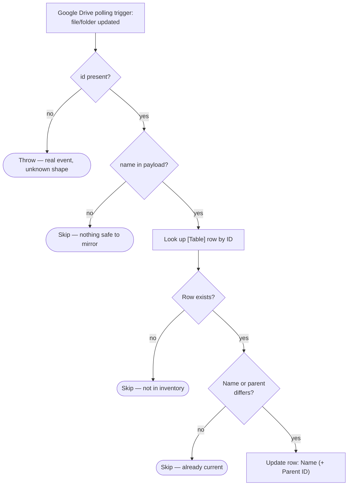

# drive-file-renamed-to-zapier-table

Google Drive polling trigger (file or folder updated) → keep that object's
`Name` and `Parent ID` current in **[Table] Google Drive Files and Folders**.

Migration of the classic Zap **"Update Google Drive File Names in Zapier
Table"**.

- **Workflow ID:** `01a028c7-2386-7fa5-8f14-48ffb2bfdbb8` (account-visible)
- **Trigger:** Google Drive `updated_file`, unscoped (no drive/folder filter,
  same as the classic Zap), deleted excluded — a polling trigger, no external
  URL to cut over. Durable triggers have no polling-interval field; the classic
  Zap ran at the account default too (`polling_interval_override: 0`).
- **Table:** `01K5ZN0AGNDHS4C424XEDCWJZY` — rows are **created** by
  [`drive-files-to-zapier-table`](../drive-files-to-zapier-table/), never here.
- **Editor:** <https://zapier.com/durables-editor/01a028c7-2386-7fa5-8f14-48ffb2bfdbb8>

## Workflow

## What changed vs the classic Zap

- **No more error-per-uninteresting-update.** The classic Zap put *both*
  "`ID` matches" and "`Name` differs" into its `find_record` filter with
  success-on-miss **off**. So every update that did not change the name — and
  every update to a file the inventory had never logged — failed the search step
  and surfaced as a Zap error. The durable looks the row up by Drive id alone,
  compares in code, and skips quietly with a reason (`already-current`,
  `not-in-inventory`).
- **Moves are mirrored too.** A file moved between folders now updates
  `Parent ID`, instead of leaving a stale parent on the row forever.
- **A payload with no name skips** rather than writing an empty `Name`: blanking
  a stored value on a partial payload is worse than doing nothing.
- **Table writes are free** (SDK Tables API), so a run costs nothing beyond the
  trigger.

## Testing

Not yet run. `run-durable` here **writes to the production inventory table**, so
the first exercise is the first live run after cutover — safe to repeat, since a
no-op update now skips. The trigger's `include_deleted` BOOLEAN shape is
field-verified against the live connection with `list-trigger-input-fields`
(the classic Zap passed the string `"no"`).

## Cutover

**Complete as of 2026-08-22.** The classic Zap **"Update Google Drive File
Names in Zapier Table"** was disabled and this durable enabled the same day.
The disable is **not machine-verifiable** — classic Zaps are exposed by
neither the SDK CLI nor the MCP connector — so it rests on Dennis's
confirmation. Verified on this side: `enabled: true` with the trigger `status:
active` and no trigger error.

## Maintainer notes

- **No connection aliases.** Zapier Tables need none; the Google Drive
  connection is bound to the *trigger* (`trigger.authentication_id`).
- This workflow deliberately does **not** create rows. If an object is missing
  from the inventory, that is `drive-files-to-zapier-table`'s gap to close —
  splitting the ownership keeps one writer per concern.
