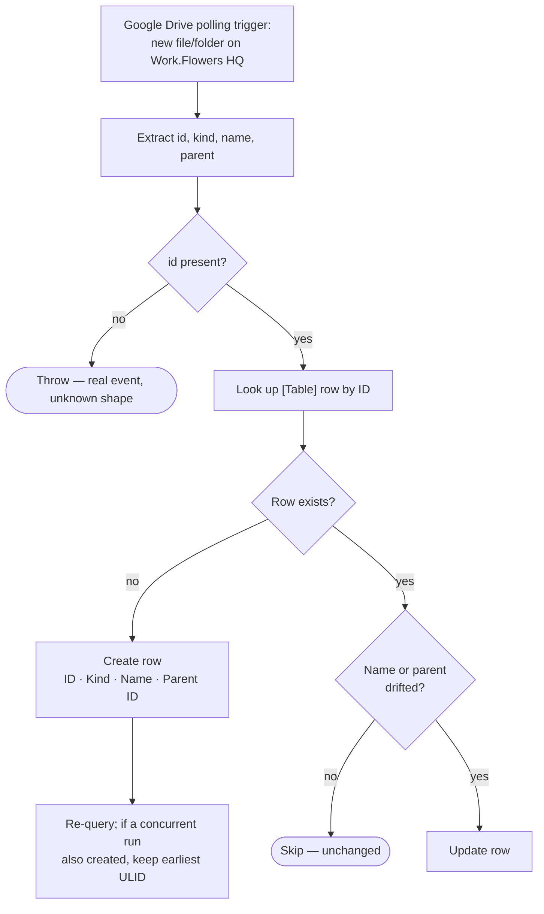

# drive-files-to-zapier-table

Google Drive polling trigger (new file or folder anywhere on **Work.Flowers
HQ**) → upsert that object into **[Table] Google Drive Files and Folders**,
keyed on the Drive object id.

Migration of the classic Zap **"Log New Google Drive Files and Folders in
Zapier Table"**.

- **Workflow ID:** `01a028c7-47d4-713a-8b25-3b57f08ca8d3` (account-visible)
- **Trigger:** Google Drive `file_in_folder_v2` over the whole shared drive
  (`0AHY_MJFjT0WtUk9PVA`), subfolders on, 4 levels deep, deleted excluded — a
  polling trigger, no external URL to cut over. Durable triggers have no
  polling-interval field; the classic Zap ran at the account default too
  (`polling_interval_override: 0`).
- **Table:** `01K5ZN0AGNDHS4C424XEDCWJZY` — this workflow **owns** row creation.
- **Editor:** <https://zapier.com/durables-editor/01a028c7-47d4-713a-8b25-3b57f08ca8d3>

## Workflow

## What changed vs the classic Zap

- **Idempotent on the Drive id.** The classic Zap called `create_record`
  unconditionally, so any re-trigger on the same object added a duplicate row.
  The durable upserts: unseen ids are created, a known id is left alone, and a
  known id whose `Name`/`Parent ID` drifted is repaired.
- **Racing creates converge.** Two runs that both find nothing and both create
  now agree on the earliest ULID and delete the rest, the same pattern
  [`notion-companies-to-zapier-table`](../notion-companies-to-zapier-table/)
  uses. Zapier Tables offer no unique constraint, so this narrows the window
  rather than closing it (see the concurrency note in `CLAUDE.md`).
- **Table writes are free.** Row reads and writes go through the SDK Tables API
  (`listTableRecords` / `createTableRecords` / `updateTableRecords`), which
  consumes no Zapier tasks — so the whole run costs nothing beyond the trigger.

## Testing

Not yet run. `run-durable` on this workflow **writes to the production
inventory table**, so the first exercise is the first live run after cutover;
the upsert makes a repeated run safe. The trigger param shapes
(`includeSubfolders` BOOLEAN, `subfolderDepth` INTEGER) are field-verified
against the live connection with `list-trigger-input-fields`.

## Cutover

**Complete as of 2026-08-22.** The classic Zap **"Log New Google Drive Files
and Folders in Zapier Table"** was disabled and this durable enabled the same
day. The disable is **not machine-verifiable** — classic Zaps are exposed by
neither the SDK CLI nor the MCP connector — so it rests on Dennis's
confirmation. Verified on this side: `enabled: true` with the trigger `status:
active` and no trigger error.

## Maintainer notes

- **No connection aliases.** The workflow only touches Zapier Tables, which
  need none; the Google Drive connection is bound to the *trigger*
  (`trigger.authentication_id`), not to a step.
- `kind` falls back to the mime type when Drive omits its own
  `drive#file`/`drive#folder` discriminator — that is what distinguishes a
  folder from a file.
- [`drive-file-renamed-to-zapier-table`](../drive-file-renamed-to-zapier-table/)
  keeps `Name`/`Parent ID` current after creation. Rows are never created there.
