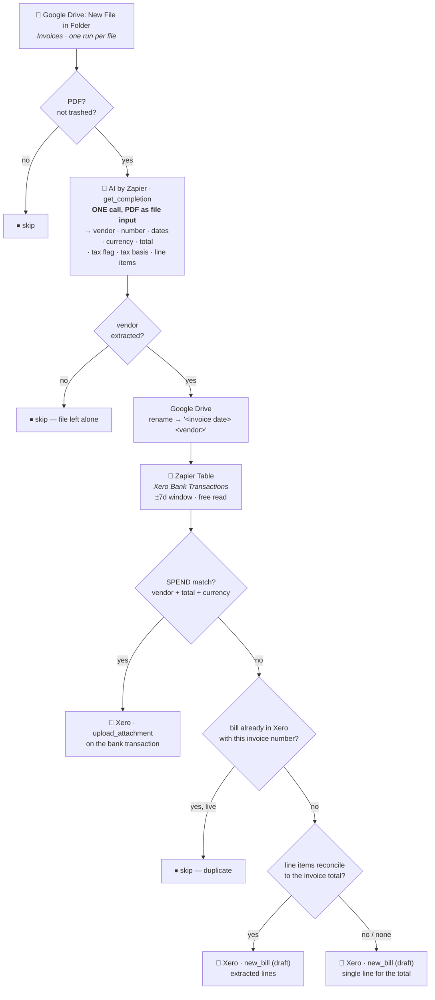

# Drive Invoice → Xero

Durable workflow (trigger **`read`** — "New File in Folder" — `GoogleDriveCLIAPI@1.22.0`) that
takes a purchase-invoice PDF dropped into the Google Drive **Invoices** folder and lands it in
Xero the right way round: attached to the payment if it has already been paid, or raised as a
draft bill if it hasn't. Migrated from the classic Zap *"Record New Bills in Xero"*.

Its upstream is [`gmail-attachments-to-drive-by-type`](../gmail-attachments-to-drive-by-type/),
which is what files invoice PDFs into that folder in the first place.

> **Bills are always created as `draft`.** Nothing here posts to the ledger or pays anything.
> Every outcome is meant to be reviewed in Xero.

## What it does

1. **Trigger** — Google Drive *New File in Folder* on **Invoices**, one run per file.
2. **PDF gate** (plain code, no task cost) — anything that isn't `application/pdf`, or is in the
   trash, is skipped. Carried over from the classic Zap's "PDFs only" filter.
3. **Extract — a single AI call.** The PDF itself goes to AI by Zapier (`standard/auto`, built-in
   credentials) as a file input, and one call returns **both** the invoice header and the full
   line-item table. The classic Zap used two calls. The prompt lives in
   [`invoice-extraction-prompt.md`](invoice-extraction-prompt.md).
4. **Rename** — the Drive file becomes `<invoice date> <vendor>`.
5. **Match** — look for a `SPEND` bank transaction for the same vendor, total and currency in the
   *Xero Bank Transactions* Zapier Table. See [Matching](#matching).
6. **Either / or:**
   - **Matched** → upload the PDF as an attachment on that Xero bank transaction. Done.
   - **Not matched** → check Xero for an existing bill with this invoice number, and if there
     isn't one, create a **draft bill**. See [Line items](#line-items).



## Matching

The rule is **vendor AND exact total AND same currency AND `SPEND`**, within **±7 days** of the
invoice date or its due date. Vendor names are compared after normalising away legal-entity
suffixes, so `Aspire FT Pte. Ltd.` and `Aspire FT` are the same counterparty — that comparison is
the only thing the classic Zap's AI Agent was really there for, and `normalizeVendor` does it in
code for nothing.

**Amount and currency are required, not tiebreakers.** The classic Zap's Agent was instructed to
"compare transaction amounts if available for additional verification", which is too weak:

| Why it matters | Real case |
| --- | --- |
| A vendor billed several times in one week | Anthropic had **3** transactions within 4 days of one invoice — 104.58 / 133.58 / 99.00. Only the amount picks the right one. |
| A subscription at a fixed price | SimplePay bills **SGD 12 every month**. The ±7d window is what stops a July invoice matching the August payment. |
| One invoice settled by two payments | Aspire FT's 45.90 invoice was paid as **4.92 + 40.98**. Requiring the amount makes this correctly *fail* to match, rather than attaching the invoice to half of it. |

A window this wide is only safe *because* the amount must match exactly. When more than one
transaction still qualifies, the nearest by date wins and the count is logged.

## Line items

The AI returns the line-item table as JSON, and the workflow then checks its own work: the lines
must add up to the total the model read off the same invoice. Tax-inclusive and no-tax lines have
to equal it outright; tax-exclusive lines only have to be a plausible pre-tax subtotal, since the
rate isn't known here.

- **Reconciles** → the extracted lines are used.
- **Doesn't reconcile, or nothing usable came back** → one line for the invoice total, described
  as `<vendor> invoice <number>`.

The fallback matters because a draft bill that doesn't equal the invoice is worse than a bill
without itemisation — the PDF is attached either way, so no detail is actually lost. Grab's
e-receipt is the live example: its four lines sum to 41.20 against a 36.70 total, so it falls back.

Lines worth nothing (a zero quantity, or an "included in your plan" row priced at 0.00) are
dropped so they don't clutter Xero. Vanta's 19-row invoice becomes 10 real lines.

**Tax basis.** The model reports whether unit prices are `Inclusive`, `Exclusive` or `NoTax`, and
that drives Xero's `line_items_type`. The classic Zap never set it, so Xero applied its
`Exclusive` default and could add tax on top of amounts that already contained it. On the
single-line fallback the basis is forced to `Inclusive` (or `NoTax`), because the figure used *is*
the final total. `line_tax_type` is `INPUTY24` (Standard-Rated Purchases) when tax applies, else
`NONE` — as in the classic Zap.

## Duplicate guard

Before creating a bill, Xero is queried for an existing `ACCPAY` invoice with the same
`InvoiceNumber`. `DELETED` and `VOIDED` bills don't count — they're gone from the ledger and must
not block a legitimate re-create. This is the one extra task cost, and only on the create branch.

It exists because the Invoices folder does accumulate duplicates: it currently holds two identical
`2026-07-15 Vanta Inc` files.

## ⚠️ The Table is a dependency, and it fails silently

The match reads the **Xero Bank Transactions** Zapier Table
(`01KCDV6Y17F31J2Q6S1EMYZC8K`), not Xero's API, because Table reads cost no tasks. That Table is
populated by a **separate Zap** ("Process New Reconciled Transactions"), so:

> **This workflow is only as correct as that Zap is current.**

On 2026-07-28 that Zap's create step was paused and the Table had quietly fallen ~5 days behind —
**7 of 43** live `SPEND` transactions over 2026-06-01..2026-07-28 were missing, all of them the
newest ones. Nothing errored. The only visible symptom was duplicate draft bills appearing in
Xero and being deleted by hand.

Because the transaction that matters is almost always the *most recent* one, staleness in this
Table converts directly into duplicate bills. The run output carries **`tableStale`** — true when
the date window came back with no rows at all — as the cheap tripwire, and the same condition is
logged as a warning. It is not proof (a genuinely quiet week looks identical), so if duplicate
bills start appearing, check that the populating Zap is enabled first.

Querying Xero live instead would remove the coupling at the cost of ~1 task per invoice; that
trade-off was considered and the Table was chosen deliberately.

## Verified behaviour

Extracted with `standard/auto` from the real PDFs in the Invoices folder, matched against the real
Table contents (2026-07-28). "Outcome" is what the deployed matcher decides.

| Invoice | Extracted | Table candidates | Outcome |
| --- | --- | --- | --- |
| `2026-07-19 SimplePay Pte Ltd` | SGD 12.00, no tax, 1 line | SGD 12 on 2026-07-19, **lag 0d** | ✅ **Attach** to `487b3963` |
| `2026-07-24 Anthropic, PBC` | SGD 104.58, no tax, 2 lines → 1 (one 0-qty dropped) | none — newest Anthropic row in the Table is USD 99 (2026-07-20) | ⚠️ **Draft bill** — the SGD 104.58 payment *does* exist in Xero (2026-07-25); it is missing from the Table. This is the staleness above, not a matcher fault. |
| `2026-07-07 Aspire FT Pte. Ltd.` | SGD 45.90, tax | 4.92 and 40.98 on 2026-07-06 — neither equals 45.90 | ✅ **Draft bill** (split payment correctly declined) |
| `2026-07-14 Brilliant Color Printing Services LLP` | SGD 384.00, no tax | SGD 228 on 2026-07-07 — amount differs | ✅ **Draft bill** |
| `2026-07-16 Grab` | SGD 36.70, no tax, 4 lines summing to 41.20 | no vendor match | ✅ **Draft bill**, single-line fallback at 36.70 |
| `2026-07-14 Private Venue Management Pte Ltd` | SGD 1362.50, **tax**, `Exclusive`, 4 lines summing to 1250.00 | no vendor match | ✅ **Draft bill**, extracted lines (1250 × 1.09 = 1362.50 ✓) |
| `2026-07-15 Vanta Inc` | USD 18178.94, `Exclusive`, 19 lines → 10 (9 zero-value dropped), reconciles | no vendor match | ✅ **Draft bill**, extracted lines |
| `2026-07-15 Vanta Inc` | SGD 8389.27, `Inclusive`, 1 line | no vendor match | ✅ **Draft bill**, extracted lines |
| `2026-07-06 MyRepublic Limited` | SGD 8.71, tax | no vendor match | ✅ **Draft bill** |
| `2026-07-02 Slack Technologies Limited` | USD 82.24, no tax | no vendor match | ✅ **Draft bill** |

Vendor-suffix normalisation, line-item parsing, reconciliation and the match rule are covered by
unit checks run against this same data; all passed. A non-PDF payload was run through the deployed
runtime (`run-durable`) and skipped correctly.

## ⚠️ `new Date()` in the workflow body is a hard error

The first published version (`019fa878`) **failed on every PDF invoice** with:

```
DeterminismViolation: Non-deterministic API "new Date()" called in GUARDED mode.
  at toIsoDate (workflow.ts:187)
```

The durable runtime replaces `Date` with a Proxy before your code runs, and its `construct` trap
calls `assert()` **before** it looks at the arguments — so `new Date(Date.UTC(y, m, d))`, which is
perfectly deterministic, is rejected exactly as hard as a clock read. `Date.now()` is guarded too
(via the `get` trap); `Date.UTC` happens not to be, but this file no longer relies on that.

The fix, and the rule for anything added here:

- **Calendar arithmetic is integer arithmetic.** `daysFromCivil` / `isoDateFromEpochMs` (Hinnant's
  civil-from-days pair, also in [`xero-overdue-invoice-to-gmail-reminder`](../xero-overdue-invoice-to-gmail-reminder/))
  and `daysInMonth`. **`Date` is not referenced anywhere in this file.** Don't reintroduce it.
- **Reading the clock goes in a `ctx.step`.** The `today` step is the only place a current time is
  obtained, so its value is fixed for every retry of a run. It runs only when the model gave no
  usable invoice date.

Two things made this invisible until production, both worth remembering:

1. **Nothing upstream catches it.** The guard is a runtime component of `@zapier/zapier-durable`,
   not a lint or a publish-time check, so `tsc` passed and `publish-workflow-version` succeeded.
2. **The pre-publish test missed it by construction.** The only end-to-end `run-durable` test was a
   non-PDF payload, which returns at the PDF gate — before the AI step, and therefore before the
   line that threw. A skip-path test cannot exercise the main path. Test with a real PDF payload.

`toIsoDate` also got stricter as a side effect. Its old NaN check never actually fired: `Date.UTC`
normalises overflow instead of failing, so `2026-13-05` rolled into 2027 and the *original* string
was returned and passed to Xero as a bill date. An impossible month or day is now rejected and
falls through to the `today` fallback.

**Replayed after the fix.** The failed Lantern Labs run was re-fired with its original trigger
payload on version `019faae7`: all five steps completed, the file was renamed to
`2026-07-28 Lantern Labs Pte. Ltd.`, no bank-transaction match was found (correctly — the invoice
is unpaid, due 2026-08-28), and draft bill `99ea5905-aa60-4327-bcb7-984c1013e3e3` was raised for
USD 7,750.00 with the PDF attached.

## Model tier

`standard/auto` — 1× tasks per run. Standard read every invoice above correctly, including
Vanta's 19-row table and the tax-basis judgement, so there was no reason to inherit Zapier's
Advanced default (which exists mainly to enable tool calls; this step makes none). The classic Zap
pinned `google/gemini-2.5-flash-lite` explicitly; the tier sentinel on built-in credentials
replaces that. Re-run the table above before changing tier.

## Maintainer notes

- **The Drive connection is bound twice** — on the trigger (which polls the folder) *and* as the
  `gdrive` alias, because the code renames the file. Both are the same connection id.
- **`_zap_raw_request` on Xero needs the `Xero-Tenant-Id` header.** Its input schema has no
  `organization` field and silently strips one, so an org-scoped call otherwise fails with
  *"Please select an organization to perform this step on."*
- **`new_bill`'s `number` maps to Xero's `InvoiceNumber`**, not `Reference` — verified against
  bills the classic Zap created.
- **No catch URL.** This is a polling trigger, so there is nothing external to repoint; the
  cutover is just turning the classic Zap off. Disabling the workflow moves the trigger to
  `released` and re-enabling reclaims it as `active`.
- **`@zapier/zapier-durable` is pinned to 0.10.1.** 0.11.0 was npm-latest at build time but only
  ~20h old, and the runtime rejects dependencies younger than 24h at *run* time, not publish.
- The classic Zap renamed files to `" <date> <vendor>"` with a leading space; this one doesn't,
  and strips `/` from vendor names.
- **Never write `new Date` in the workflow body** — see the determinism section above. Integer date
  helpers are already here; use them.
- **A polling trigger consumes a file once.** A run that fails is not retried (a
  `DeterminismViolation` is a terminal *user* error, not a transient one) and the trigger will not
  re-deliver that file, so a fix has to be paired with a manual replay: re-fire the workflow with
  the failed run's original trigger payload. The `file` hydrate reference in that payload was still
  valid ~7 hours later.
