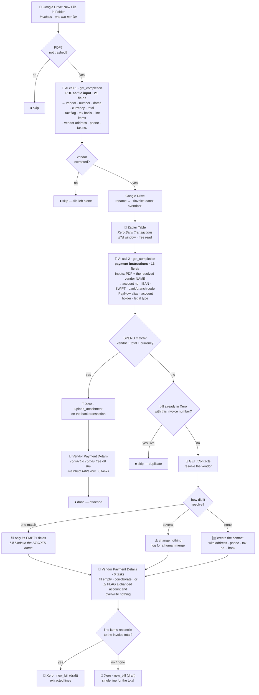

# Drive Invoice → Xero

Durable workflow (trigger **`read`** — "New File in Folder" — `GoogleDriveCLIAPI@1.22.0`) that
takes a purchase-invoice PDF dropped into the Google Drive **Invoices** folder and lands it in
Xero the right way round: attached to the payment if it has already been paid, or raised as a
draft bill if it hasn't. Migrated from the classic Zap *"Record New Bills in Xero"*.

Its upstream is [`gmail-attachments-to-drive-by-type`](../gmail-attachments-to-drive-by-type/),
which is what files invoice PDFs into that folder in the first place.

> **Bills are always created as `draft`.** Nothing here posts to the ledger or pays anything.
> Every outcome is meant to be reviewed in Xero.

> ✅ **Vendor-contact handling has now been exercised by a real invoice.** `019fab74`'s first live
> PDF — Lantern Labs `INV-26-0007`, 2026-07-29 — resolved the vendor to the existing contact,
> enriched three empty fields and raised the bill against the stored name. See
> [Live runs](#live-runs). That run also closed the bank-field control that shipped untested.

## What it does

1. **Trigger** — Google Drive *New File in Folder* on **Invoices**, one run per file.
2. **PDF gate** (plain code, no task cost) — anything that isn't `application/pdf`, or is in the
   trash, is skipped. Carried over from the classic Zap's "PDFs only" filter.
3. **Extract the invoice — AI call 1.** The PDF itself goes to AI by Zapier (`standard/auto`,
   built-in credentials) as a file input, and one call returns **both** the invoice header and the
   full line-item table. The prompt lives in
   [`invoice-extraction-prompt.md`](invoice-extraction-prompt.md).
4. **Rename** — the Drive file becomes `<invoice date> <vendor>`.
5. **Match** — look for a `SPEND` bank transaction for the same vendor, total and currency in the
   *Xero Bank Transactions* Zapier Table. See [Matching](#matching).
6. **Extract the payment instructions — AI call 2.** A second, focused call reads how the vendor
   wants to be paid — bank account, IBAN, SWIFT, bank/branch codes, PayNow alias, account holder.
   Prompt: [`payment-extraction-prompt.md`](payment-extraction-prompt.md). This is a separate call
   rather than more fields on the first one, and the measurement that forced that is in
   [Why two AI calls](#why-two-ai-calls).
7. **Either / or:**
   - **Matched** → upload the PDF as an attachment on that Xero bank transaction, record the
     vendor's payment details, done.
   - **Not matched** → check Xero for an existing bill with this invoice number, and if there
     isn't one, resolve the vendor's **contact** (see [Vendor contacts](#vendor-contacts)), record
     the vendor's payment details, and create a **draft bill** against it. See
     [Line items](#line-items).

Both finishing paths write the [Vendor Payment Details](#vendor-payment-details) row — a settled
invoice still tells you where that vendor banks, which is what the *next* one gets paid into.



## Matching

The rule is **vendor AND exact total AND same currency AND `SPEND`**, within **±7 days** of the
invoice date or its due date. Vendor names are compared after normalising away legal-entity
suffixes, so `Aspire FT Pte. Ltd.` and `Aspire FT` are the same counterparty — that comparison is
the only thing the classic Zap's AI Agent was really there for, and `normalizeVendor` does it in
code for nothing.

**Amount and currency are required, not tiebreakers.** The classic Zap's Agent was instructed to
"compare transaction amounts if available for additional verification", which is too weak:

| Why it matters | Real case |
| --- | --- |
| A vendor billed several times in one week | Anthropic had **3** transactions within 4 days of one invoice — 104.58 / 133.58 / 99.00. Only the amount picks the right one. |
| A subscription at a fixed price | SimplePay bills **SGD 12 every month**. The ±7d window is what stops a July invoice matching the August payment. |
| One invoice settled by two payments | Aspire FT's 45.90 invoice was paid as **4.92 + 40.98**. Requiring the amount makes this correctly *fail* to match, rather than attaching the invoice to half of it. |

A window this wide is only safe *because* the amount must match exactly. When more than one
transaction still qualifies, the nearest by date wins and the count is logged.

## Why two AI calls

The payment fields were first folded into the existing extraction call, taking it from 21 output
fields to 34. **That measurably broke the header.** A/B'd on the same PDF, same tier, six runs each:

| Schema | Correct vendor name |
| --- | --- |
| 21 fields — header only | **6/6** |
| 34 fields — header + payment | **2/6** |

The four failures returned `Company Flow Pte. Ltd.` — *our own* entity — as the vendor, with
`Vendor Country: Singapore` to match. `2026-07-02 Slack Technologies Limited` has a two-column
header, and under field pressure the model stopped resolving which column was which.

That is the worst available failure. `Vendor Name` binds the Xero contact **and** the draft bill, so
a header error raises a bill against the wrong party; a missing bank detail merely stops a payment.
So the header call keeps its proven 21-field shape byte-for-byte, and the payment tuple gets a
prompt that does one thing.

The second call receives the vendor name as its own `Vendor` input field. That is what makes a
payment-only prompt safe: without it, a prompt that never reasons about the header has no way to
tell the vendor's remittance block from the recipient's own bank details, which most invoices also
print. It goes in as an input field rather than interpolated into the instructions so the prompt
text stays static and `scripts/check-prompts.mjs` can verify it verbatim.

**Cost: +1 task per invoice.** The alternative is a cheaper Zap that sometimes bills the wrong
vendor.

Two things are derived in code rather than by loosening the prompt, because both are exact and the
prompt's job is to refuse to guess:

- **Bank country** from characters 5–6 of the SWIFT/BIC, which *are* the ISO-3166 country code by
  definition (`CMFGUS33` → `US`). The prompt rightly forbids inferring a country from a currency or
  phone code, which left the US invoices with no corridor at all. Decoding a fixed-position field
  is not an inference.
- **Legal type** from a company suffix on the account holder. The model answers `Unknown` even when
  the holder it just read is plainly a `Pte. Ltd.` This only ever upgrades `Unknown` → `BUSINESS`;
  it never contradicts a stated answer, and never guesses `PRIVATE` from the absence of a suffix,
  since a business can trade under a bare name.

## Vendor contacts

Full rationale and evidence: [`vendor-contact-design.md`](vendor-contact-design.md).

`new_bill` binds a bill to a contact **by name**, and Xero creates a bare contact when nothing
matches exactly. That is how the ledger acquired four duplicate pairs — `Aspire FT` alongside
`Aspire FT Pte. Ltd.`, and the same for `Linear Orbit`, `N9 Offices` and `Private Venue Management`
— and why contacts this Zap created carry no address, bank details or email at all.

Before raising a bill the workflow now pulls the contact list (one `GET /Contacts`, 130 rows in a
single page) and resolves the vendor with the **same** `normalizeVendor` / `vendorMatches` pair used
for bank transactions:

| Resolution | Contact action | Name used on the bill |
| --- | --- | --- |
| Exactly one normalised match | Fill **empty** fields only | The contact's **stored** name |
| Several matches | **Nothing**, logged for a human merge | The invoice's spelling (unchanged behaviour) |
| Containment match + vendor email domain agrees | Fill **empty** fields only | The contact's **stored** name |
| No match | Create the contact with everything extracted | The invoice's spelling |

Two things about this are load-bearing:

- **The bill is created with the resolved contact's stored name.** Resolving a `ContactID` achieves
  nothing on its own, because `new_bill` has no contact-id input — only `contact_name`. Passing the
  invoice's spelling is exactly what mints the duplicates.
- **Containment alone never binds.** Against bank transactions it is safe because an exact amount,
  currency and date must also match. A contact has no such corroboration, and the same rule would
  otherwise merge `LinkedIn` with `LinkedIn Ads`, or `PayPal` with `PAYPAL *FACEBOOK 35314369001 IE`.
  The vendor email domain has to agree, or it is treated as no match.

Xero's own search can't make this decision: `searchTerm` is an unranked substring `contains`, so
`olar` returns both `Olar Software, Inc.` and `Polar Software, Inc.` — two unrelated companies.
Suffix-stripped comparison keeps them apart; similarity scoring would not.

### ⚠️ Bank details are write-once

An emailed invoice asking to be paid into a new account is what invoice-redirection fraud looks
like, and a contact's bank account outlives the bill that introduced it. So:

- Bank details are written when the contact's stored `BankAccountDetails` is **empty** — whether that
  is a fresh create or an enrichment of an existing bare record. `filled` then reports
  `bank account`.
- A stored account is **never** overwritten. When the invoice disagrees with it, the workflow leaves
  the record alone and logs a warning naming both — the cheap tripwire — and surfaces it as
  `contact.bankConflict` in the run output.

The same fill-empty-only rule covers address, phone, tax number and email. Existing values are
re-sent with every update, so a contact holding both a `STREET` and a `POBOX` address keeps both.

Xero's `BankAccountDetails` is one free-text field, so the rest of the tuple — SWIFT/BIC, bank
name, sort/routing code, branch code, PayNow alias — has nowhere to go in Xero. That is what the
[Vendor Payment Details](#vendor-payment-details) Table is for. Note that the Xero field still
receives the account number **or** the IBAN, whichever the invoice printed, exactly as it did
before the two were split apart for Wise's benefit.

### Cost

Per run, on top of what this Zap already spends. The attach branch is unchanged at zero.

| Case | Added tasks |
| --- | --- |
| Contact matched, nothing to add | +1 |
| Contact matched, fields to fill | +3 (list, full read, write) |
| No match, details extracted | +2 (list, create) |
| No match, nothing extracted | +1 — the create is skipped, since `new_bill` would make the same bare contact for free |

## Vendor Payment Details

Zapier Table **`01KYR653H04DNMKKYAZ72534YG`**, one row per Xero contact, keyed on
`xero_contact_id`. Written here; read by
[`xero-bill-approved-to-wise-transfer`](../xero-bill-approved-to-wise-transfer/) to build a Wise
recipient. Reads and writes cost **no tasks**, so keeping it costs nothing.

It exists because Xero cannot hold a payment instruction. `BankAccountDetails` is a single
free-text field, and Wise needs the parts separately: `details.accountNumber` and `details.iban`
are different keys on different account types, and a sort code, an ABA routing number and a
Singapore bank code all go in different places. Full schema and reasoning:
[`payment-details-design.md`](../xero-bill-approved-to-wise-transfer/payment-details-design.md).

### PayNow is not the edge case

**9 of the 14 active recipients on the live Wise account are PayNow aliases, not bank accounts.**
For most vendors here it is the only payable rail, which is why `paynow_identifier` and its type
are first-class columns rather than an afterthought.

### Write classes

Nothing frozen is **ever** overwritten. What differs between the classes is what a disagreement
means.

| Class | Columns | Rule |
| --- | --- | --- |
| **Money identity** | `account_number`, `iban`, `swift_bic`, `bank_code`, `branch_code`, `paynow_identifier` | Filled when empty. A disagreement sets `needs_review`, writes `conflict_note`, and changes nothing else — not even other empty fields. |
| **Descriptive** | `account_holder_name`, `vendor_legal_type`, `account_type`, `account_currency`, `bank_country_code`, `paynow_identifier_type`, `bank_code_label` | Filled when empty, never overwritten. Drift is reported in the run output but does **not** raise `needs_review`. |
| **Correctable** | `xero_contact_name`, `bank_name`, `bank_address`, `payment_method`, the five `beneficiary_*` address fields | Fill a gap or fix drift, never blank. None of these can redirect a payment. |
| **Provenance** | `source_file_id`, `source_file_name`, `source_invoice_number`, `first_seen` | Written once, with the tuple they are the provenance of. |
| **Counters** | `last_seen`, `confirmations` | Always updated — except on a contradiction, which is not a corroboration. |
| **Wise cache** | the five `wise_recipient_*` columns | Never written here. Single-writer: the payment Zap owns them. |

Splitting money-identity from descriptive is deliberate. Freezing everything and alarming on any
difference sounds safer and is worse: a vendor reformatting its own name would raise a fraud alert,
and an alert that fires on formatting is an alert nobody reads.

Comparison is normalised via `normalizeAccountNumber`. Your Eugene Thuraisingam account is stored
in Wise as `0721445433` and their invoice prints `072-144543-3` — the same account. Without
normalising, every Singapore vendor's second invoice would raise a false alarm.

### ⚠️ What happens on a changed account

Nothing is overwritten, ever. Beyond that it depends on whether a Wise recipient has been cached:

- **No recipient cached** → `conflict-reported`. `needs_review` goes up, the draft bill is still
  raised. The bill was never the risk; the payment is.
- **Recipient cached** → `conflict-blocked`. Same flag, and the payment Zap will refuse to prepare
  anything for that vendor until a human clears it.

Both log a `WARNING` printing **both** account numbers in full, because someone deciding whether
they are being defrauded needs to compare the two values, not a masked summary.

**To clear it**, verify out of band — phone the vendor on a number you already had, never one
printed on the new invoice. Then either:

- **Keep the old details:** blank `needs_review`, `conflict_note`, `conflict_detected_at`.
- **Accept the change:** blank the frozen tuple **and** all five `wise_recipient_*` columns **and**
  the three flag columns. The next invoice refills from scratch and a fresh Wise recipient is
  minted. Nothing partial — a half-cleared row reads as a never-seen vendor.

### Known gap

No Xero contact id means no key, so no row. That covers the `ambiguous`, `deferred-to-new-bill` and
`suppressed-*` contact paths. Only `deferred-to-new-bill` loses anything real, and only for a
**brand-new** vendor whose invoice prints a PayNow alias and nothing else at all — any bank account
forces a contact create, which yields an id. The next invoice from them picks it up.

A Table failure never costs a bill: the write is wrapped, and an error is logged and reported as
`vendorPaymentRow.outcome: "error"` while the bill goes ahead regardless.

## Line items

The AI returns the line-item table as JSON, and the workflow then checks its own work: the lines
must add up to the total the model read off the same invoice. Tax-inclusive and no-tax lines have
to equal it outright; tax-exclusive lines only have to be a plausible pre-tax subtotal, since the
rate isn't known here.

- **Reconciles** → the extracted lines are used.
- **Doesn't reconcile, or nothing usable came back** → one line for the invoice total, described
  as `<vendor> invoice <number>`.

The fallback matters because a draft bill that doesn't equal the invoice is worse than a bill
without itemisation — the PDF is attached either way, so no detail is actually lost. Grab's
e-receipt is the live example: its four lines sum to 41.20 against a 36.70 total, so it falls back.

Lines worth nothing (a zero quantity, or an "included in your plan" row priced at 0.00) are
dropped so they don't clutter Xero. Vanta's 19-row invoice becomes 10 real lines.

**Tax basis.** The model reports whether unit prices are `Inclusive`, `Exclusive` or `NoTax`, and
that drives Xero's `line_items_type`. The classic Zap never set it, so Xero applied its
`Exclusive` default and could add tax on top of amounts that already contained it. On the
single-line fallback the basis is forced to `Inclusive` (or `NoTax`), because the figure used *is*
the final total. `line_tax_type` is `INPUTY24` (Standard-Rated Purchases) when tax applies, else
`NONE` — as in the classic Zap.

## Duplicate guard

Before creating a bill, Xero is queried for an existing `ACCPAY` invoice with the same
`InvoiceNumber`. `DELETED` and `VOIDED` bills don't count — they're gone from the ledger and must
not block a legitimate re-create. This is the one extra task cost, and only on the create branch.

It exists because the Invoices folder does accumulate duplicates: it currently holds two identical
`2026-07-15 Vanta Inc` files.

## ⚠️ The Table is a dependency, and it fails silently

The match reads the **Xero Bank Transactions** Zapier Table
(`01KCDV6Y17F31J2Q6S1EMYZC8K`), not Xero's API, because Table reads cost no tasks. That Table is
owned and populated by a **separate workflow** —
[`xero-bank-transactions-to-zapier-table`](../xero-bank-transactions-to-zapier-table/) — so:

> **This workflow is only as correct as that one is current.**

Its predecessor, the classic Zap *"Process New Reconciled Transactions"*, had its create step
paused on 2026-07-28, and the Table quietly fell ~5 days behind — **7 of 43** live `SPEND`
transactions over 2026-06-01..2026-07-28 were missing, all of them the newest ones. Nothing
errored. The only visible symptom was duplicate draft bills appearing in Xero and being deleted by
hand. That gap is **not** being backfilled, by design: a polling trigger primes its dedupe on first
poll, so re-enabling restores the flow but never the gap. See that workflow's `known_gaps`.

Because the transaction that matters is almost always the *most recent* one, staleness in this
Table converts directly into duplicate bills.

### `tableStale` measures the Table's freshness

The run output carries **`tableStale`**, and the same condition is logged as a warning. As of
`019fad1c` it measures the **Table's own freshness**: a free `latest-bank-transaction` step reads
the newest row in the whole Table (no filters, `sort` by date descending, `pageSize` 1) and the flag
trips when that row is more than **`TABLE_STALE_AFTER_DAYS` (14)** behind the stepped `today`.
Alongside it:

| Output field | Meaning |
| --- | --- |
| `tableLagDays` | Days between the Table's newest row and today. `null` if no row could be read. |
| `tableLatestRowDate` | The newest row's date, so a run can be judged without re-querying. |
| `windowRowsConsidered` | Rows this invoice's own ±7d window returned — context, not the verdict. |

An **unreadable** newest row also counts as stale: an empty table, a renamed `date` column and a
failed read are indistinguishable from this side, and all three are worse than lateness.

> #### Why it isn't the window-emptiness check any more
>
> Until `019fad1c` the flag was simply *"did this invoice's match window come back with zero rows?"*
> That is a much weaker question, and it misfired **both ways in a single day**:
>
> | Run | Window | Rows | Old `tableStale` | Feeder actually |
> | --- | --- | --- | --- | --- |
> | `INV-26-0006` | `2026-07-21..2026-09-04` | 1 (CPF, 2026-07-21) | `false` | healthy |
> | `INV-26-0007` | `2026-07-22..2026-09-05` | 0 | `true` ❌ | **healthy** |
>
> The window is `[min(invoiceDate, dueDate) − 7, max(invoiceDate, dueDate) + 7]`. For a freshly
> received unpaid invoice on 31-day terms that is `[D−7, D+38]` — **39 of its 46 days are in the
> future**, where no transaction can exist. So it only ever inspected an ~8-day past slice, and in
> that slice "no payments were recorded this week" is indistinguishable from "the feeder is dead".
> `INV-26-0007` tripped it against a feeder that was demonstrably healthy (published
> 2026-07-28T11:39Z, trigger `active`, zero runs only because no new Xero transaction had been
> *created* since 2026-07-21), and `INV-26-0006` stayed quiet purely because one CPF row happened to
> land on its boundary date.
>
> The 14-day threshold sits deliberately **above** the largest legitimate quiet stretch observed —
> 8 days, over 2026-07-21..2026-07-29, feeder verified healthy throughout. It buys silence at the
> cost of detection latency, which is the right trade for a warning nobody can action twice.

Because the `today` step now feeds this check, it runs on **every** run rather than only when the
model failed to give a usable invoice date. It costs no task.

Still true either way: this flag is a proxy, not proof. If duplicate bills start appearing, check the
feeder's run history.

Querying Xero live instead would remove the coupling at the cost of ~1 task per invoice; that
trade-off was considered and the Table was chosen deliberately.

## Verified behaviour

Extracted with `standard/auto` from the real PDFs in the Invoices folder, matched against the real
Table contents (2026-07-28). "Outcome" is what the deployed matcher decides.

| Invoice | Extracted | Table candidates | Outcome |
| --- | --- | --- | --- |
| `2026-07-19 SimplePay Pte Ltd` | SGD 12.00, no tax, 1 line | SGD 12 on 2026-07-19, **lag 0d** | ✅ **Attach** to `487b3963` |
| `2026-07-24 Anthropic, PBC` | SGD 104.58, no tax, 2 lines → 1 (one 0-qty dropped) | none — newest Anthropic row in the Table is USD 99 (2026-07-20) | ⚠️ **Draft bill** — the SGD 104.58 payment *does* exist in Xero (2026-07-25); it is missing from the Table. This is the staleness above, not a matcher fault. |
| `2026-07-07 Aspire FT Pte. Ltd.` | SGD 45.90, tax | 4.92 and 40.98 on 2026-07-06 — neither equals 45.90 | ✅ **Draft bill** (split payment correctly declined) |
| `2026-07-14 Brilliant Color Printing Services LLP` | SGD 384.00, no tax | SGD 228 on 2026-07-07 — amount differs | ✅ **Draft bill** |
| `2026-07-16 Grab` | SGD 36.70, no tax, 4 lines summing to 41.20 | no vendor match | ✅ **Draft bill**, single-line fallback at 36.70 |
| `2026-07-14 Private Venue Management Pte Ltd` | SGD 1362.50, **tax**, `Exclusive`, 4 lines summing to 1250.00 | no vendor match | ✅ **Draft bill**, extracted lines (1250 × 1.09 = 1362.50 ✓) |
| `2026-07-15 Vanta Inc` | USD 18178.94, `Exclusive`, 19 lines → 10 (9 zero-value dropped), reconciles | no vendor match | ✅ **Draft bill**, extracted lines |
| `2026-07-15 Vanta Inc` | SGD 8389.27, `Inclusive`, 1 line | no vendor match | ✅ **Draft bill**, extracted lines |
| `2026-07-06 MyRepublic Limited` | SGD 8.71, tax | no vendor match | ✅ **Draft bill** |
| `2026-07-02 Slack Technologies Limited` | USD 82.24, no tax | no vendor match | ✅ **Draft bill** |

Vendor-suffix normalisation, line-item parsing, reconciliation and the match rule are covered by
unit checks run against this same data; all passed. A non-PDF payload was run through the deployed
runtime (`run-durable`) and skipped correctly.

### Contact resolution

Checked offline against the **real** 130-contact ledger (2026-07-28), with the resolver and payload
builder transpiled straight out of `workflow.ts` rather than re-implemented — 47 assertions, all
passing. What they establish:

| Case | Result |
| --- | --- |
| The 8 unambiguous invoice vendors above | Resolve to exactly one contact |
| `Aspire FT Pte. Ltd.`, `Private Venue Management Pte Ltd` | Correctly **ambiguous** — contacts left alone |
| `Olar Software, Inc.` vs `Polar Software, Inc.` | Stay distinct |
| `Wise Business Ltd` with no email | Containment found, **not** bound |
| Same, with a `wise.com` email on both sides | Bound, `via: email-corroborated` |
| Same, with a disagreeing domain | Not bound |
| Enriching the real bare `Lantern Labs` record | Fills address/phone/bank/tax; both address types and all four phone rows survive |
| A fully populated contact (`Ernest Choo`'s real shape) | Nothing written at all |
| Invoice bank account differs from the stored one | Stored value kept, conflict reported |
| Same account, different punctuation | Not a conflict |
| Bank mismatch with nothing else to fill | Still reported |

### Vendor-detail extraction, `standard/auto`

Run against the real PDFs through a throwaway extraction-only durable (see
[`vendor-contact-design.md`](vendor-contact-design.md)). Ground truth was read off the documents
first, so these are scored, not eyeballed.

| | `2026-07-28 Lantern Labs Pte. Ltd.` | `2026-07-24 Anthropic, PBC` |
| --- | --- | --- |
| Address | `11 COLLYER QUAY` / `#17-00`, SINGAPORE 049317 ✅ | `548 Market Street` / `PMB 90375`, San Francisco, California 94104, United States ✅ |
| Phone | `+65 8801 4107` ✅ | empty ✅ (none printed) |
| Tax number | `202117064E` ✅ (the vendor's UEN) | `M90375715E` ✅ — Anthropic's, **not** workFlowers' `202442050M` |
| Bank account | `8311123520` ✅ | **empty** ✅ — the cheque "PAYMENT ADDRESS" PO Box was correctly *not* treated as a remittance block |
| SWIFT | `CMFGUS33` ✅ | empty ✅ |
| Bank name | ⚠️ `Lantern Labs Pte. Ltd.` — the account **holder**, not the bank. Prompt now says so explicitly. Log-only field, never written to Xero. | empty ✅ |
| Currency | ⚠️ `US$` on one run, `USD` on another | `SGD` ✅ |

Anthropic's invoice is the hard case for **layout** and it passed: the vendor and recipient
addresses interleave line-by-line in a two-column header, and two tax numbers sit on the page. Both
were attributed correctly, and that result holds regardless of anything else about the document.

> **It is not a valid control for the bank fields, though.** That invoice was already paid by card
> the moment it was issued and should never have reached the Invoices folder at all — the gap that
> let it through has since been closed in
> [`gmail-attachments-to-drive-by-type`](../gmail-attachments-to-drive-by-type/), which now
> classifies per email and files a settled invoice as a receipt. So "no remittance block, bank
> fields correctly empty" was demonstrated on a document outside this Zap's real population.
>
> **✅ That control has since run, on a real invoice through the create-bill branch.** Lantern Labs
> `INV-26-0007` (2026-07-29) offers **only** a PayNow QR and a Wise payment link — no account
> number, no SWIFT, no routing number anywhere on the page. The run enriched the contact with
> `["tax number", "address", "phone"]` and **no `bank account`**, with no `bankConflict`. That is a
> real negative, not an absence of evidence: the contact's stored `BankAccountDetails` was empty, so
> `buildContactWrite` would have written and reported any account the model returned. It returned
> none. See [Live runs](#live-runs).

Which cuts the other way too, and matters for the write-once rule: the invoices that reach this
branch are by definition **unpaid**, and an unpaid invoice usually prints the account it wants
paying into. Both genuinely outstanding invoices read for ground truth (Lantern Labs, Eugene
Thuraisingam) carry a full remittance block. The bank-detail path will fire often, not rarely.

> ### ⚠️ Non-required output fields are silently dropped
>
> The first run of this harness returned **only the nine `isRequired: true` fields** — no address,
> no phone, no tax number, no bank details — from an invoice that plainly prints all of them. AI by
> Zapier omits an `isRequired: false` output field from the structured response entirely; the model
> is never asked for it.
>
> **Every vendor-detail field is therefore `isRequired: true`,** and the prompt carries the
> counterweight: an empty string is always acceptable and is the right answer when the invoice
> doesn't state the value. Anthropic's run is the evidence that this doesn't induce invention — all
> three bank fields came back empty.
>
> This also explains a **pre-existing** gap: `Vendor Email Address` shipped as optional in version
> `019faae7`, so `header.vendorEmail` has always been null in production. It is required now —
> though that fix is still **unproven in production**: `header.vendorEmail` was null on both
> `019fab74` live runs, and correctly so, because neither Lantern Labs invoice prints an email
> address anywhere. Proving it needs an invoice that does.

**Currency is normalised in code, not trusted from the model.** `toCurrencyCode` maps `US$` → `USD`,
`S$` → `SGD` and friends, takes a standalone three-letter token out of something like `USD 7,750`,
and falls back to the org default on a bare `$`. An unnormalised `US$` would fail the
bank-transaction currency comparison — raising a duplicate draft bill for an already-paid invoice —
and then reach Xero as the bill's currency.

### Payment-instruction extraction, `standard/auto`

Nine real PDFs through the offline `run-action` harness, 2026-07-30, with the prompt and
`PAYMENT_OUTPUT_FIELDS` lifted verbatim out of `workflow.ts`. Ground truth read off the documents
first. All 16 fields present in every response; every self-consistency check passed (no bank code
equal to an account number, `bank_code_label` present exactly when `bank_code` is, PayNow type
`None` exactly when no alias).

| Invoice | Expected | Result |
| --- | --- | --- |
| `2026-07-28 Lantern Labs Pte. Ltd.` | full US remittance block | ✅ `8311123520` · `CMFGUS33` · `026073008` labelled `Routing number` · holder `Lantern Labs Pte. Ltd.` — matches the ground truth in `zap.json`, and the routing number is correctly **not** in the account field. Bank name blank: the invoice never names the bank, and deriving it from the SWIFT is forbidden. |
| `2026-07-14 Private Venue Management Pte Ltd` | DBS local | ✅ `072-824536-0` · bank code `7171` · branch `001` · `DBSSSGSG` · `SGD`. Normalises to `0728245360`, **exactly** the `accountNumber` on live Wise recipient `1505954755`, same bank code. |
| `2026-07-14 Brilliant Color Printing Services LLP` | bank **and** PayNow | ✅ `Both` · account `506073352001` · PayNow UEN `T14LL2123A`. That vendor does have a PayNow recipient in Wise. |
| `2026-07-29 Lantern Labs Pte. Ltd.` | PayNow **QR only** | ✅ `PayNow` with a blank alias — a QR image is not readable text, so the alias behind it is correctly not invented. Honest and unpayable, which is the right answer. |
| `2026-07-24` + `2026-06-28 Anthropic, PBC` | nothing — card link + cheque PO Box | ✅ `CardLink`, every field empty. The cheque "PAYMENT ADDRESS" is still not mistaken for a bank account. |
| `2026-07-02 Slack Technologies Limited` | nothing | ✅ `None`, every field empty — and notably it did **not** pick up our own details |
| `2026-07-07 Aspire FT Pte. Ltd.` | nothing printed | ✅ `None` |
| `2026-07-19 SimplePay Pte Ltd` | nothing printed | ✅ `None` |

Two bugs this harness caught and the prompt now fixes:

- **Brilliant Color put the account number in `Vendor Bank Code`**, labelled `Ac No.` The prompt now
  states that a value labelled "Account No.", "Ac No.", "A/C" or "Acct" is an account number
  whatever else is nearby, and that the bank code must never repeat the account digits. Re-tested:
  blank, correctly. Note it was **`bank_code_label` that exposed this** — without that column the
  bogus code would have been invisible and unfalsifiable, which is the argument for its existence.
- **PayNow type came back `Unknown` with a blank alias** on one invoice. The enum now carries an
  explicit `None` and the prompt names it.

### Vendor-payment-row logic, offline

**39 assertions, all passing**, run against `tsc`'s own emitted output for `workflow.ts` — so the
code asserted is the code that deploys, with a mock Table so nothing is written. Covers: the two
code-side derivations and the sentinel stripping; create / corroborate / fill; DBS punctuation
*not* raising a conflict; a changed account number reported with `needs_review` and **nothing else
touched, not even empty fields**; the same case escalating to `conflict-blocked` when a Wise
recipient is cached; `confirmations` **not** incremented by a contradiction; descriptive drift
recorded without alarming; a changed PayNow UEN treated as a conflict; and a Table outage returning
`error` rather than throwing, so the bill still gets raised.

## Live runs

Both Lantern Labs invoices arrived by email from `me@petergao.com` and reached the Invoices folder
through [`gmail-attachments-to-drive-by-type`](../gmail-attachments-to-drive-by-type/). Times below
are **SGT** (UTC+8). Ground truth was read off the PDFs afterwards, so the extraction column is
scored, not eyeballed.

| | `INV-26-0006` — USD 7,750.00 | `INV-26-0007` — SGD 60.43 |
| --- | --- | --- |
| Email received | 2026-07-29 00:00:55 | 2026-07-29 13:11:03 |
| PDF in Drive | 00:05:49 (+4m54s) | 13:13:10 (+2m07s) |
| Run | `019fa97a` 00:06:14 → **failed** 00:06:42 | `019fac4a` 13:13:20 → finished 13:14:06 (**46s**) |
| Version | `019fa878` | `019fab74` |
| Replay | `019faaed` 06:52:25 → 06:53:07 on `019faae7` | — |
| Email → draft bill | 6h 52m (manual replay) | **3m 04s**, hands-off |
| Draft bill | `99ea5905-aa60-4327-bcb7-984c1013e3e3` | `1b61a648-859f-46e2-a430-fc5609d0f673` |

`INV-26-0006`'s first attempt is the single casualty of the `new Date()` determinism bug below — the
only run `019fa878` ever had, and the `toIsoDate` throw took it. The polling trigger consumed the
file, so it needed a manual replay. `INV-26-0007` is therefore the only clean end-to-end measure of
the current version: **46 seconds**, no intervention.

### Extraction — 10/10 on both

| Field | `INV-26-0006` (printed → extracted) | `INV-26-0007` |
| --- | --- | --- |
| Vendor | `Lantern Labs Pte. Ltd.` ✅ | ✅ |
| Number | `INV-26-0006` ✅ | `INV-26-0007` ✅ |
| Invoice date | `28/07/26` → `2026-07-28` ✅ | `29/07/26` → `2026-07-29` ✅ |
| Due date | `28/08/26` → `2026-08-28` ✅ | `29/08/26` → `2026-08-29` ✅ |
| Currency | `US$7,750` → **`USD`** ✅ | `SGD$60.43` → **`SGD`** ✅ |
| Total | `7750.00` ✅ | `60.43` ✅ |
| Tax | `0.00%` → `taxApplied: false`, `NONE`, `NoTax` ✅ | ✅ |
| Lines | 1, reconciles ✅ | 1 (`FedEx invoice (pass through)`), reconciles ✅ |

Two results worth keeping. `INV-26-0006` prints **three** date-like fields — it carries a
`Billing Period: 03/07/26 - 02/08/26` alongside the invoice and due dates — and the model took the
invoice date, not the period start. And `toCurrencyCode` earned its keep twice: the model returned
`US$` and `SGD$` verbatim, and both normalised. An unnormalised `US$` would have failed the
bank-transaction currency comparison.

Routing was correct on both — `draft-bill-created`, `candidatesConsidered: 0`. Neither invoice was
paid at the time (`INV-26-0006` was still awaiting an inbound payment; `INV-26-0007` was issued that
morning on 31-day terms), so no match was the right answer regardless of Table state.

`INV-26-0007` reported `tableStale: true`, which is what prompted
[the rewrite of that flag](#tablestale-measures-the-tables-freshness) in `019fad1c`. Under the new
definition the same conditions read `tableLagDays: 8`, `tableStale: false` — verified by replaying
the logic against the real Table in the deployed runtime.

### Contact resolution, live

`INV-26-0007` was `019fab74`'s first live exercise of the create-bill branch:

```json
{ "via": "exact", "tier": "matched", "contactId": "699fb6bb-960d-4a7f-ac43-3185e242890a",
  "matchedName": "Lantern Labs Pte. Ltd.", "enrichment": "updated",
  "filled": ["tax number", "address", "phone"] }
```

All three filled values check out against the PDF: UEN `202117064E`, `11 COLLYER QUAY` / `#17-00`
THE ARCADE, SINGAPORE 049317, and `+65 8801 4107`. No `bankConflict`.

**No duplicate contact was minted, and the run proves it.** `resolveContact` returns `tier: "matched"`
with `via: "exact"` only when *exactly one* contact normalises to `lantern labs`; two would have
returned `ambiguous`. So the bill raised the previous evening on `019faae7` — which had no contact
logic and passed the invoice's own spelling to `new_bill` — bound to the existing record rather than
forking it.

> **One gap this sequence left behind.** `INV-26-0006` is the invoice that carries Lantern Labs'
> remittance block (account `8311123520`, SWIFT `CMFGUS33`, routing `026073008`), and it went
> through `019faae7`, which could not record it. `INV-26-0007` offers no bank details to fill. So
> the Xero contact currently holds address, phone and UEN but **no bank account** — the one the
> vendor is actually paid into. Fill-empty-only means the next Lantern Labs invoice that prints a
> remittance block will populate it; until then it is blank.

## ⚠️ `new Date()` in the workflow body is a hard error

The first published version (`019fa878`) **failed on every PDF invoice** with:

```
DeterminismViolation: Non-deterministic API "new Date()" called in GUARDED mode.
  at toIsoDate (workflow.ts:187)
```

The durable runtime replaces `Date` with a Proxy before your code runs, and its `construct` trap
calls `assert()` **before** it looks at the arguments — so `new Date(Date.UTC(y, m, d))`, which is
perfectly deterministic, is rejected exactly as hard as a clock read. `Date.now()` is guarded too
(via the `get` trap); `Date.UTC` happens not to be, but this file no longer relies on that.

The fix, and the rule for anything added here:

- **Calendar arithmetic is integer arithmetic.** `daysFromCivil` / `isoDateFromEpochMs` (Hinnant's
  civil-from-days pair, also in [`xero-overdue-invoice-to-gmail-reminder`](../xero-overdue-invoice-to-gmail-reminder/))
  and `daysInMonth`. **`Date` is not referenced anywhere in this file.** Don't reintroduce it.
- **Reading the clock goes in a `ctx.step`.** The `today` step is the only place a current time is
  obtained, so its value is fixed for every retry of a run. Since `019fad1c` it runs on **every**
  run — the Table-freshness check needs today even when the invoice carried its own date — where it
  previously ran only as a fallback for a missing invoice date. Steps cost no task.

Two things made this invisible until production, both worth remembering:

1. **Nothing upstream catches it.** The guard is a runtime component of `@zapier/zapier-durable`,
   not a lint or a publish-time check, so `tsc` passed and `publish-workflow-version` succeeded.
2. **The pre-publish test missed it by construction.** The only end-to-end `run-durable` test was a
   non-PDF payload, which returns at the PDF gate — before the AI step, and therefore before the
   line that threw. A skip-path test cannot exercise the main path. Test with a real PDF payload.

`toIsoDate` also got stricter as a side effect. Its old NaN check never actually fired: `Date.UTC`
normalises overflow instead of failing, so `2026-13-05` rolled into 2027 and the *original* string
was returned and passed to Xero as a bill date. An impossible month or day is now rejected and
falls through to the `today` fallback.

**Replayed after the fix.** The failed Lantern Labs run was re-fired with its original trigger
payload on version `019faae7`: all five steps completed, the file was renamed to
`2026-07-28 Lantern Labs Pte. Ltd.`, no bank-transaction match was found (correctly — the invoice
is unpaid, due 2026-08-28), and draft bill `99ea5905-aa60-4327-bcb7-984c1013e3e3` was raised for
USD 7,750.00 with the PDF attached.

## Model tier

`standard/auto` for **both** calls — 1× tasks each. Standard read every invoice above correctly,
including Vanta's 19-row table and the tax-basis judgement, so there was no reason to inherit
Zapier's Advanced default (which exists mainly to enable tool calls; neither step makes any). The
classic Zap pinned `google/gemini-2.5-flash-lite` explicitly; the tier sentinel on built-in
credentials replaces that. Re-run the tables above before changing tier.

Worth being explicit, since the header regression looks like a tier problem and is not one: the fix
for 34-field degradation was **splitting the call**, not buying a better model. Standard at 21
fields scored 6/6. Upgrading the tier to paper over a schema that asks one call to do two jobs would
have cost 3× per run and left the same design fault in place.

## Publishing

**Publish through a draft, not `publish-workflow-version`.** That is how `019fab74` shipped, and it
is the recommended path for any change here that touches only `workflow.ts`:

```bash
zapier-sdk --experimental create-workflow-draft 019fa877-c2c2-72aa-962d-525aa58ebf0e --json

SOURCE_FILES="$(jq -n --rawfile workflow workflow.ts '{"workflow.ts": $workflow}')"
zapier-sdk --experimental update-workflow-draft <workflow-id> <draft-id> "$SOURCE_FILES" \
  --draft-revision <revision from create> --json

zapier-sdk --experimental publish-workflow-draft <workflow-id> <draft-id> \
  --draft-revision <revision from update> --json
```

A fresh draft **forks the live version's trigger, connections, dependency pins and durable version**,
and `update-workflow-draft` leaves any flag you omit at its stored value. So passing source alone
carries all of that over verbatim, which removes the two ways a direct publish goes wrong here:

- **It cannot silently unbind the Drive poll.** `publish-workflow-version` without `--trigger` drops
  the trigger while the Zap still reports `enabled: true`, so it simply stops firing.
- **It sidesteps the connection-shape mismatch.** Reads return `{"gdrive":{"connection_id":…}}`
  (snake_case); the publish flags document `connectionId` (camelCase). Not having to retype the
  bindings means not having to be right about which one the writer accepts.

Publishing consumes the draft (`status: "discarded"`), and omitting `--enabled` preserves the
current enabled state — pass it only to change that. Afterwards, refresh `zap.json`
(`current_version_id`, `version_created_at`, a `version_history` entry) and verify with
`get-workflow` that `triggers[0].status` is still `active`.

- **Flag names are kebab-case** — `--zapier-durable-version`, `--draft-revision`, `--app-versions`.
  The `workflows-*` skills were validated against SDK CLI 0.54.3 and document the snake_case
  spellings; the installed CLI's own `--help` is the authority.
- **Gate every publish on `npm run build`.** Publishing does **not** typecheck, so `tsc` is the only
  thing standing between a type error and a live version.
- **Grep for `Date`, `Math.random`, `fetch` and `setTimeout` outside a `ctx.step` before publishing.**
  Cheap, and it is the one failure mode that has actually taken this Zap down — see below.
- **Test with a real PDF payload, not a skip-path one.** The determinism bug below survived
  publishing precisely because the only end-to-end test returned at the PDF gate. Note that a real
  `run-durable` test writes to production: it renames the Drive file and can create a Xero contact
  and a draft bill.
- A polling trigger consumes each file once, so pair any failed run with a manual replay.

## Maintainer notes

- **`new_bill` has no contact-id input.** `contact_name` is the only handle it offers, so a resolved
  `ContactID` has to be turned back into a name before the bill is created. This is the single
  easiest thing to break here — resolve the contact correctly, pass `header.vendor` anyway, and Xero
  quietly creates the duplicate you just went to the trouble of avoiding.
- **Contacts are written through `_zap_raw_request`, not Zapier's `contact` action.** That action
  flattens to a **single** address (`address__line1`, one `address__type_of`), so preserving a
  contact that holds both a `STREET` and a `POBOX` address is impossible through it. The raw
  endpoint takes the whole `Addresses` array, which makes read-modify-write safe.
- **Xero's update-merge semantics are unverified** — specifically whether posting one address type
  clears the other. Every update re-sends the existing values, so the answer doesn't change the
  outcome. Confirm it against a throwaway contact before relaxing that.
- **`where=IsSupplier==true` is rejected** by this org: *"Due to the high number of contacts being
  processed, this filter cannot be used"*. The full list comes back instead and is filtered in code.
- **`summaryOnly=true` omits `Addresses`, `Phones` and `TaxNumber`** but does return `EmailAddress`
  and `BankAccountDetails`. That's why a matched contact is re-read in full before enrichment.
- **A second page suppresses contact creation.** At 130 contacts one page covers it; if the ledger
  outgrows `CONTACT_PAGE_SIZE`, "no match" stops being evidence that a contact is absent, so the
  workflow declines to create rather than risk a duplicate.
- **The Drive connection is bound twice** — on the trigger (which polls the folder) *and* as the
  `gdrive` alias, because the code renames the file. Both are the same connection id.
- **`_zap_raw_request` on Xero needs the `Xero-Tenant-Id` header.** Its input schema has no
  `organization` field and silently strips one, so an org-scoped call otherwise fails with
  *"Please select an organization to perform this step on."*
- **`new_bill`'s `number` maps to Xero's `InvoiceNumber`**, not `Reference` — verified against
  bills the classic Zap created.
- **No catch URL.** This is a polling trigger, so there is nothing external to repoint; the
  cutover is just turning the classic Zap off. Disabling the workflow moves the trigger to
  `released` and re-enabling reclaims it as `active`.
- **`@zapier/zapier-durable` is pinned to 0.10.1.** 0.11.0 was npm-latest at build time but only
  ~20h old, and the runtime rejects dependencies younger than 24h at *run* time, not publish.
- The classic Zap renamed files to `" <date> <vendor>"` with a leading space; this one doesn't,
  and strips `/` from vendor names.
- **Never write `new Date` in the workflow body** — see the determinism section above. Integer date
  helpers are already here; use them.
- **A polling trigger consumes a file once.** A run that fails is not retried (a
  `DeterminismViolation` is a terminal *user* error, not a transient one) and the trigger will not
  re-deliver that file, so a fix has to be paired with a manual replay: re-fire the workflow with
  the failed run's original trigger payload. The `file` hydrate reference in that payload was still
  valid ~7 hours later.
