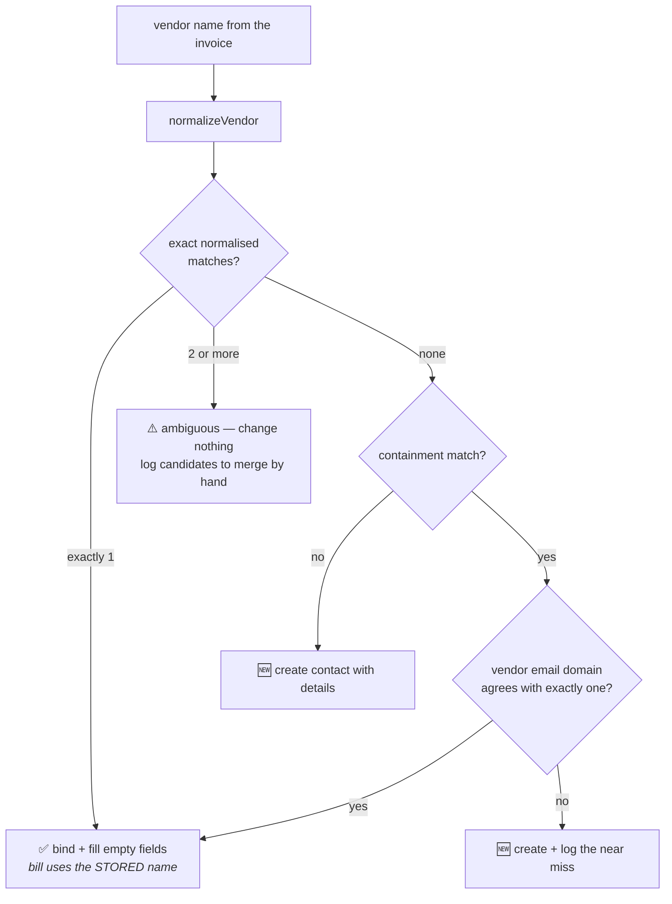

# Design note — vendor contacts in Xero

How [`drive-invoice-to-xero`](workflow.ts) resolves an invoice's vendor to a Xero contact, when it
creates one, and what it will and won't write onto an existing record.

Written 2026-07-28, before the feature was built. Evidence is from the live work.flowers Xero org
(`62699a8c-3351-40e8-9265-bdca5e037b03`), read through `_zap_raw_request`.

## The problem

Today the workflow passes `contact_name: header.vendor` to Xero's `new_bill`. Xero matches that
string against contact names exactly and **creates a bare contact when nothing matches** — no
address, no bank details, no email. The contact this Zap created on 2026-07-28 is the illustration:

```
Lantern Labs Pte. Ltd.   699fb6bb-960d-4a7f-ac43-3185e242890a
  EmailAddress: ""   BankAccountDetails: ""   Addresses: [STREET {}, POBOX {}]
```

Worse, "matches exactly" means a vendor whose name is punctuated differently gets a **second**
contact. That has already happened four times in a ledger of 130:

| | |
| --- | --- |
| `Aspire FT` | `Aspire FT Pte. Ltd.` |
| `Linear Orbit Inc.` | `Linear Orbit, Inc.` |
| `N9 OFFICES` | `N9 Offices Pte Ltd` |
| `Private Venue Management Pte Ltd` | `PRIVATE VENUE MANAGEMENT PTE. LTD.` |

Two of the ten invoices in the README's verified table hit one of those pairs, so the ambiguous case
is not hypothetical — it is 20% of the known sample.

## Why the lookup can't be delegated to Xero

`GET /Contacts?searchTerm=…` is a plain substring `contains`, returned unranked. Live proof:

```
searchTerm=olar  ->  "Polar Software, Inc."   5687465a-98d1-407c-9a7f-b69d42a9ed08
                     "Olar Software, Inc."    8139f51e-0a51-4922-bb0a-4b949b3ca1d9
```

Two unrelated companies, and nothing in the response says which is closer. Any similarity ranking —
edit distance especially — merges them. `Name.Contains(…)` has the same problem, and
`where=IsSupplier==true` is refused outright by this org: *"Due to the high number of contacts being
processed, this filter cannot be used"*.

So: **fetch the contacts and decide locally.** One `GET /Contacts?summaryOnly=true&pageSize=200`
returns all 130 in a single page for one task — the same cost as a search call, with semantics we
control.

## The matcher

`normalizeVendor` and `vendorMatches` already exist in [`workflow.ts`](workflow.ts) for the
bank-transaction match. They lowercase, strip punctuation, peel legal-entity suffixes, then allow
prefix containment. Run over all 130 real contact names (functions extracted from the deployed
source, not re-implemented):

- All four duplicate pairs collapse to a single key — `aspire ft`, `linear orbit`, `n9 offices`,
  `private venue management`. The matcher **sees** the ambiguity instead of silently picking one.
- `Olar Software, Inc.` and `Polar Software, Inc.` stay **distinct**. Suffix-stripping plus
  containment does what similarity scoring cannot.
- 8 of the 10 verified invoice vendors resolve to exactly one contact.

### Containment needs corroboration here, and doesn't in the transaction match

This is the one place the existing rule can't be reused as-is. Against bank transactions,
containment is safe **because an exact amount, currency and date window must also match**. A contact
has no such corroboration — only the name. The five containment-only pairs in the ledger show the
spread:

```
"Wise"      ~  "Wise Asia-Pacific Pte Ltd."       probably the same payee
"Slack"     ~  "Slack Technologies Limited"       probably the same payee
"LinkedIn"  ~  "LinkedIn Ads"                     arguably not
"PayPal"    ~  "PAYPAL *FACEBOOK 35314369001 IE"  definitely not
"Company Flow Pte. Ltd." ~ "… (dba work.flowers)" us, not a vendor
```

So containment alone never binds. It has to agree with the vendor email domain the extraction step
already returns, and otherwise degrades to "no match".

### Decision table

| Tier | Condition | Contact action | `contact_name` on the bill |
| --- | --- | --- | --- |
| 1 | Exactly one normalised match | Fill empty fields only | The matched contact's **stored** name |
| 2 | Several normalised matches | **Nothing** — log candidates for a human merge | `header.vendor` (today's behaviour) |
| 3a | Containment match, vendor email domain agrees with exactly one | Fill empty fields only | The matched contact's **stored** name |
| 3b | Containment match, no corroboration | Create a new contact with details | `header.vendor` |
| 4 | No match at all | Create a new contact with details | `header.vendor` |



Tier 2 is deliberately inert. A wrong bind puts a bill on the wrong payee and nobody notices; a
duplicate contact is untidy, visible in Xero, and mergeable in a click. When in doubt, prefer the
visible failure.

## `new_bill` has no contact-id field

The resolved `ContactID` cannot be handed to Xero directly. `new_bill`'s only handle is
`contact_name` (required, string) — there is no contact-id input. So a resolution is only worth
anything if it is fed back **as a name**: the bill must be created with the matched contact's exact
stored `Name`, not the vendor string off the invoice. Miss that and the matcher runs, finds the
right contact, and Xero creates the duplicate anyway.

Raw `POST /Invoices` with `Contact.ContactID` would remove the residual race (a contact renamed
between the lookup and the create), but it means hand-rolling the invoice payload and losing
`new_bill`'s attachment handling. Not worth it for a race this narrow.

Ordering follows from this: **resolve → create/enrich the contact → create the bill** with whatever
name the contact now has.

## What gets written

Fields available on Zapier's Xero `contact` write action, mapped from the extraction step:

| Xero input | Source |
| --- | --- |
| `name` | Vendor Name |
| `email_address` | Vendor Email Address (already extracted today) |
| `address__line1` / `line2` / `city` / `region` / `postal_code` / `country` | new extraction fields |
| `address__type_of` | `Postal Address` (Xero `POBOX`, the action's default and Xero's primary) |
| `phone__number` | new extraction field |
| `tax_number` | new extraction field (GST/VAT/UEN as printed) |
| `bank_account_details` | new extraction field — IBAN when present, else the account number |

**Bank name and SWIFT/BIC have nowhere to go.** Xero's `BankAccountDetails` is a single free-text
field, not a structured bank record. They are captured in the run output and the log line only; the
invoice PDF is attached to the bill and remains the record of truth.

### Fill empty fields only, never overwrite

Two reasons, one of them serious.

1. Xero's `contact` action **upserts by name** — passing a name that already exists updates that
   contact. Its merge semantics for absent fields, and specifically whether supplying one address
   type clears the other, are **not verified** (see Open items). Writing only into fields that are
   currently empty makes the answer irrelevant.
2. **Bank details scraped from an emailed PDF are the classic invoice-redirection vector.** Writing
   them onto a contact makes them sticky and reusable for future payments. Bills are draft-only and
   reviewed by a human, which mitigates the immediate risk, but the contact record outlives the
   bill.

So bank details are written **only when creating a brand-new contact**. On an existing contact whose
`BankAccountDetails` is already populated and *differs* from what the invoice says, the workflow
writes nothing and logs a warning. That warning is the cheap fraud tripwire, and it is the reason
this rule is worth the lines it costs. `Ernest Choo` and `Seth Lee` carry real account numbers
today; clobbering one from a scraped PDF is precisely the failure to design out.

## Task cost

Per run, on top of what the workflow spends today:

| Branch | Added tasks |
| --- | --- |
| Already paid → attach to transaction | **0** (unchanged, see below) |
| Draft bill, contact matched, nothing to add | +1 (the contact list) |
| Draft bill, contact matched, fields to fill | +3 (list, full read of the one contact, write) |
| Draft bill, no match, details extracted | +2 (list, create) |
| Draft bill, no match, nothing extracted | +1 — the create is skipped, since a bare contact is exactly what `new_bill` would have made anyway |

The full read of the matched contact is needed because `summaryOnly=true` omits `Addresses`,
`Phones` and `TaxNumber` — it does return `EmailAddress` and `BankAccountDetails`.

## Deliberately out of scope

- **Enriching on the already-paid branch.** The bank-transaction Table already carries
  `contact_id` (`Contact.ContactID`), so resolution there is an exact ID bind for free — no matching
  needed. But enrichment would still cost a read plus a write on the branch that runs most often,
  and the ask was about bill creation. Easy to add later; the identifier is already in hand.
- **Mirroring contacts into a Zapier Table** to make the lookup free, as the bank transactions are.
  It would save one task per run and reintroduce exactly the staleness coupling that produced
  duplicate bills on 2026-07-28. 130 contacts and one task is the better trade today.
- **Merging the four existing duplicate pairs.** A person should do that in Xero; the workflow only
  stops making new ones and reports the ones it trips over.

## Open items

1. **Xero's update-merge semantics are unverified** — specifically whether supplying a `POBOX`
   address leaves an existing `STREET` address intact. Verifying means writing to production Xero
   (contacts can be archived but not hard-deleted, so a test contact leaves a residue). The
   fill-empty-only rule is designed so the answer doesn't change correctness, but it should be
   confirmed against a throwaway contact before anyone relaxes that rule.
2. **Extraction quality for the new fields is unproven at `standard/auto`.** Address and bank blocks
   sit in invoice footers in wildly varying layouts. Per repo rule 7 the tier is not to be raised
   without a failing test; the verified-cases table in the README needs a column for these fields,
   run against the real PDFs.
3. **Pagination.** 130 contacts fit one page at `pageSize=200`. Past ~1000 this needs a loop.
