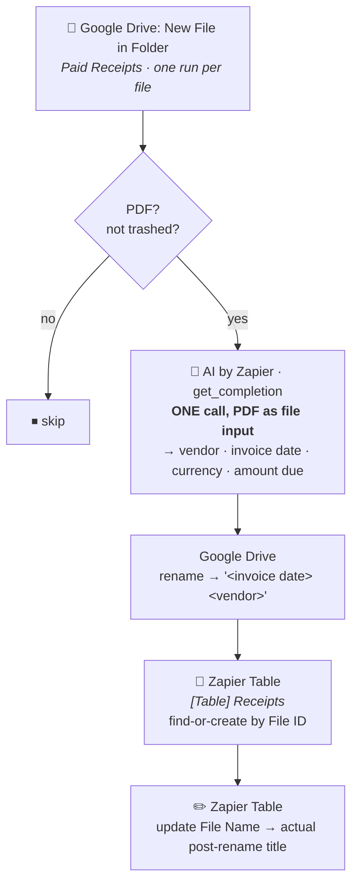

# Drive Paid Receipts → Table

Durable workflow (trigger **`read`** — "New File in Folder" — `GoogleDriveCLIAPI@1.22.0`) that
takes a receipt PDF dropped into the Google Drive **Paid Receipts** folder, renames it
`<invoice date> <vendor>`, and logs it in the **`[Table] Receipts`** Zapier Table. Migrated from
the classic Zap *"Google Drive receipts processing and analysis"*.

## What it does

1. **Trigger** — Google Drive *New File in Folder* on **Paid Receipts**, one run per file.
2. **PDF gate** (plain code, no task cost) — anything that isn't `application/pdf`, or is in the
   trash, is skipped. Carried over from the classic Zap's "PDFs only" filter.
3. **Analyze — a single AI call.** The PDF itself goes to AI by Zapier (`standard/auto`, built-in
   credentials) as a file input; one call returns vendor, invoice date, currency and total amount
   due. The prompt lives in [`receipt-extraction-prompt.md`](receipt-extraction-prompt.md).
4. **Rename** — the Drive file becomes `<invoice date> <vendor>`.
5. **Log** — find-or-create the file's row in `[Table] Receipts`, keyed on File ID.
6. **Sync** — re-write the Table's File Name field to the file's actual post-rename title, in case
   Drive appended `(1)` or similar to avoid a name collision.

## Verified behaviour

Extracted with `standard/auto` from a real receipt already in the Paid Receipts folder, via a
direct `run-action` test (no durable run, no writes) on 2026-07-28:

| Receipt | Extracted |
| --- | --- |
| `2026-07-25 Anthropic, PBC` | Vendor **Anthropic, PBC**, Date **2026-07-25**, Currency **S$**, Amount **133.58** |

Full durable end-to-end (rename + Table upsert against production data) was not run as part of
this migration — Dennis opted to publish directly on the strength of the AI-extraction test above
plus the code's close structural match to the already-verified
[`drive-invoice-to-xero`](../drive-invoice-to-xero/) migration. Worth a spot-check against the
next real receipt that lands in the folder.

## ⚠️ `new Date()` in the workflow body is a hard error

The first published version (`019fa8af`) carried two `Date` constructions in the workflow body and
**would have failed on the first receipt PDF** with `DeterminismViolation: Non-deterministic API
"new Date()" called in GUARDED mode`. It never did, only because no receipt landed in the folder
while that version was live — the fault was latent, not benign. It was found by
[`drive-invoice-to-xero`](../drive-invoice-to-xero/) hitting the identical bug in production
(same `toIsoDate` helper, same position right after the AI step) and is fixed the same way.

The durable runtime replaces `Date` with a Proxy before your code runs, and its `construct` trap
throws **before** it inspects its arguments — so `new Date(Date.UTC(y, m, d))`, which is perfectly
deterministic, is rejected exactly as hard as a clock read. Hence:

- **Validating and formatting dates is integer arithmetic** — `daysInMonth`, `isoDateFromEpochMs`.
- **Reading the clock goes in a `ctx.step`** — the `today` step, which runs only when the model
  gave no usable receipt date, so its value is fixed for every retry of a run.

Note the guard is a runtime component of `@zapier/zapier-durable`, not a lint or publish-time
check: `tsc` passes and the publish succeeds either way. See that Zap's README for the full write-up.

`toIsoDate` also got stricter as a side effect. Its old NaN check never fired — `Date.UTC`
normalises overflow instead of failing, so `2026-13-05` rolled into 2027 and the *original* string
came back. An impossible month or day is now rejected and falls through to the `today` fallback.

## Model tier

`standard/auto` — 1× tasks per run. Standard correctly read the test receipt above, and this step
is a straightforward four-field extraction with no tool calls, so there was no reason to inherit
Zapier's Advanced default.

## Maintainer notes

- **The Drive connection is bound twice** — on the trigger (which polls the folder) *and* as the
  `gdrive` alias, because the code renames the file. Both are the same connection id.
- **The Table upsert always re-syncs the File Name after renaming.** The classic Zap's
  find-or-create step computed the intended name directly from the AI step's output; the final
  update step overwrites it with the file's *actual* post-rename title, which can differ if Drive
  auto-appended `(1)` to avoid a name collision. This workflow preserves that two-step pattern.
- **`[Table] Receipts` (`01KJKDRB9P8ZP7NP9HE6NS3YFQ`) is keyed on File ID (f1).** Field map: f1
  File ID, f2 File Name, f3 Currency, f4 Amount, f5 Date, f6 Vendor Name.
- **The Date field (f5) is pinned to midnight UTC** (`<date>T00:00:00Z`) — a bare `YYYY-MM-DD` is
  read in the account's local timezone and silently shifts a day.
- **No catch URL.** This is a polling trigger, so there is nothing external to repoint; the
  cutover is just turning the classic Zap off.
- Missing vendor/date from the AI step fall back to `"Unknown Vendor"` / today's date rather than
  skipping, since a rename-and-log audit trail is lower-stakes than the bill-creation flow in
  `drive-invoice-to-xero` — a wrong file name is easy to spot and fix by hand. Today's date comes
  from the `today` step, not `new Date()`; see the determinism section above.
- **Never write `new Date` in the workflow body.** Integer date helpers are already here; use them.
- **This Zap has still never processed a real receipt.** The determinism fix is verified by unit
  checks over the date helpers (1970..2100 against native `Date`) and by the identical fix running
  green end-to-end in `drive-invoice-to-xero`, but no receipt PDF has been through this workflow on
  any version. Watch the first live run.
