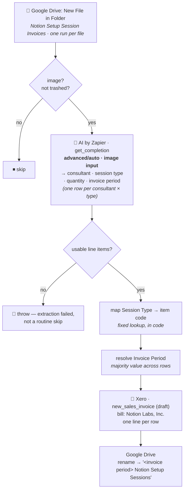

# Drive Screenshot → Xero Sales Invoice

Durable workflow (trigger **`read`** — "New File in Folder" — `GoogleDriveCLIAPI@1.22.0`) that turns
a monthly "Notion Setup Sessions" activity screenshot into a **draft sales invoice** billing Notion
Labs, Inc. Migrated from the classic Zap *"Generate Setup Session Invoice"*.

> **Invoices are always created as `draft`.** Nothing here approves, sends, or emails anything.
> Every invoice is meant to be reviewed in Xero before it goes anywhere near Notion.

## What it does

1. **Trigger** — Google Drive *New File in Folder* on **Notion Setup Session Invoices**, one run per
   file.
2. **Image gate** (plain code, no task cost) — anything that isn't an image, or is in the trash, is
   skipped. Carried over from the classic Zap's "Image Only" filter.
3. **Extract the line items — AI by Zapier.** The screenshot goes to `get_completion`
   (`advanced/auto`, built-in credentials) as an image input, returning one row per
   consultant/session-type combination: consultant name, session type, quantity, and the invoice
   period (the reporting month's last day). Prompt:
   [`drive-screenshot-to-xero-sales-invoice-prompt.md`](drive-screenshot-to-xero-sales-invoice-prompt.md).
4. **Map session type → Xero item code** — a fixed lookup table, in code, ported from the classic
   Zap's Formatter "Lookup Table" step. See [Item codes](#item-codes).
5. **Resolve the invoice period** — every row on one screenshot reports the same month, so the
   majority value across rows becomes the invoice's `date`. Ported from the classic Zap's
   Formatter "Line-item to Text" step.
6. **Create the draft sales invoice** — Xero `new_sales_invoice`, billing **Notion Labs, Inc.**, one
   line per consultant/session-type row.
7. **Rename** — the screenshot becomes `<invoice period> Notion Setup Sessions`.



## Item codes

Ported verbatim from the classic Zap's Formatter "Lookup Table" step (`util.lookup`):

| Session Type | Xero item code |
| --- | --- |
| Calls Completed | `NOTION-CALL` |
| No-Shows | `NOTION-NOSHOW` |
| Late Cancellations | `NOTION-CANCEL` |
| Workspace Conversions | `NOTION-UPGRADE` |
| Seats Added | `NOTION-SEATS` |
| Referral Bonuses | `NOTION-REFERRAL` |

A line whose Session Type doesn't match one of these six (or whose quantity is empty or ≤ 0, per
the classic Zap's own instruction) is silently dropped from the invoice rather than raised as an
error — the AI's category output is already constrained to this exact enum via `options_Session
Type`, so this is a defensive backstop, not the expected path.

## Invoice details

| Field | Value | Note |
| --- | --- | --- |
| Organisation | `62699a8c-3351-40e8-9265-bdca5e037b03` | work.flowers — same Xero tenant as [`drive-invoice-to-xero`](../drive-invoice-to-xero/) |
| Contact | `Notion Labs, Inc.` | Fixed literal, not read off the screenshot — no vendor-spelling drift for Xero's by-name match to trip over |
| Status | `draft` | Never auto-approved or sent |
| Currency | `USD` | |
| Branding theme | `742441f1-81a7-498b-9f8b-bc685bb0183c` ("USD Payments") | Verified live against the org |
| Account code | `460` ("Affiliate / Referral Income") | Verified live against the chart of accounts |
| Tax type | `NONE` ("No Tax") | Verified live |
| Reference | `PO #8900` | Fixed, per Dennis — the classic Zap held this in a Zap Component variable whose value the exported Zap JSON didn't carry, so it couldn't be recovered from the migration source and was supplied directly |

## AI model

**`advanced/auto`, not the repo's default `standard/auto`.** Flagged and tested before publishing,
per the repo's AI-tier convention — never silently upgraded.

A/B'd against three real screenshots already in the Drive folder (2026-04-30, 2026-05-31,
2026-06-30), each run at both tiers:

| Screenshot | `standard/auto` | `advanced/auto` |
| --- | --- | --- |
| 2026-04-30 | 12 lines | 12 lines — **identical** |
| 2026-05-31 | 8 lines | 8 lines — **identical** |
| 2026-06-30 | **9 lines** | **10 lines** |

On 2026-06-30, `standard/auto` silently dropped a real row — **Ernest Choo, Calls Completed: 2** —
that `advanced/auto` caught both times it was run. Reproduced on a second `standard/auto` run of the
same screenshot (still 9 lines, still missing Ernest Choo's Calls Completed row), so this isn't a
one-off flake. `advanced/auto` agreed with itself and with `standard/auto` on the other two screenshots.

A dropped line here is under-billed revenue with no error anywhere — the invoice would simply have
been short one line item, silently. That is the exact failure mode the repo's AI-tier convention
exists to catch before it ships, so the tier is `advanced/auto` despite the extra task cost.
Re-run this comparison (offline, via `run-action`, against real screenshots — not by running the
durable) before ever considering a downgrade.

## Determinism

No calendar arithmetic happens here at all — the AI already returns the reporting month's last day
— so unlike [`drive-invoice-to-xero`](../drive-invoice-to-xero/) there's no `daysFromCivil` /
`isoDateFromEpochMs` pair needed. `toIsoDate` still exists, purely to validate the AI's date string
is a real calendar date via integer math (`daysInMonth`) before it reaches Xero — because the
durable runtime's `Date` guard rejects even a deterministic `new Date(Date.UTC(...))` in the
workflow body (see that Zap's README for the production incident this caused). `Date` is not
referenced anywhere in `workflow.ts`.

## Publishing

Published directly (no draft — brand-new workflow, nothing to publish past):

```bash
zapier-sdk --experimental publish-workflow-version 019fd190-ba8f-73be-a6c0-555cc4c79f68 "$SOURCE_FILES" \
  --dependencies '{"@zapier/zapier-sdk":"0.94.0","zod":"4.4.3"}' \
  --zapier-durable-version '0.12.3' \
  --connections '{"gdrive":{"connectionId":"02eb8724-3fc7-8edc-9b30-be83af0b327f"},"xero_wf":{"connectionId":"02336808-1736-878b-a0a8-87e02bb0aec3"}}' \
  --trigger '{"selected_api":"GoogleDriveCLIAPI@1.22.0","action":"file_in_folder_v2","authentication_id":"02eb8724-3fc7-8edc-9b30-be83af0b327f","params":{"drive":"0AHY_MJFjT0WtUk9PVA","folder":"1ptd7K3cVnDG_FZWjq3xxPmKKnbizbJfM","includeDeleted":"false","includeSubfolders":false}}' \
  --enabled \
  --json
```

- **Gate every publish on `npm run build`.** Publishing does not typecheck.
- **No catch URL.** Polling trigger; cutover was just disabling the classic Zap (done by Dennis
  before this migration started).
- **Tested with a real screenshot before publishing**, not a skip-path payload — see
  [AI model](#ai-model) and [Maintainer notes](#maintainer-notes). The first `run-durable` attempt
  hit the rename bug below and created a real draft invoice (`a773938c-…`); the second, after the
  fix, created another (`0cda0de5-…`) and completed cleanly — 10 lines, invoice period
  `2026-06-30`, `periodUnanimous: true`, renamed to match the file's already-correct name. **Both
  test invoices were deleted from Xero** (`update_sales_invoice` with `invoice_status: "deleted"`,
  confirmed via a raw `GET`) before this was reported done — production runs start with a clean
  ledger.
- **Verified after publish:** `get-workflow` shows `enabled: true`, `triggers[0].status: "active"`,
  `is_private: false`.

## Maintainer notes

- **`update_file_name`'s `file` input wants the plain Drive file ID, not the AI step's hydrate
  token.** The trigger payload's `file` field is a hydrate reference meant for content-fetching
  actions (the AI step's image input) — passing that same token to `update_file_name` 404s
  (`"Error 404 (Not Found)!!1"`). Use `file.id` there, exactly like `drive-invoice-to-xero`'s rename
  step. Caught live during pre-publish testing, not in code review — `tsc` has no way to know a
  `string` field wants one specific string shape over another.
- **`new_sales_invoice` has no `contact_id` field** — same shape as `new_bill` on the bill side.
  `contact_name` is the only handle it offers. Unlike `drive-invoice-to-xero`'s vendor problem, this
  is safe here because `CONTACT_NAME` is a fixed constant, never text read off a document — every
  run sends the exact same literal, so there's no spelling variance for Xero's by-name match to
  fork into a duplicate contact.
- **`line_items` is a nested fieldset of objects**, not five parallel top-level arrays — confirmed
  live via `list-action-input-fields XeroCLIAPI write new_sales_invoice`. Each object carries its
  own `line_item_code`, `line_description`, `line_quantity`, `line_account_code`, `line_tax_type`,
  `line_items_type`. This differs from how the classic Zap's UI expressed it (one flat field per
  key, each bound to an `items[]`-prefixed array reference) but resolves to the same wire shape.
- **The Drive connection is bound twice** — on the trigger (which polls the folder) *and* as the
  `gdrive` alias, because the code renames the file. Both are the same connection id
  (`02eb8724-3fc7-8edc-9b30-be83af0b327f`), same as `drive-invoice-to-xero` and
  `drive-paid-receipts-to-table`.
- **Tested against a real screenshot before publishing**, not the empty-payload skip path — the
  2026-06-30 file already in the folder, via `run-durable`. That test genuinely creates a draft Xero
  invoice and (harmlessly, since the file was already correctly named) attempts a no-op rename.
- **A polling trigger consumes a file once.** A run that fails is not retried and the trigger will
  not re-deliver that file, so a fix has to be paired with a manual replay — re-fire the workflow
  with the failed run's original trigger payload (the `file` hydrate reference stays valid for
  hours afterward, per `drive-invoice-to-xero`'s experience).
- **No vendor-contact resolution needed.** `drive-invoice-to-xero` had to resolve vendor names
  against the real Xero contact list because vendor spelling comes off a scanned document; this Zap
  bills one fixed contact with a fixed literal name, so that whole problem doesn't apply here.
