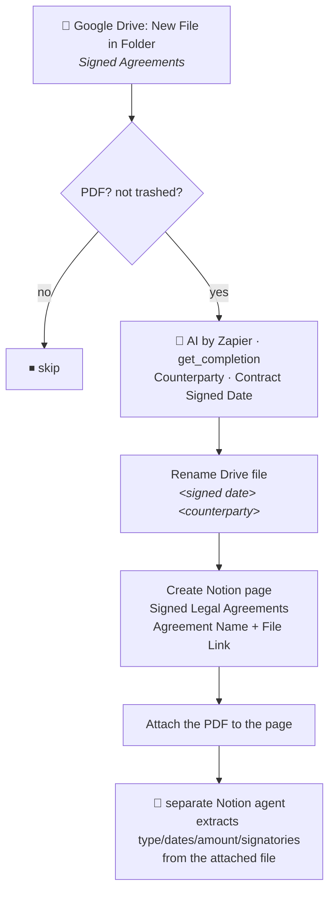

# Drive Signed Agreement → Notion

Durable workflow, trigger **Google Drive "New File in Folder"** on the **Signed Agreements** folder
(`1-1HCfTIdnngXv_1fhUHuPpjI6Nupk7-K`). Migration of the classic Zap **"Legal Agreement Summarizer"**,
deliberately cut down in scope: it renames the file and files it into Notion with the Drive link and
the file itself attached, and nothing more. A separate Notion agent, triggered on new pages in the
data source, reads the attached PDF and populates everything else (Agreement Type, Effective Date,
End Date, Currency, Amount, Signatory Email Addresses, Additional Notes/AI summary).

## Why the scope was cut down

The classic Zap's single AI call extracted 9 fields (currency, amount, counterparty, effective date,
end date, agreement type, signatory emails, signed date, a free-text summary) and fanned out into a
Zapier Table lookup, a branch on whether a signatory email resolved to a Contact, and two near-duplicate
`create_database_item` calls (one with a `Signatory` relation, one without — the second, node `11` in the
export, predates a schema change and was already dead code). Dennis asked to keep this migration to
exactly what's needed to **file** the document — rename it and get it into Notion with the source file
attached — and hand the rest to a Notion-side agent that can iterate on extraction independently of this
workflow's publish cycle.

**Agreement Type classification was tried and then dropped.** An earlier version of this workflow also
extracted Agreement Type (first against the classic Zap's narrow 4-option set, then against a consolidated
9-category taxonomy proposed and refined with Dennis). It was never actually written to a Notion property —
this workflow only ever set `Agreement Name` and `File Link` — so it was purely for the file/page name.
Dennis asked to drop the classification step entirely rather than keep an AI call whose only output fed a
naming convenience; the rename and the Notion title now use just `<signed date> <counterparty>`.

## The counterparty bug that was fixed

Real production evidence, pulled from 7 real documents already sitting in the live Signed Agreements
folder at build time — several of them repeatedly misidentified **Company Flow Pte. Ltd. (our own entity)**
as the counterparty:

| File | Old counterparty | Bug |
| --- | --- | --- |
| `20260308-Salary Revision March 2026 - ....pdf` | **Company Flow Pte. Ltd.** | wrong — that's us, and this is an internal-only document with no external counterparty at all |
| `CompanyFlowPteLtd__SCWInc_MNDA__NOV25.pdf` | **Company Flow Pte. Ltd** | wrong — actual counterparty is Secure Code Warrior |
| `Complete_with_Docusign_Notion_General_MNDA_(.pdf` | **Company Flow Pte. Ltd.** | wrong — actual counterparty is Notion |
| `...SOW Terrascope GTM Automation....pdf` | **`Terrascope GTM PA.pdf`** | the literal filename leaked into the field |

**Fix, validated against those same 7 documents** via the offline `run-action` harness (never through the
durable, so nothing was written except the one live-validation run below):

| Document | Old (wrong) | New | Verdict |
| --- | --- | --- | --- |
| `20260308-Salary Revision March 2026...pdf` | Company Flow Pte. Ltd. | **empty string** | fixed — internal doc, no counterparty |
| `CompanyFlowPteLtd__SCWInc_MNDA__NOV25.pdf` | Company Flow Pte. Ltd | **Secure Code Warrior Inc.** | fixed |
| `Complete_with_Docusign_Notion_General_MNDA_(.pdf` | Company Flow Pte. Ltd. | **Notion Labs, Inc.** | fixed |
| `...SOW Terrascope GTM Automation....pdf` | literal filename | **Seth Lee; Terrascope Pte. Ltd.** | fixed |
| `20260702-SUBCONTRACTING AGREEMENT...Lantern Labs....pdf` | correct, but padded with an explanatory aside about a tangential third party | **Lantern Labs Pte. Ltd.** only | cleaner |

The fix: an explicit exclusion list naming the company's own entity/aliases (`Company Flow Pte. Ltd.`,
`workFlowers`, `Work Flowers`, Dennis's name, his email), and an explicit instruction to return an empty
string — never a placeholder — for internal-only documents. `standard/auto` was sufficient throughout; no
tier upgrade was needed, matching the pattern already established in `drive-invoice-to-xero` and
`gmail-attachments-to-drive-by-type`.

## What this Zap does NOT do

- Does not classify Agreement Type, or extract Currency, Amount, Effective Date, End Date, Signatory Email
  Addresses, or write an `AI summary` / `Additional Notes` — a separate Notion agent, triggered on new pages
  in this data source, reads the attached PDF and fills those in.
- Does not look up or set the `Signatory` relation (the old Zap's Zapier Table lookup against
  `Signatory Email Addresses` is gone entirely).
- Does not apply the data source's default template — **"Signed Legal Agreements" has none configured**
  (confirmed live: `create_database_item` with `template_mode: "default"` threw "no default template", and
  the fallback create path was taken — see `usedTemplate: false` in the live run below). Per repo rule 5 the
  code still tries the template path first via the shared `createItemWithTemplate` helper, so nothing needs
  to change here if a default template is added in Notion later.

## Live validation

Run through the deployed durable (not a synthetic payload) against a real, previously-unfiled document —
`Terms and Conditions for pre-paid Talk Therapy Sessions.pdf`:

- Extracted: Counterparty `Talk Your Heart Out Pte Ltd`, signed date not stated on the document (fell back
  to the run date). *(This run predates dropping Agreement Type entirely — it also returned a Type value
  that was never written to Notion anyway.)*
- Drive file renamed; Notion page created with only `Agreement Name` and `File Link` set —
  `Counterparty`, `Currency`, `Amount`, dates, `Signatory`, `AI summary` all correctly left null/empty for
  the separate Notion agent to fill in.
- PDF attached to the page as a `pdf` block.
- `usedTemplate: false`, confirming no default template on this data source.

## Maintainer notes

- **Connections.** `gdrive` (Google Drive dennis@work.flowers) is bound in code because the workflow
  renames the file; it's also the trigger's own connection. `notion_wf` is the work.flowers workspace
  Notion connection — **never** the Knoxx connection, which cannot see this data source. AI by Zapier runs
  on built-in credentials, no connection.
- **No email/signatory resolution at all.** The classic Zap's `text_line_item` email-extraction Formatter
  step, its branch on "Signatory Emails Found", and its Zapier Table lookup against the email → Notion
  Contact Table are all gone — that responsibility moves entirely to the separate Notion agent, which reads
  the attached PDF directly rather than trusting an AI-extracted email string.
- **The classic Zap can be left as-is or turned off** — either is safe. Its trigger polls the same folder,
  but every downstream step was `paused: true` in the export, so there's no duplicate-processing risk from
  this durable being live alongside it.
- **Rename basis unified.** The classic Zap renamed the file using `Contract Signed Date` but titled the
  Notion page using `Effective Date` — two different dates for the same record. This workflow uses
  `Contract Signed Date` for both.
