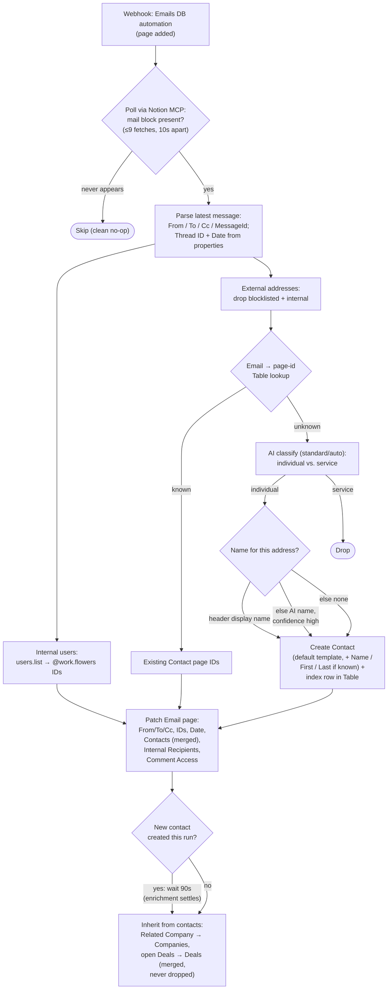

# Email DB Updates

Durable port of the [`notion-worker-email-db-updates`](https://github.com/work-flowers/notion-worker-email-db-updates) Notion Worker (itself a replacement for a classic Zap + sub-Zap). Enriches newly created pages in the Notion **Emails** data source (`1e491b07-11ac-80ce-8b86-000b29ba4f68`) with metadata parsed from their mail block, resolved **Contacts**, and internal recipients.

## Trigger

Notion DB automation on the **Emails** data source — **When page added** → **Send to webhook** → this workflow's **catch URL** (`zap.json` → `trigger.webhook_url`, `https://hooks.zapier.com/hooks/catch/…`; `WebHookCLIAPI@1.1.1` / `hook_v2`, no auth). Live and cut over (see "Cutover"). The top-level `trigger_url` (`code-substrate-workflows.zapier.com/…`) is Zapier-internal — manual `trigger-workflow` runs and Zap-to-Zap calls only. Payload carries the page under `data.id`; manual runs may pass a bare `{ "pageId": … }`.

## What it does

1. **Polls for the mail block** (up to ~90s; Notion populates it asynchronously after page creation). Mail blocks are **not exposed by the public Notion API** (they come back as `unsupported`), so the page is fetched through Notion MCP via the *MCP Client by Zapier* app — the same route the Worker and the original Zap used. Each fetch is a billed action call, so the loop is one fetch plus up to 8 wait-and-retry rounds. When the API adds mail-block support, switch to `blocks.children` and drop the MCP dependency.
2. **Parses the latest message** in the thread: `From`, `To`, `Cc`, `Subject`, `MessageId`; `Gmail Thread ID` and `Date Received` come from the page's own properties, with mail-header fallback for the date.
3. **Resolves addresses**:
   - External addresses → Contact page IDs via the **email → page-id Zapier Table** (`01JYEPSEARXB2Z6BJRCMFGXBC2`; free reads; one row per address, Primary *and* Secondary, kept in sync by [`contact-emails-to-zapier-table`](../contact-emails-to-zapier-table/)). Blocklisted addresses (Zapier Table `01KQY6RB1TJ9X7BAYBRRRKB35S`) and `@work.flowers` ones are dropped first.
   - Unknown addresses are classified with AI by Zapier (individual vs. service account); a Contact page is created for each individual (capped at 10 per run), **with the Contacts default template applied** (repo rule 5) and **with the person's name when the email reveals one** (see below), and its address indexed straight into the Table so back-to-back emails from the same new sender can't race the sync durable into a duplicate contact.
   - Internal addresses (`@work.flowers`) → Notion workspace user IDs via `users.list`.
4. **Patches the page**: `From` (email), `To` / `Cc` (multi-select), `Gmail Message ID`, `Gmail Thread ID` (falls back to the message ID), `Date Received` (only if Notion didn't already set it), `Contacts` (**merged** with any relations Notion set natively — never overwritten), `Internal Recipients` and `Comment Access` (people; Comment Access is deliberately overwritten, same as the Worker and Zap).
5. **Inherits `Companies` and `Deals` from the linked contacts** — each contact's `Related Company` relations, plus their **open** `Deals`, are merged onto the email (existing links are never dropped). A deal counts as open unless its `Status` is `Closed Won` / `Closed Lost` / `Declined` — the closed set is enumerated so a future open-pipeline status is included automatically, and a deal whose status can't be read is linked (with a log line) rather than silently dropped. This replaces the native "set Companies when a contact is linked" Emails DB automation, which **does not fire on API-driven property updates** (the same finding recorded in the meeting-note worker). When the run created a brand-new contact, it waits 90s first so [`enrich-contact-records`](../enrich-contact-records/) has time to fill in the contact's `Related Company` (the wait is free while the durable is suspended).



## Naming a new contact

A contact created here used to carry `Primary Email` and nothing else. That is
not just cosmetic: it silently halved the contact's enrichment.
[`enrich-contact-records`](../enrich-contact-records/) runs Apollo first and
falls back to NinjaPear, but a NinjaPear lookup only ever resolves on
`employer_website` **+ a name**, so its viability gate
(`Boolean(contact.domain && (firstName || lastName))`) skips the call outright
for a nameless contact — logging `skipped — no name to pair with the company
domain`. A nameless contact therefore has one enrichment source, not two, and
when Apollo misses (free-tier 401, no credits, no usable match) it stays bare
until a human types a name in. Meanwhile the name was usually sitting in the
email all along. Two paths now harvest it, strongest evidence first:

1. **The mail-block header display name** (`parseDisplayNames`, deterministic,
   free). The block renders headers as
   `To: Dennis Chiuten \<dennis@work.flowers\>, Amandeep Gill \<amandeep@oboxhr.com\>`
   — Notion's enhanced markdown **escapes the angle brackets**, hence the
   optional backslashes in `ADDRESS_WITH_NAME_REGEX`. Address extraction is
   untouched: `extractEmails` remains the sole authority on which addresses are
   present, so a parse miss here costs a name and never a recipient.
2. **The AI classifier's name field**, used only for an address the header left
   unnamed. A Gmail plus-reply chip is the motivating case: it puts the name in
   the *body* (`@Amandeep Gill has outlined the requirements`) and can leave the
   header bare. This rides the `classify-new-emails` call that already runs — an
   extra `Email Context` input field and two extra output fields, **no extra
   step and no extra task**.

Only `high`-confidence AI names are written. A **wrong** name is worse than no
name, because it is exactly what the enrichment sources match on: it converts a
clean miss into a confident match on the wrong person. So a name merely inferred
from the shape of the mailbox (`john.smith@` → "John Smith") is required to come
back `low` and is discarded. `isUsableName` applies the same scepticism to
header names, rejecting a name that echoes its own mailbox (`support
\<support@…\>`, `jsmith \<jsmith@…\>`) — which also rejects a genuine one-word
name equal to its mailbox (`Aman \<aman@…\>`), a trade worth making since a lone
first name is weak enrichment input anyway.

The full name always goes in the `Name` title, so a bad First/Last split still
leaves the page correct to a human reader. Properties passed on create override
the template's defaults, so the name lands on a properly templated page.

## Differences from the Worker, on purpose

- **Contact lookup uses the email → page-id Zapier Table** instead of querying the Contacts data source directly (Primary + Secondary). The Worker had moved *off* the Table because free Table reads don't apply outside Zapier; inside a Durable they do, so this moves back — the same resolution path the Luma guest workflows use.
- **New Contact pages apply the Contacts default template** (blue user-circle icon; repo rule 5). The Worker created bare pages.
- **New contacts are indexed into the Table immediately** rather than waiting on the `contact-emails-to-zapier-table` sync (whose upsert treats the pre-written row as a no-op).
- **The classifier runs on AI by Zapier `standard/auto`** (repo convention) instead of `openai/gpt-5-mini` via the AI action's provider passthrough.
- **`Companies` / `Deals` inheritance is new** — neither the Worker nor the original Zap did it; a native Emails DB automation used to set `Companies`, but it never fires on these API-driven updates, so the linking moved into the workflow.
- **New contacts are named from the email** (see "Naming a new contact"). The Worker, the original Zap and this workflow's first five versions all created `Primary Email`-only pages.

Carried over from the Worker (differences from the original Zap): the `Contacts` relation is merged, not replaced; the audit table is dropped (run history replaces it); internal user IDs come from `users.list`, not the "Internal User IDs" Zapier table.

## AI model

`standard/auto` on built-in credentials (`authentication_id: "0"`). Classification of email addresses is exactly the workload Standard is recommended for, and adding the name pass did not change that — see the name cases below, which Standard gets right including the one that matters most (refusing to promote a mailbox-shaped guess to `high`). Verified offline via a `run-action` harness with the deployed prompt + output fields; verdicts were identical across two consecutive runs, and the `boolean` output-field type round-trips correctly with `isOutputArray`.

**Classification** (unchanged by the name pass — re-run after it was added, 10/10 identical):

| Address | Verdict | Correct? |
| --- | --- | --- |
| `jane.doe@acme.com` | individual | ✅ |
| `noreply@stripe.com` | service | ✅ |
| `billing@vendor.io` | service | ✅ |
| `tomas92@gmail.com` | individual | ✅ |
| `support@notion.so` | service | ✅ |
| `k.tanaka@knoxxfoods.com` | individual | ✅ |
| `newsletter@substack.com` | service | ✅ |
| `d.smith+invoices@contractor.co` | individual | ✅ |
| `alerts@github.com` | service | ✅ |
| `mchen@terrascope.com` | individual | ✅ |

**Naming** (added 2026-07-31). The `Email Context` input is the latest message, `<br>`-unescaped and capped at 4000 chars:

| Case | Address | Name / confidence | Correct? |
| --- | --- | --- | --- |
| Real "India visit" message; header names him | `amandeep@oboxhr.com` | `Amandeep Gill` / high | ✅ |
| Same message, header stripped to bare addresses — name only in the body as a Gmail chip mention | `amandeep@oboxhr.com` | `Amandeep Gill` / high | ✅ (the case path 2 exists for) |
| Name derivable only from the mailbox shape, body never names anyone | `john.smith@acme.com` | `John Smith` / **low** → discarded | ✅ (the guard that matters) |
| Service address on a message that names a colleague | `billing@vendor.io` | empty / low, classified service | ✅ |
| …the colleague, introduced by name in the body | `priya.raman@vendor.io` | `Priya Raman` / high | ✅ |
| 10 addresses absent from the supplied context | (the table above) | all empty / low | ✅ (no invented names) |

Prompt source of truth: [`contact-classifier-prompt.md`](contact-classifier-prompt.md) (repo rule 6; `node scripts/check-prompts.mjs` verifies the embedded copy).

Header parsing is covered separately by 16 offline cases run against the real mail block — escaped and unescaped brackets, quoted `"Last, First"` names, bare addresses, mailbox-echo rejection, non-Latin names, hyphen/apostrophe names — with `extractEmails` output asserted byte-identical throughout.

## Connections

| Alias | App key | Connection | Connection id |
| --- | --- | --- | --- |
| `notion_wf` | `NotionCLIAPI` | `work.flowers \| Dennis` | `02b73654-15c8-85c3-b16a-07304d2beb17` |
| `notion_mcp` | `App222157CLIAPI` (MCP Client by Zapier) | `Notion MCP (1.2.0)` | `025ea818-da55-8691-b4d0-5647c50a0e59` |

Connectionless: `AICLIAPI` (built-in credentials), Zapier Tables.

## Test

```bash
SOURCE_FILES="$(jq -n --rawfile workflow workflow.ts '{"workflow.ts": $workflow}')"
zapier-sdk --experimental run-durable "$SOURCE_FILES" \
  --dependencies '{"@zapier/zapier-sdk":"0.91.0","zod":"4.4.3"}' \
  --zapier-durable-version '0.10.1' \
  --connections '{"notion_wf":{"connectionId":"02b73654-15c8-85c3-b16a-07304d2beb17"},"notion_mcp":{"connectionId":"025ea818-da55-8691-b4d0-5647c50a0e59"}}' \
  --input '{"pageId":"<real-email-page-id>"}' \
  --private
```

This writes to the real Emails page (and possibly creates real Contacts) — use a recent genuine Email page and verify the patch by hand.

## Deploy

```bash
SOURCE_FILES="$(jq -n --rawfile workflow workflow.ts '{"workflow.ts": $workflow}')"
zapier-sdk --experimental create-workflow "email-db-updates" \
  --description "Notion Emails page added -> parse mail block, resolve Contacts + internal recipients, patch the page." --private --json
# capture the workflow id, then:
zapier-sdk --experimental publish-workflow-version <workflow-id> "$SOURCE_FILES" \
  --dependencies '{"@zapier/zapier-sdk":"0.91.0","zod":"4.4.3"}' \
  --zapier-durable-version '0.10.1' \
  --connections '{"notion_wf":{"connectionId":"02b73654-15c8-85c3-b16a-07304d2beb17"},"notion_mcp":{"connectionId":"025ea818-da55-8691-b4d0-5647c50a0e59"}}' \
  --trigger '{"selected_api":"WebHookCLIAPI@1.1.1","action":"hook_v2","authentication_id":null,"params":{}}' \
  --enabled --json
```

## Cutover — done

The Notion **Emails** automation posts here now: runs from 2026-07-28 onward
carry `source.type: "automation"` with `automation_id`
`3a091b07-11ac-80d8-8e18-004dbf133f9c`, delivered to this workflow's catch URL
`https://hooks.zapier.com/hooks/catch/20495893/diRTHE6K9IbpbqZW/`
(`zap.json` → `trigger.webhook_url` — not the internal `trigger_url`). Confirm
any time with `zapier-sdk --experimental list-workflow-runs <workflow-id>`.

Remaining: decommission the `notion-worker-email-db-updates` Worker, which was
kept deployed as rollback (`ntn workers` — remove the webhook registration or
the Worker itself).

## References

- [`notion-worker-email-db-updates`](https://github.com/work-flowers/notion-worker-email-db-updates) — the Worker this replaces; its `exported-zap-*.json` files hold the original classic Zap + sub-Zap.
- [`contact-emails-to-zapier-table`](../contact-emails-to-zapier-table/) — owns the email → page-id Table this workflow resolves contacts through.
