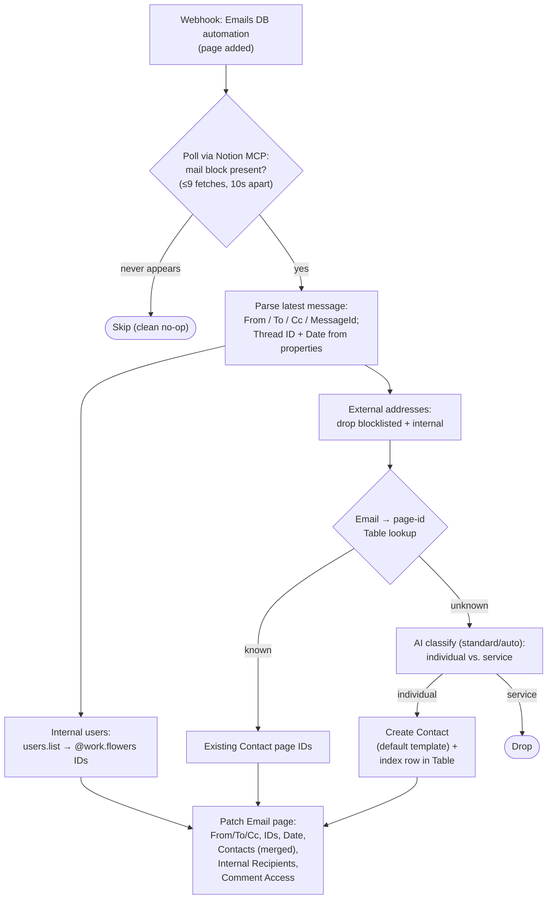

# Email DB Updates

Durable port of the [`notion-worker-email-db-updates`](https://github.com/work-flowers/notion-worker-email-db-updates) Notion Worker (itself a replacement for a classic Zap + sub-Zap). Enriches newly created pages in the Notion **Emails** data source (`1e491b07-11ac-80ce-8b86-000b29ba4f68`) with metadata parsed from their mail block, resolved **Contacts**, and internal recipients.

## Trigger

Notion DB automation on the **Emails** data source — **When page added** → **Send to webhook** → this workflow's `trigger_url` (`WebHookCLIAPI@1.1.1` / `hook_v2`, no auth). Payload carries the page under `data.id`; manual runs may pass a bare `{ "pageId": … }`.

## What it does

1. **Polls for the mail block** (up to ~90s; Notion populates it asynchronously after page creation). Mail blocks are **not exposed by the public Notion API** (they come back as `unsupported`), so the page is fetched through Notion MCP via the *MCP Client by Zapier* app — the same route the Worker and the original Zap used. Each fetch is a billed action call, so the loop is one fetch plus up to 8 wait-and-retry rounds. When the API adds mail-block support, switch to `blocks.children` and drop the MCP dependency.
2. **Parses the latest message** in the thread: `From`, `To`, `Cc`, `Subject`, `MessageId`; `Gmail Thread ID` and `Date Received` come from the page's own properties, with mail-header fallback for the date.
3. **Resolves addresses**:
   - External addresses → Contact page IDs via the **email → page-id Zapier Table** (`01JYEPSEARXB2Z6BJRCMFGXBC2`; free reads; one row per address, Primary *and* Secondary, kept in sync by [`contact-emails-to-zapier-table`](../contact-emails-to-zapier-table/)). Blocklisted addresses (Zapier Table `01KQY6RB1TJ9X7BAYBRRRKB35S`) and `@work.flowers` ones are dropped first.
   - Unknown addresses are classified with AI by Zapier (individual vs. service account); a Contact page is created for each individual (capped at 10 per run, `Primary Email` only), **with the Contacts default template applied** (repo rule 5), and its address indexed straight into the Table so back-to-back emails from the same new sender can't race the sync durable into a duplicate contact.
   - Internal addresses (`@work.flowers`) → Notion workspace user IDs via `users.list`.
4. **Patches the page**: `From` (email), `To` / `Cc` (multi-select), `Gmail Message ID`, `Gmail Thread ID` (falls back to the message ID), `Date Received` (only if Notion didn't already set it), `Contacts` (**merged** with any relations Notion set natively — never overwritten), `Internal Recipients` and `Comment Access` (people; Comment Access is deliberately overwritten, same as the Worker and Zap).



## Differences from the Worker, on purpose

- **Contact lookup uses the email → page-id Zapier Table** instead of querying the Contacts data source directly (Primary + Secondary). The Worker had moved *off* the Table because free Table reads don't apply outside Zapier; inside a Durable they do, so this moves back — the same resolution path the Luma guest workflows use.
- **New Contact pages apply the Contacts default template** (blue user-circle icon; repo rule 5). The Worker created bare pages.
- **New contacts are indexed into the Table immediately** rather than waiting on the `contact-emails-to-zapier-table` sync (whose upsert treats the pre-written row as a no-op).
- **The classifier runs on AI by Zapier `standard/auto`** (repo convention) instead of `openai/gpt-5-mini` via the AI action's provider passthrough.

Carried over from the Worker (differences from the original Zap): the `Contacts` relation is merged, not replaced; the audit table is dropped (run history replaces it); internal user IDs come from `users.list`, not the "Internal User IDs" Zapier table.

## AI model

`standard/auto` on built-in credentials (`authentication_id: "0"`). Classification of email addresses is exactly the workload Standard is recommended for. Verified offline via a `run-action` harness with the deployed prompt + output fields — verdicts below were identical across two runs, and the `boolean` output-field type round-trips correctly with `isOutputArray`:

| Address | Verdict | Correct? |
| --- | --- | --- |
| `jane.doe@acme.com` | individual | ✅ |
| `noreply@stripe.com` | service | ✅ |
| `billing@vendor.io` | service | ✅ |
| `tomas92@gmail.com` | individual | ✅ |
| `support@notion.so` | service | ✅ |
| `k.tanaka@knoxxfoods.com` | individual | ✅ |
| `newsletter@substack.com` | service | ✅ |
| `d.smith+invoices@contractor.co` | individual | ✅ |
| `alerts@github.com` | service | ✅ |
| `mchen@terrascope.com` | individual | ✅ |

Prompt source of truth: [`contact-classifier-prompt.md`](contact-classifier-prompt.md) (repo rule 6; `node scripts/check-prompts.mjs` verifies the embedded copy).

## Connections

| Alias | App key | Connection | Connection id |
| --- | --- | --- | --- |
| `notion_wf` | `NotionCLIAPI` | `work.flowers \| Dennis` | `02b73654-15c8-85c3-b16a-07304d2beb17` |
| `notion_mcp` | `App222157CLIAPI` (MCP Client by Zapier) | `Notion MCP (1.2.0)` | `025ea818-da55-8691-b4d0-5647c50a0e59` |

Connectionless: `AICLIAPI` (built-in credentials), Zapier Tables.

## Test

```bash
SOURCE_FILES="$(jq -n --rawfile workflow workflow.ts '{"workflow.ts": $workflow}')"
zapier-sdk --experimental run-durable "$SOURCE_FILES" \
  --dependencies '{"@zapier/zapier-sdk":"0.91.0","zod":"4.4.3"}' \
  --zapier-durable-version '0.10.1' \
  --connections '{"notion_wf":{"connectionId":"02b73654-15c8-85c3-b16a-07304d2beb17"},"notion_mcp":{"connectionId":"025ea818-da55-8691-b4d0-5647c50a0e59"}}' \
  --input '{"pageId":"<real-email-page-id>"}' \
  --private
```

This writes to the real Emails page (and possibly creates real Contacts) — use a recent genuine Email page and verify the patch by hand.

## Deploy

```bash
SOURCE_FILES="$(jq -n --rawfile workflow workflow.ts '{"workflow.ts": $workflow}')"
zapier-sdk --experimental create-workflow "email-db-updates" \
  --description "Notion Emails page added -> parse mail block, resolve Contacts + internal recipients, patch the page." --private --json
# capture the workflow id, then:
zapier-sdk --experimental publish-workflow-version <workflow-id> "$SOURCE_FILES" \
  --dependencies '{"@zapier/zapier-sdk":"0.91.0","zod":"4.4.3"}' \
  --zapier-durable-version '0.10.1' \
  --connections '{"notion_wf":{"connectionId":"02b73654-15c8-85c3-b16a-07304d2beb17"},"notion_mcp":{"connectionId":"025ea818-da55-8691-b4d0-5647c50a0e59"}}' \
  --trigger '{"selected_api":"WebHookCLIAPI@1.1.1","action":"hook_v2","authentication_id":null,"params":{}}' \
  --enabled --json
```

## Cutover

1. Publish (above) and test with a real page id.
2. Repoint the Notion **Emails** data source automation (**When page added → Send to webhook**) at this workflow's `trigger_url` (see `zap.json`).
3. Leave the `notion-worker-email-db-updates` Worker deployed for a few days as rollback, then decommission it (`ntn workers` — remove the webhook registration or the Worker itself).

## References

- [`notion-worker-email-db-updates`](https://github.com/work-flowers/notion-worker-email-db-updates) — the Worker this replaces; its `exported-zap-*.json` files hold the original classic Zap + sub-Zap.
- [`contact-emails-to-zapier-table`](../contact-emails-to-zapier-table/) — owns the email → page-id Table this workflow resolves contacts through.
