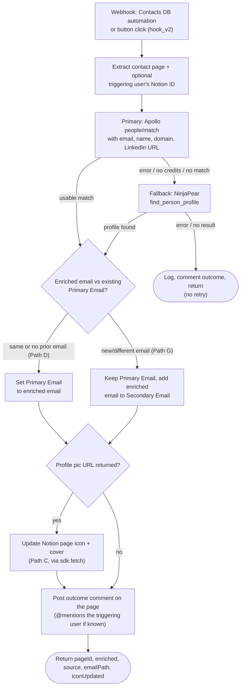

# Enrich Contact Records

Durable replacement for the "Enrich Contact Records" parent Zap and its
"[Sub-Zap] Update Contact Record" sub-Zap. The sub-Zap is collapsed into an
inline function (`updateContactRecord`) — no separate Durable needed.

## What it does

1. **Trigger** — Notion webhook on the Contacts DB (same `hook_v2` trigger as
   the original Zap).
2. **Enrich** — Two-source cascade with the contact's email, name, domain, and
   LinkedIn URL:
   - **Primary — Apollo.io** (`POST https://api.apollo.io/api/v1/people/match`):
     called through Apollo's native **API Request (Beta)** action
     (`_zap_raw_request`), which issues the raw HTTP request *with the
     integration's own auth headers attached*. (A plain `sdk.fetch` through the
     connection does **not** get those headers and Apollo returns 401.) Sent
     with `reveal_personal_emails: false` / `reveal_phone_number: false` to keep
     credit spend minimal, and `fail_on_errors: false` so a non-2xx response is
     returned (and falls back) rather than throwing.
   - **Fallback — NinjaPear** (`App243984CLIAPI.search.find_person_profile`):
     used only when Apollo errors (e.g. invalid key / no credits on the free
     tier), returns a non-2xx, or returns no usable match.

   Each source runs inside a step that **catches its own errors and returns a
   value instead of throwing**, so a failing source does not trigger the
   durable's step-retry loop — the workflow falls through to the fallback (or
   skips) cleanly on the first attempt. On error or no result from either
   source, it logs and returns (no retry; the original Zap retried after a
   1-minute delay).
3. **Update contact** — Inline function that replaces the sub-Zap:
   - **Same or no prior email** (Path D): sets Primary Email to the enriched
     email; leaves Secondary Email untouched.
   - **New/different email** (Path G): keeps the existing Primary Email, adds
     the enriched email to Secondary Email.
   - **Profile pic** (Path C): if the enrichment returned a profile pic URL,
     updates the Notion page icon and cover via `sdk.fetch`.
4. **Add outcome comment** — Posts a brief comment on the triggering Notion
   page stating the outcome of the run (including which source — Apollo or
   NinjaPear — did the enrichment). If the webhook was triggered by a button
   click and the payload included the user's Notion ID, the comment mentions
   that user for better visibility.
5. **Return** — `{ pageId, enriched, source, emailPath, iconUpdated }`.

## Workflow



## Connections

| Alias | App key | Connection |
|---|---|---|
| `notion_wf` | `NotionCLIAPI` | Notion (work.flowers \| Dennis) |
| `apollo` | `ApolloCLIAPI` | Apollo.io (primary enrichment, via API Request Beta) |
| `enrichment` | `App243984CLIAPI` | Person enrichment app (zapier-ninjapear, fallback) |

The Notion connection must have the **Insert comments** capability enabled so
the workflow can post outcome comments on the triggering page.

> **Why the API Request (Beta) action?** Apollo's `people/match` (Enrichment
> API) rejects a plain `sdk.fetch` made through the connection with a 401
> (`Invalid API key`) — the connection's auth headers aren't applied to
> arbitrary raw fetches. Apollo's native **API Request (Beta)** action
> (`_zap_raw_request`) makes the same request *with* the integration's auth
> attached, so `people/match` returns 200. This is why the primary path goes
> through `sdk.runAction(_zap_raw_request)` rather than `sdk.fetch`. Apollo's
> per-key rate limits (e.g. 600/day, 200/hr, 50/min) apply.

## Trigger configuration

```json
{
  "selected_api": "WebHookCLIAPI@1.1.1",
  "action": "hook_v2",
  "authentication_id": null,
  "params": {}
}
```

The Notion database automation on the Contacts DB sends a webhook to the
Zapier webhook URL when a contact is created or updated. The trigger payload
has the shape `{ data: { id, properties: { ... } } }`. When triggered by a
button click, the payload may also include the user's Notion ID under
`data.created_by.id`, `data.last_edited_by.id`, or `data.triggered_by.id`.

## Test

```bash
SOURCE_FILES="$(jq -n --rawfile workflow workflow.ts '{"workflow.ts": $workflow}')"

zapier-sdk --experimental run-durable "$SOURCE_FILES" \
  --dependencies '{"@zapier/zapier-sdk":"0.79.0","zod":"4.4.3"}' \
  --zapier-durable-version '0.6.1' \
  --connections '{"notion_wf":{"connectionId":"<notion-conn-id>"},"apollo":{"connectionId":"<apollo-conn-id>"},"enrichment":{"connectionId":"<enrichment-conn-id>"}}' \
  --input '{"data":{"id":"<contact-page-id>","properties":{"First Name":{"rich_text":[{"plain_text":"Test"}]},"Last Name":{"rich_text":[{"plain_text":"User"}]},"Primary Email":{"email":"test@example.com"}}}}' \
  --private
```

## Deploy

```bash
zapier-sdk --experimental create-workflow "enrich-contact-records" \
  --description "Enrich Notion contact records with person profile data" \
  --private --json

# Capture the workflow ID, then:
zapier-sdk --experimental publish-workflow-version <workflow-id> "$SOURCE_FILES" \
  --dependencies '{"@zapier/zapier-sdk":"0.79.0","zod":"4.4.3"}' \
  --zapier-durable-version '0.6.1' \
  --connections '{"notion_wf":{"connectionId":"<notion-conn-id>"},"apollo":{"connectionId":"<apollo-conn-id>"},"enrichment":{"connectionId":"<enrichment-conn-id>"}}' \
  --trigger '{"selected_api":"WebHookCLIAPI@1.1.1","action":"hook_v2","authentication_id":null,"params":{}}' \
  --enabled --json
```

## Architectural changes vs the original Zaps

- **Apollo primary, NinjaPear fallback** — the original Zap used NinjaPear as
  the sole enrichment source. This Durable tries Apollo.io's `people/match`
  endpoint first (via Apollo's API Request (Beta) action, `_zap_raw_request`)
  and only falls back to NinjaPear when Apollo fails. Each enrichment call
  catches its own errors and returns a value rather than throwing, so a failing
  source falls through on the first attempt instead of burning the durable's
  step-retry budget.
- **No sub-Zap** — the sub-Zap's four-path branching logic (Path D / G / C / E)
  collapses into a single inline function with if/else blocks.
- **No retry** — the original parent Zap retried enrichment after a 1-minute
  delay on error. This Durable logs and skips instead.
- **Page icon via `sdk.fetch`** — the original sub-Zap used a Notion action
  (`ae:523997`) for the icon/cover update. This Durable uses a direct
  `PATCH /v1/pages/{id}` call instead, which is more reliable and doesn't depend
  on a specific action key.
- **Enrichment via `sdk.runAction`** — uses the Zapier SDK action interface
  rather than raw API calls, following the repo's existing Durable patterns.
- **Outcome comment** — after every run, posts a brief comment on the
  triggering Notion page stating the outcome. If the webhook was triggered by a
  button click and the payload included the user's Notion ID, the comment
  mentions that user.

## References

- `exported-zap-2026-07-22T01_26_39.602Z.json` — original parent Zap (Enrich Contact Records).
- `exported-zap-2026-07-22T01_26_44.566Z.json` — original sub-Zap (Update Contact Record).
