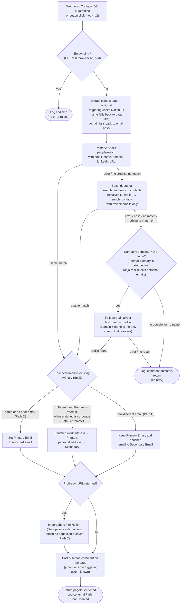

# Enrich Contact Records

Durable replacement for the "Enrich Contact Records" parent Zap and its
"[Sub-Zap] Update Contact Record" sub-Zap. The sub-Zap is collapsed into an
inline function (`updateContactRecord`) — no separate Durable needed.

## What it does

1. **Trigger** — Notion webhook on the Contacts DB (same `hook_v2` trigger as
   the original Zap). An **empty ping** (pasting the catch URL into a Notion
   automation and hitting "test", opening it in a browser, curling it) is
   skipped with a log line instead of throwing, per the repo-wide rule — a
   payload with content but no page id still throws, loudly. (Added
   2026-08-10.)
2. **Enrich** — Three-source cascade with the contact's email, name, domain,
   and LinkedIn URL: **Apollo → Lusha → NinjaPear**. Apollo leads because it
   also returns a profile photo (used for the page icon/cover) and a bio,
   which Lusha never provides. (Order flipped 2026-08-10; Lusha briefly led.) When the `First Name` /
   `Last Name` properties are empty, the name is parsed from the page **title**
   instead (auto-created contacts often carry the person's name only there); a
   title that is just an email address is not treated as a name. (Added
   2026-07-27, TKT-811.)

   **Domain** comes from the `Domain` rollup on the linked Company page, taking
   the **first entry that is a real corporate host** — the rollup often carries
   several URLs and consumer domains leak in from loosely-linked companies, and
   the previous `.join("")` concatenated them into strings like
   `https://hotmail.compangolin.net` that match nothing. When the rollup is
   empty or unusable, the domain falls back to the **Primary Email's own host**
   (skipped for freemail addresses, which name no employer). Contacts with a
   perfectly good corporate email but no linked Company page were previously
   unenrichable by the fallback for want of a domain. (Added 2026-07-28.)
   - **Primary — Apollo.io** (`POST https://api.apollo.io/api/v1/people/match`):
     called through Apollo's native **API Request (Beta)** action
     (`_zap_raw_request`), which issues the raw HTTP request *with the
     integration's own auth headers attached*. (A plain `sdk.fetch` through the
     connection does **not** get those headers and Apollo returns 401.) Sent
     with `reveal_personal_emails: false` / `reveal_phone_number: false` to keep
     credit spend minimal, and `fail_on_errors: false` so a non-2xx response is
     returned (and falls back) rather than throwing.
   - **Second — Lusha Connect** (`LushaCLIAPI`): a two-call flow, because
     `search_and_enrich_contacts` — despite its name — only resolves a Lusha
     contact id; its output carries **no email fields at all** (verified
     2026-08-10 against Megan Anderson, with the `reveal` param set and unset).
     The id then goes to `enrich_contacts` with `reveal: ["emails"]`, which
     returns the work email plus title, location, and LinkedIn URL, and never
     spends Lusha **phone** credits — this workflow doesn't consume phone data.
     Lusha returns no profile photo or bio, so a Lusha-enriched contact keeps
     its existing page icon and Bio. The call is skipped (with an explicit
     reason) when the contact has no email, no LinkedIn URL, and no
     name + company domain — nothing Lusha can match on.
   - **Final fallback — NinjaPear** (`App243984CLIAPI.search.find_person_profile`):
     used only when both Apollo and Lusha error (e.g. invalid key / no credits),
     return a non-2xx, or return no usable match.

     **NinjaPear rejects personal-email lookups** (data-privacy policy), and a
     personal address in `work_email` sinks the whole request even when another
     identifier could match on its own. So (added 2026-07-27, TKT-811): a
     **freemail** Primary is stripped from the NinjaPear inputs.
     `isFreemail` is list-based, so an unlisted consumer domain still goes
     through and fails like any other no-match. Apollo is unaffected — it
     indexes personal emails, so the primary path keeps sending them.

     **Only `employer_website` + a name actually resolves a profile** — see
     [Why the NinjaPear fallback misses](#why-the-ninjapear-fallback-misses).
     The call is skipped when the contact has no company domain or no name, and
     a skipped call surfaces in the outcome comment as
     `NinjaPear: skipped — no company domain…`, which is more actionable than a
     false "no profile found". The call sets `enrichment: detailed` (needed for
     `work_experience`, the source of company and role) and
     `use_cache: if-present` (see the same section for why).

   Each source runs inside a step that **catches its own errors and returns a
   value instead of throwing**, so a failing source does not trigger the
   durable's step-retry loop — the workflow falls through to the next source
   (or skips) cleanly on the first attempt. On error or no result from every
   source, it logs and returns (no retry; the original Zap retried after a
   1-minute delay).
3. **Update contact** — Inline function that replaces the sub-Zap:
   - **Same or no prior email** (Path D): sets Primary Email to the enriched
     email; leaves Secondary Email untouched.
   - **Work address over a consumer mailbox** (Path G-promote): when the existing
     Primary Email is on a **freemail** domain and the enriched address is not,
     the enriched (work) address takes Primary and the personal one moves to
     Secondary. See [Email paths](#email-paths).
   - **New/different email** (Path G): keeps the existing Primary Email, adds
     the enriched email to Secondary Email.
   - **Profile pic** (Path C): if the enrichment returned a profile pic URL,
     hands it to Notion as a `file_uploads` `external_url` import and attaches
     the resulting upload as both the page icon and cover. **The URL is never
     stored as the icon** — see [Profile photos are uploaded, not
     linked](#profile-photos-are-uploaded-not-linked). A photo that fails to
     import is reported in the outcome comment and never fails the run.
   - **Index the email in the email→contact Zapier Table**
     (`01JYEPSEARXB2Z6BJRCMFGXBC2`): whenever a new email lands on the contact
     (Path G secondary, or a first-ever primary via Path D), upsert-if-missing a
     row (`Email` → `Page ID`, `Type` Secondary/Primary, `Trigger Contact
     Creation: false`). The Luma guest workflows resolve contacts through this
     Table — an email on a contact but missing from the Table produces a
     **duplicate contact** when that person registers with it (bug observed
     2026-07-24 with a secondary email). Best-effort: a Table error logs and
     never fails the run.
4. **Add outcome comment** — Posts a brief comment on the triggering Notion
   page stating the outcome of the run:
   - which source did the enrichment (**Apollo**, **Lusha** or **NinjaPear**);
   - when a fallback source did the work, a short labelled note on **why each
     earlier source failed** (e.g. `(Apollo: HTTP 422 — You have insufficient
     credits!; Lusha: no result)`);
   - when nothing enriched, **one clause per source tried**, each labelled and
     trimmed on its own, with JSON/HTML error wrapping stripped — e.g.
     `Enrichment skipped — Apollo: HTTP 422 — You have insufficient credits! …;
     NinjaPear: no profile found.`

   Skip reasons were originally joined first and truncated after, so Apollo's
   verbose out-of-credits blob (a JSON body with an inline `<a>` tag) ate the
   whole 160-char budget and hid the `ninjapear returned no result` clause —
   making the fallback look like it never ran (TKT-811, fixed 2026-07-27; the
   run record's `reason` field always carried the full detail).

   If the webhook was triggered by a button click and the payload included the
   user's Notion ID, the comment mentions that user for better visibility.
5. **Return** — `{ pageId, enriched, source, emailPath, iconUpdated }`.

## Workflow


```mermaid
flowchart TD
    A["Webhook: Contacts DB automation<br/>or button click (hook_v2)"] --> P{"Empty ping?<br/>(URL test, browser hit, curl)"}
    P -- yes --> PS(["Log and skip<br/>(no error raised)"])
    P -- no --> B["Extract contact page + optional<br/>triggering user's Notion ID<br/>(name falls back to page title;<br/>domain falls back to email host)"]
    B --> AP["Primary: Apollo people/match<br/>with email, name, domain, LinkedIn URL"]
    AP -- "usable match" --> E
    AP -- "error / no credits / no match" --> LU["Second: Lusha search_and_enrich_contacts<br/>(resolves Lusha id) → enrich_contacts<br/>with reveal: emails only"]
    LU -- "usable match" --> E
    LU -- "error / no id / no match /<br/>nothing to match on" --> NPG{"Company domain AND a name?<br/>(freemail Primary is stripped —<br/>NinjaPear rejects personal emails)"}
    NPG -- "yes" --> NP["Fallback: NinjaPear<br/>find_person_profile<br/>(domain + name is the only<br/>combo that resolves)"]
    NPG -- "no domain, or no name" --> D
    NP -- "profile found" --> E{"Enriched email vs existing<br/>Primary Email?"}
    NP -- "error / no result" --> D(["Log, comment outcome, return<br/>(no retry)"])
    E -- "same or no prior email (Path D)" --> F["Set Primary Email<br/>to enriched email"]
    E -- "different, and Primary is freemail<br/>while enriched is corporate<br/>(Path G-promote)" --> GP["Enriched work address → Primary,<br/>personal address → Secondary"]
    E -- "new/different email (Path G)" --> G["Keep Primary Email, add enriched<br/>email to Secondary Email"]
    F --> H{"Profile pic URL returned?"}
    GP --> H
    G --> H
    H -- yes --> I["Import photo into Notion<br/>(file_uploads external_url)<br/>attach as page icon + cover<br/>(Path C)"] --> J
    H -- no --> J["Post outcome comment on the page<br/>(@mentions the triggering user if known)"]
    J --> K(["Return pageId, enriched, source, emailPath, iconUpdated"])
```

## Profile photos are uploaded, not linked

Until 2026-08-12 Path C set the icon and cover to
`{type: "external", external: {url: <the enrichment's photo URL>}}`. Both Apollo
(`person.photo_url`) and NinjaPear (`profile_pic_url`) hand back LinkedIn's CDN
link verbatim, and those are **signed and time-limited**:

```
https://media.licdn.com/dms/image/v2/…/0/1669569071244?e=1779321600&v=beta&t=xqUO1s9…
                                                        ^^^^^^^^^^ unix expiry
```

Notion re-fetches an `external` icon on every view and stores the dead link
forever, so a few weeks after enrichment the page keeps an icon and cover that
**render as empty white space**. Nothing errors, nothing alerts, and the record
looks subtly broken. An audit on 2026-08-12
(`scripts/audit-contact-icon-urls.mjs`) found **210 of 962 contacts** already in
that state, with expiries stretching back to 2026-04-23.

The fix hands the URL to Notion instead, and lets Notion do the fetching:

```
POST /v1/file_uploads  { mode: "external_url", external_url, filename }
GET  /v1/file_uploads/<id>            → poll until status "uploaded"
PATCH /v1/pages/<id>  { icon: {type:"file_upload", …}, cover: {…} }
```

Notion stores the bytes on its own `prod-files-secure` S3 and re-signs the URL
on every read, so the result comes back as `{type: "file"}` and never expires.

Things worth knowing before editing this:

- **`filename` is required** in `external_url` mode — omitting it is a
  `400 validation_error`. LinkedIn URLs carry no extension in the path, so it
  falls back to `.jpg`. The stored file's real content type comes from the
  response Notion fetches, not from that name.
- **One upload backs both the icon and the cover.** Passing the same
  `file_upload` id twice in a single PATCH works; the docs don't say either way.
- **This is the opposite choice to
  [`esignatures-status-to-notion`](../esignatures-status-to-notion/)**, which
  downloads the bytes and pushes a `single_part` upload. Both are right:
  `external_url` makes Notion probe with `HEAD` first, and the S3 links
  eSignatures receives are presigned for `GET` alone, so they 403 that probe.
  LinkedIn answers HEAD normally.
- **The durable cannot casually download the photo itself.** A bare `fetch`
  fails for *every* host (probed 2026-08-12: example.com, pbs.twimg.com,
  media.licdn.com, api.notion.com), and `sdk.fetch` *with* a connection is
  domain-filtered to that connection's app — `Domain media.licdn.com did not
  match expected domain filter api.notion.com`. The escape hatch, if
  `external_url` ever stops working, is `sdk.fetch` with **no connection**.
- **A failed import never fails the run.** It is caught inside the step (so it
  doesn't spin the retry loop) and surfaced in the outcome comment as
  `Profile photo not stored: …`. A Notion PATCH failure is left to throw, since
  that one is worth retrying.

### Contacts already affected

The 210 broken contacts **cannot be repaired by rewriting the URL** — the links
are dead and the bytes are gone. They need re-enrichment to fetch a fresh photo,
which is blocked while Apollo is out of lead credits (see below). Re-running
`scripts/audit-contact-icon-urls.mjs` reports the current count.

A further 40 contacts hold a LinkedIn URL whose expiry is `2147483647` (the
int32 maximum, i.e. "never"). Those still render and are not urgent, though they
are still `external` links and would be made permanent by a re-enrichment.

> **Apollo is out of lead credits** as of 2026-08-12: `people/match` returns
> `422 — You have insufficient credits!`. The cascade falls through to Lusha
> (which returns no photo at all) and NinjaPear (which does return
> `profile_pic_url`), so photos still arrive, just only via NinjaPear.

## Why the NinjaPear fallback misses

Investigated 2026-07-28, after "no profile found" became the near-universal
outcome. Two separate causes.

**1. Apollo ran out of credits on 2026-07-26 at ~13:40.** The 7 runs immediately
before that timestamp all enriched via Apollo; every run after it returns
`apollo http 422: "You have insufficient credits!"` and falls through. Apollo is
the source doing the real work — **top it up first**; everything below is about
making the fallback less bad, not about replacing it.

**2. `linkedin_profile_url` and `work_email` do not resolve on their own.** The
action's field docs claim a work email is sufficient and offer the LinkedIn URL
as a standalone lookup key. Neither holds. Measured against two profiles
NinjaPear demonstrably holds:

| Inputs | Megan Anderson | Sachin Kolekar |
|---|---|---|
| `work_email` + name + `employer_website` + LinkedIn | **match** | **match** |
| name + `employer_website` | **match** | **match** |
| `work_email` alone | empty | — |
| `linkedin_profile_url` alone | empty | empty |
| name + `linkedin_profile_url` | empty | — |

Megan's own NinjaPear record carries `linkedin_profile_url:
https://www.linkedin.com/in/megananderson` — the exact URL queried with, tried
both with and without the trailing slash. It still returns nothing.

So **`employer_website` + a name is the only combination that works**, which is
why the domain fallback above matters so much: a contact with no linked Company
page had no domain, and therefore no way to match at all. The LinkedIn URL and
work email are still sent — they cost nothing, may sharpen a match, and may
start resolving if NinjaPear fixes it — but neither gates the call any more.

**Timeouts — partly unfixable.** The action runs in a 30s Lambda, while
NinjaPear's default `use_cache: if-recent` triggers a **live** re-scrape whenever
the cached profile is over 29 days old, and a live enrichment takes 30–60s. That
timed out a run on 2026-07-27 (`Task timed out after 30.00 seconds`). The call
now passes `use_cache: if-present`, which serves any cached profile immediately
and only goes live for a profile never seen before.

That removes the stale-cache re-scrape as a cause, but **not** the uncached case:
re-running the timed-out contact with `if-present` timed out again, and
`if-present-only` returned empty, proving the profile simply isn't cached.
**A contact NinjaPear has never seen cannot be enriched within the 30s budget**
— there is no input tuning that fixes it. It is recorded as a reason, not a
crash, and does not retry.

### Verified cases (2026-07-28, post-change)

Run via `run-action` against the real action, not the durable, so nothing writes
to Notion. Each is a contact whose last real run returned nothing.

| Contact | `employer_website` sent | Result | Read as |
|---|---|---|---|
| Megan Anderson | `securecodewarrior.com` | **match** (International Tax Manager @ Secure Code Warrior) | regression check — the working path still works with the new params |
| Alex Mg | `kinnai.com` (**newly** derived from email; was empty) | timeout at 30s; `if-present-only` → empty | not in NinjaPear's cache; unfixable within the Lambda budget |
| Kerrie Zeng | `securecodewarrior.com` (unchanged) | empty | genuine gap in NinjaPear's index |
| Amy Yang | `securecodewarrior.com` (unchanged) | empty | genuine gap in NinjaPear's index |

**None of the previously-failing contacts now resolve.** The changes fix *routing*
— a usable domain is derived where one exists, and calls that could never match
are skipped with an honest reason instead of burning a credit — but they do not
conjure coverage NinjaPear doesn't have. Restoring Apollo credits is the only
change that meaningfully raises the enrichment rate.

## Email paths

Which slot an enriched address lands in depends on what the contact already has:

| Existing `Primary Email` | Enriched address | Result | Path |
|---|---|---|---|
| empty, or the same address (**compared case-insensitively**) | corporate or consumer | enriched → Primary | D |
| **freemail** (`gmail.com`, `hotmail.co.uk`, `outlook.*`, `yahoo.*`, `icloud.com`, …) | **corporate** | **enriched → Primary, personal → Secondary** | **G-promote** |
| already corporate | corporate | Primary untouched, enriched → Secondary | G |
| freemail | also freemail | Primary untouched, enriched → Secondary | G |

**Why G-promote exists (added 2026-07-26).** Path G originally covered every
"different email" case, so a contact who signed up with a personal address kept
that address in `Primary Email` while the real work address was buried in
`Secondary Email` — inverted on ~26 contacts, and the opposite of the rule the
[Luma guest workflows](../luma-guest-registered-to-event-attendance#work-email--primary-email)
apply to a `Work Email` registration answer.

**Why it's narrow.** An enriched address is a *guess*, so it must never overwrite
a `Primary Email` someone chose deliberately. A consumer mailbox in Primary is a
signup artefact, which is the one case where the guess is reliably better. A
Primary already on a corporate domain is treated as curated and left alone — that
was Path G's original point and it still holds.

**Addresses compare case-insensitively (added 2026-07-27).** Enrichment sources
return whatever case the upstream record holds, so `Zoe@automatico.com` and
`zoe@automatico.com` arrived as different strings and the "same address" test —
a plain `===` — missed. The address was treated as newly discovered and Path G
filed the contact's own Primary under Secondary. Nine contacts ended up listing
their Primary twice before this was caught; they were cleaned up the same day.

Both write paths now run their Secondary list through `dedupeAddresses` and drop
anything matching the Primary, so an address can appear at most once and never in
both slots. The Path G filter also strips a redundant Primary an earlier run left
behind, which means an affected contact heals itself the next time it's enriched.

Freemail detection is a domain list (`FREEMAIL_EXACT` plus `FREEMAIL_PREFIXES`
for families with many country TLDs). Word boundaries matter: `notgmail.com`,
`gmailservices.com` and `myhotmailagency.com` are correctly **not** freemail. To
cover a domain the list misses, add it to `FREEMAIL_EXACT` — no logic change.

The address G-promote **demotes** needs no new Table row: it was this contact's
Primary, so it already resolves here. Its row keeps `Type: "Primary"` and goes
stale, which is harmless — lookups match on `Email` only.

## Connections

| Alias | App key | Connection | Connection id |
|---|---|---|---|
| `notion_wf` | `NotionCLIAPI` | `work.flowers \| Dennis` | `02b73654-15c8-85c3-b16a-07304d2beb17` |
| `apollo` | `ApolloCLIAPI` | Apollo.io (primary enrichment, via API Request Beta) | `02be390b-7f16-8214-9337-c9a9b04cf4f7` |
| `lusha` | `LushaCLIAPI` | Lusha Connect (second source) | `02532e03-2b39-869c-8fe4-15257e2b099c` |
| `enrichment` | `App243984CLIAPI` | Person enrichment app (zapier-ninjapear, final fallback) | `025703ba-3a5f-8132-9138-e87fb3599abc` |

> ⚠️ **Notion connection:** `notion_wf` **must** be the `work.flowers | Dennis`
> connection (`02b73654-…`) — it's the one with the Contacts DB shared. Do **not**
> bind the `Knoxx | Dennis #2` connection (`02b95b31-…`); that's the Knoxx Foods
> *client* workspace and the write-back fails with `Could not find data_source …
> shared with your integration "Zapier"`. See the root `CLAUDE.md` for the
> repo-wide rule.

The Notion connection must have the **Insert comments** capability enabled so
the workflow can post outcome comments on the triggering page.

> **Why the API Request (Beta) action?** Apollo's `people/match` (Enrichment
> API) rejects a plain `sdk.fetch` made through the connection with a 401
> (`Invalid API key`) — the connection's auth headers aren't applied to
> arbitrary raw fetches. Apollo's native **API Request (Beta)** action
> (`_zap_raw_request`) makes the same request *with* the integration's auth
> attached, so `people/match` returns 200. This is why the primary path goes
> through `sdk.runAction(_zap_raw_request)` rather than `sdk.fetch`. Apollo's
> per-key rate limits (e.g. 600/day, 200/hr, 50/min) apply.

## Trigger configuration

```json
{
  "selected_api": "WebHookCLIAPI@1.1.1",
  "action": "hook_v2",
  "authentication_id": null,
  "params": {}
}
```

The Notion database automation on the Contacts DB sends a webhook to the
Zapier webhook URL when a contact is created or updated. The trigger payload
has the shape `{ data: { id, properties: { ... } } }`. When triggered by a
button click, the payload may also include the user's Notion ID under
`data.created_by.id`, `data.last_edited_by.id`, or `data.triggered_by.id`.

## Test

```bash
SOURCE_FILES="$(jq -n --rawfile workflow workflow.ts '{"workflow.ts": $workflow}')"

zapier-sdk --experimental run-durable "$SOURCE_FILES" \
  --dependencies '{"@zapier/zapier-sdk":"0.79.0","zod":"4.4.3"}' \
  --zapier-durable-version '0.6.1' \
  --connections '{"notion_wf":{"connectionId":"<notion-conn-id>"},"lusha":{"connectionId":"<lusha-conn-id>"},"apollo":{"connectionId":"<apollo-conn-id>"},"enrichment":{"connectionId":"<enrichment-conn-id>"}}' \
  --input '{"data":{"id":"<contact-page-id>","properties":{"First Name":{"rich_text":[{"plain_text":"Test"}]},"Last Name":{"rich_text":[{"plain_text":"User"}]},"Primary Email":{"email":"test@example.com"}}}}' \
  --private
```

## Deploy

```bash
zapier-sdk --experimental create-workflow "enrich-contact-records" \
  --description "Enrich Notion contact records with person profile data" \
  --private --json

# Capture the workflow ID, then:
zapier-sdk --experimental publish-workflow-version <workflow-id> "$SOURCE_FILES" \
  --dependencies '{"@zapier/zapier-sdk":"0.79.0","zod":"4.4.3"}' \
  --zapier-durable-version '0.6.1' \
  --connections '{"notion_wf":{"connectionId":"<notion-conn-id>"},"lusha":{"connectionId":"<lusha-conn-id>"},"apollo":{"connectionId":"<apollo-conn-id>"},"enrichment":{"connectionId":"<enrichment-conn-id>"}}' \
  --trigger '{"selected_api":"WebHookCLIAPI@1.1.1","action":"hook_v2","authentication_id":null,"params":{}}' \
  --enabled --json
```

## Architectural changes vs the original Zaps

- **Apollo primary, Lusha second, NinjaPear last** — the original Zap used
  NinjaPear as the sole enrichment source. This Durable tries Apollo.io's
  `people/match` endpoint first (via Apollo's API Request (Beta) action,
  `_zap_raw_request`), then Lusha's search + enrich pair (added 2026-08-10;
  it briefly led before the order was flipped the same day — Apollo also
  returns a profile photo and bio, which Lusha never does), and only falls
  back to NinjaPear when both fail. Each enrichment call catches its own
  errors and returns a value rather than throwing, so a failing source falls
  through on the first attempt instead of burning the durable's step-retry
  budget.
- **No sub-Zap** — the sub-Zap's four-path branching logic (Path D / G / C / E)
  collapses into a single inline function with if/else blocks.
- **No retry** — the original parent Zap retried enrichment after a 1-minute
  delay on error. This Durable logs and skips instead.
- **Page icon via `sdk.fetch`** — the original sub-Zap used a Notion action
  (`ae:523997`) for the icon/cover update. This Durable uses a direct
  `PATCH /v1/pages/{id}` call instead, which is more reliable and doesn't depend
  on a specific action key.
- **Enrichment via `sdk.runAction`** — uses the Zapier SDK action interface
  rather than raw API calls, following the repo's existing Durable patterns.
- **Outcome comment** — after every run, posts a brief comment on the
  triggering Notion page stating the outcome. If the webhook was triggered by a
  button click and the payload included the user's Notion ID, the comment
  mentions that user.

## References

- `exported-zap-2026-07-22T01_26_39.602Z.json` — original parent Zap (Enrich Contact Records).
- `exported-zap-2026-07-22T01_26_44.566Z.json` — original sub-Zap (Update Contact Record).
