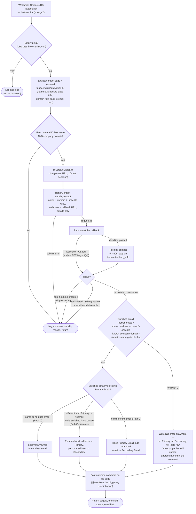

# Enrich Contact Records

Durable replacement for the "Enrich Contact Records" parent Zap and its
"[Sub-Zap] Update Contact Record" sub-Zap. The sub-Zap is collapsed into an
inline function (`updateContactRecord`) — no separate Durable needed.

**Enrichment source: BetterContact** (since 2026-09-18). It replaced the
Apollo → Lusha → NinjaPear cascade wholesale; see
[What changed with BetterContact](#what-changed-with-bettercontact) for what was
gained and what was given up.

## What it does

1. **Trigger** — Notion webhook on the Contacts DB (same `hook_v2` trigger as
   the original Zap). An **empty ping** (pasting the catch URL into a Notion
   automation and hitting "test", opening it in a browser, curling it) is
   skipped with a log line instead of throwing, per the repo-wide rule — a
   payload with content but no page id still throws, loudly. (Added
   2026-08-10.)
2. **Extract the contact** — first name, last name, LinkedIn URL, Primary and
   Secondary emails, and the company domain. When the `First Name` / `Last
   Name` properties are empty, the name is parsed from the page **title**
   instead (auto-created contacts often carry the person's name only there); a
   title that is just an email address is not treated as a name. (Added
   2026-07-27, TKT-811.)

   **Domain** comes from the `Domain` rollup on the linked Company page, taking
   the **first entry that is a real corporate host** — the rollup often carries
   several URLs and consumer domains leak in from loosely-linked companies.
   When the rollup is empty or unusable, the domain falls back to the **Primary
   Email's own host** (skipped for freemail addresses, which name no
   employer). (Added 2026-07-28.) The domain is load-bearing: BetterContact
   matches on **first + last name + company domain**, so a contact without
   all three is skipped with an explicit reason rather than sent.
3. **Enrich via BetterContact** — an **async job**, handled as
   submit → park → resume:
   - `ctx.createCallback` mints a single-use URL and the run passes it as the
     job's `webhook`; BetterContact POSTs the finished result there and the run
     resumes with the payload. No polling on the happy path. See
     [How the async job is handled](#how-the-async-job-is-handled).
   - `enrich_contact` (write) is submitted with `first_name`, `last_name`,
     `company_domain`, `linkedin_url` (sharpens the match), `uuid` = the Notion
     page id (echoed back in `custom_fields`), `enrich_email_address: "True"`
     and `enrich_phone_number: "False"` — emails only; this workflow does not
     consume phone data.
   - If the webhook has not arrived after **10 minutes**, the run polls
     `get_contact` (search) by request id, **5 times a minute apart**, stopping
     on `terminated` or `on_hold`.
   - Only `status: "terminated"` carries a result. `on_hold` means the
     BetterContact account is out of credits — the job resumes by itself once
     topped up, and the outcome comment says so.
   - The email is taken only when BetterContact verified it
     (`contact_email_address_status` of `deliverable` or `catch_all_safe`). A
     plain `catch_all` or `undeliverable` address is named in the outcome
     comment and written nowhere.
   - Every BetterContact call catches its own errors and returns a value, so a
     vendor failure becomes a reason in the comment rather than spinning the
     durable's step-retry loop.
4. **Update contact** — Inline function that replaces the sub-Zap:
   - **Corroborate the enriched address first** (Path U): an enriched email that
     cannot be tied to this contact is **not written anywhere** — not Primary,
     not Secondary, not the Table — and is named in the outcome comment instead.
     The other properties still update. See [Identity
     corroboration](#identity-corroboration). (Added 2026-08-12.)
   - **Same or no prior email** (Path D): sets Primary Email to the enriched
     email; leaves Secondary Email untouched.
   - **Work address over a consumer mailbox** (Path G-promote): when the existing
     Primary Email is on a **freemail** domain and the enriched address is not,
     the enriched (work) address takes Primary and the personal one moves to
     Secondary. See [Email paths](#email-paths).
   - **New/different email** (Path G): keeps the existing Primary Email, adds
     the enriched email to Secondary Email.
   - **No photo path.** The original sub-Zap's Path C (page icon + cover from a
     profile photo) was removed 2026-09-18: BetterContact's `contact_avatar` is a
     legacy always-null key, and no other acceptable source returns photos. See
     [What changed with BetterContact](#what-changed-with-bettercontact).
   - **Index the email in the email→contact Zapier Table**
     (`01JYEPSEARXB2Z6BJRCMFGXBC2`): whenever a new email lands on the contact
     (Path G secondary, or a first-ever primary via Path D), upsert-if-missing a
     row (`Email` → `Page ID`, `Type` Secondary/Primary, `Trigger Contact
     Creation: false`). The Luma guest workflows resolve contacts through this
     Table — an email on a contact but missing from the Table produces a
     **duplicate contact** when that person registers with it (bug observed
     2026-07-24). Best-effort: a Table error logs and never fails the run.
     **Path U never reaches this step.**
   - Properties BetterContact does not return (Bio, and usually Job Title and
     City) are written as `""`, which the Notion action treats as **no change**
     — a contact keeps whatever it already has.
5. **Add outcome comment** — Posts a brief comment on the triggering Notion
   page stating the outcome. A transient Notion failure (429, 409, 5xx) is
   retried by the step; a definite rejection is reported in the run output as
   `commentPosted: false` — see [The outcome comment retries transient
   failures](#the-outcome-comment-retries-transient-failures). The comment
   names the source (**BetterContact**), what changed, and on a skip **why** —
   e.g. `Enrichment skipped — BetterContact: skipped — no company domain (a
   personal email names no employer).`, `… BetterContact: on hold — the account
   is out of credits …`, or `… BetterContact: found x@y.com but its status is
   catch_all; not written.` A Path U run names the uncorroborated address:
   `Email grace@leaps.sg NOT written — … Add it by hand if it is really theirs.`

   If the webhook was triggered by a button click and the payload included the
   user's Notion ID, the comment mentions that user.
6. **Return** — `{ pageId, enriched, source, emailPath }`, plus
   `unverifiedEmail` and `identity` on a Path U run, and `reasons` on a skip.

## Workflow


```mermaid
flowchart TD
    A["Webhook: Contacts DB automation<br/>or button click (hook_v2)"] --> P{"Empty ping?<br/>(URL test, browser hit, curl)"}
    P -- yes --> PS(["Log and skip<br/>(no error raised)"])
    P -- no --> B["Extract contact page + optional<br/>triggering user's Notion ID<br/>(name falls back to page title;<br/>domain falls back to email host)"]
    B --> V{"First name AND last name<br/>AND company domain?"}
    V -- no --> D(["Log, comment the skip reason, return"])
    V -- yes --> CB["ctx.createCallback<br/>(single-use URL, 10-min deadline)"]
    CB --> SUB["BetterContact enrich_contact<br/>name + domain + LinkedIn URL,<br/>webhook = callback URL,<br/>emails only"]
    SUB -- "submit error" --> D
    SUB -- "request id" --> W["Park: await the callback"]
    W -- "webhook POSTed<br/>(body = GET /async/{id})" --> ST
    W -- "deadline passed" --> PL["Poll get_contact<br/>5 × 60s, stop on<br/>terminated / on_hold"]
    PL --> ST{"status?"}
    ST -- "on_hold (no credits) /<br/>still processing / error" --> D
    ST -- "terminated, nothing usable<br/>or email not deliverable" --> D
    ST -- "terminated, usable row" --> E{"Enriched email corroborated?<br/>shared address · contact's LinkedIn ·<br/>known company domain ·<br/>domain+name-gated lookup"}
    E -- "no (Path U)" --> U["Write NO email anywhere —<br/>no Primary, no Secondary, no Table row.<br/>Other properties still update;<br/>address named in the comment"]
    E -- "yes" --> EP{"Enriched email vs existing<br/>Primary Email?"}
    EP -- "same or no prior email (Path D)" --> F["Set Primary Email<br/>to enriched email"]
    EP -- "different, and Primary is freemail<br/>while enriched is corporate<br/>(Path G-promote)" --> GP["Enriched work address → Primary,<br/>personal address → Secondary"]
    EP -- "new/different email (Path G)" --> G["Keep Primary Email, add enriched<br/>email to Secondary Email"]
    F --> J
    GP --> J
    G --> J
    U --> J
    J["Post outcome comment on the page<br/>(@mentions the triggering user if known)"]
    J --> K(["Return pageId, enriched, source, emailPath"])
```

## How the async job is handled

BetterContact's enrichment is a job, not a lookup: `POST /async` answers `201`
with a request id and `"Processing..."`, the waterfall runs on their side, and
the result is available only once `GET /async/{request_id}` reports
`status: "terminated"` (`not_started` and `processing` are still running;
`on_hold` is paused for credits). Their docs are explicit that a `2xx` does not
mean the result is ready. Two ways to learn it is done: poll, or give the job a
`webhook` URL that BetterContact POSTs the same body to, once, on `terminated`
(retried up to 5 times on a non-2xx; **no signature, no auth** — the URL's
secrecy is the whole security model).

This durable uses the webhook, with polling as the fallback:

```ts
const [resultPromise, callbackUrl] = await ctx.createCallback({
  name: "bettercontact-result",
  timeoutSeconds: 600,
});
const submit = await ctx.step("bettercontact-submit", async () =>
  sdk.runAction({ /* enrich_contact */ inputs: { …, webhook: callbackUrl } }));
const delivered = await resultPromise;          // run parks here
if (delivered.status === "delivered") …           // body = GET /async/{id}
else outcome = await pollBetterContactResult(…);  // 5 × 60s get_contact
```

What `ctx.createCallback` does, since this is the first Zap in the repo to use
it (spiked 2026-09-18, `@zapier/zapier-durable` 0.6.1):

- It journals a `callback` operation with a single-use token and returns the
  URL `https://code-substrate-runner.zapier.com/api/v0/callbacks/<token>`. Note
  the host: the SDK's *default* base URL (`sdkapi.zapier.com/…`) is **not**
  where the hosted runtime's callbacks live — a POST there answers
  `{"error":"not_found"}`. Always use the URL the durable itself returns; never
  reconstruct it.
- Awaiting the promise parks the run (`status: waiting`) at no cost. An
  external POST with a JSON body completes the operation and wakes the run,
  which replays to the `await` and continues with the body as the value.
- With `timeoutSeconds`, the value is `{ status: "delivered", value, at }` or
  `{ status: "expired", at }`. The server decides once; a late POST after expiry
  cannot flip it, so the polling fallback can never double-handle a result.
- A callback that is **created but never awaited does not park the run** —
  dormancy engages only on an awaited wait — which is why the URL can be
  minted before the submit step and the await skipped when the submit fails.
- Do not `Promise.race` it against a wait or a step; express the deadline with
  `timeoutSeconds` and branch on `status`.

Measured on the spike run: submit → webhook delivered → run resumed in ~90s,
1 credit consumed (BetterContact bills per deliverable address, not per call).

**Why not poll only.** Each `get_contact` poll is a billed action and would run
in a helper with loop-indexed step ids; the webhook costs nothing while parked
and returns as soon as the job does. Polling stays as insurance against a lost
delivery and as the only way to *see* `on_hold`.

**Why not a second Zap on a catch URL.** It would split `updateContactRecord`
across two workflows for no gain; the callback keeps the whole run in one
place and one run history.

## What changed with BetterContact

Replaced 2026-09-18. The previous cascade was Apollo `people/match` →
Lusha `search_and_enrich_contacts` + `enrich_contacts` → NinjaPear
`find_person_profile`, each with its own quirks (Apollo out of credits since
2026-08-12; Lusha rejecting a name without a company; NinjaPear resolving only
on domain + name and timing out on uncached profiles). Its history is in this
directory's git log.

Gained:

- **One source, one credit model.** Charged only for a verified, deliverable
  address; no charge for a miss.
- **Verification status on every address** (`deliverable`, `catch_all_safe`,
  `catch_all`, `undeliverable`), which the old sources never gave. Only the
  first two are written.
- **A gated lookup by construction.** The request requires the contact's own
  name + company domain, so corroboration has a backstop even when nothing in
  the result echoes the CRM.

Given up — deliberately, since the brief was to replace the cascade:

- **No profile photo or bio.** Those came from Apollo (photo, bio) and
  NinjaPear (photo), and neither returned photos reliably; the only source that
  ever did was HarvestAPI, by scraping LinkedIn, which is not coming back.
  BetterContact's `contact_avatar` is a documented legacy key that is always
  `null`, and its `enrich_profile` endpoint (not exposed by the Zapier app) has
  no image field either. **Path C was therefore removed outright on
  2026-09-18** — the `file_uploads` import, the placeholder-silhouette filter,
  the icon/cover PATCH and the `iconUpdated`/`iconError` outputs — rather than
  left as a code path nothing can exercise. The working implementation is in
  this directory's git history (versions up to `01a0b2d9`) should a photo source
  ever appear; the design notes that mattered are summarised below. Contacts
  with a broken or missing icon are not repaired by enrichment; the 210 expired
  `external` icons found by `scripts/audit-contact-icon-urls.mjs` on 2026-08-12
  stay as they are unless fixed by hand.
- **Narrower coverage.** BetterContact needs `first_name` + `last_name` and a
  company (domain); it takes no email as input and does not resolve a LinkedIn
  URL alone. Contacts known only by an email, or only by a LinkedIn URL, are
  skipped with a reason where Apollo/Lusha could sometimes match them. Job
  title, city and country arrive only when a provider happened to return them.

## Photo path: what was learned before it was removed

Kept for whoever wires a photo source in again. All of it was live in this Zap
from 2026-08-12 to 2026-09-18.

- **Upload, never link.** Enrichment photo URLs were signed, time-limited
  LinkedIn CDN links (`…?e=<unix-expiry>&t=<sig>`). Setting them as an
  `{type:"external"}` icon left the page with an icon and cover that rendered
  as blank white space once the link expired — 210 of 962 contacts by the
  2026-08-12 audit. The fix was `POST /v1/file_uploads {mode:"external_url"}`
  → poll until `uploaded` → `PATCH /v1/pages/{id}` with `file_upload` for both
  icon and cover (one upload backs both). `filename` is required in that mode.
- **The durable cannot download the bytes itself.** A bare `fetch` fails for
  every host and `sdk.fetch` with a connection is domain-filtered to that app;
  `sdk.fetch` with **no connection** is the escape hatch. `external_url` makes
  Notion probe with `HEAD` first, which LinkedIn answers and presigned-for-GET
  S3 links (eSignatures) do not — hence the opposite choice in
  [`esignatures-status-to-notion`](../esignatures-status-to-notion/).
- **Filter LinkedIn's placeholder silhouette.** A profile with no photo came
  back as `https://static.licdn.com/aero-v1/sc/h/9c8pery4andzj6ohjkjp54ma2`, a
  489-byte SVG, not `null`; 7 of 43 runs put a picture of nobody on the page.
  Guard by host (`static.licdn.com`) at extraction, and by content after import
  (reject SVG or anything under 1 KB via the upload's `content_type` /
  `content_length`).
- **Never fail the run over a photo.** Catch the import inside the step and
  report it in the outcome comment; leave only the Notion PATCH to throw.

## The outcome comment retries transient failures

The comment is the **last Notion call of every run**. When the Contacts
automation enriches new pages in a batch, several runs fire within a second
and the comment is the call most exposed to `429 rate_limited`, `409
conflict_error` and the odd 5xx. Until 2026-09-03 any failure was logged and
swallowed — two bursts on 2026-09-02 lost 3 of 4 and 3 of 5 comments with green
runs. Now a **transient** status (408, 409, 429, 5xx) or network error
**throws**, so the durable's step retry (5 attempts, ~155 s of backoff) posts it
again; the record updates are memoised steps, so only the comment re-posts. A
**definite** rejection (400, 403 missing *Insert comments*, 404) returns
`posted: false` and the run output carries `commentPosted: false` with
`commentError`.

## Identity corroboration

**Added 2026-08-12.** An enriched email is the one field this workflow writes that
carries **identity**. It lands in `Primary Email` or `Secondary Email`, and from
there into `CONTACT_EMAIL_TABLE` — which is how the
[Luma guest workflows](../luma-guest-registered-to-event-attendance/) decide *who
a registration belongs to*. An address written here **defines** the contact for
every other Zap.

### What went wrong

Two different Grace Tangs ended up as one contact (diagnosed 2026-08-12). The
then-primary source, Apollo `people/match`, is **fuzzy** and matched a
subcontractor with a personal Gmail Primary, no Company relation and no LinkedIn
URL to *a different Grace Tang* at an unrelated company. Path G-promote did
exactly what it was written to do; the stranger's address became the contact's
Primary and was indexed into the Table, and from then on her Luma
registrations, a company page, 25 email threads and a signed agreement all
attached to the wrong contact. **Nothing errored at any point.**

### The bar

Before an enriched address is written, the match must be corroborated against
something the CRM already knows. Any one of these clears it:

| Signal | Evidence |
|---|---|
| **Shared address** | the returned record carries an address already on the contact (Primary or any Secondary), compared case-insensitively |
| **LinkedIn** | the returned profile URL and the contact's reduce to the same `/in/<slug>` |
| **Company domain** | the enriched address's host, or the record's `company_domain`, equals the `Domain` the CRM already holds |
| **Gated lookup** | the request itself was gated on the contact's own name + company domain, so any record returned is a person at the employer already recorded — BetterContact's case, and the backstop when nothing above echoes |

BetterContact's result echoes `company_domain`, so in practice the **company
domain** rule fires first and the gated-lookup rule is the backstop. The
per-source shape is kept in code so a future *fuzzy* source (Apollo was one)
cannot inherit the gated-lookup exemption by accident.

An uncorroborated address goes nowhere — not Primary, not Secondary, not the
Table (**Path U**) — and is named in the outcome comment for a person to judge.
Every other property is still written: those carry no identity downstream.

### Side effect on `emailPath`

`noPriorEmail` requires an enriched address to exist. A run where the contact
has no Primary **and** the source returned no email reports
`emailPath: "no-new-email"` rather than `"same-or-no-prior"`.

## Email paths

Which slot an enriched address lands in depends on what the contact already has —
**after** it clears BetterContact's verification and
[identity corroboration](#identity-corroboration):

| Existing `Primary Email` | Enriched address | Result | Path |
|---|---|---|---|
| — | `catch_all` / `undeliverable` | **nothing written; comment names the address and status** | — |
| — | **uncorroborated** | **nothing written; comment names the address** | **U** |
| empty, or the same address (**compared case-insensitively**) | corporate or consumer | enriched → Primary | D |
| **freemail** (`gmail.com`, `hotmail.co.uk`, `outlook.*`, `yahoo.*`, `icloud.com`, …) | **corporate** | **enriched → Primary, personal → Secondary** | **G-promote** |
| already corporate | corporate | Primary untouched, enriched → Secondary | G |
| freemail | also freemail | Primary untouched, enriched → Secondary | G |

**Why G-promote exists (added 2026-07-26).** Path G originally covered every
"different email" case, so a contact who signed up with a personal address kept
it in `Primary Email` while the real work address was buried in `Secondary
Email` — inverted on ~26 contacts, and the opposite of the rule the
[Luma guest workflows](../luma-guest-registered-to-event-attendance#work-email--primary-email)
apply to a `Work Email` registration answer.

**Why it's narrow.** An enriched address is a *guess*, so it must never overwrite
a `Primary Email` someone chose deliberately. A consumer mailbox in Primary is a
signup artefact, which is the one case where the guess is reliably better.

**Addresses compare case-insensitively (added 2026-07-27).** Both write paths run
their Secondary list through `dedupeAddresses` and drop anything matching the
Primary, so an address appears at most once and never in both slots; the Path G
filter also strips a redundant Primary an earlier run left behind.

Freemail detection is a domain list (`FREEMAIL_EXACT` plus `FREEMAIL_PREFIXES`
for families with many country TLDs). To cover a domain the list misses, add it
to `FREEMAIL_EXACT`.

The address G-promote **demotes** needs no new Table row: it was this contact's
Primary, so it already resolves. Its row keeps `Type: "Primary"` and goes
stale, which is harmless — lookups match on `Email` only.

## Connections

| Alias | App key | Connection | Connection id |
|---|---|---|---|
| `notion_wf` | `NotionCLIAPI` | `work.flowers \| Dennis` | `02b73654-15c8-85c3-b16a-07304d2beb17` |
| `bettercontact` | `App217413CLIAPI` (BetterContact, `@1.0.3`) | `dennis@work.flowers` | `027e9dfc-e7ad-8889-a0b4-c34f9b65a362` |

> ⚠️ **Notion connection:** `notion_wf` **must** be the `work.flowers | Dennis`
> connection (`02b73654-…`) — it's the one with the Contacts DB shared. Do **not**
> bind the `Knoxx | Dennis #2` connection (`02b95b31-…`); that's the Knoxx Foods
> *client* workspace and the write-back fails with `Could not find data_source …
> shared with your integration "Zapier"`. See the root `CLAUDE.md`.

The Notion connection must have the **Insert comments** capability enabled so
the workflow can post outcome comments on the triggering page.

**BetterContact action surface** (`list-actions App217413CLIAPI`): exactly two
actions, `write enrich_contact` and `search get_contact`, no triggers. The
booleans on `enrich_contact` take the strings `"True"` / `"False"`, not JSON
booleans. `get_contact` with an unknown id errors with `Unvalid request_id.`

## Trigger configuration

```json
{
  "selected_api": "WebHookCLIAPI@1.1.1",
  "action": "hook_v2",
  "authentication_id": null,
  "params": {}
}
```

The Notion database automation on the Contacts DB sends a webhook to the
Zapier webhook URL when a contact is created or updated. The trigger payload
has the shape `{ data: { id, properties: { ... } } }`. When triggered by a
button click, the payload may also include the user's Notion ID under
`data.created_by.id`, `data.last_edited_by.id`, or `data.triggered_by.id`.

## Test

```bash
SOURCE_FILES="$(jq -n --rawfile workflow workflow.ts '{"workflow.ts": $workflow}')"

zapier-sdk --experimental run-durable "$SOURCE_FILES" \
  --dependencies '{"@zapier/zapier-sdk":"0.79.0","zod":"4.4.3"}' \
  --zapier-durable-version '0.6.1' \
  --connections '{"notion_wf":{"connectionId":"<notion-conn-id>"},"bettercontact":{"connectionId":"<bettercontact-conn-id>"}}' \
  --input '{"data":{"id":"<contact-page-id>","properties":{"First Name":{"rich_text":[{"plain_text":"Test"}]},"Last Name":{"rich_text":[{"plain_text":"User"}]},"Domain":{"rollup":{"array":[{"url":"https://example.com"}]}}}}}' \
  --private
```

A run against a real page **writes to that contact** and spends a BetterContact
credit if an address is found. Use a page you own.

### Callback spike (2026-09-18)

Before wiring BetterContact in, a throwaway `run-durable` (no workflow
container) proved the two things the design rests on:

| Check | Result |
|---|---|
| `ctx.createCallback` on the hosted runtime yields a URL an external service can POST to unauthenticated | ✅ `https://code-substrate-runner.zapier.com/api/v0/callbacks/<token>`; the SDK-default host answers `not_found` |
| BetterContact `enrich_contact` with `webhook` = that URL delivers the `terminated` body and the parked run resumes with it | ✅ ~90 s submit → resume; `data[0]` carried `dennis@work.flowers` / `deliverable`, LinkedIn URL, `company_domain`, country; 1 credit consumed |
| `get_contact` with a bogus id | clean action error `Unvalid request_id.` |

### Offline checks (2026-09-18)

`extractEnrichedFromBetterContact`, `betterContactRowUsable`,
`readBetterContactResult` and `corroborateEnrichedIdentity` are pure and were
verified against the live spike payload rather than by running the durable:

| Case | Expected |
|---|---|
| Live `terminated` row → email, employer domain, LinkedIn URL, country extracted; bio empty | ✅ |
| Contact with name + `Domain` rollup, result echoing the domain | corroborated via company domain |
| Result whose `company_domain` does not echo and nothing else ties it | corroborated via the gated-lookup backstop |
| `contact_email_address_status: catch_all` | address **not** written, still visible to corroboration |
| `catch_all_safe` | written |
| Row with only an `undeliverable` address | not usable |
| `processing` body, `null` body, upper-case status | `processing` / `unknown` / no row |

## Deploy

Publishing goes through the merge pipeline (see the repo rules). For reference,
the direct publish shape is:

```bash
zapier-sdk --experimental publish-workflow-version <workflow-id> "$SOURCE_FILES" \
  --dependencies '{"@zapier/zapier-sdk":"0.79.0","zod":"4.4.3"}' \
  --zapier-durable-version '0.6.1' \
  --connections '{"notion_wf":{"connectionId":"<notion-conn-id>"},"bettercontact":{"connectionId":"<bettercontact-conn-id>"}}' \
  --trigger '{"selected_api":"WebHookCLIAPI@1.1.1","action":"hook_v2","authentication_id":null,"params":{}}' \
  --enabled --json
```

**Connection bindings changed with this migration** (`apollo`, `lusha`,
`enrichment` dropped; `bettercontact` added). The publisher reconciles the
bindings `zap.json` declares against the deployed version and publishes the
declared set when they differ, logging the change in the run summary.

## Architectural changes vs the original Zaps

- **BetterContact, async, in-run** — the original Zap used NinjaPear as its sole
  synchronous source; a later cascade added Apollo and Lusha. This Durable
  submits one BetterContact job and parks on `ctx.createCallback` until the
  webhook lands, polling only as a fallback.
- **No sub-Zap** — the sub-Zap's four-path branching logic (Path D / G / C / E)
  collapses into a single inline function with if/else blocks.
- **No retry** — the original parent Zap retried enrichment after a 1-minute
  delay on error. This Durable logs and skips instead.
- **No page icon step** — the sub-Zap's Path C icon/cover update was carried
  over and then removed on 2026-09-18, when no acceptable photo source remained.
- **Outcome comment** — after every run, a brief comment on the triggering page,
  mentioning the triggering user when known. Transient Notion failures are
  retried, not swallowed.

## References

- `exported-zap-2026-07-22T01_26_39.602Z.json` — original parent Zap (Enrich Contact Records).
- `exported-zap-2026-07-22T01_26_44.566Z.json` — original sub-Zap (Update Contact Record).
- BetterContact API docs: <https://doc.bettercontact.rocks/> — `api-reference/endpoint/create`,
  `api-reference/endpoint/get`, `api-reference/webhooks`, `api-reference/statuses`, `api-reference/credits`.
