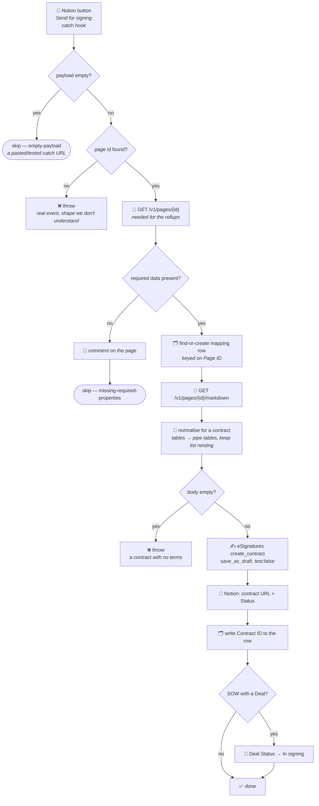

# esignatures-send-for-signing

A Notion **Send for signing** button turns a SOW or Project Addendum page into an eSignatures
draft contract, using the page's own body as the contract text.

**Status:** ✅ Enabled and live — both Notion buttons were repointed to these durables on
2026-08-04, so this is the code that runs when someone clicks **Send for signing**. Replaces the
classic **Send SOW for Signing** and **Send Project Addendum for Signing** Zaps. Two follow-ups
remain, neither affecting behaviour — see [Cutover](#cutover).

**Durable ×2.** One shared [`shared.ts`](shared.ts) deployed twice:

| Deployment | Entry file | Data source |
| --- | --- | --- |
| `sow-send-for-signing` | [`workflow.sow.ts`](workflow.sow.ts) | SOWs |
| `project-addendum-send-for-signing` | [`workflow.addendum.ts`](workflow.addendum.ts) | Project Addendums |

The two flows differ only in configuration, so they share one code path and one config table rather
than being two near-identical workflows that drift apart. **Republish both together** whenever
`shared.ts` changes.

## Workflow

### Per-kind configuration

| | `sow` | `addendum` |
| --- | --- | --- |
| Data source | `SOWs` | `Project Addendums` |
| Contract URL property | `eSignature contract` | `eSignatures Contract` |
| Status set | `Sent for signature` | `Sent for signing` |
| Title | `Agreement Name` | `[Project Addendum] ` + `SOW Name` rollup |
| Signer name | `Signatory Name` rollup | `Consultant` person's name |
| Signer email | `Override Email (Optional)` ?? `Signatory Primary Email` rollup | `Consultant` person's email |
| Validation | a signatory email (either source) | `Consultant` **and** `Client SOW` both set |
| eSignatures template | `6eaa0583…` "Scope of Work" | `443d6bed…` "Consultant Project Addendum" |
| Extra step | linked `Deal` → `In signing` | — |

Note the property names genuinely differ in case and number — `eSignature contract` (singular,
lowercase c) versus `eSignatures Contract` (plural, capital C) — and so do the status options,
`Sent for signature` versus `Sent for signing`. A mismatch fails silently, so they live in one
config table rather than being typed out at each call site.

## Trigger

Each deployment has a catch hook. **The URL a Notion button must POST to is the
`hooks.zapier.com/hooks/catch/…` one**, which lives at `triggers[0].details.webhook_url` — *not*
the top-level `trigger_url`, which is Zapier-internal and needs a JWT.

| Deployment | Catch URL for the Notion button |
| --- | --- |
| `sow-send-for-signing` | `https://hooks.zapier.com/hooks/catch/20495893/CU1FC7PIztrRJjZzu/` |
| `project-addendum-send-for-signing` | `https://hooks.zapier.com/hooks/catch/20495893/ASihmbdguE4cPXFb/` |

An empty payload **skips** rather than raising: these URLs get pasted into Notion button
properties and "tested" long before they are used properly, and every one of those touches
delivers `{"querystring":{}}`.

## Three things worth knowing before touching this

**The classic Zap's page-to-markdown step cannot be ported.** It used `ae:577300`, a hidden Zapier
*action extension*, which `runAction` refuses outright (`ZAPIER_RESOURCE_NOT_FOUND_ERROR`). The
replacement is Notion's own `GET /v1/pages/{id}/markdown`, which is also more faithful than the
Zapier `block_children` converter that extension wrapped.

**The markdown normaliser earns its keep on tables and nested lists.** It is adapted from
[`notion-newsletter-to-buttondown`](../notion-newsletter-to-buttondown/)'s `notionMarkdownToEmail`,
but agreements are table-heavy in a way newsletters are not, and two bugs surfaced in testing that
would have mangled every real contract:

- Notion exports tables as `<table><tr><td>` HTML. The inherited block-separation pass put a blank
  line between every tag, shredding each table into fragments. They are now converted to Markdown
  pipe tables, so rendering does not depend on eSignatures passing raw HTML through.
- Notion indents nested list items with tabs, and the inherited tab-strip removed them all —
  **promoting a sub-clause to a clause**, which changes what the agreement says. Tabs on list items
  now become the 4 spaces Markdown wants; tabs directly under a blockquote carry the `> ` prefix
  down so a callout's body stays in its callout.

**`test` must be set explicitly.** On `App236843CLIAPI`'s `create_contract`, `test` is a *required*
field whose own default is `"true"`. Leaving it out would make every run produce a throwaway test
contract. `save_as_draft: true` is also deliberate — nothing reaches a signer until a human sends
the draft.

## Two eSignatures apps, on purpose

| App | Used for | Why |
| --- | --- | --- |
| `App236843CLIAPI` — "eSignatures.com (Unofficial)" | `create_contract` here | The only one whose `create_contract` takes a single `markdown` body plus a placeholder name |
| `EsignaturesioCLIAPI` — public "eSignatures" | triggers, in [`esignatures-status-to-notion`](../esignatures-status-to-notion/) | Owns `contract_sent_to_signer` / `contract_signed`; the private app has no usable trigger |

Both point at the same eSignatures account, and template ids are portable between them.

`create_contract` returns a **doubly nested** result —
`{ data: [ { status: "queued", data: { contract: { id } } } ] }`. `runAction` supplies the outer
`data` array and the app's envelope adds a second `data` inside each row; the classic Zap's
`gives[...]["data"]["contract"]["id"]` was addressing that inner one. `extractContractId` checks
both nestings and throws rather than writing a wrong id.

## Fixed on migration

The classic **Send Project Addendum for Signing** Zap generated addenda from the **SOW** template
(`6eaa0583…`), even though a `443d6bed…` "Consultant Project Addendum" template exists. Confirmed
as a bug with Dennis on 2026-08-04 and fixed here. Both shells use the same `{{contract-body}}`
placeholder, so the fix was one constant.

## Verification

Verified 2026-08-04 with `run-durable`. Every real mapped record is a live client agreement, so the
main-path runs used purpose-made scratch records, deleted afterwards.

| Case | Result |
| --- | --- |
| `sow` main path | Draft created. Signer name `Kelvin Tan` from the rollup, email from the override — **override precedence confirmed**. Status `Sent for signature`, 575 chars of body. |
| `addendum` main path | Draft created against the addendum's own template. Title `[Project Addendum] <SOW Name>`, signer from the `Consultant` person, Status `Sent for signing`. |
| Retry idempotency | A re-run after a mid-flow failure returned `tableRowCreated: false` — reused the existing mapping row instead of duplicating it. |
| Empty ping | `{"skipped":"empty-payload"}`, no error raised. |
| Normaliser, real page | The live NUS (LKYSPP) addendum renders with clean pipe tables, its D1–D8 list intact, and the "Variation from standard terms" clause kept inside its blockquote. |
| Types | `npm run build` (tsc, durable 0.12.3 + sdk 0.93.0) | Clean |

**Not verified:** that eSignatures' renderer substitutes `{{contract-body}}` exactly as expected —
that needs a human eye on a draft. Open one of the drafts below and check the body rendered.

## Cutover

- [x] Notion **SOWs** → `Send for signing` button repointed to
      `https://hooks.zapier.com/hooks/catch/20495893/CU1FC7PIztrRJjZzu/` — **done 2026-08-04**
- [x] Notion **Project Addendums** → `Send for signing` button repointed to
      `https://hooks.zapier.com/hooks/catch/20495893/ASihmbdguE4cPXFb/` — **done 2026-08-04**
- [ ] Turn off the two classic Zaps once a real signing round has gone through end to end.
- [ ] Delete the three test drafts left in eSignatures: `1041daf2-d152-4d21-8084-5dca1e6448b8`,
      `2a875453-37cf-4c8a-a55e-5443f7720187`, `c9738320-214b-44dd-b310-8adba581f1ae`.

**No double-drafting risk while the classic Zaps stay on.** Each button posts to one URL, so the
classic Zaps' catch URLs now simply never fire — they are dead weight rather than a duplicate. The
one thing that *would* duplicate is a button configured to POST to both the old and new URL, which
would create two contracts per click; worth a glance at the button config if a stray draft ever
appears.

**Still worth a human eye on the first real draft:** that eSignatures substitutes
`{{contract-body}}` as expected is the one thing that could not be verified from here, since the app
exposes no Get-Contract action.

## Maintainer notes

- **`Status` is a `status`-type property and `update_database_item` writes it fine** — confirmed
  with `list-action-input-fields NotionCLIAPI write update_database_item --inputs
  '{"datasource":"…"}'`, which exposes `properties|||Status|||status`. No raw PATCH needed.
- **The page is fetched, not read from the payload**, because the signer lives behind rollups
  (`Signatory Name`, `Signatory Primary Email`, `SOW Name`). Those appear in the data source's
  `notAvailableInQuerySql`, so a SQL-mode query cannot see them.
- The mapping row is claimed **before** the contract is created, so the contract id always has
  somewhere to go. Read and create happen in one `ctx.step` so a retry re-reads rather than
  committing over state a previous attempt already wrote.
- Repo rule 5 (default templates) does not apply — these workflows only update existing pages.
- Missing data is a **skip with a comment on the page**, not an error. A person has to fix it, and
  an error alert nobody can action is just noise.
