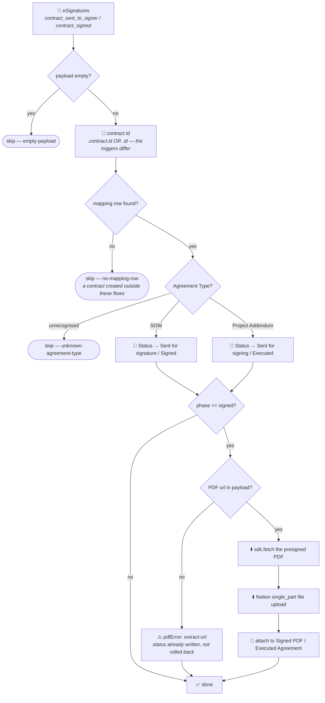

# esignatures-status-to-notion

eSignatures fires; we look the contract id up in the mapping Table to find which Notion record it
belongs to, and move that record's status on. On signature, the executed PDF is filed on the record
too — which the classic Zap never actually did.

**Status:** ✅ Enabled — and unlike the send pair, **these two are already live**: they claimed
their eSignatures triggers at publish time, so they run in parallel with the classic Zaps as of
2026-08-04. That is deliberate and benign; see [Cutover](#cutover). Replaces the classic
**Update SOW / Project Addendum Status When Sent for Signature** and **Signed SOWs / Project
Addenda** Zaps.

**Durable ×2.** One shared [`shared.ts`](shared.ts) deployed twice:

| Deployment | Entry file | Trigger |
| --- | --- | --- |
| `esignatures-contract-sent-to-notion` | [`workflow.sent.ts`](workflow.sent.ts) | `contract_sent_to_signer` |
| `esignatures-contract-signed-to-notion` | [`workflow.signed.ts`](workflow.signed.ts) | `contract_signed` |

**Republish both together** whenever `shared.ts` changes.

## Workflow

Steps `DL` → `AT` all sit inside **one** `ctx.step`, so a retry can neither re-download against an
expired URL nor attach a second copy.

## The two triggers disagree about the contract id

`contract_sent_to_signer` nests it at `.contract.id`; `contract_signed` delivers it flat at `.id`.
`extractContractId` reads **both** paths rather than branching on which deployment it is, so neither
can be broken by the asymmetry and a hand-built replay payload works either way.

## Filing the executed PDF

This is the one genuinely new behaviour. The classic Zap passed
`properties|||Signed PDF|||files: []` — an empty array, a silent no-op — so no executed PDF was
ever filed on any record.

Getting it filed *permanently* took three attempts, and the two obvious routes are both wrong:

| Route | Outcome |
| --- | --- |
| Pass the URL to `properties|||…|||files` on `update_database_item` | **Stores it, but as `{type:"external"}`.** Notion does not re-host external property URLs, so the property looks populated and the link dies when the URL expires. |
| `POST /v1/file_uploads` with `mode:"external_url"` | **Fails.** Notion probes the URL with `HEAD` to read its Content-Type, and an S3 URL presigned for `GET` answers `HEAD` with 403 — `Failed to fetch the headers of the external URL`. |
| **Download the bytes, then a `single_part` upload** | ✅ Lands as a Notion-hosted `{type:"file"}` on `prod-files-secure` — permanent. |

The eSignatures URL is presigned with `X-Amz-Expires=259200` — **72 hours** — and the app exposes
no Get/Find-Contract action and no raw-request action, so the webhook payload is the only chance to
fetch it. There is no way to re-fetch a fresh URL later.

Three things that will bite anyone editing this:

- **The multipart file part must declare the same `Content-Type` the upload was created with**, or
  Notion rejects the send with `Current file content type of 'application/octet-stream' does not
  match the original content type`. The body is hand-built rather than assembled with `FormData`
  because that exact byte layout is the one verified against Notion.
- **A files-entry `name` is capped at 100 characters** and Notion 400s the whole PATCH otherwise
  (`files[0].name.length should be ≤ 100`). eSignatures names its PDFs after the full agreement
  title plus both signers, which runs well past that, so the stem is truncated and `.pdf` preserved.
- **The durable sandbox has no DNS for arbitrary hosts.** A bare `fetch()` dies with
  `getaddrinfo ENOTFOUND`; all egress goes through `sdk.fetch`. It is called with **no connection**
  deliberately — the URL is already presigned, and binding one would hand a Zapier-held credential
  to AWS.

Filing **never throws**. The status write has already happened by then and must not be undone by a
filing problem. Failures come back as `{ok:false, stage, detail}` and are surfaced in the run
**output** as `pdfError`, not merely logged — a durable run's console output is *not* retrievable
from `get-durable-run` (the run object exposes step status but no logs), so a silently swallowed
failure would be undiagnosable in production.

### One thing still unverified

No CLI command exposes a trigger's *output* shape, so the exact payload field holding the PDF URL
could not be pinned from a schema. `extractSignedPdfUrl` tries an ordered candidate list, then falls
back to scanning the payload for any `https` URL whose path ends in `.pdf`.

The fallback is tested: a run with the URL buried at
`some_unexpected_wrapper.documents[0].totally_unknown_key` still found and filed it. **After the
first real `contract_signed`, read `pdfFound` / `pdfError` on the run output and tighten the
candidate list to the real field name.**

## A Table miss is a skip, not an error

The classic Zap's lookup was configured to fail on a miss
(`_zap_search_success_on_miss: false`), which turned every contract created outside these flows —
a referral agreement, a one-off, anything sent by hand — into an error alert. Here a miss logs and
returns `{skipped: "no-mapping-row"}`.

## Verification

Verified 2026-08-04 with `run-durable`.

| Case | Result |
| --- | --- |
| `contract_signed`, real record | Contract `28e9b5ff…` → the live NUS (LKYSPP) addendum. Status `Executed`; PDF filed into `Executed Agreement` — 154643 bytes, `{type:"file"}` on `prod-files-secure`, name truncated to exactly 100 chars. **This fixed real missing data**: the record was already `Executed` from the classic Zap but had never had its PDF filed. |
| `contract_signed`, fallback extraction | URL at `some_unexpected_wrapper.documents[0].totally_unknown_key` still found and filed. |
| `contract_sent_to_signer`, main path | Nested `{"contract":{"id":…}}` payload resolved, `agreementType: SOW`, Status `Sent for signature`. |
| Empty ping | `{"skipped":"empty-payload"}` on both deployments, no error raised. |
| Types | `npm run build` (tsc, durable 0.12.3 + sdk 0.93.0) | Clean |

## Cutover

These are **already live and running alongside the classic Zaps**. That is safe: both write the same
`Status` value, so the duplicate write is idempotent, and the durable additionally files the executed
PDF — which is the improvement. Nothing needs repointing, because eSignatures registers the trigger
subscription itself.

1. Turn off the two classic Zaps once a real signature has gone through the durables.
2. After the first real `contract_signed`, tighten `extractSignedPdfUrl` to the actual field name.

To stop the parallel run in the meantime: `zapier-sdk --experimental disable-workflow <id>`.

## Maintainer notes

- **The status option names differ between the two data sources** — SOWs uses `Sent for signature`
  (lowercase s), Project Addendums uses `Sent for signing`. Likewise `Signed` versus `Executed`, and
  `Signed PDF` versus `Executed Agreement`. A mismatch fails silently, so all of it lives in one
  config table.
- `Status` is a `status`-type property and `update_database_item` writes it fine; no raw PATCH is
  needed for the status. The raw API is used only for the file upload, which has no action.
- The eSignatures connection is bound as the **trigger's** `authentication_id`, not as a workflow
  connection — no eSignatures action is called here. The triggers live on the *public*
  `EsignaturesioCLIAPI` app, while [`esignatures-send-for-signing`](../esignatures-send-for-signing/)
  calls actions on the *private* `App236843CLIAPI`; that app has no usable trigger.
- Both triggers take **zero input fields**, so there is nothing to configure and nothing that can be
  mis-shaped into a silent claim failure.
- The mapping Table is **read-only** here; `esignatures-send-for-signing` owns it.
