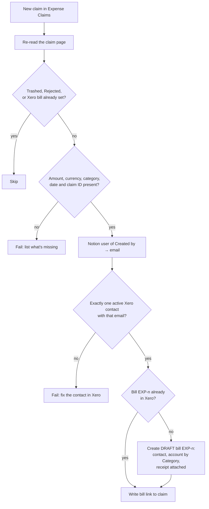

# expense-claim-to-xero-bill

When someone submits a reimbursement claim to the Notion **🧾 Expense Claims DB**, this Zap raises a **draft** bill in Xero to pay them back. Then it links the bill from the claim.

| | |
| --- | --- |
| Trigger | Notion polling **New Data Source Item** on Expense Claims (`4c0a9038-54fc-4643-a63b-df4e52139219`) |
| Writes | Xero draft bill (`new_bill`). Notion `Xero bill` URL property on the claim |
| Connections | `notion_wf` (work.flowers Notion; also bound on the trigger), `xero_wf` (Xero work.flowers) |
| Cost | 3 Xero tasks per claim (find contact, find existing bill, create bill). The Notion reads and write go through `sdk.fetch` |

## Flow



## What the bill looks like

- **Contact:** the claimant. This is the Notion user in *Created by*, matched to Xero by **email address**, never by name. Notion display names are often a first name only ("Dennis"), while the Xero contact is "Dennis Chiuten".
- **Number:** `EXP-<Claim ID>`. This is also the dedupe key (see below).
- **Date:** *Expense date*. There is no due date; set one when you approve the bill.
- **Currency:** *Currency*. "Other" fails the run, because Xero needs an ISO code.
- **One line:** *Claim description*, the merchant, the business purpose and the claim number. Quantity 1 at *Amount*, coded to the account for its *Category*:

| Category | Xero account |
| --- | --- |
| Travel | 420 Travel & Entertainment |
| Meals | 420 Travel & Entertainment |
| Software & subscriptions | 510 Subscriptions - Software |
| Office supplies | 453 Office Expenses |
| Professional services | 313 Professional Fees |
| Training & courses | 475 Learning & Development |
| Events & sponsorship | 405 Event & Sponsorship Costs |
| Memberships & publications | 485 Subscriptions - Non-Software |
| Other | 429 General Expenses |

  **Adding a Category option in Notion means adding a row to `CATEGORY_ACCOUNTS` in `workflow.ts` in the same change.** Otherwise claims in that category fail the run. They never land on a guessed account.
- **Tax:** for an **SGD** claim, the amount is tax-inclusive at the account's default tax rate. Most of these accounts default to `INPUTY24`, but 510 defaults to `INPUT`. Every other currency is `NoTax`. A receipt that isn't a valid tax invoice gets corrected in the draft.
- **Attachment:** the first file in *Receipt*. If a claim has more than one receipt, the run logs a warning, and you attach the rest by hand.
- **Source link:** the bill's URL field points back to the Notion claim.

## Failure modes and replays

Each claim fires the trigger **exactly once**: new-item polling never re-delivers a page id. So when a run fails on a claim you can fix, fixing the claim does not re-run it. After the fix, replay it by hand:

```bash
npx zapier-sdk --stability experimental trigger-workflow <workflow_id> --input '{"page_id":"<claim page id>"}'
```

A replay is safe at any point:

- If the claim already has a `Xero bill` link, the run is skipped.
- If Xero already holds a live bill numbered `EXP-n` (say, a run created the bill and then died before the write-back), that bill is linked rather than duplicated. Deleted and voided bills don't count.

Every case below **fails the run on purpose**. That is the repo's default unrecognised-payload mechanism (see `CLAUDE.md`), and nobody is waiting on a background run, so a silent skip would go unnoticed:

| Failure | Fix |
| --- | --- |
| Amount blank or ≤ 0, Currency blank or "Other", Category blank or unmapped, Expense date blank | Fix the claim in Notion and replay |
| No active Xero contact has the claimant's email | Add the email to the claimant's Xero contact and replay. The Zap never creates contacts |
| Several Xero contacts share that email | Archive or re-address the duplicates and replay |
| Xero isn't subscribed to the claim's currency | Add the currency in Xero, or re-enter the claim in a currency Xero holds |
| Page isn't in Expense Claims | A replay pointed at the wrong page |

A **Rejected** claim, or a trashed one, is skipped without an error.

## Before it can run

- **The Expense Claims DB must be shared with the Zapier Notion integration** (the `work.flowers | Dennis` connection, `02b73654-…`). Until it is, the trigger can't list the data source and every API read returns 404.

## Testing

`npm test` runs offline assertions over the real helpers: payload shapes including the six empty-ping variants, claim parsing, absence-preserving amount handling, the Category map, tax mode, and contact and bill matching. It makes no Zapier calls.

Type-check (no tool on the publish path does this for you):

```bash
npm install --no-save && npm run build
```
