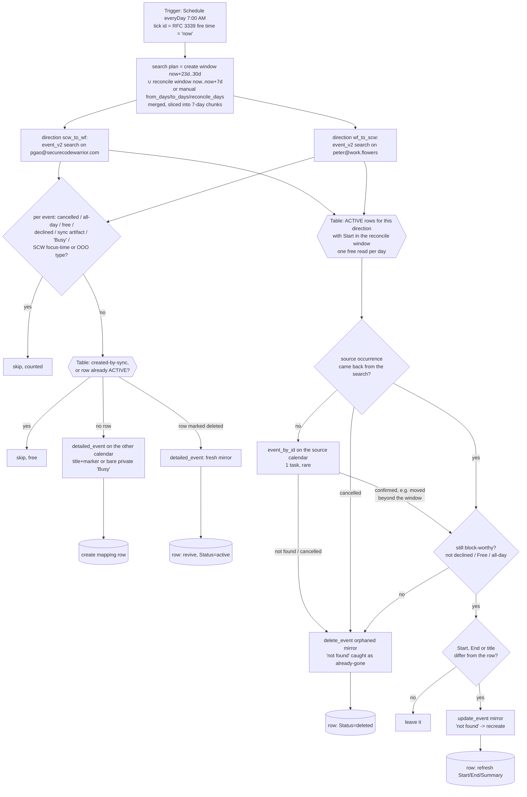

# gcal-block-sweep-peter

**Peter's copy of [`gcal-block-sweep`](../gcal-block-sweep/)** — the same workflow, repointed at Peter's two Google Calendars, Peter's two connections and Peter's own **GCal Sync Map (Peter)** Zapier Table (`01M2HT9XPZEASFV09J4A3QTDGT`). The logic is identical to Dennis's file apart from the constants block, the names and **one deliberate deviation** (in the `scw_to_wf` direction, SCW Focus time / Out of office / working-location events are never mirrored — see below), so a fix in either copy should be ported to the other by diff. The original's README carries the full account of *why* every pass exists; this one records what is specific to Peter's deployment.

Daily horizon backstop, **coming-week reconciler**, and manual cutover backfill for Peter's two-way calendar-blocking pair ([`scw-events-to-workflowers-block-peter`](../scw-events-to-workflowers-block-peter/) / [`workflowers-events-to-scw-busy-peter`](../workflowers-events-to-scw-busy-peter/)).

- **Create pass** — the trigger Zaps refuse to *create* a mirror for an occurrence starting more than 30 days out (`expand_recurring: true` fires an open-ended weekly series ~730 instances ahead in one burst, and Zapier's polling dedupe means a skipped occurrence never re-fires). Every morning this scans the week rolling **into** the horizon (days **23..30**, a full week of overlap so missed days self-heal), in both directions, and creates any mirror the table says is missing. Everything already mapped is a free Table read.
- **Reconcile pass** — the trigger Zaps only ever see an occurrence once (durables dedupe on the raw event id, ticket W6ZE93-VMEWP) and a series truncated with "this and following" emits no per-occurrence cancellation, so *every* post-creation change propagates here: for each ACTIVE row whose `Start` falls in the coming week (days **0..7**), source gone or cancelled → delete the mirror and mark the row `deleted`; no longer block-worthy (declined, Free, all-day) → same; moved or renamed → `update_event` and refresh the row. The create pass also **revives** a row previously marked `deleted` whose source is block-worthy again. **This is why the sweep is not optional** — without it a truncated series leaves orphan mirrors standing forever.

## Manual runs

The scheduled tick needs no input. Manual runs (`trigger-workflow <workflow-id> --input '<json>'`) take the same fields as Dennis's sweep:

| Field | Meaning |
| --- | --- |
| `from_days` / `to_days` | Create-window override in days from now. **Backfill at cutover: `{"from_days":0,"to_days":30}`.** |
| `reconcile_days` | Reconcile-window override (default 7; `0` disables). `{"from_days":0,"to_days":30,"reconcile_days":30}` reconciles the whole horizon for the cost of the backfill's searches. |
| `dryRun: true` | Report what would be created/revived/updated/deleted; write nothing (Table reads still run). |
| `cleanup_notion_blocks: true` | Inherited from Dennis's copy and **inert for Peter** — it matches only self-organised events carrying Notion Calendar's "Event blocked with" text, and Peter never used Notion Calendar blocking. Kept so the file stays diffable against the original. |
| `now: "<RFC 3339>"` | Pin the window anchor (testing). Scheduled runs use the tick's own timestamp; a manual run without `now` reads the clock once inside a `ctx.step`. |

**Prerequisite before the PR merges — share Peter's assets with the account.** The publish pipeline runs under the repo's CI client credentials, not Peter's login, so the workflows it creates run as that identity. Peter's two Google Calendar connections were created `shared_with_all: false` and his Table is visible only to him (the same way Dennis's GCal Sync Map is invisible to Peter's login — `get-table` answers `You do not have the required permissions`). Both connections and the Table therefore have to be shared with the work.flowers account before merge, or every run fails on the first Table read or calendar call. Sharing is a UI action: connections at https://zapier.com/app/assets/connections (⋯ → Share), the Table from its ⋯ menu → Share. Record the date in each `zap.json` `connections_note`/`tables` entry once done.

**Cutover sequence for Peter** (nothing else writes blocks on either calendar, so all five Zaps ship enabled): share the assets as above → merge the PR → wait for the publish pipeline to fill in `workflow_id` → dry-run the backfill (`{"from_days":0,"to_days":30,"reconcile_days":30,"dryRun":true}`) and eyeball the counts → run it for real without `dryRun`. Record the date in each `zap.json` under `cutover`.

## What is Peter-specific

- **Deliberate deviation from Dennis's copy — SCW Focus time / Out of office are never mirrored.** Decided by Peter on 2026-09-15: in the `scw_to_wf` direction, events whose Google `eventType` is `focusTime`, `outOfOffice` (Peter's recurring "Unavailable on Fridays" included) or `workingLocation` are skipped as `excluded-event-type` by the create pass, and the reconcile pass unmirrors an already-mirrored occurrence whose source has turned into one of those types. Same rule as in [`scw-events-to-workflowers-block-peter`](../scw-events-to-workflowers-block-peter/), so the two never disagree. The `wf_to_scw` direction is untouched.
- **Calendars / connections**: `gcal_wf` = Peter's work.flowers Google Calendar connection, `gcal_scw` = Peter's SCW one — never Dennis's ids. Both are read (`event_v2` window search on the source side) and written (`detailed_event` on the destination side).
- **`TABLE_START_UTC_OFFSET_MINUTES`** — the per-day reconcile row lookup filters `Start` (f5) on its `YYYY-MM-DD` prefix, and f5 is stored exactly as Google returned `start.dateTime`, in the calendar's own zone. Dennis's copy hard-codes `+08:00` (Asia/Singapore), and **the same value is correct for Peter**: a read-only `event_v2` probe of `pgao@securecodewarrior.com` on 2026-09-15 returned every `start.dateTime` with a `+08:00` offset, including events whose own `timeZone` is Australia/Sydney or Asia/Kolkata — Zapier renders them in the calendar's zone. Re-verify if Peter's calendar timezone ever changes; a wrong offset is not fatal (the window is a week wide and the sweep runs daily), it just costs a day of latency around midnight.
- **Trigger**: `ScheduleCLIAPI@1.7.0` `everyDay` at 7:00 AM account time, weekends included — same tick as Dennis's, so both sweeps run together.

## Maintainer notes (inherited, still true here)

- Keep `HORIZON_DAYS` (30) and `DEFAULT_FROM_DAYS` (23) in lockstep with the trigger Zaps' horizon — and with Dennis's five, since they are the same design. Change them all in one PR.
- `event_v2` window semantics are inverted from the field names: `start_time` is "Start Time **Before**", `end_time` is "End Time **After**".
- **Reconciliation trusts a search chunk to be complete**; a chunk returning ≥ 100 events is treated as possibly truncated and reconciliation is skipped for that direction, loudly.
- **"Not in the search results" is not yet "gone"** — the pass fetches that one occurrence by id (`event_by_id`, 1 task, rare) before declaring an orphan.
- Every step whose id carries a loop variable lives in a helper that takes `ctx` (publish-time analyzer rule `invalid-step-call`).
- Steady-state cost: ~4 `event_v2` searches/day + 1 task per occurrence newly entering the horizon + 1 task per mirror created, revived, updated or deleted by reconciliation. Table reads and writes are free.
- All timestamps are integer epoch maths — no `new Date` anywhere in the body.

## Verified cases

| Case | Result |
| --- | --- |
| Manual `{"from_days":0,"to_days":30,"reconcile_days":30,"dryRun":true}` (run-durable, 2026-09-15 06:13Z, pre-publish, durable run `01a0a3b3-49d4-7ae4-b9cf-b0c6403a8fd1`, empty table apart from one test row) | Clean finish in 8½ minutes, nothing written. `scw_to_wf`: **85 events** in the 30-day window, **62 would be mirrored** onto work.flowers (18× *Focus time*, 18× *AI COE: MCP Daily Sync*, 9× *Out of office*, 4× *Unavailable on Fridays*, 4× *MCP sync*, 4× *AI COE - Weekly Long Sync*, 4× *Weekly - Peter / Jaap*, 1× *LP Team <> MCP - Follow up #3*), 23 skipped as `free`. `wf_to_scw`: **7 events**, **6 would become Busy blocks** on SCW, 1 skipped as `sync-artifact` (the scw→wf test mirror). Reconcile pass: 1 active row checked (the scw→wf test row, whose synthetic source id exists on no calendar) → `event_by_id` fallback ran once, returned nothing → reported as **1 orphan**, exactly the path a truncated series relies on. Neither direction came near the 100-event trust cap. |

| Same manual dryRun **after the Focus time / OOO exclusion** (2026-09-15 07:19Z, durable run `01a0a3dc-072b-7cad-9799-a33ee761b14c`) | Clean finish, nothing written. `scw_to_wf`: same 85 events, now **31 would be mirrored** (18× *AI COE: MCP Daily Sync*, 4× *MCP sync*, 4× *AI COE - Weekly Long Sync*, 4× *Weekly - Peter / Jaap*, 1× *LP Team <> MCP - Follow up #3*) and **54 skipped as `excluded-event-type`** — every *Focus time*, *Out of office*, *Unavailable on Fridays* and *Home* entry (the 23 *Home* working-location markers used to fall out as `free`; the type check now catches them first). `wf_to_scw` unchanged: 7 events, 6 would become Busy blocks. Reconcile again found the one synthetic test row as an orphan. |

Those **31 + 6** mirrors are what the real backfill will create at cutover — about 37 tasks, then steady state.
