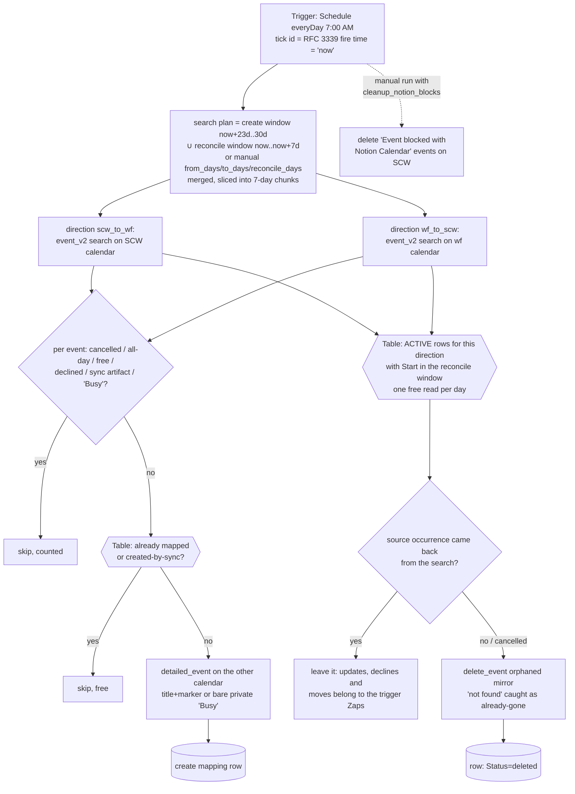

# gcal-block-sweep

Daily horizon backstop, **coming-week reconciler**, and manual cutover backfill for the two-way calendar-blocking pair ([`scw-events-to-workflowers-block`](../scw-events-to-workflowers-block/) / [`workflowers-events-to-scw-busy`](../workflowers-events-to-scw-busy/)).

**Why it exists (create):** the trigger Zaps refuse to *create* a mirror for an occurrence starting more than 30 days out, because `expand_recurring: true` fires an open-ended weekly series ~14 years (~730 instances) ahead in one burst, and Zapier's polling dedupe means a skipped occurrence never re-fires on its own. Something has to mirror those occurrences when they eventually approach. This sweep runs every morning, scans the week rolling **into** the horizon (default window: days **23..30** from now — a full week of overlap so a few missed days self-heal), in both directions, and creates any mirror the shared **GCal Sync Map** table (`01M13QPJ5GRJV33096MBNSN1Q5`) says is missing. Everything already mapped is a free Table read.

**Why it exists (reconcile):** a recurring series that is truncated or moved with "this and following" gets an `UNTIL` on the old series — Google emits **no per-occurrence cancellation**, so [`scw-cancellations-to-workflowers-unblock`](../scw-cancellations-to-workflowers-unblock/) (and its reverse) never hear about the occurrences that vanished, and their mirrors stand at the old time indefinitely. First seen 2026-09-08: the AI COE Weekly Long Sync moved from 11:30 to 09:30 SGT and left four orphaned 11:30 blocks on work.flowers (only the one occurrence that had been individually edited produced a tombstone). So each run also scans the **coming week** (days **0..7**), compares the active mapping rows whose `Start` falls in that window against the source events the search actually returned, deletes any mirror whose source occurrence is gone, and marks the row `deleted`.

## Manual runs

The scheduled tick needs no input. Manual runs (`trigger-workflow <workflow-id> --input '<json>'`) take:

| Field | Meaning |
| --- | --- |
| `from_days` / `to_days` | Create-window override in days from now. **Backfill at cutover: `{"from_days":0,"to_days":30}`.** |
| `reconcile_days` | Reconcile-window override (days from now; default 7). `0` disables reconciliation for the run. The search plan merges it with the create window, so `{"from_days":0,"to_days":30,"reconcile_days":30}` reconciles the whole horizon for the cost of the backfill's searches. |
| `dryRun: true` | Report what would be created/deleted; write nothing (Table reads still run). |
| `cleanup_notion_blocks: true` | Also delete the frozen legacy "Event blocked with Notion Calendar" blocks on the SCW calendar inside the window (matched on Notion Calendar's own description text AND self-organized, so nothing hand-made can match). One-off cutover chore — SCW IT cut Notion Calendar off 2026-08-28, so its blocks can never update or expire themselves. |
| `now: "<RFC 3339>"` | Pin the window anchor (testing). Scheduled runs use the tick's own timestamp; a manual run without `now` reads the clock once inside a `ctx.step`. |

Recommended cutover sequence: merge/publish all three Zaps (enabled) → dry-run the backfill (`{"from_days":0,"to_days":30,"dryRun":true,"cleanup_notion_blocks":true}`) and eyeball the counts → run it for real without `dryRun`.

## Maintainer notes

- Keep the sweep's `HORIZON_DAYS` (30), `DEFAULT_FROM_DAYS` (23) in lockstep with the trigger Zaps' horizon. If the horizon ever changes, change it in all three workflows in the same PR.
- `event_v2` window semantics are inverted from what the field names suggest: `start_time` is "Start Time **Before**" (upper bound), `end_time` is "End Time **After**" (lower bound). Verified by probe 2026-08-28.
- **Create only fills gaps; reconcile only removes orphans.** Updates, declines, all-day/free transitions and revivals belong to the trigger Zaps. A source event that still comes back from the search — even declined or moved — is left alone here. A row already `Status: deleted` (deliberately unmirrored) is never touched by either half.
- **Reconciliation trusts a search chunk to be complete**, because an event missing from the results is read as "the source is gone". A chunk that returns `RECONCILE_MAX_EVENTS_PER_CHUNK` (100) or more events is treated as a possibly truncated page and reconciliation is skipped for that direction, with the reason in the run summary — a truncated page must never read as a mass cancellation. The busiest week observed so far returned 20 events.
- **The per-day row lookup filters `Start` (f5) on its `YYYY-MM-DD` prefix.** f5 is stored exactly as Google returned `start.dateTime`, in the calendar's own zone (`+08:00` for both calendars), so `TABLE_START_UTC_OFFSET_MINUTES` computes the day boundary in that offset. A row on the wrong side of a boundary is not lost — the window is a week wide and the sweep runs daily.
- **Race with the trigger Zap:** if a source occurrence was moved out of the window and the trigger Zap has not yet processed the move, reconcile deletes the mirror one poll early; the trigger Zap then finds the row `deleted`, takes its revive path and creates a fresh mirror at the new time. Net effect is correct, at the cost of one extra task.
- **Every step whose id carries a loop variable lives in a helper that takes `ctx`.** The publish-time analyzer rejects a template-literal `ctx.step` id in the workflow body (`invalid-step-call`, see `.claude/rules/durables-sdk.md`); the pre-reconcile version of this file had several and would have failed its next republish.
- Steady-state cost: 2 `event_v2` searches/day for the create window + 2 for the reconcile window (1 task each) + 1 task per occurrence newly entering the horizon + 1 task per orphaned mirror deleted. Table reads and writes are free. A full 30-day backfill is ~9 searches + 1 task per mirror created.
- All timestamps are computed with integer epoch maths (`daysFromCivil`/`civilFromDays`) — no `new Date` anywhere in the body (the durable runtime's Date guard throws regardless of arguments).

## Verified cases

| Case | Result |
| --- | --- |
| Manual `{"now":…,"from_days":0,"to_days":7,"dryRun":true,"cleanup_notion_blocks":true}` (run-durable, 2026-08-28, pre-publish) | Both directions scanned: 15 SCW events → 3 would-mirror (6 free, 6 sync-artifact skips); 20 wf events → 11 would-mirror (1 free, 6 declined, 2 sync-artifact skips); cleanup preview found exactly the 6 legacy Notion Calendar blocks. Nothing written. |
| Reconcile pass, manual `{"reconcile_days":7,"dryRun":true}` against the published version (2026-09-08 00:55Z, durable run `01a07e83-afda-7d05-991d-54bebe7a0c69`) | 65 steps, clean finish, nothing written. `scw_to_wf`: 43 events in the merged window, 4 active rows checked, 0 orphans (the four AI COE orphans had been removed by hand an hour earlier). `wf_to_scw`: 39 events, 12 active rows checked, **1 genuine orphan found** — `IT & Data Team - Weekly Sync` 14 Sep 14:00 SGT, source `90qimr2iukqp9mon7o9te12ebk_20260914T060000Z`: that series had been truncated and recreated as `sntotkc5ul86le2eajobj0atmr` at 14:30 (confirmed by a direct fetch — the old occurrence returns not-found), so its `Busy` block on SCW is exactly the shape this pass exists to remove. Neither chunk came near the 100-event trust cap. The first scheduled run deletes it. |
