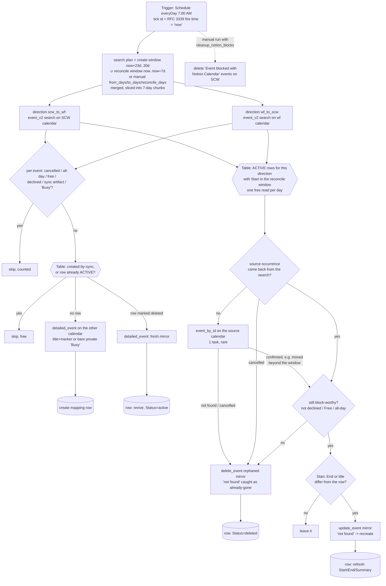

# gcal-block-sweep

Daily horizon backstop, **coming-week reconciler**, and manual cutover backfill for the two-way calendar-blocking pair ([`scw-events-to-workflowers-block`](../scw-events-to-workflowers-block/) / [`workflowers-events-to-scw-busy`](../workflowers-events-to-scw-busy/)).

**Why it exists (create):** the trigger Zaps refuse to *create* a mirror for an occurrence starting more than 30 days out, because `expand_recurring: true` fires an open-ended weekly series ~14 years (~730 instances) ahead in one burst, and Zapier's polling dedupe means a skipped occurrence never re-fires on its own. Something has to mirror those occurrences when they eventually approach. This sweep runs every morning, scans the week rolling **into** the horizon (default window: days **23..30** from now — a full week of overlap so a few missed days self-heal), in both directions, and creates any mirror the shared **GCal Sync Map** table (`01M13QPJ5GRJV33096MBNSN1Q5`) says is missing. Everything already mapped is a free Table read.

**Why it exists (reconcile):** since 2026-09-08 this is where *every* change to an already-mirrored occurrence propagates, because the trigger Zaps only ever see an occurrence once:

- **`event_updated` never re-fires for an occurrence it has already delivered.** Across the last 100 runs of each of the three `event_updated` Zaps in this repo — 300 runs — every event id is distinct, and a live reschedule of the AI COE Weekly Long Sync (moved 09:30 → 13:00 SGT on 2026-09-08) that the trigger's own poll returned *first* never produced a run in the following hours. **Confirmed by Zapier Product Escalations the same day (ticket W6ZE93-VMEWP):** classic Zaps dedupe this trigger on event id + `updated`, but durable workflows apply an additional dedupe layer keyed on the raw event `id` alone, which drops every re-delivery of an already-seen id. It is a bug, not a design decision; a fix is filed with no ETA, and the dedupe behaviour may change shape when it ships. Until then there is no reliable way for a durable to react to an update to an existing event (Zapier's suggested stopgap is a classic Zap on the same trigger). So a move, a rename, a decline, a switch to Free or all-day never reaches the trigger Zaps' update/delete branches.
- **A series truncated or moved with "this and following" gets an `UNTIL` on the old series** — Google emits **no per-occurrence cancellation**, so even the `event_cancelled` Zaps never hear about the vanished occurrences. First seen the same day: only the one occurrence that had been individually edited produced a tombstone; four sweep-created mirrors stood at the old time.

So each run also scans the **coming week** (days **0..7**) and, for every ACTIVE mapping row whose `Start` falls in that window, compares the row against the source event the search actually returned: source gone or cancelled → delete the mirror, mark the row `deleted`; source no longer block-worthy (declined, Free, all-day) → same; source moved or renamed → `update_event` the mirror and refresh the row. The create pass also **revives** a row previously marked `deleted` whose source is block-worthy again (un-declined, restored).

## Manual runs

The scheduled tick needs no input. Manual runs (`trigger-workflow <workflow-id> --input '<json>'`) take:

| Field | Meaning |
| --- | --- |
| `from_days` / `to_days` | Create-window override in days from now. **Backfill at cutover: `{"from_days":0,"to_days":30}`.** |
| `reconcile_days` | Reconcile-window override (days from now; default 7). `0` disables reconciliation for the run. The search plan merges it with the create window, so `{"from_days":0,"to_days":30,"reconcile_days":30}` reconciles the whole horizon for the cost of the backfill's searches. |
| `dryRun: true` | Report what would be created/revived/updated/deleted; write nothing (Table reads still run). |
| `cleanup_notion_blocks: true` | Also delete the frozen legacy "Event blocked with Notion Calendar" blocks on the SCW calendar inside the window (matched on Notion Calendar's own description text AND self-organized, so nothing hand-made can match). One-off cutover chore — SCW IT cut Notion Calendar off 2026-08-28, so its blocks can never update or expire themselves. |
| `now: "<RFC 3339>"` | Pin the window anchor (testing). Scheduled runs use the tick's own timestamp; a manual run without `now` reads the clock once inside a `ctx.step`. |

Recommended cutover sequence: merge/publish all three Zaps (enabled) → dry-run the backfill (`{"from_days":0,"to_days":30,"dryRun":true,"cleanup_notion_blocks":true}`) and eyeball the counts → run it for real without `dryRun`.

## Maintainer notes

- Keep the sweep's `HORIZON_DAYS` (30), `DEFAULT_FROM_DAYS` (23) in lockstep with the trigger Zaps' horizon. If the horizon ever changes, change it in all three workflows in the same PR.
- `event_v2` window semantics are inverted from what the field names suggest: `start_time` is "Start Time **Before**" (upper bound), `end_time` is "End Time **After**" (lower bound). Verified by probe 2026-08-28.
- **The trigger Zaps create; this sweep does everything after.** Because `event_updated` fires once per occurrence and never again, the trigger Zaps' update/delete/revive branches are dead code in practice (kept as a belt in case Zapier changes the dedupe). Every post-creation change lands here on the next 07:00 run — so a same-day reschedule is *not* propagated until the following morning. If that lag ever matters, the trigger cadence is the dial: `everyHour` with a 2-day reconcile window costs about one extra search per direction per hour.
- **Reconciliation trusts a search chunk to be complete**, because an event missing from the results is read as "the source is gone". A chunk that returns `RECONCILE_MAX_EVENTS_PER_CHUNK` (100) or more events is treated as a possibly truncated page and reconciliation is skipped for that direction, with the reason in the run summary — a truncated page must never read as a mass cancellation. The busiest merged window observed so far returned 43 events.
- **The per-day row lookup filters `Start` (f5) on its `YYYY-MM-DD` prefix.** f5 is stored exactly as Google returned `start.dateTime`, in the calendar's own zone (`+08:00` for both calendars), so `TABLE_START_UTC_OFFSET_MINUTES` computes the day boundary in that offset. A row on the wrong side of a boundary is not lost — the window is a week wide and the sweep runs daily.
- **"Not in the search results" is not yet "gone".** An occurrence moved beyond the searched windows (say from day 3 to day 12) is absent from every search too, and deleting its block would be wrong. So before declaring an orphan the pass fetches that one occurrence by id from the source calendar (`event_by_id`, 1 task, only on this rare branch): a confirmed event comes back → treated as the source (usually the update path, at its new time); not found or a `cancelled` tombstone → orphan. A truncated series' vanished occurrences read back as `status: cancelled` with a sparse body, which is what `event_by_id` returned for the AI COE old series on 2026-09-08.
- **In the `busy` direction only times matter.** A rename on work.flowers changes nothing on a bare `Busy` block, so the title comparison is skipped there; the row's `Summary` may lag for those and that is fine.
- **Every step whose id carries a loop variable lives in a helper that takes `ctx`.** The publish-time analyzer rejects a template-literal `ctx.step` id in the workflow body (`invalid-step-call`, see `.claude/rules/durables-sdk.md`); the pre-reconcile version of this file had several and would have failed its next republish.
- Steady-state cost: 2 `event_v2` searches/day for the create window + 2 for the reconcile window (1 task each) + 1 task per occurrence newly entering the horizon + 1 task per mirror created, revived, updated or deleted by reconciliation + 1 `event_by_id` per active row whose source was missing from the searches. Table reads and writes are free. A full 30-day backfill is ~9 searches + 1 task per mirror created.
- All timestamps are computed with integer epoch maths (`daysFromCivil`/`civilFromDays`) — no `new Date` anywhere in the body (the durable runtime's Date guard throws regardless of arguments).

## Verified cases

| Case | Result |
| --- | --- |
| Manual `{"now":…,"from_days":0,"to_days":7,"dryRun":true,"cleanup_notion_blocks":true}` (run-durable, 2026-08-28, pre-publish) | Both directions scanned: 15 SCW events → 3 would-mirror (6 free, 6 sync-artifact skips); 20 wf events → 11 would-mirror (1 free, 6 declined, 2 sync-artifact skips); cleanup preview found exactly the 6 legacy Notion Calendar blocks. Nothing written. |
| Orphan reconcile, manual `{"reconcile_days":7,"dryRun":true}` against the published version (2026-09-08 00:55Z, durable run `01a07e83-afda-7d05-991d-54bebe7a0c69`) | 65 steps, clean finish, nothing written. `scw_to_wf`: 43 events in the merged window, 4 active rows checked, 0 orphans (the four AI COE orphans had been removed by hand an hour earlier). `wf_to_scw`: 39 events, 12 active rows checked, **1 genuine orphan found** — `IT & Data Team - Weekly Sync` 14 Sep 14:00 SGT, source `90qimr2iukqp9mon7o9te12ebk_20260914T060000Z`: that series had been truncated and recreated as `sntotkc5ul86le2eajobj0atmr` at 14:30 (confirmed by a direct fetch — the old occurrence returns not-found), so its `Busy` block on SCW is exactly the shape this pass exists to remove. Neither chunk came near the 100-event trust cap. |
| Update / unmirror / revive paths, manual `{"reconcile_days":7,"dryRun":true}` against the published version (2026-09-08 07:24Z, durable run `01a07fe7-5605-7419-a3d7-94a10be32a07`, version `01a07f97-b059-72b5-8356-e74c510f75f2`) | 68 steps, clean finish, nothing written. `scw_to_wf`: 44 events, 1 would-create (AI COE Daily Sync rolling into the horizon on 8 Oct), 3 active rows checked, 0 orphans, 0 updates, **1 would-unmirror, reason `declined`** — `Department AI Champion Certification Kickoff` 9 Sep 05:30 SGT; a direct fetch confirms Dennis's `responseStatus: declined` set at 05:26Z that day, i.e. a decline made *after* the mirror was created, exactly the change the trigger Zap can never see. `wf_to_scw`: 38 events, 12 rows checked, the same 1 orphan as the morning run (IT & Data Team 14 Sep), 0 updates, 0 unmirrors. `revived` empty in both directions. Nothing still at its recorded time appeared under `updated`. The `event_by_id` fallback ran once (for the orphan) and returned the cancelled tombstone. |
