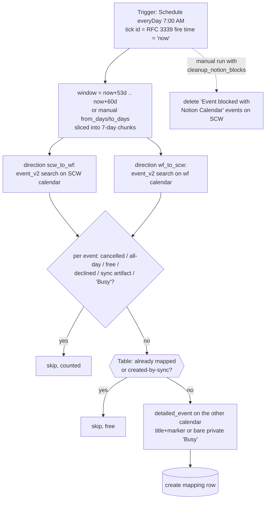

# gcal-block-sweep

Daily horizon backstop — and manual cutover backfill — for the two-way calendar-blocking pair ([`scw-events-to-workflowers-block`](../scw-events-to-workflowers-block/) / [`workflowers-events-to-scw-busy`](../workflowers-events-to-scw-busy/)).

**Why it exists:** the trigger Zaps refuse to *create* a mirror for an occurrence starting more than 60 days out, because `expand_recurring: true` fires an open-ended weekly series ~14 years (~730 instances) ahead in one burst, and Zapier's polling dedupe means a skipped occurrence never re-fires on its own. Something has to mirror those occurrences when they eventually approach. This sweep runs every morning, scans the week rolling **into** the horizon (default window: days **53..60** from now — a full week of overlap so a few missed days self-heal), in both directions, and creates any mirror the shared **GCal Sync Map** table (`01M13QPJ5GRJV33096MBNSN1Q5`) says is missing. Everything already mapped is a free Table read, so a quiet day costs ~2 search tasks and nothing else.

## Manual runs

The scheduled tick needs no input. Manual runs (`trigger-workflow <workflow-id> --input '<json>'`) take:

| Field | Meaning |
| --- | --- |
| `from_days` / `to_days` | Window override in days from now. **Backfill at cutover: `{"from_days":0,"to_days":60}`.** |
| `dryRun: true` | Report what would be created/deleted; write nothing (Table reads still run). |
| `cleanup_notion_blocks: true` | Also delete the frozen legacy "Event blocked with Notion Calendar" blocks on the SCW calendar inside the window (matched on Notion Calendar's own description text AND self-organized, so nothing hand-made can match). One-off cutover chore — SCW IT cut Notion Calendar off 2026-08-28, so its blocks can never update or expire themselves. |
| `now: "<RFC 3339>"` | Pin the window anchor (testing). Scheduled runs use the tick's own timestamp; a manual run without `now` reads the clock once inside a `ctx.step`. |

Recommended cutover sequence: merge/publish all three Zaps (enabled) → dry-run the backfill (`{"from_days":0,"to_days":60,"dryRun":true,"cleanup_notion_blocks":true}`) and eyeball the counts → run it for real without `dryRun`.

## Maintainer notes

- Keep the sweep's `HORIZON_DAYS` (60), `DEFAULT_FROM_DAYS` (53) in lockstep with the trigger Zaps' horizon. If the horizon ever changes, change it in all three workflows in the same PR.
- `event_v2` window semantics are inverted from what the field names suggest: `start_time` is "Start Time **Before**" (upper bound), `end_time` is "End Time **After**" (lower bound). Verified by probe 2026-08-28.
- The sweep only **creates**; updates, deletions and revivals belong to the trigger Zaps. An event whose row exists — even `Status: deleted` (deliberately unmirrored) — is left alone.
- Steady-state cost: 2 `event_v2` searches/day (1 task each) + 1 task per occurrence newly entering the horizon. A full 60-day backfill is ~18 searches + 1 task per mirror created.
- All timestamps are computed with integer epoch maths (`daysFromCivil`/`civilFromDays`) — no `new Date` anywhere in the body (the durable runtime's Date guard throws regardless of arguments).

## Verified cases (run-durable, 2026-08-28, pre-publish)

| Case | Result |
| --- | --- |
| Manual `{"now":…,"from_days":0,"to_days":7,"dryRun":true,"cleanup_notion_blocks":true}` | Both directions scanned: 15 SCW events → 3 would-mirror (6 free, 6 sync-artifact skips); 20 wf events → 11 would-mirror (1 free, 6 declined, 2 sync-artifact skips); cleanup preview found exactly the 6 legacy Notion Calendar blocks. Nothing written. |
