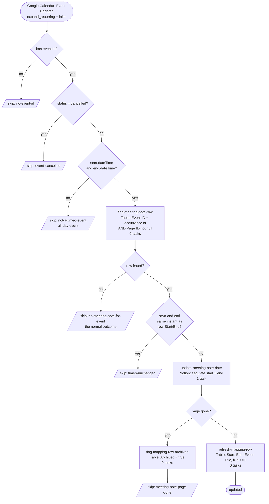

# gcal-event-updated-to-meeting-note

Keeps a Notion **meeting note**'s `Date` in step with the Google Calendar event it came from. When a meeting is rescheduled, this writes the new start/end onto the existing note. It is **update-only** — it never creates a note, and never touches anything but `Date`.

Replaces the classic Zap **“Updated Meeting → Update Meeting Note in Notion”**, which had been silently failing since May 2026 (see [Why the classic Zap stopped working](#why-the-classic-zap-stopped-working)).

- **Trigger:** Google Calendar → *Event Updated* (`GoogleCalendarCLIAPI@1.15.0` / `event_updated`), calendar `dennis@work.flowers`, `expand_recurring: false`
- **Workflow ID:** `019fb770-139b-74ca-bf9b-fec7ea0c9c3b` · [editor](https://zapier.com/durables-editor/019fb770-139b-74ca-bf9b-fec7ea0c9c3b)
- **Cost:** 1 task per *actual* reschedule. The lookup and the write-back are Zapier Tables ops, which are free, and every skip path exits before the one Notion call.

## Workflow



## The two Google Calendar ids — and why it matters

This is the whole story of the bug, so it is worth stating plainly. A Google event carries **two** identifiers, and they are not interchangeable:

| | `id` — the **occurrence** | `iCalUID` — the **series** |
| --- | --- | --- |
| One-off event | `020m73h4pol31v2vml5scfchmp` | `020m73h4pol31v2vml5scfchmp@google.com` |
| Recurring occurrence | `48759896…_20260730T033000Z` | `48759896…@google.com` |
| Recurring, series since revised | `rljatc0qotko…_20260730T033000Z` | `rljatc0qotko…_R20260622T033000@google.com` |

- **`id`** is Google's key for *one occurrence*. For a recurring meeting it is `<seriesId>_<originalStartUTC>` — a different value every week. **This is the only id that is unique per meeting note**, so it is the lookup key, and it is what the Worker stamps on the note as `Google Calendar Event ID`.
- **`iCalUID`** is the RFC 5545 UID: the cross-system identity of the *series*, therefore **shared by every occurrence**. The `_R<stamp>` segment changes only when the series itself is edited. For an externally-created booking it keeps the origin system's UID (e.g. `7TnnAYZ5vtPgPDbQBtcdxf@Cal.com`), which is the one thing it is genuinely useful for.

A trap worth knowing: **you cannot tell recurring from one-off by looking at an iCalUID.** A recurring series that has never been revised gets a bare `<seriesId>@google.com`, identical in shape to a one-off's.

## Why the classic Zap stopped working

The classic Zap looked the note up in `[Table] Meeting Note IDs` by matching **`Event ID` (f3)** exactly against the trigger's **`id`**. Correct as designed — but from May 2026 the `meeting-note-db-updates` Notion Worker began writing the **`iCalUID`** into that column. For the 31 July 2026 standup:

```
trigger id      17o8m8ek1bfnt6vsdg64v0ov2l_20260731T034500Z
table Event ID  17o8m8ek1bfnt6vsdg64v0ov2l_R20260706T034500@google.com
```

Never equal → “only continue if found” stopped every run → no Notion update, no error, no alert. **92 of 849 rows** were in this state. Note this broke one-off events too, not just recurring ones: `<id>@google.com` never equals `<id>`.

It also caused a second, quieter fault: because one iCalUID covers every occurrence, the Worker's find-or-create kept matching the *same* row and overwriting its `Page ID`. A year of weekly standups became one row. `AI COE Daily Sync` — a daily meeting — had a single row whose Page ID had been overwritten continuously since 14 May.

**Both were fixed by re-keying the table**, not by changing this workflow's logic — see [`scripts/backfill-meeting-note-event-ids.mjs`](../scripts/backfill-meeting-note-event-ids.mjs). The table now carries the occurrence id in `Event ID` (f3) and the iCalUID in a new `iCal UID` (f9) column, so nothing was thrown away.

> **Keep this invariant:** `Event ID` (f3) is the **occurrence** id. Anything writing to this table — this workflow, the Notion Worker, a future backfill — must respect that, or the lookup silently returns nothing again.

## Design notes

- **Why the Table and not a Notion search.** A Notion `find_data_source_item` on `Google Calendar Event ID` finds the same page and needs no mapping table at all — but it costs a task on *every* calendar edit, and most edits are for meetings with no note. The Table lookup is free, so the one task is spent only on a real reschedule.
- **Instant comparison, not string comparison.** Google sends local time plus offset (`2026-07-31T16:00:00+08:00`); Zapier Tables normalises to `Z` (`2026-07-31T08:00:00Z`). Those are the same moment, so the “did the time actually change?” guard reduces both to epoch milliseconds. A string compare would see a change on every single run and rewrite Notion endlessly.
- **No `Date` in the workflow body.** `@zapier/zapier-durable` runs the body in GUARDED mode and its `Date` proxy throws in the `construct` trap *before* reading its arguments, so even `new Date(isoString)` fails. `epochMsFromRfc3339` is integer maths only — same approach as [`drive-invoice-to-xero`](../drive-invoice-to-xero/).
- **A dead page is flagged, not deleted.** The classic Zap *deleted* the mapping row when the Notion update errored. Any transient Notion failure would therefore have destroyed a good mapping. Here the error is caught **inside** the `ctx.step` (so it cannot spin the retry loop), matched against a narrow "page is gone" pattern, and the row is flagged `Archived` — the column already existed for exactly this. Every other error rethrows and gets the step's normal retries.
- **Write-back keeps the change-detection honest.** After a successful update the row's `Start`/`End` are refreshed, so the next edit compares against current values. This also backfills `iCal UID` on rows that predate that column.

## What it deliberately does not do

- **A whole-series edit does not propagate.** With `expand_recurring: false` (matching the classic Zap), editing the *series* delivers the master event, whose id matches no note, so the run skips cleanly. Only single-occurrence edits and one-off events propagate. This is the right trade for this data: notes exist only for meetings at or after their start, so retro-updating past occurrences is rarely wanted, and `expand_recurring: true` would fan a single series edit out across every future instance, almost all of which have no note.
- **It never creates a meeting note.** Notes are created by the [`meeting-note-db-updates`](https://github.com/work-flowers/notion-worker-meeting-note-db-updates) Notion Worker, from a Notion DB automation. No mapping row means no note, which means nothing to do.
- **It only writes `Date`.** Attendees, contacts, call link and description stay owned by the Worker.
- **Notes whose row was already overwritten stay unreachable.** Where the collapse had already reused a row, the earlier occurrences' Page IDs are gone from the table; the migration could only re-key the surviving one.

## Verified cases

Run against production on 2026-07-31 via `run-durable`:

| Case | Input | Result |
| --- | --- | --- |
| Real reschedule (the reported failure) | 31 Jul standup, `id …_20260731T034500Z`, moved to `16:00–16:30+08:00` | `updated: true` — Notion `Date` went `03:45–04:15Z` → `08:00–08:30Z`; row refreshed, `iCal UID` populated |
| Re-run of the same event | identical payload | `skipped: times-unchanged` — proves the offset-vs-`Z` comparison does not see a phantom change |
| Event with no meeting note | `id: no-such-event-id-abc123` | `skipped: no-meeting-note-for-event` |
| Cancelled occurrence | same id, `status: cancelled` | `skipped: event-cancelled` |
| All-day event | `start.date` only, no `dateTime` | `skipped: not-a-timed-event` |

## Maintainer notes

- **Upstream dependency:** the `Event ID` column must hold the occurrence id. The Notion Worker at [`notion-workers/workers/meeting-note-db-updates`](https://github.com/work-flowers/notion-worker-meeting-note-db-updates) writes that column when it enriches a new note — if it ever reverts to writing the iCalUID, this workflow goes silently dead again. That is the single most important thing to know before touching either side.
- **Cutover:** the classic Zap must be turned off in the Zapier UI. Note that the re-keying migration *also* repaired the classic Zap's lookup, so until it is disabled both it and this workflow will fire on the same event and write the same value twice.
- The table's `Archived` (f7) column is now meaningful: `true` means the linked Notion note no longer exists.
