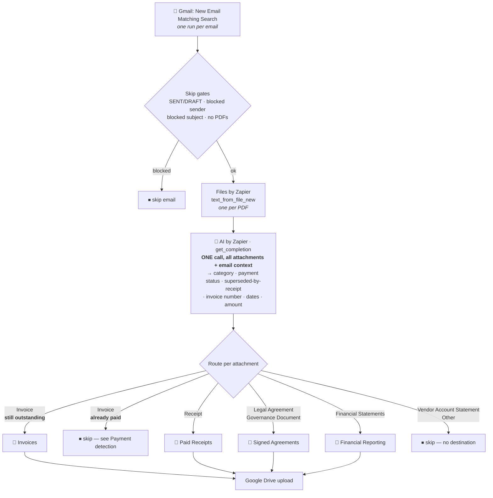

# Gmail Attachments → Google Drive by Type

Durable workflow (trigger **`search`** — "New Email Matching Search" — `GoogleMailV2CLIAPI@2.14.0`)
that classifies every PDF attached to an incoming email and files each into the right Google
Drive folder. Migrated from the classic multi-step Zap *"Gmail Attachments to Google Drive by
Type"* (Gmail trigger → filters → Files by Zapier → AI classifier → Paths → four Drive uploads).

> **The Invoices folder is for bills that still need paying.** Everything below about payment
> detection exists to keep already-settled invoices out of it.

## What it does

1. **Trigger** — Gmail *New Email Matching Search*, one run per **email** (not per attachment).
   The search query pre-filters; see [Trigger query](#trigger-query).
2. **Skip gates** (plain code, no task cost) — drop the email entirely if it carries a `SENT`
   or `DRAFT` label, comes from a blocked sender, matches a blocked subject phrase, or has no
   PDF attachments. Carried over from the classic Zap's "A bunch of filters" step.
3. **Extract text** — one Files by Zapier `text_from_file_new` call per PDF. A PDF that won't
   convert yields empty text rather than failing the run; the classifier still gets its
   filename and the surrounding email. See
   [Unconvertible PDFs](#unconvertible-pdfs-and-the-checkpoint-trap) — "won't convert" does
   **not** always mean "raises an error".
4. **Classify — a single AI call for the whole email.** Sender, subject, date and body, plus
   every attachment's filename and extracted text, go to AI by Zapier
   (`standard/auto`, built-in credentials) which returns one structured result per attachment.
   The prompt lives in [`classifier-prompt.md`](classifier-prompt.md). See
   [Model tier](#model-tier) for why Standard.
5. **Route** — each attachment is filed, or skipped, per [Routing](#routing).
6. **Upload** — Google Drive `file` upload into the destination folder.



## Why per-email, not per-attachment

The classic Zap used Gmail's **New Attachment** trigger, which fires **once per attachment**.
Each PDF was therefore classified with no knowledge of its siblings — and that makes the SaaS
case unsolvable.

A card-billed vendor sends **one email carrying both the invoice and its receipt**. Read on its
own, the invoice looks unpaid. Real example from this mailbox — Anthropic,
*"Your receipt from Anthropic, PBC #2215-5909-1740"*:

| Attachment | What it says |
| --- | --- |
| `Invoice-YIGHXGH9-0005.pdf` | "S$133.58 **due** July 25, 2026" · "Pay online" · payment address. **No paid marker anywhere.** |
| `Receipt-2215-5909-1740.pdf` | "**Date paid** July 25, 2026" · "Amount paid S$133.58" · "Visa - 3612" · **`Invoice number YIGHXGH9-0005`** |

The invoice's only evidence of settlement is the *other attachment* — and the receipt quotes the
invoice number it settles, so the two can be joined deterministically. Triggering per email puts
both PDFs in front of the classifier in one call, which is what makes the skip possible.

It is also cheaper: **one AI call per email** instead of one per attachment.

## Payment detection

For every attachment classified `Invoice`, five independent signals are checked, strongest
first, so the reason recorded in the run output names the actual evidence:

| # | Signal | Recorded reason |
| --- | --- | --- |
| 1 | A **`Receipt`** on this same email quotes the **same invoice number** (normalised: non-alphanumerics stripped, uppercased, ≥4 chars) | `a receipt on this email settles invoice <n>` |
| 2 | The classifier set **Superseded By Receipt = Yes** — it matched a sibling receipt on vendor + amount + date when no invoice number was available | `classifier matched a receipt on this email to this invoice` |
| 3 | The classifier set **Auto-Paid By Recurring Charge = Yes** *and* a `Vendor Account Statement` is attached — see [Recurring auto-charge](#recurring-auto-charge-no-receipt-exists) | `the account statement on this email shows this vendor's invoices auto-cleared by same-day card payments` |
| 4 | **Paid markers on the invoice itself** — amount due zero, "Paid", "Date paid", card last-four, a settled payment-history row | `payment markers on the invoice itself` |
| 5 | The email carries **any** paid receipt and more than one attachment (weakest; last resort) | `this email also carries a paid receipt` |

Signal 1 collects invoice numbers **from receipts only**, so an invoice can never mark itself
settled. Signals 2 and 3 are each gated in code on the corresponding document actually being
attached — a `Receipt` for signal 2, a `Vendor Account Statement` for signal 3 — not on the
model's say-so alone. That guard is load-bearing: on SimplePay the model reported
`Superseded By Receipt = Yes` when the only sibling was a statement, which reached the right
verdict by the wrong route and logged evidence that did not exist.

### Recurring auto-charge (no receipt exists)

A second auto-payment shape, and unlike the Anthropic case it produces **no receipt at all**.

SimplePay emails a monthly invoice together with an account statement, where the statement is
generated the moment the invoice is issued — *before* that month's card charge posts. Read
literally, the invoice is unpaid and the statement agrees. The evidence is the history above
that line:

```
2026-06-19  Invoice #1126613   $12.00   $12.00
2026-06-19  Card Payment      -$12.00    $0.00     ← 16 prior months, all identical
2026-07-19  Invoice #1148057   $12.00   $12.00     ← this month, charge not yet posted
2026-07-19  CLOSING BALANCE             $12.00
```

…reinforced by the email body: *"We have these payment options available: 1. Monthly card
payment (the default)."*

The prompt sets `Auto-Paid By Recurring Charge = Yes` only when **all five** hold: a sibling
statement for the same vendor/account; **≥3 prior invoices** each cleared to zero; those
settling payments posting **same-day or within one day**; the invoice in question being the
**newest and only outstanding** line; and no sign the arrangement has lapsed (dunning, overdue
warning, failed payment, payment-method change). A vendor that merely *offers* card payment,
with no statement history proving it is in use, does not qualify.

### The old "due date == invoice date" filter is gone

The classic Zap dropped any invoice whose due date equalled its issue date, as a proxy for
"billed to a card, already paid". That has been removed deliberately. Due-on-receipt terms are
common on invoices that are **genuinely unpaid**, and silently discarding them means a real bill
is never seen. Payment is now established from evidence, not date arithmetic.

The bias is stated in the prompt: filing an already-paid invoice is a small annoyance, skipping
an unpaid one is a missed bill — so when the model can't tell, it errs toward filing.

## Routing

| Category | Destination | Folder ID |
| --- | --- | --- |
| Invoice *(outstanding only)* | Invoices | `14RpcjSzye4BVZPS_1OzspabmQzDwFVRE` |
| Receipt | Paid Receipts | `1te8aN26Kl5PVH3qY1bXrw9vzX3CfsQwC` |
| Legal Agreement | Signed Agreements | `1-1HCfTIdnngXv_1fhUHuPpjI6Nupk7-K` |
| Governance Document | Signed Agreements | `1-1HCfTIdnngXv_1fhUHuPpjI6Nupk7-K` |
| Financial Statements | Financial Reporting | `1t719k98AHrfMVgcrSNOx9REIvnsL8_Bo` |
| Vendor Account Statement | *(none — classified, never filed)* | — |
| Other | *(none)* | — |

`Vendor Account Statement` has no destination. That matches the classic Zap, which offered it as
a category but had no Path for it. It is still classified so the run output shows what was seen
and skipped — change `CATEGORY_FOLDERS` in `workflow.ts` to start filing it.

## Trigger query

```
has:attachment filename:pdf -in:sent -in:drafts -in:chats -in:trash -in:spam -from:no-reply.1tdl9c@zapiermail.com
```

This narrows what Gmail polls. It is **not** the authoritative filter — Gmail's phrase matching
is fuzzy, so every exclusion is re-checked in code (`BLOCKED_SENDERS`, `BLOCKED_SUBJECTS`,
`BLOCKED_LABELS` in `workflow.ts`). The trigger fires on all folders including sent mail unless
excluded, hence `-in:sent -in:drafts`.

Blocked subject phrases, carried over from the classic Zap:

- `your monthly aspire account statement`
- `from company flow` — **our own outgoing invoices**, which Xero copies to us. Accounts
  receivable, not bills to pay.
- `your trade statement for assets`
- `your monthly statement for assets` — the other Wise Assets statement. Password-protected
  (the password is our UEN), so nothing can be extracted from it, and as a vendor account
  statement it has no destination folder. Added alongside the fix in
  [Unconvertible PDFs](#unconvertible-pdfs-and-the-checkpoint-trap); it saves the AI task, it
  is **not** what stops the failure.

## Unconvertible PDFs and the checkpoint trap

**Files by Zapier does not always raise on a PDF it cannot convert.** With
`failOnConversionError: false` — which this workflow passes, so one bad attachment can't kill an
email — an encrypted PDF comes back **as its own raw bytes decoded as text**, with a `200`.

Wise's *"Your monthly statement for Assets"* is password-protected, and its "extracted text" was
128 KB starting `%PDF-1.6`, ~38% U+FFFD replacement characters and ~10% control characters,
including **101 NULs**.

That is what broke the workflow on 2026-08-07 (`ZAP-26`), and the failure mode is worth knowing
because nothing in the workflow's own error handling can catch it:

> Every value a `ctx.step` returns is checkpointed to PostgreSQL as JSON, and Postgres rejects a
> JSON string containing **U+0000** with SQLSTATE **`22P05`** — *unsupported Unicode escape
> sequence*. The checkpoint happens **after** the step function returns, so the step's own
> `try`/`catch` never sees it. The step is retried 5 times, the return value is byte-identical
> every time, so all 5 checkpoints fail identically and the run dies as
> `StepExhaustedError: Step "extract-text-0" exhausted all retry attempts`.

The error names text extraction, but text extraction succeeded. Two guards in `workflow.ts` fix
it, both applied **before the step returns**:

| Guard | What it does |
| --- | --- |
| `looksLikeRawFileBytes()` | Recognises undecoded file bytes — a `%PDF-`/`PK`/`PNG` magic-number header, >2% control characters, or >5% U+FFFD in the first 4 KB — and takes the existing empty-text path with `ok: false`. Genuine extracted text carries essentially none of either marker. |
| `stripUncheckpointableChars()` | Belt and braces: removes NUL and the other C0 controls (tab, newline and carriage return kept) plus lone surrogates from whatever does leave the step, error messages included. No PDF can hit `22P05` again. |

Verified against the real payload: `extract-text-0` now **completes** instead of exhausting,
`textExtracted: false`, and the statement classifies as `Vendor Account Statement` → skipped.

> **This is not specific to this Zap.** Any durable that returns extracted document text, scraped
> HTML or upstream API text from a `ctx.step` can hit `22P05` the same way. The triage ticket read
> the failure as a platform bug in `@zapier/zapier-durable@0.10.1` and blamed zero-width
> non-joiners (U+200C) in the email body — neither holds up. U+200C is perfectly legal in Postgres
> JSON, and the email body travels in the workflow *input*, which had already checkpointed fine
> before the step ran. The framework arguably should scrub NULs, but the workflow put them there.

## Model tier

`AI_MODEL` in `workflow.ts`. **The tier is the task cost**, so it is the main lever on what this
workflow spends:

| `model_id` | Tasks per run | Notes |
| --- | --- | --- |
| **`standard/auto`** ← in use | **1×** | Zapier's recommended tier for classification and extraction. No tool calls. |
| `advanced/auto` | 3× | The Zapier default, chiefly so new steps can use tools. |
| `premium/auto` | 5× | Deep reasoning / agent workflows. |

Those three sentinels are the **only** valid values — anything else fails with
`Unknown tier sentinel "…". Expected one of: standard/auto, advanced/auto, premium/auto`. Cost is
`(1 × rate) + (tool calls × rate)`; this step makes no tool calls, so it is exactly one unit at
the tier rate. ([tier pricing](https://help.zapier.com/hc/en-us/articles/46425475442829-AI-by-Zapier-model-tier-pricing))

Standard was verified to reach the **same routing verdict as Advanced on every case** in
[Verified behaviour](#verified-behaviour) — including SimplePay's statement-history inference,
stable across repeat runs. Named models (`anthropic/claude-sonnet-4-6`, `openai/gpt-4.1-mini`,
`google/gemini-3.5-flash`, …) are selectable only against **your own provider account** via a
custom `authentication_id`, which bills to that provider instead of Zapier tasks.

**Re-run the verified cases before changing tier.** The prompt does most of the work here — the
accuracy gains over the classic Zap came from cross-attachment context and the payment rules,
not from model strength.

## The prompt

Per repo rule 6, the classifier prompt lives in [`classifier-prompt.md`](classifier-prompt.md),
and `workflow.ts` embeds a verbatim copy in `CLASSIFIER_PROMPT`. Edit the markdown, then:

```bash
node scripts/check-prompts.mjs --fix
```

Plain `node scripts/check-prompts.mjs` verifies the two agree and exits non-zero on drift.

Structured output (`OUTPUT_FIELDS` in `workflow.ts`, `isOutputArray: true`) returns one object
per attachment: `Attachment Filename`, `Document Category`, `Payment Status`,
`Superseded By Receipt`, `Auto-Paid By Recurring Charge`, `Payment Evidence`, `Invoice Number`,
`Invoice Date`, `Due Date`, `Amount`, `Currency`, `Vendor`, `Justification`.

Results are matched back to attachments **by filename first** (the model echoes it verbatim),
falling back to positional order, with each row consumed at most once.

### Prompt changes from the classic Zap

- **The old prompt had a live bug.** Its instructions interpolated
  `{{=gives['371950344']["text"]}}` — a step ID not present in the Zap (the text extractor was
  `340923866`) — so "analyze this document ___" rendered empty. The document reached the model
  only through the `File Extract` input field.
- **The email is now context.** Sender, subject, date and body were previously discarded. A
  subject like *"Your receipt from Anthropic, PBC"* is strong evidence on its own.
- **All attachments in one call**, which is what enables cross-attachment reasoning.
- **Payment fields added** — `Payment Status`, `Superseded By Receipt`, `Payment Evidence`,
  `Invoice Number`, `Amount`, `Currency`, `Vendor`.
- **Model raised** from `standard/auto` to `advanced/auto`.

## Verified behaviour

Run against real mail before publishing:

| Email | Attachment | Outcome |
| --- | --- | --- |
| Vanta `#86736448-0002` | `Invoice-86736448-0002.pdf` — $18,178.94 due | **filed → Invoices** (correctly kept) |
| NinjaPear `NP-2026-3DF070` | `Invoice-NP-2026-3DF070.pdf` — "AMOUNT DUE USD 0.00" | **filed → Paid Receipts** (reclassified despite the filename) |
| Aspire, Google Workspace June | `GISG-26070126-Paid.pdf` — "Invoice Status : Paid" | **skipped** — paid markers |
| Anthropic `#2215-5909-1740` | invoice + receipt pair | invoice **skipped**, receipt **filed** |
| Xero `INV-0081 from Company Flow` | `Invoice INV-0081.pdf` | **email skipped** — blocked subject |
| SimplePay, July + March | `Invoice …pdf` + `Statement …pdf` | invoice **skipped** (recurring auto-charge, 16 / 12 priors), statement skipped |
| Wise `Your monthly statement for Assets` | `Monthly_Statement.pdf` — password-protected | **email skipped** — blocked subject. With the subject unblocked, `extract-text-0` completes, `textExtracted: false`, classified `Vendor Account Statement` → skipped. Both paths re-run against the real 2026-08-07 payload after the `22P05` fix. |

Regression-checked after adding signal 3: Vanta still files (no statement, `Auto-Paid = No`) and
Anthropic still skips via signal 1.

> **Known nondeterminism.** Aspire's `GISG-…-Paid.pdf` — an invoice document stamped
> `Invoice Status : Paid` — classifies as `Invoice`+`Paid` (skipped) on some runs and `Receipt`
> (filed to Paid Receipts) on others. Both keep it out of Invoices, so neither outcome is
> harmful; the difference is only whether the document is archived or dropped. Pin it by adding
> a line to the prompt's category definitions if consistency matters.

## Maintainer notes

- **Connections.** Only Google Drive is bound in code (`gdrive`). The Gmail credential lives on
  the *trigger* (`authentication_id` in the publish `--trigger` payload), and Files by Zapier
  and AI by Zapier both run on built-in credentials with no connection at all.
- **Caps.** `MAX_ATTACHMENTS = 10` per email, `MAX_TEXT_CHARS = 20000` per PDF,
  `MAX_BODY_CHARS = 2000`. Overflow attachments are **not** silently dropped — they are logged
  and listed in the run output as `attachmentsSkippedOverCap`.
- **No dedupe store.** Gmail's polling trigger dedupes on message ID, so an email is processed
  once. Re-running the same payload manually *will* upload duplicates to Drive.
- **Never return unscrubbed upstream text from a `ctx.step`.** A single NUL in a checkpointed
  value fails the run with `StepExhaustedError` naming a step that worked fine — see
  [Unconvertible PDFs](#unconvertible-pdfs-and-the-checkpoint-trap).
- **AI by Zapier can't read the attachments directly.** Gmail serves attachment URLs from S3 as
  `application/octet-stream`; passing one as a file URL fails with
  `'media type: application/octet-stream' functionality not supported`, and `extract_content`
  rejects it as `Unsupported content type`. Hence the Files by Zapier text-extraction step.
- **Retiring the classic Zap.** *"Gmail Attachments to Google Drive by Type"* already has every
  node after the trigger paused. Turn it off entirely once this workflow has run for a few days.
