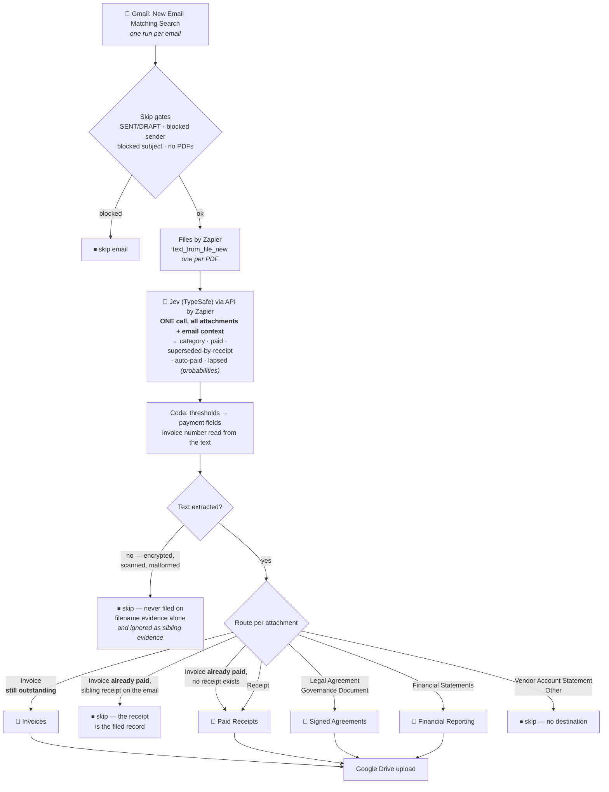

# Gmail Attachments → Google Drive by Type

Durable workflow (trigger **`search`** — "New Email Matching Search" — `GoogleMailV2CLIAPI@2.14.0`)
that classifies every PDF attached to an incoming email and files each into the right Google
Drive folder. Migrated from the classic multi-step Zap *"Gmail Attachments to Google Drive by
Type"* (Gmail trigger → filters → Files by Zapier → AI classifier → Paths → four Drive uploads).

> **The Invoices folder is for bills that still need paying.** Everything below about payment
> detection exists to keep already-settled invoices out of it. A settled invoice is not
> dropped, though: **when no actual receipt exists, the paid invoice is treated as the
> receipt** and filed to Paid Receipts — it is the only record of the payment. Only when the
> same email carries a real receipt does the invoice skip, since the receipt is the filed
> record and the invoice would duplicate it.

## What it does

1. **Trigger** — Gmail *New Email Matching Search*, one run per **email** (not per attachment).
   The search query pre-filters; see [Trigger query](#trigger-query).
2. **Skip gates** (plain code, no task cost) — drop the email entirely if it carries a `SENT`
   or `DRAFT` label, comes from a blocked sender, matches a blocked subject phrase, or has no
   PDF attachments. Carried over from the classic Zap's "A bunch of filters" step.
3. **Extract text** — one Files by Zapier `text_from_file_new` call per PDF. A PDF that won't
   convert yields empty text rather than failing the run; the classifier still gets its
   filename and the surrounding email, but the attachment is **never filed** — see
   [Nothing is filed on evidence we couldn't read](#nothing-is-filed-on-evidence-we-couldnt-read).
   Also [Unconvertible PDFs](#unconvertible-pdfs-and-the-checkpoint-trap): "won't convert" does
   **not** always mean "raises an error".
4. **Classify — a single Jev call for the whole email.** Sender, subject, date and body, plus
   every attachment's filename and extracted text, go to **Jev**, TypeSafe's classification
   model, as typed questions: one category choice and four yes/no payment signals per attachment.
   It answers with probabilities, and code turns them into the fields routing needs — see
   [Classifier](#classifier). The invoice number used to pair an invoice with its receipt is read
   from the text by code, not by the model.
5. **Route** — each attachment is filed, or skipped, per [Routing](#routing).
6. **Upload** — Google Drive `file` upload into the destination folder.


```mermaid
flowchart TD
    T["📧 Gmail: New Email Matching Search<br/><i>one run per email</i>"] --> G{"Skip gates<br/>SENT/DRAFT · blocked sender<br/>blocked subject · no PDFs"}
    G -- blocked --> X["⏹ skip email"]
    G -- ok --> E["Files by Zapier<br/>text_from_file_new<br/><i>one per PDF</i>"]
    E --> AI["🤖 Jev (TypeSafe) via API by Zapier<br/><b>ONE call, all attachments + email context</b><br/>→ category · paid · superseded-by-receipt<br/>· auto-paid · lapsed <i>(probabilities)</i>"]
    AI --> N["Code: thresholds → payment fields<br/>invoice number read from the text"]
    N --> RD{"Text extracted?"}
    RD -- "no — encrypted,<br/>scanned, malformed" --> S0["⏹ skip — never filed on<br/>filename evidence alone<br/><i>and ignored as sibling evidence</i>"]
    RD -- yes --> R{"Route per attachment"}

    R -- "Invoice<br/><b>still outstanding</b>" --> INV["📁 Invoices"]
    R -- "Invoice <b>already paid</b>,<br/>sibling receipt on the email" --> S1["⏹ skip — the receipt<br/>is the filed record"]
    R -- "Invoice <b>already paid</b>,<br/>no receipt exists" --> REC
    R -- Receipt --> REC["📁 Paid Receipts"]
    R -- "Legal Agreement<br/>Governance Document" --> AGR["📁 Signed Agreements"]
    R -- "Financial Statements" --> FIN["📁 Financial Reporting"]
    R -- "Vendor Account Statement<br/>Other" --> S2["⏹ skip — no destination"]

    INV --> U["Google Drive upload"]
    REC --> U
    AGR --> U
    FIN --> U
```

## Why per-email, not per-attachment

The classic Zap used Gmail's **New Attachment** trigger, which fires **once per attachment**.
Each PDF was therefore classified with no knowledge of its siblings — and that makes the SaaS
case unsolvable.

A card-billed vendor sends **one email carrying both the invoice and its receipt**. Read on its
own, the invoice looks unpaid. Real example from this mailbox — Anthropic,
*"Your receipt from Anthropic, PBC #2215-5909-1740"*:

| Attachment | What it says |
| --- | --- |
| `Invoice-YIGHXGH9-0005.pdf` | "S$133.58 **due** July 25, 2026" · "Pay online" · payment address. **No paid marker anywhere.** |
| `Receipt-2215-5909-1740.pdf` | "**Date paid** July 25, 2026" · "Amount paid S$133.58" · "Visa - 3612" · **`Invoice number YIGHXGH9-0005`** |

The invoice's only evidence of settlement is the *other attachment* — and the receipt quotes the
invoice number it settles, so the two can be joined deterministically. Triggering per email puts
both PDFs in front of the classifier in one call, which is what makes the skip possible.

It is also cheaper: **one AI call per email** instead of one per attachment.

## Payment detection

For every attachment classified `Invoice`, five independent signals are checked, strongest
first, so the reason recorded in the run output names the actual evidence:

Only attachments whose text was actually extracted take part — see
[Nothing is filed on evidence we couldn't read](#nothing-is-filed-on-evidence-we-couldnt-read).

| # | Signal | Outcome |
| --- | --- | --- |
| 1 | A **`Receipt`** on this same email quotes the **same invoice number** (normalised: non-alphanumerics stripped, uppercased, ≥4 chars) | **skip** — `a receipt on this email settles invoice <n>` |
| 2 | The classifier set **Superseded By Receipt = Yes** — it matched a sibling receipt on vendor + amount + date when no invoice number was available | **skip** — `classifier matched a receipt on this email to this invoice` |
| 3 | The classifier set **Auto-Paid By Recurring Charge = Yes** *and* a `Vendor Account Statement` is attached — see [Recurring auto-charge](#recurring-auto-charge-no-receipt-exists) | **filed → Paid Receipts** (or skip, if a receipt is also attached) |
| 4 | **Paid markers on the invoice itself** — amount due zero, "Paid", "Date paid", card last-four, a settled payment-history row | **filed → Paid Receipts** (or skip, if a receipt is also attached) |
| 5 | The email carries **any** paid receipt and more than one attachment (weakest; last resort) | **skip** — `this email also carries a paid receipt` |

Signals 1, 2 and 5 all mean an actual receipt is on the email; that receipt files to Paid
Receipts and the invoice skips as a duplicate. Signals 3 and 4 are the invoice's **own**
evidence of settlement — no receipt exists in those shapes, so **the paid invoice is the
receipt** and files to Paid Receipts with the reason
`paid invoice — <evidence>; no receipt on this email, so the invoice is the record of payment`.
If a readable receipt happens to be attached anyway, the invoice skips with
`already paid — <evidence>; the receipt on this email is the filed record`.

Signal 1 collects invoice numbers **from receipts only**, so an invoice can never mark itself
settled. Signals 2 and 3 are each gated in code on the corresponding document actually being
attached — a `Receipt` for signal 2, a `Vendor Account Statement` for signal 3 — not on the
model's say-so alone. That guard is load-bearing: on SimplePay the model reported
`Superseded By Receipt = Yes` when the only sibling was a statement, which reached the right
verdict by the wrong route and logged evidence that did not exist.

### Recurring auto-charge (no receipt exists)

A second auto-payment shape, and unlike the Anthropic case it produces **no receipt at all**.

SimplePay emails a monthly invoice together with an account statement, where the statement is
generated the moment the invoice is issued — *before* that month's card charge posts. Read
literally, the invoice is unpaid and the statement agrees. The evidence is the history above
that line:

```
2026-06-19  Invoice #1126613   $12.00   $12.00
2026-06-19  Card Payment      -$12.00    $0.00     ← 16 prior months, all identical
2026-07-19  Invoice #1148057   $12.00   $12.00     ← this month, charge not yet posted
2026-07-19  CLOSING BALANCE             $12.00
```

…reinforced by the email body: *"We have these payment options available: 1. Monthly card
payment (the default)."*

The prompt sets `Auto-Paid By Recurring Charge = Yes` only when **all five** hold: a sibling
statement for the same vendor/account; **≥3 prior invoices** each cleared to zero; those
settling payments posting **same-day or within one day**; the invoice in question being the
**newest and only outstanding** line; and no sign the arrangement has lapsed (dunning, overdue
warning, failed payment, payment-method change). A vendor that merely *offers* card payment,
with no statement history proving it is in use, does not qualify.

### The old "due date == invoice date" filter is gone

The classic Zap dropped any invoice whose due date equalled its issue date, as a proxy for
"billed to a card, already paid". That has been removed deliberately. Due-on-receipt terms are
common on invoices that are **genuinely unpaid**, and silently discarding them means a real bill
is never seen. Payment is now established from evidence, not date arithmetic.

The bias is stated in the prompt: filing an already-paid invoice is a small annoyance, skipping
an unpaid one is a missed bill — so when the model can't tell, it errs toward filing.

## Routing

| Category | Destination | Folder ID |
| --- | --- | --- |
| Invoice *(outstanding)* | Invoices | `14RpcjSzye4BVZPS_1OzspabmQzDwFVRE` |
| Invoice *(paid, no sibling receipt)* | Paid Receipts | `1te8aN26Kl5PVH3qY1bXrw9vzX3CfsQwC` |
| Invoice *(paid, sibling receipt attached)* | *(none — the receipt is the filed record)* | — |
| Receipt | Paid Receipts | `1te8aN26Kl5PVH3qY1bXrw9vzX3CfsQwC` |
| Legal Agreement | Signed Agreements | `1-1HCfTIdnngXv_1fhUHuPpjI6Nupk7-K` |
| Governance Document | Signed Agreements | `1-1HCfTIdnngXv_1fhUHuPpjI6Nupk7-K` |
| Financial Statements | Financial Reporting | `1t719k98AHrfMVgcrSNOx9REIvnsL8_Bo` |
| Vendor Account Statement | *(none — classified, never filed)* | — |
| Other | *(none)* | — |

`Vendor Account Statement` has no destination. That matches the classic Zap, which offered it as
a category but had no Path for it. It is still classified so the run output shows what was seen
and skipped — change `CATEGORY_FOLDERS` in `workflow.ts` to start filing it.

### Nothing is filed on evidence we couldn't read

**An attachment whose text could not be extracted is never uploaded**, whatever it classifies as.
Encrypted, scanned, malformed, or converted to genuinely empty text — all of them stop at
`textExtracted: false`, and the run output records
`no text could be extracted — not filed on filename and email evidence alone`, with the
underlying cause in `textExtractionError`.

Such an attachment is still classified, so run history shows what the document probably was, and
there is no extra cost in doing so: the classifier call is one per **email**, so a readable
sibling pays for it anyway.

The reason is that classifying a document you cannot read is a guess off its filename and the
email around it. A wrong guess puts a file in a folder somebody then has to notice and undo — and
in the Invoices folder specifically, a guessed invoice is indistinguishable from a real bill.

**Unreadable attachments are also excluded from the sibling-evidence signals** in
[Payment detection](#payment-detection). An unreadable attachment guessed to be a `Receipt` from
its filename must not be able to suppress a genuine outstanding invoice — that is the expensive
direction of the bias this workflow is built around. Signals 1–3 and 5 therefore only consider
siblings that were actually read.

> **The trade-off, stated plainly.** A real unpaid bill that happens to arrive as a scan or an
> encrypted PDF will **not** reach the Invoices folder — it stays in Gmail only. That is the
> deliberate choice: its classification would have been guesswork either way, and a folder that
> silently accumulates guesses is worse than one with a known gap. If this starts biting, the
> place to fix it is OCR on the extraction step, not by relaxing this rule.

## Trigger query

```
has:attachment filename:pdf -in:sent -in:drafts -in:chats -in:trash -in:spam -from:no-reply.1tdl9c@zapiermail.com
```

This narrows what Gmail polls. It is **not** the authoritative filter — Gmail's phrase matching
is fuzzy, so every exclusion is re-checked in code (`BLOCKED_SENDERS`, `BLOCKED_SUBJECTS`,
`BLOCKED_LABELS` in `workflow.ts`). The trigger fires on all folders including sent mail unless
excluded, hence `-in:sent -in:drafts`.

Blocked subject phrases, carried over from the classic Zap:

- `your monthly aspire account statement`
- `from company flow` — **our own outgoing invoices**, which Xero copies to us. Accounts
  receivable, not bills to pay.
- `your trade statement for assets`
- `your monthly statement for assets` — the other Wise Assets statement. Password-protected
  (the password is our UEN), so nothing can be extracted from it, and as a vendor account
  statement it has no destination folder. Added alongside the fix in
  [Unconvertible PDFs](#unconvertible-pdfs-and-the-checkpoint-trap); it saves the AI task, it
  is **not** what stops the failure.

## Unconvertible PDFs and the checkpoint trap

**Files by Zapier does not always raise on a PDF it cannot convert.** With
`failOnConversionError: false` — which this workflow passes, so one bad attachment can't kill an
email — an encrypted PDF comes back **as its own raw bytes decoded as text**, with a `200`.

Wise's *"Your monthly statement for Assets"* is password-protected, and its "extracted text" was
128 KB starting `%PDF-1.6`, ~38% U+FFFD replacement characters and ~10% control characters,
including **101 NULs**.

That is what broke the workflow on 2026-08-07 (`ZAP-26`), and the failure mode is worth knowing
because nothing in the workflow's own error handling can catch it:

> Every value a `ctx.step` returns is checkpointed to PostgreSQL as JSON, and Postgres rejects a
> JSON string containing **U+0000** with SQLSTATE **`22P05`** — *unsupported Unicode escape
> sequence*. The checkpoint happens **after** the step function returns, so the step's own
> `try`/`catch` never sees it. The step is retried 5 times, the return value is byte-identical
> every time, so all 5 checkpoints fail identically and the run dies as
> `StepExhaustedError: Step "extract-text-0" exhausted all retry attempts`.

The error names text extraction, but text extraction succeeded. Two guards in `workflow.ts` fix
it, both applied **before the step returns**:

| Guard | What it does |
| --- | --- |
| `looksLikeRawFileBytes()` | Recognises undecoded file bytes — a `%PDF-`/`PK`/`PNG` magic-number header, >2% control characters, or >5% U+FFFD in the first 4 KB — and takes the existing empty-text path with `ok: false`. Genuine extracted text carries essentially none of either marker. |
| `stripUncheckpointableChars()` | Belt and braces: removes NUL and the other C0 controls (tab, newline and carriage return kept) plus lone surrogates from whatever does leave the step, error messages included. No PDF can hit `22P05` again. |

Verified against the real payload: `extract-text-0` now **completes** instead of exhausting,
`textExtracted: false`, and the statement classifies as `Vendor Account Statement` → skipped.

> **This is not specific to this Zap.** Any durable that returns extracted document text, scraped
> HTML or upstream API text from a `ctx.step` can hit `22P05` the same way. The triage ticket read
> the failure as a platform bug in `@zapier/zapier-durable@0.10.1` and blamed zero-width
> non-joiners (U+200C) in the email body — neither holds up. U+200C is perfectly legal in Postgres
> JSON, and the email body travels in the workflow *input*, which had already checkpointed fine
> before the step ran. The framework arguably should scrub NULs, but the workflow put them there.

## Classifier

The classifier is **Jev** (`jev-latest`, `jev-1.13.0` when this was verified), TypeSafe's
"System One" model, called through Zapier's authenticated fetch with the `typesafe` connection
(an *API by Zapier* connection holding the TypeSafe API key as a Bearer token). Jev does not
write text: it answers typed questions with calibrated probabilities. That makes it a different
shape of step from the AI by Zapier prompt it replaced on 2026-10-02:

| | AI by Zapier `standard/auto` (before) | Jev (now) |
| --- | --- | --- |
| Cost per email | 1 Zapier task | 1 Zapier task (the authenticated call to Jev), plus ~$0.0001 of TypeSafe usage billed by TypeSafe |
| Latency, real emails | 7.7s median, 22.9s p90, 76s worst | 1.5s median, 2.3s p90, 2.5s worst |
| Output | category, payment flags, vendor, amount, currency, dates, evidence, justification | category and payment flags, each with a probability |

**What was given up.** Vendor, amount, currency, invoice and due dates, payment evidence and the
justification text are no longer in the run output. Nothing consumed them: files upload under
their original names, and the folders' own workflows ([`drive-paid-receipts-to-table`](../drive-paid-receipts-to-table/),
[`drive-invoice-to-xero`](../drive-invoice-to-xero/), [`drive-signed-agreement-to-notion`](../drive-signed-agreement-to-notion/))
each run their own extraction on the filed PDF. In their place, each attachment's output carries
`signals` — Jev's raw probabilities — so a surprising decision can be read straight off the run.

**The questions, per attachment** (`jevQuestions` in `workflow.ts`, addressed as `attachments[i]`):

| Question id | Type | Asks | Feeds |
| --- | --- | --- | --- |
| `category_i` | Choice over the 7 categories | which kind of document this is, from workFlowers' side | `category` |
| `paid_i` | Noul | does the document itself show the payment completed | `paymentStatus` (≥ 0.5 → `Paid`; a `Receipt` is always `Paid`) |
| `superseded_i` | Noul | is a different attachment the receipt for this transaction | `supersededByReceipt` (Invoice only) |
| `autopaid_i` | Noul | is a sibling statement proving same-day auto-charges on ≥3 prior invoices | `autoPaidByRecurringCharge` (Invoice only) |
| `lapsed_i` | Noul | any sign the auto-charge has lapsed (dunning, failed payment…) | vetoes `autoPaidByRecurringCharge` |

The category definitions (`CATEGORY_CRITERIA`) carry the rules the old prompt spelled out, plus
one learned in testing: **money coming in to us is `Other`**. The first offline run filed a
Notion remittance advice and a Citibank incoming-payment advice as receipts, a Slack credit note
as an invoice and AppleCare+ terms as a signed agreement; saying so explicitly in the
definitions fixed all four with no regressions.

The **invoice number** is found by a regex in `invoiceNumberFromText` (`Invoice number X`,
`Invoice #X`, `Invoice No: X`, bare `INV-0083`), never by the model, because signal 1 is a
verbatim join between an invoice and its receipt. Table-layout PDFs extract the label and value
apart, so it takes the first nearby token with a digit that isn't a date. On the 48-email set it
matched the old AI's number on 30 of 31 invoices and receipts, including **all 13 that arrived
in pairs** — the only case routing uses it. The miss is NUS's goods-received note, labelled
*Receipt Number*, which Jev classifies as `Other` anyway.

**Limits.** Jev accepts about 32k tokens of state, so the email's attachments share an 80,000
character text budget (`MAX_TOTAL_TEXT_CHARS`) on top of the 20,000 per-PDF cap. Text only — it
never sees the PDF itself, which was already true of the old step. A `429` or `5xx` from
TypeSafe retries the step; any other non-200 fails the run with TypeSafe's own message.
`jev-latest` moves when TypeSafe ships a new release; every run logs the model that answered.

**Re-run the offline comparison before changing a threshold or a definition** — see
[Verified behaviour](#verified-behaviour).

## Verified behaviour

**Jev, offline, on real mail (2026-10-02).** The 48 most recent emails this workflow
classified (59 PDFs) were re-run from their saved run records: the same email context and
extracted text, through the real `decide()`. Production's answers were replayed from the same
records, so no AI by Zapier calls were made and nothing was uploaded.

| | Same filing outcome as production | Wrong, on reading the document |
| --- | --- | --- |
| AI by Zapier `standard/auto` (production) | — | 1 |
| Jev, final definitions | 58 / 59 | 0 |

The one disagreement is NUS's SAP *Goods Receipt* `RC523374`: NUS acknowledging that it
received *our* work, which production filed to Paid Receipts and Jev classifies as `Other`
(0.88). The figure is optimistic in one respect — the category definitions were tightened on
these same 48 emails — so the first weeks of live runs are the real holdout. Only one email
(SimplePay) exercises the recurring auto-charge rule.

A private `run-durable` of the published shape against two real payloads confirmed the
`typesafe` connection works inside the durable runtime (Jev step ≈ 0.8s); the payloads'
attachment links had expired, so those runs exercised the unreadable-attachment path.

**Before the switch to Jev**, the AI by Zapier classifier was run against real mail:

| Email | Attachment | Outcome |
| --- | --- | --- |
| Vanta `#86736448-0002` | `Invoice-86736448-0002.pdf` — $18,178.94 due | **filed → Invoices** (correctly kept) |
| NinjaPear `NP-2026-3DF070` | `Invoice-NP-2026-3DF070.pdf` — "AMOUNT DUE USD 0.00" | **filed → Paid Receipts** (reclassified despite the filename) |
| Aspire, Google Workspace June/July | `GISG-…-Paid.pdf` — "Invoice Status : Paid" | **filed → Paid Receipts** — paid markers, no receipt exists, so the invoice is the record. *(Skipped outright before 2026-08-10; the paid-invoice-is-the-receipt rule changed that.)* |
| Anthropic `#2215-5909-1740` | invoice + receipt pair | invoice **skipped** (the receipt is the filed record), receipt **filed → Paid Receipts** |
| Xero `INV-0081 from Company Flow` | `Invoice INV-0081.pdf` | **email skipped** — blocked subject |
| SimplePay, July + March | `Invoice …pdf` + `Statement …pdf` | invoice **filed → Paid Receipts** (recurring auto-charge, 16 / 12 priors; no receipt exists — *skipped outright before 2026-08-10*), statement skipped |
| Wise `Your monthly statement for Assets` | `Monthly_Statement.pdf` — password-protected | **email skipped** — blocked subject. With the subject unblocked, `extract-text-0` completes, `textExtracted: false`, `textExtractionError` names the conversion failure, and the attachment is **skipped as unreadable** rather than filed. Both paths re-run against the real 2026-08-07 payload. |

The routing rules are also covered by offline assertions over the real `decide()` and the Jev
answer mapping — [`decide.test.mjs`](decide.test.mjs), run with `npm test` (41 assertions; no
network, no credentials). They cover every case above, the unreadable-attachment rule, the
guarantee that an unreadable sibling cannot suppress a readable outstanding invoice, the
paid-invoice-is-the-receipt routing in both directions, and how Jev's probabilities become the
payment fields (including that a missing answer skips rather than guesses).

## Maintainer notes

- **Connections.** Two are bound in code: `gdrive` (Google Drive) and `typesafe` (API by
  Zapier, `02c36cbc-669d-8c82-9c72-7b7813e5cde0`, titled *Jev*, holding the TypeSafe API key).
  The Gmail credential lives on the *trigger* (`authentication_id` in the publish `--trigger`
  payload), and Files by Zapier runs on built-in credentials.
- **Caps.** `MAX_ATTACHMENTS = 10` per email, `MAX_TEXT_CHARS = 20000` per PDF,
  `MAX_TOTAL_TEXT_CHARS = 80000` per email (Jev's input limit), `MAX_BODY_CHARS = 2000`. Overflow attachments are **not** silently dropped — they are logged
  and listed in the run output as `attachmentsSkippedOverCap`.
- **No dedupe store.** Gmail's polling trigger dedupes on message ID, so an email is processed
  once. Re-running the same payload manually *will* upload duplicates to Drive.
- **Never return unscrubbed upstream text from a `ctx.step`.** A single NUL in a checkpointed
  value fails the run with `StepExhaustedError` naming a step that worked fine — see
  [Unconvertible PDFs](#unconvertible-pdfs-and-the-checkpoint-trap).
- **Why a text-extraction step.** Jev takes text only. (The AI by Zapier step it replaced could
  not read the attachments directly either: Gmail serves attachment URLs from S3 as
  `application/octet-stream`, which `get_completion` and `extract_content` both reject.)
- **Retiring the classic Zap.** *"Gmail Attachments to Google Drive by Type"* already has every
  node after the trigger paused. Turn it off entirely once this workflow has run for a few days.
