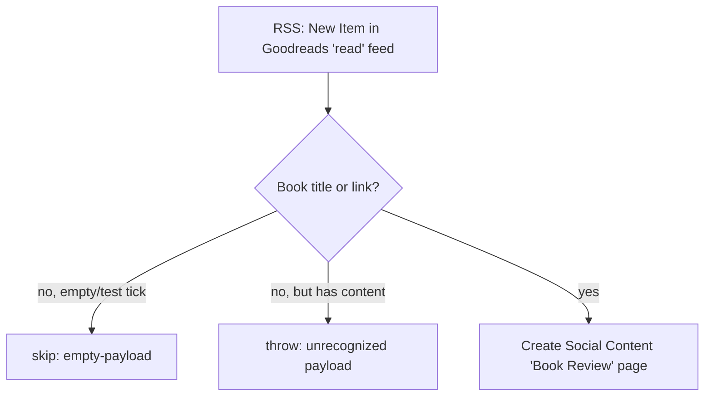

# goodreads-reviews-to-notion

Migrated from the classic two-step Zap **"Log Book Reviews in Notion"**.

When a book lands on Dennis's Goodreads **"read"** shelf, its RSS feed emits a new item and this durable creates a **"Book Review"** idea in the work.flowers Notion **Social Content** data source — a finished book becomes a LinkedIn content idea.

## Trigger

- **RSS by Zapier — "New Item in Feed"** (`RSSCLIAPI@1.1.0` / `new_feed`), a polling trigger with no auth.
- `params.url` is the Goodreads read-shelf RSS feed; `trigger_style: "smart"` (the classic Zap's setting).
- The feed **guid dedups new items at the trigger**, so each finished book fires exactly once — no dedup ledger is needed.

## What it writes

A Social Content page:

| Property | Value |
| --- | --- |
| Name (title) | `Book Review: <title> by <author>` (the `by <author>` clause is dropped if the feed omits the author) |
| Type (select) | `Book Review` |
| Channel (multi-select) | `LI@dchiuten` |
| Author (people) | Dennis |

Page creation uses `template_mode: "default"` (repo rule 5); the Social Content data source has no default template today, so the create falls back to no-template.

## Flow

## Maintenance notes

- **No dedup ledger by design** — the RSS trigger delivers each guid once. Default posture otherwise: idempotent-ish write, accept the rare duplicate a whole-run replay could produce (acceptable for a low-volume personal feed).
- **Unrecognized-payload posture: throw** (repo default). A payload with real content but no extractable book title or link is treated as a feed schema change and raises. An empty/test tick skips silently.
- **Feed URL is a per-user Goodreads RSS token** stored in `zap.json` `trigger.params.url` (required for the trigger to fire). It grants read-only access to the shelf; rotate it in Goodreads if it needs revoking.
