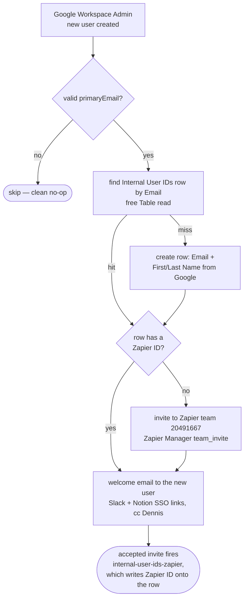

# New Google Workspace User → Provision Standard Accounts

Durable port of the classic Zap **"New Google Workspace Account -> Provision
Standard Accounts"**. When a new user is created in Google Workspace
(the identity source for the team), this workflow:

1. **Find-or-creates their row in the "Internal User IDs" Zapier Table**
   (`01JM3J9SG5X6S8GBSSC8AS28AT`), keyed on lowercased `Email` — the same key
   every [`internal-user-ids-*`](../internal-user-ids-to-table-and-notion/)
   durable matches on. On create it also seeds `First Name` / `Last Name`
   from the Google payload (an improvement over the classic Zap, which set
   Email only; Google Workspace *is* the identity source, so its names are
   authoritative). Existing rows are never modified.
2. **Invites them to the work.flowers Zapier team** (`20491667`, Zapier
   Manager `team_invite`) — but only when the row's `Zapier ID` is empty.
   When they accept, the live `internal-user-ids-zapier` durable (Zapier
   Manager `team_member` trigger) writes the `Zapier ID` back onto this same
   row, which is what makes the guard idempotent across re-runs.
3. **Sends the welcome email** (Email by Zapier, unconditional, cc Dennis)
   pointing at the Slack and Notion **SSO join links**. The links are the
   mechanism, not a placeholder: neither workspace can be joined by API on
   our plans (Slack's workspace-invite action is hidden/legacy-token-only;
   Notion has no member-creation API outside Enterprise SCIM).

**Trigger:** Google Workspace Admin `list_users` (polling — fires per new
user). No trigger params; connection `Google Workspace Admin
dennis@work.flowers` (`02a62089-aec4-80bd-859f-f24f89b65429`).

## Interdependencies

- **The Table row is the anchor of the internal identity map.** The five
  `internal-user-ids-*` durables (Slack / Harvest / Linear / Notion / Zapier)
  find-or-create on the same lowercased `Email` column and fill in their
  system's ID as the person joins each tool, then mirror onto Notion People.
  This workflow usually creates the row *first* (the Google account exists
  before any downstream tool), so their find-or-creates land on it instead of
  minting duplicates.
- **`Zapier ID` (f7) is both read here and written elsewhere**: this workflow
  reads it to decide whether to invite; `internal-user-ids-zapier` writes it
  when the invite is accepted. Rare race: if the invite is accepted and
  recorded between this workflow's read and a replay, a second invite to an
  existing member is a harmless no-op on Zapier's side.

## Provisioning coverage of the other internal systems

Audited 2026-08-14 while migrating (the classic Zap only covered Zapier +
the SSO email):

| System | API provisioning possible? | Current mechanism |
| --- | --- | --- |
| Zapier | ✅ `ZapierManagerCLIAPI` `team_invite` | **This workflow** |
| Slack | ⚠️ Only via hidden legacy-token action (`slack_invite`) or Enterprise admin API | SSO join link in the email |
| Notion | ❌ No member-creation API (Enterprise SCIM only) | SSO link in the email |
| Harvest | 🔶 Possible: Harvest API v2 `POST /v2/users` sends an invite; the Zapier app has no create-user action, so it would need the `_zap_raw_request` route | Manual invite from Harvest |
| Linear | 🔶 Possible: GraphQL has an org-invite mutation; not exposed by the Zapier Linear app | Manual invite from Linear |
| SimplePay | ❌ Practical no: employee creation needs payroll data (ID, bank, salary) not present in the Google payload | Manual payroll onboarding |

The Harvest and Linear invites would ride the existing `email` + name from
the trigger payload, but **Dennis explicitly deferred them (2026-08-14)** —
keep those invites manual unless that decision changes.

## Cutover — complete (2026-08-14)

Published disabled on 2026-08-14 (the classic Zap was still live, and
running both would have doubled the welcome email and invite). Dennis
disabled the classic "New Google Workspace Account -> Provision Standard
Accounts" Zap in the UI and enabled this workflow the same day; verified via
`get-workflow` (`enabled: true`, trigger `active`). This durable is now the
only provisioning flow.

## Maintainer notes

- **Tested 2026-08-14** via `run-durable` with Dennis's real payload: row
  found, invite correctly skipped (his `Zapier ID` is set), welcome email
  delivered. The invite branch is untested against a live invite (it would
  send a real one); it is a single `team_invite` call with two fields.
- The welcome email body is the classic Zap's, verbatim (HTML ` `s and
  all). If the Slack/Notion join links rot, this file and `workflow.ts` are
  where they live.
- No `zod` dependency — input validation is hand-rolled (`normalizeInput` +
  guards), same pattern as the internal-user-ids durables.
