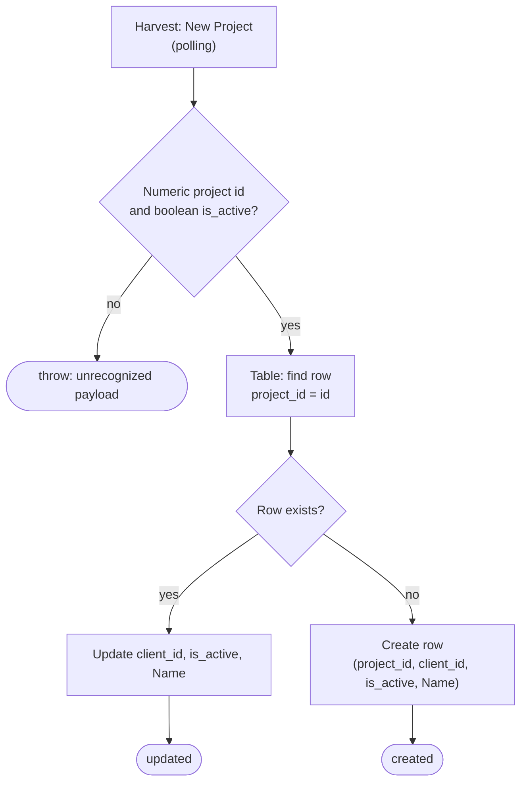

# harvest-new-project-to-zapier-table

When a project is created in Harvest, this Zap adds it to the **Harvest Projects (New)** Zapier Table (`01K8A2KV9X1W95GAB6Y69D7G4C`). It writes `project_id`, `client_id`, `is_active` and `Name`.

The Table is what [`start-a-timer-from-notion-task`](../start-a-timer-from-notion-task/) reads to decide which Harvest project a Notion task bills to. That lookup goes through the `Project Page ID` column. This Zap never writes that column: someone fills it in by hand, and a new row starts with it empty.

Its companion [`harvest-project-status-to-zapier-table`](../harvest-project-status-to-zapier-table/) keeps `is_active` current after the row exists.

**Status:** ⏳ Pending first publish, which happens on merge and enables the workflow. This Zap replaces the classic Zap **Add Harvest Project to Zapier Table**.

## What it does

## Trigger

The trigger is `HarvestCLIAPI@1.0.14` `new_project`, a polling trigger that authenticates with the work.flowers Harvest connection. It is a "new" trigger that delivers each project id once, so the durable polling-dedupe bug described in `CLAUDE.md` does not affect it.

The payload shape comes from the classic Zap's field mappings (`record_id`, `client.id`, `is_active`, `name`). A manual `run-action … read new_project` returns an empty list, so the shape could not be sampled directly. The code also accepts the plain Harvest API shape (`id`, `client_id`).

## Maintainer notes

- **It upserts rather than creates.** The classic Zap created a row blindly. This Zap looks up `project_id` first and updates the row if it finds one, so a replay, or a trigger that delivers existing projects again, cannot create a duplicate.
- **`update_record` leaves omitted columns alone.** `Project Page ID` is never passed, so it survives an update. This was verified on 2026-09-30 against a row whose page id was set.
- **A payload it can't read throws.** A polling trigger never sends an empty ping, so an unreadable record means Harvest's payload shape has changed.
- **The Table has 6 rows Harvest no longer lists**, for projects deleted in Harvest. Nothing removes them, and the timer lookups are unaffected.

## Verified cases

These ran through `run-durable` against the live runner on 2026-09-30:

| Input | Outcome |
| --- | --- |
| `{}`, `{"foo":1}` | throws `Unrecognized Harvest project payload` |
| Knoxx Foods project `48185265` (row exists) | `updated`. The row was rewritten with the same values, and it is still the only row for that project |
| Noah Health project `48549719` (row exists, `Project Page ID` set) | `updated`, and `Project Page ID` was unchanged |

The **create** path has not run, because running it adds a real row. The first new Harvest project will exercise it.
