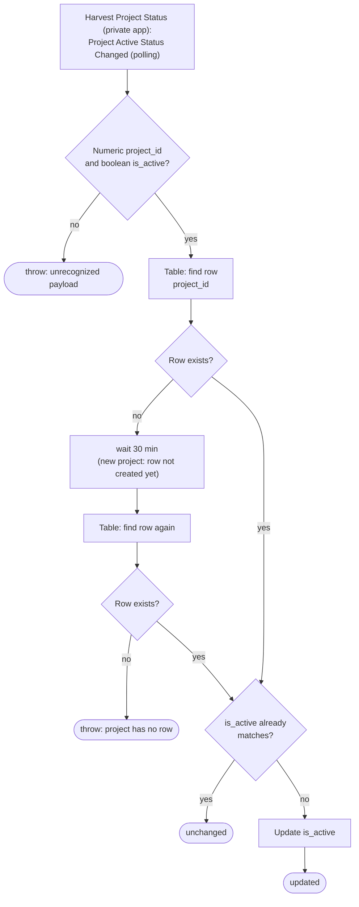

# harvest-project-status-to-zapier-table

When a Harvest project is activated or deactivated, this Zap updates the project's `is_active` value in the **Harvest Projects (New)** Zapier Table (`01K8A2KV9X1W95GAB6Y69D7G4C`).

[`start-a-timer-from-notion-task`](../start-a-timer-from-notion-task/) only books time against rows where `is_active = true`. Rows are created by [`harvest-new-project-to-zapier-table`](../harvest-new-project-to-zapier-table/). This Zap writes nothing but `is_active`.

**Status:** ⏳ Pending first publish, which happens on merge and enables the workflow. It replaces the classic Zap **Update Harvest Project Status**.

## What it does

## Trigger

The trigger is `App237841CLIAPI@1.0.0` `project_active_status_changed`. It comes from the private **Harvest Project Status** app, whose source is in `~/Repos/work-flowers/zapier/integrations/zapier-harvest/triggers/projectActiveStatusChanged.js`. Every poll returns all projects, each with the dedupe id `{project_id}-{is_active}`. A status flip changes that id, so Zapier sees the project as a new item.

**Known gap, kept on purpose to match the classic Zap:** Zapier never delivers the same dedupe id twice. So a project that goes active → inactive → active again does **not** fire on the second activation, because `X-true` was already delivered once. In practice this means a reactivated project stays `is_active = false` in the Table until someone fixes the row by hand. The durable polling-dedupe bug in `CLAUDE.md` produces the same effect as classic dedupe here. It does not make things worse, and it does not fix the gap either.

## Maintainer notes

- **A brand-new project fires both triggers.** This Zap and the new-project Zap poll independently, so this one can arrive before the row exists. If no row is found, it waits 30 minutes (waits cost nothing), looks again, and **throws** if the row is still missing. A silent skip would leave the Table's status stale forever. The classic Zap did exactly that: it halted without an error.
- **It writes only when the value changed.** If the row already holds the new `is_active`, the run returns `unchanged` and writes nothing. This matters if the first poll after publishing delivers every project: that would be 44 runs, all no-ops.
- **A payload it can't read throws**, for the same reason as in the new-project Zap.

## Verified cases

These ran through `run-durable` against the live runner on 2026-09-30:

| Input | Outcome |
| --- | --- |
| `{"foo":1}` | throws `Unrecognized project status payload` |
| `{"id":"48185265-true","project_id":48185265,"is_active":true,…}` (the Knoxx project, already active in the Table) | `unchanged`, no write |

Two paths are **untested**:
- **Update** would flip a real project's status in the Table.
- **Wait-then-throw** takes 30 minutes.
