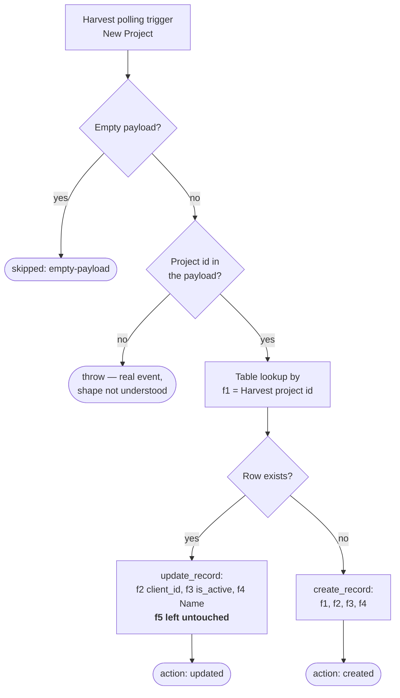

# harvest-project-to-zapier-table

New Harvest project → upsert its row in the **Harvest Projects (New)** Zapier Table, so every Harvest project is indexed by id.

**Status:** ✅ Enabled — the polling trigger is claimed and active; no cutover step needed.

Migration of the classic Zap **"Add Harvest Project to Zapier Table"**, disabled 2026-08-07.

## What it does

## Trigger

Polling — `HarvestCLIAPI@1.0.14` / `new_project`, on the Harvest connection. No catch URL, and none expected.

**Polling triggers never backfill.** Harvest projects that existed before this version was published will not be logged; the table was reconciled by hand instead (see below). The classic Zap's `polling_interval_override` was `0` (the default), so nothing was lost by durables not exposing an interval.

## Why it upserts instead of creating

Two Zaps write this table. [`notion-project-to-harvest-client-project`](../notion-project-to-harvest-client-project/) creates a row **with** `f5` (the Notion Project Page ID) the moment it creates a Harvest project; this Harvest poll then fires for that same project minutes later. The classic Zap blind-created, so it added a second row every time — **16 such duplicate pairs** were sitting in the table, 31 seconds apart.

Matching on `f1` fixes it at source: the poll now enriches the row the Notion side already wrote.

**The dedupe was a prerequisite, not tidying.** While two rows shared a `project_id`, `find_record` returned whichever came first — a test upsert for project `48549718` matched the *duplicate* rather than the row carrying the page id.

Two things make the upsert safe, both verified rather than assumed:

- **`update_record` leaves unlisted fields alone.** Checked on a scratch row: after updating only `f2`/`f3`/`f4`, both `f1` and `f5` survived. So `f5` — which belongs to the Notion side — is never clobbered.
- **`is_active` defaults to `true` when absent.** The classic Zap's `{{=gives[...]['is_active']}}` recorded `false` on all 16 duplicates, including projects whose Notion-side twin (written 30 seconds earlier) said `true`. An unresolved Zapier template coerces to `false`, and `false` is the dangerous direction: [`start-a-timer-from-notion-task`](../start-a-timer-from-notion-task/) gates on `f3 = true`, so a spurious `false` silently stops timers from starting. `readIsActive` honours only an explicit falsey value.

## Table reconciliation, 2026-08-07

A one-off cleanup done at migration time, approved after the consequence below was spelled out.

| | |
| --- | --- |
| Duplicate rows deleted | 16 (the copy without a Project Page ID, in every case) |
| `is_active` flips applied | 15 — **all `true` → `false`** |
| Result | 66 rows → 50, no duplicate `project_id`s, **0 rows disagreeing with Harvest** |

### ⚠️ The Notion Track Time button can no longer resolve a project

Only **3** Harvest projects are active — `48185265` DEAL-40 Knoxx, `47968437` DEAL-53 Terrascope, `46733152` DEAL-35 SCW — and **none of them is mapped to a Notion Projects page**.

`start-a-timer-from-notion-task` matches on `(f5, f3 = true)`. Before: 20 rows. After: 6 — and all 6 are junk:

- three carry a project **code** in `f1` instead of an id (`WF-10`, `WF-17`, `WF-20` — written by the classic Notion Zap's step 8, a bug the replacement doesn't have),
- two reference Harvest projects since deleted,
- one is a blank row.

So the table is now honest, and the Notion Track Time path can no longer resolve a project. That was the accepted trade: the previous 20 matches were all stale `true`s.

**In practice this removed an accidental capability, not a working one.** The time-entry mapping table (`01K5060J1B1FHCJEWVVH597B71`, 670 rows) shows **576 timers keyed to Linear and 4 ever keyed to a Notion task**, the most recent on 2026-05-21. The `WF-*` Harvest projects were not created until 2026-06-20, so those 4 predate the mapping and it has never once been exercised. The live path — last used 2026-08-05 — is Linear, and is untouched by any of this.

**Context, not a bug:** client delivery was tracked in Linear before a recent migration to Notion Projects, which is why the `WF-*` ids start where they do and why every one of them is archived in Harvest while time is billed to the `DEAL-*` retainers. That migration is still under review — Dennis is weighing reverting to Linear for issue tracking — so **don't re-plumb the Notion → Harvest mapping until that call is made.**

## Maintainer notes

- **Reading Tables results:** `find_record` keys the row `data` by **field id** (`f1`, `f5`); the CLI's `list-table-records` keys it by **field name** (`project_id`, `Project Page ID`). Mixing them yields `undefined` for every row with no error.
- **`delete-table-records` takes one bare id per call.** Passing several at once fails with a misleading `Record ID must be a valid ULID`.
- Harvest supplies the trigger only — the workflow body binds no connection, since Zapier Tables auth is automatic and costs no tasks.

## Verification

| Path | Status |
| --- | --- |
| Empty payload | ✅ run `019fda54-e446-7870-9c16-08fcf0eab041` |
| Upsert onto an existing row | ✅ run `019fda54-ef95-7120-8663-79ea078acfd9` → `action: "updated"` |
| `update_record` preserves `f1`/`f5` | ✅ scratch row `01KZD589DSFSND4TFH06F2Q7H8`, created → updated → read back → deleted |
| `tsc --strict --noEmit` | ✅ passes |
| **`create-project-row`** (no existing row) | ❌ never run |
| **A real `new_project` trigger delivery** | ❌ never observed |

The project-id key is still inferred from the classic Zap's output (`record_id`, with `id` / `project_id` as fallbacks) — no live trigger payload has been seen. **The first genuinely new Harvest project tests both.**
