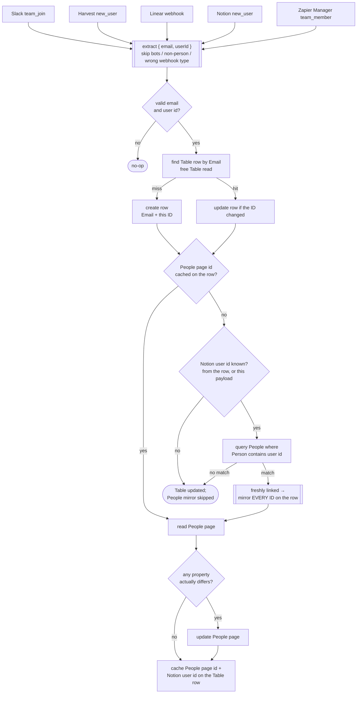

# Internal User IDs → Zapier Table + Notion People

Keeps the internal cross-system identity map in sync. One person, keyed on their
work email, gets a row in the **"User IDs" Zapier Table**
(`01JM3J9SG5X6S8GBSSC8AS28AT`) and — new in this durable — the same IDs mirrored
onto their row in Notion's native **People** data source
(`a0791b07-11ac-8364-9113-07ea21165718`).

Durable port of five classic Zaps, one per source system. All five were
`trigger → Table find-or-create → filter → Table update`; the Notion mirror is
added functionality.

| Deployed workflow | Trigger | Writes | Status |
|---|---|---|---|
| `internal-user-ids-slack` | `SlackCLIAPI@1.39.2` · `team_join` | Slack User ID | ✅ Live |
| `internal-user-ids-harvest` | `HarvestCLIAPI@1.0.14` · `new_user` | Harvest User ID | ✅ Live |
| `internal-user-ids-linear` | `WebHookCLIAPI@1.1.1` · `hook_v2` (Linear posts its own webhook) | Linear User ID | ⚠️ Waiting on Linear's webhook — see below |
| `internal-user-ids-notion` | `App233228CLIAPI@1.0.1` · `new_user` | Notion User ID | ✅ Live |
| `internal-user-ids-zapier` | `ZapierManagerCLIAPI@1.5.0` · `team_member` (team `20491667`) | Zapier ID | ✅ Live |

> ⚠️ **The Linear deployment has its own catch-hook and receives nothing until
> Linear is repointed at it.** Set **Linear → Settings → API → Webhooks** to:
>
> ```
> https://hooks.zapier.com/hooks/catch/20495893/CDYh6npEuajLK2eTK/
> ```
>
> Subscribe it to the **User** resource. Until then the classic "Add New Linear
> User ID" Zap still owns the Linear feed, so **leave that one enabled**.
>
> Two traps when looking this URL up again:
> - It is **not** at the top level of `get-workflow` — it lives at
>   `triggers[0].details.webhook_url`.
> - The `trigger_url` field is the durable's *internal* endpoint and rejects
>   unauthenticated POSTs (`Expected valid JWT in authorization header`). It is
>   not the webhook target.
>
> ```bash
> npx zapier-sdk-experimental get-workflow <workflow_id> --json \
>   | python3 -c "import json,sys;print(json.load(sys.stdin)['data']['triggers'][0]['details']['webhook_url'])"
> ```

## Files

One shared core, five thin entry files. Each deployment publishes exactly two
source files: its own entry renamed to `workflow.ts`, plus `sync.ts` verbatim.

| File | Role |
|---|---|
| `sync.ts` | All logic. Exports `defineUserIdSync(source)`. |
| `workflow.<source>.ts` | Five-line entry; published as `workflow.ts`. |

**Why not one self-detecting `workflow.ts`?** The durable `ctx` exposes no
workflow identity and the trigger payload arrives unwrapped, so the only runtime
discriminator would be payload shape — and Harvest's `new_user` and Zapier
Manager's `team_member` are both `{ id, email }`. Guessing wrong writes a Harvest
ID into the Zapier column, so each deployment states its source explicitly.

Entries import `./sync.ts` **with the extension** — the runner is Node ESM and
an extensionless specifier fails with `ERR_MODULE_NOT_FOUND`.

## What it does



### The join

Notion's People data source is **Notion-managed**: rows are workspace members
and guests, and the API refuses to create them. So this workflow only ever
*updates* People rows — repo rule 5 (apply the default template on create) has
nothing to apply to.

Matching is `Table.Notion User ID → People.Person`. Notion reserves `Email` as a
read-only built-in on the People collection (`people:email`), so an Email
property **cannot** be added to it — attempting to returns
`Cannot modify read-only property schema for people collection: people:email`.
The `Person` people-property is filterable by user id, which gives an exact
join without one.

The resolved page id is cached on the Table row as `Notion People Page ID`, so
the steady-state path is one free Table read and no Notion query.

### Self-healing backfill

The first time a person's People page is resolved, **every** ID already on their
Table row is pushed across, not just the triggering one. Someone who joined
Slack months before they were invited to Notion gets fully populated the moment
the Notion `new_user` event links them.

A person with no matching People row (contractors, service accounts, anyone not
in the Notion workspace) is a clean no-op on the Notion side — the Table is
still updated, and the link heals on a later run.

### Idempotency

The People page is read before it is written and skipped when nothing differs,
so replays and re-fires cost no Notion write. Every side effect sits in its own
`ctx.step`.

## Schema

Properties added to the Notion People data source for this workflow:
`Slack User ID`, `Linear User ID`, `Notion User ID` (all `rich_text`).
`Zapier User ID` and `Harvest User ID` already existed but were empty
workspace-wide.

Column added to the Zapier Table: `Notion People Page ID` (`f15`).

Column ↔ property mapping — note the one name mismatch:

| Table column | People property |
|---|---|
| `Slack User ID` | `Slack User ID` |
| `Harvest User ID` | `Harvest User ID` |
| `Linear User ID` | `Linear User ID` |
| `Notion User ID` | `Notion User ID` |
| **`Zapier ID`** | **`Zapier User ID`** |

`SimplePay Employee ID`, `Zapier Partner Contact ID`, `First Name`, `Last Name`
and `Active` live on the Table but have no source Zap and are not mirrored.

## Cutover

The durables were published **enabled**, alongside the still-running classic
Zaps. That overlap is safe: both write the same value from the same payload, and
the durable reads before it writes, so the second writer is a no-op. Polling
triggers set a watermark on activation rather than replaying history, so
enabling them did not backfire a queue of old members.

Remaining steps:

1. Repoint Linear's outgoing webhook (see the warning above), then disable the
   classic **Add New Linear User ID**.
2. Disable the other four classic Zaps in the Zapier UI: **Add New Slack User
   ID**, **Add New Harvest User ID**, **Add New Notion User ID**, **Update
   Zapier User ID**.

## Maintainer notes

- **Connection:** `notion_wf` → `02b73654-15c8-85c3-b16a-07304d2beb17`
  (`work.flowers | Dennis`). Never the Knoxx connection — see [CLAUDE.md](../CLAUDE.md).
- **Republish all five together** whenever `sync.ts` changes; they share it.
- **The Linear deployment has a webhook trigger**, so it has its own catch-hook
  URL. Linear's outgoing webhook must point at it — see `zap.json`.
- The one-time backfill that seeded the join (Table `Notion User ID` /
  `Notion People Page ID`, and the existing IDs onto the 9 matching People rows)
  used the `notion-worker-automations` token from 1Password, because the Notion
  MCP connector refuses the People data source
  (`This object is managed by Notion and isn't accessible via MCP`). The Zapier
  `NotionCLIAPI` connection *can* read and write it, which is what the workflow
  uses at runtime.
