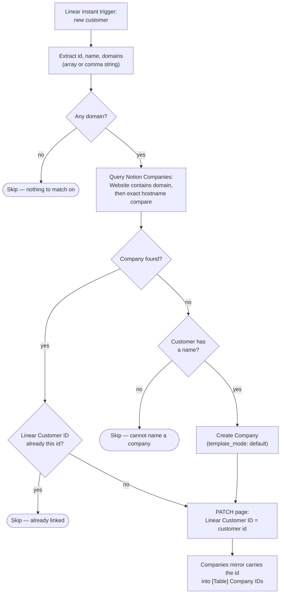
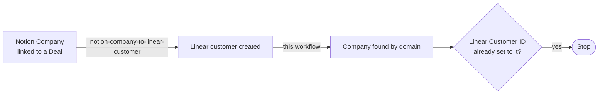

# linear-customer-to-notion-company

Linear instant trigger (**new customer**) → find or create the matching Notion
**Companies** record by domain, and write the Linear customer id onto that page.
[`notion-companies-to-zapier-table`](../notion-companies-to-zapier-table/) then
mirrors the id into **[Table] Company IDs**.

Migration of the classic Zap **"Update New Linear Customer in Zapier Table"**.

- **Workflow ID:** _pending first publish_ (account-visible)
- **Trigger:** Linear `newCustomerInstant` — an instant trigger with no input
  fields. Zapier registers the Linear-side subscription itself; there is no
  external URL to hand out or repoint.
- **Notion:** Companies data source `21991b07-11ac-80b0-b787-000b3d3995f6`;
  match on `Website` (url), write `Linear Customer ID` (rich_text).

## Workflow

## What changed vs the classic Zap

- **BUG FIX — the customer id is actually written.** The classic Zap's fallback
  path mapped `{{1__domains}}` into `f7 Linear Customer ID`, so existing rows
  carry hostnames (e.g. `tanninroad.com.au`) where a Linear customer UUID
  belongs. That is the same defect already recorded in
  [`notion-company-to-linear-customer`](../notion-company-to-linear-customer/)'s
  `zap.json`. The durable writes the real id. Existing bad values are left
  alone; each is corrected the next time that customer fires.
- **The Table is no longer written directly.** Writing to the Notion page and
  letting the Companies mirror carry it into the Table keeps a single owner for
  that mirror, instead of two writers racing on the same row. Same division of
  labour as `notion-company-to-linear-customer`.
- **Domain matching is exact on the hostname.** The classic Zap used an
  `icontains` filter on `f9 Domain`, so a customer at `acme.com` could match a
  stored `notacme.com`. Notion's `url` filter has no host-aware operator either,
  so the `contains` query is treated as a coarse prefilter and the hostname
  comparison is redone exactly in code.
- **Company creation applies the default template** (`template_mode: "default"`,
  repo rule 5), falling back to a plain create when the data source has none —
  so an automation-created company looks hand-made.
- **Domainless and nameless customers skip with a reason** instead of creating a
  Notion company with a blank `Website` that the next domainless customer would
  collide with.

## The loop with `notion-company-to-linear-customer`

These two run in opposite directions and would otherwise write at each other:

`notion-company-to-linear-customer` writes the id to the page as its last step,
so by the time this workflow sees the new customer the guard already matches and
the run stops at `already-linked`. That guard is what makes the pair terminate —
do not remove it.

## Maintainer notes

- Connections: only `notion_wf` = `02b73654-15c8-85c3-b16a-07304d2beb17`
  (work.flowers Notion — **never** the Knoxx connection). The Linear connection
  is bound to the *trigger*; the workflow reads the customer off the payload and
  never calls back into Linear.
- Notion is queried through the **data sources** endpoint
  (`POST /v1/data_sources/{id}/query`, `Notion-Version: 2026-03-11`), not
  `databases/{id}/query`. The classic Zap's find-or-create step used the
  *database* id `21991b07-11ac-806d-99e8-f151552c7d3c`; both are recorded in
  `zap.json`.
- `domains` is read as an array **or** a comma-joined string: the classic Zap's
  template flattened Linear's array, and payload shapes vary.
- Oldest matching page wins, so repeated events converge on the same company
  rather than ping-ponging between duplicates.

## Cutover

**Pending.** The durable is published but **disabled**. This is the one
migration where the overlap window is genuinely unsafe — the classic Zap and the
durable resolve companies differently, so both running can create **duplicate
Notion Companies**. To cut over:

1. Disable the classic Zap **"Update New Linear Customer in Zapier Table"** in
   the Zapier UI — **first**.
2. `zapier-sdk --experimental enable-workflow <workflow_id>`
3. Record the date in `zap.json` under `cutover.classic_zap_disabled`.

If duplicates do appear, [`merge-duplicate-contacts`](../merge-duplicate-contacts/)
is the Contacts backstop only — Companies duplicates need merging by hand.

## Testing

Not yet run. The interesting paths create or patch production Notion pages, so
there is no side-effect-free happy path for `run-durable`. Verified read-only:
the `create_database_item` property keys for Companies
(`properties|||Company Name|||title`, `properties|||Website|||url`) and
`template_mode` against the live connection, and that `newCustomerInstant`
takes no trigger input fields. **Watch the first live run after cutover** — in
particular whether the Companies data source has a default template (as of
2026-07-25 it did not, so the fallback path is the expected one).
