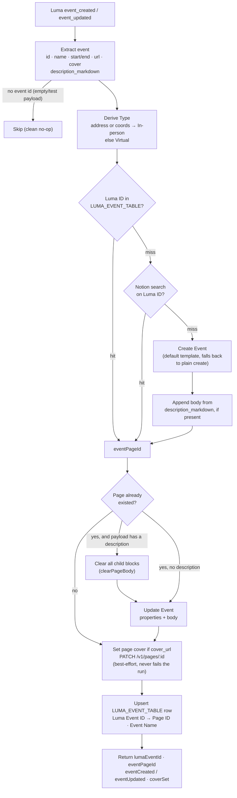

# Luma Event → Notion

Durable workflow that keeps a Notion **Events** record in sync with a Luma event.
Deployed twice — once per trigger — from this single code directory.

| Workflow name | Trigger (`LumaCLIAPI@6.1.0`) |
|---|---|
| `luma-event-created-to-notion` | `event_created` |
| `luma-event-updated-to-notion` | `event_updated` |

## What it does

Idempotent upsert keyed on the Luma event id:

1. Extract the `event` object (the payload is the event itself for `event_*`; the
   nested `event` is also supported so guest payloads can reuse the logic).
2. Derive `Type` — `In-person` if the event has a physical address/coordinates,
   else `Virtual`.
3. **Resolve the page id via the free Zapier Table** (`LUMA_EVENT_TABLE`), falling
   back to a Notion search on the `Luma ID` property.
4. **Create or update** the Notion Event: `Event` (title), `Luma ID`, `Type`,
   `Date` (start/end datetime), `Event page` (url).
4b. **Apply the data source's default template on create** via
   `createItemWithTemplate` — `template_mode: "default"`, falling back to a plain
   create when the data source has none (Events currently has no default
   template, so this is a no-op there today; Contacts does). Because a template
   and inline `content` cannot be sent in one call, the body is a **second**
   `write/page_content` call. See "Notion default templates" below.
5. **Sync the page body** from Luma's `description_markdown` (rendered as Notion
   blocks via `content` + `content_format: markdown`). Luma owns the body — on
   update, existing blocks are cleared first (`clearPageBody` deletes the page's
   children) so the description is *replaced*, not appended. The body is only
   touched when the payload carries a description; **manual edits to the event
   page body will be overwritten** on the next `event_updated`.
6. **Set the page cover** from `event.cover_url` via a best-effort
   `PATCH /v1/pages/{id}` (`sdk.fetch`) — the create/update actions can't set covers.
7. **Upsert the `LUMA_EVENT_TABLE` row** (`Luma Event ID` → `Page ID`, `Event Name`)
   so guest workflows resolve the event without a Notion call.

## Workflow



## Notion default templates

Page creation goes through `createItemWithTemplate`, which applies the data
source's **default template** so automation-created pages match hand-made ones
(icon, body blocks, template property defaults). Two Notion-action constraints
shape it:

1. `template_mode: "default"` **throws** on a data source with no default
   template (`No default template is configured for this data source`). The
   helper catches that single error and retries without it — no per-data-source
   config, and a template added in Notion later is picked up automatically.
   Current state: **Contacts has** a default template (blue `user-circle-filled`
   icon); **Events and Event Attendance do not**.
2. A template and inline `content` are **mutually exclusive** in one call, so
   body content is appended in a second `write/page_content` call.

Properties you pass still win — Notion's docs: "Any properties you provide here
override the template's defaults."

> ⚠️ **Interaction with body sync:** on `event_updated` this workflow *clears
> all* child blocks before rewriting the description (Luma owns the body). If a
> default template with body blocks is ever added to the **Events** data source,
> those blocks would be wiped on the next update. Revisit `clearPageBody` if that
> changes.

## Connections

| Alias | App key | Connection |
|---|---|---|
| `notion_wf` | `NotionCLIAPI` | Notion (work.flowers \| Dennis) — `02b73654-15c8-85c3-b16a-07304d2beb17` |

Trigger source connection (`authentication_id`): Luma **Calendar · workFlowers Events**
`020ea5fc-59b8-8042-b128-49a6d0ed6f48`.

## IDs

- Events data source: `65490a1e-aa79-4884-932b-60e88db67042`
- Luma Event ID → Notion Page ID table: `01KY6MEV55JF723XYDEE4EP0T6`

## Test

```bash
SOURCE_FILES="$(jq -n --rawfile workflow workflow.ts '{"workflow.ts": $workflow}')"
zapier-sdk --experimental run-durable "$SOURCE_FILES" \
  --dependencies '{"@zapier/zapier-sdk":"0.86.0","zod":"4.4.3"}' \
  --zapier-durable-version '0.9.1' \
  --connections '{"notion_wf":{"connectionId":"02b73654-15c8-85c3-b16a-07304d2beb17"}}' \
  --input '{"id":"evt-…","name":"…","start_at":"…","end_at":"…","url":"…","cover_url":"…"}' \
  --private
```

## Deploy

```bash
SOURCE_FILES="$(jq -n --rawfile workflow workflow.ts '{"workflow.ts": $workflow}')"
zapier-sdk --experimental create-workflow "luma-event-created-to-notion" \
  --description "Luma event created -> create/upsert the Notion Event record (keyed on Luma ID)." \
  --private --json
# capture the workflow id, then (repeat with event_updated for the update workflow):
zapier-sdk --experimental publish-workflow-version <workflow-id> "$SOURCE_FILES" \
  --dependencies '{"@zapier/zapier-sdk":"0.86.0","zod":"4.4.3"}' \
  --zapier-durable-version '0.9.1' \
  --connections '{"notion_wf":{"connectionId":"02b73654-15c8-85c3-b16a-07304d2beb17"}}' \
  --trigger '{"selected_api":"LumaCLIAPI@6.1.0","action":"event_created","authentication_id":"020ea5fc-59b8-8042-b128-49a6d0ed6f48","params":{}}' \
  --enabled --json
```

`selected_api` must be version-pinned (`LumaCLIAPI@6.1.0`) or the trigger claim fails
silently. Verify `get-workflow` shows `enabled: true` and `triggers[0].status: "active"`.
