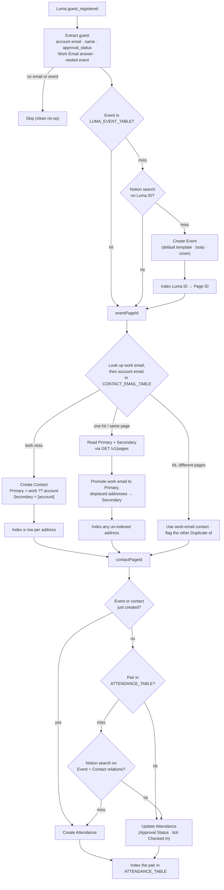

# Luma Guest Registered → Notion Event Attendance

Durable workflow (trigger **`guest_registered`**, `LumaCLIAPI@6.1.0`) that upserts a Notion
**Event Attendance** record from a Luma guest. Replaces the retired
`contrast-registrations-to-event-attendance` workflow.

> **This is the SOLE CREATOR** of Event / Contact / Attendance records for the guest flow.
> The sibling [`luma-guest-updated-to-event-attendance`](../luma-guest-updated-to-event-attendance)
> (trigger `guest_updated`) is **lookup/update-only** and never creates.
>
> **Why the split:** Luma fires `guest.registered` **and** `guest.updated` within ~150ms of a
> single new registration. When both workflows could create, they raced and produced duplicate
> Attendance (and Contact) records — neither saw the other's just-created record (Notion search
> lags, and this Zapier account has no unique-Table constraint to claim atomically). Making
> creation single-owner eliminates the race.

## What it does

1. Extract the guest: `email` (required), name, `approval_status`, `registered_at`,
   `checkedIn` (any `tickets[].checked_in_at` set), the **`Work Email` registration
   answer** (see below), and the nested `event`.
2. **Resolve the Event** — free `LUMA_EVENT_TABLE` lookup → Notion `Luma ID` search →
   create from the guest's `event` object (rich, incl. page cover) and index the table.
3. **Resolve the Contact** — work email, then Luma account email, each → page-id via
   `CONTACT_EMAIL_TABLE`; create in Contacts (`Name`, `Primary Email`,
   `Secondary Email`, `First`/`Last Name`) and index a row per address
   (`Trigger Contact Creation: false`) if missing. On an existing contact, reconcile
   the emails (see below).
4. **Upsert Attendance**, deduped on the `<eventPageId>::<contactPageId>` pair:
   - **Resolve via the free `ATTENDANCE_TABLE`** first (no Notion read). If the event
     or contact was *just created* this run, skip the lookup entirely (nothing can
     pre-exist) and create directly.
   - On a Table miss, fall back to a Notion `find_data_source_item` search on the
     `Event` + `Contact` relations (backfills pre-Table / Contrast-era records).
   - **Create** → `Approval Status` (mapped from `approval_status`), `Checked In`
     (if checked in), `Registration Date`. No title (a native automation sets `ATT-<id>`).
   - **Update** → refresh `Approval Status`; only ever tick `Checked In` true (never
     un-tick on a later non-checkin update); `Registration Date` left untouched.
   - **Index** the pair into `ATTENDANCE_TABLE` unless it was already resolved from
     there — so repeat guest triggers for the same pair cost zero Notion reads.

### Approval-status mapping

`approved`→Approved · `pending_approval`/`pending`→Pending Approval ·
`waitlist`→Waitlist · `declined`/`rejected`→Declined · `invited`→Invited · (default Approved)

Physical check-in is tracked separately in the **`Checked In`** checkbox, not in the select.

## Work email → `Primary Email`

The Luma events ask for a **work email** as a registration question, because a guest's
Luma account address is often a personal one. When that answer is present it becomes the
contact's `Primary Email`, and the Luma account address is kept in the `Secondary Email`
multi-select.

**The rule:** the guest's own work-email answer always wins the Primary slot. Whatever it
displaces — the previous `Primary Email`, plus the Luma account address — moves into
`Secondary Email`, so **no address is ever lost**. That includes a Primary set earlier by
[`enrich-contact-records`](../enrich-contact-records): the answer the guest just typed is
treated as the fresher signal.

| Contact before | Work-email answer | Contact after |
|---|---|---|
| *(none — new contact)* | `d@acme.io` | Primary `d@acme.io` · Secondary `[luma@gmail.com]` |
| Primary `luma@gmail.com` | `d@acme.io` | Primary `d@acme.io` · Secondary `[luma@gmail.com]` |
| Primary `old@acme.com` | `d@acme.io` | Primary `d@acme.io` · Secondary `[old@acme.com, luma@gmail.com]` |
| Primary `d@acme.io` · Secondary `[luma@gmail.com]` | `d@acme.io` | *(no write — already settled)* |

### How the answer is found

Luma delivers registration answers twice — `registration_answers` (an array of
`{ label, value, answer, value_text, question_id }`) and `registration_answers_by_label`
(snake_cased label → value). The array is read first, the map as a fallback.

Matching is on the **label**, not a hardcoded `question_id`: Luma mints a fresh question id
per event, so the same "Work Email" question has a different id on every event. A label
qualifies when it mentions an email **and** a work-ish word (`work`, `business`, `company`,
`corporate`, `office`, `professional`) — so `Work Email`, `Business e-mail address` and
`What's your company email?` all match, while a plain `Email` does not. Add a differently
worded question and it keeps working with no code change.

An answer that is blank, not a valid email, or just repeats the Luma account address is
treated as absent — the workflow then behaves exactly as it did before this feature.

### Contact resolution with two addresses

Both addresses are looked up in `CONTACT_EMAIL_TABLE` (free ops). The work email is tried
first, since it's the identity the guest is asserting.

| Work email row | Account email row | Result |
|---|---|---|
| miss | miss | **Create** the contact with Primary = work, Secondary = `[account]`; index both rows |
| hit | miss / same page | Use it; reconcile emails per the rule above; index the missing row |
| miss | hit | Use it; **promote** the work email; index the work-email row |
| hit | hit, **different page** | Two contacts for one person. Use the work-email contact, leave both records' emails alone, and flag the account-email record `Duplicate of` the work-email one (the same convention [`contact-emails-to-zapier-table`](../contact-emails-to-zapier-table) uses) so it can be merged by hand. |

Every address put on a contact is also indexed in `CONTACT_EMAIL_TABLE` here, rather than
relying on the Contacts DB automation behind `contact-emails-to-zapier-table` to catch the
edit — a contact email missing from that table is what creates duplicate contacts on the
guest's next registration.

### Why the emails are read over raw REST

`Secondary Email` is a **multi-select**, and writing a multi-select **replaces** the whole
option list — appending an address without first reading the current list would silently
drop every address already on the contact. `find_data_source_item` can't read a
multi-select back either, so the current state comes from a raw
`GET /v1/pages/{id}` via `sdk.fetch` (the same idiom as the page-cover `PATCH`). The read
and the write share **one** `ctx.step`, so a step retry re-reads the contact rather than
writing a multi-select computed from stale state.

## Workflow



## Notion default templates

All three creates (Event, Contact, Attendance) go through
`createItemWithTemplate`, which applies the data source's **default template** so
automation-created pages match hand-made ones (icon, body blocks, template
property defaults). Two Notion-action constraints shape it:

1. `template_mode: "default"` **throws** on a data source with no default
   template (`No default template is configured for this data source`). The
   helper catches that single error and retries without it — no per-data-source
   config, and a template added in Notion later is picked up automatically.
   Current state: **Contacts has** a default template (blue `user-circle-filled`
   icon); **Events and Event Attendance do not**.
2. A template and inline `content` are **mutually exclusive** in one call, so the
   event body (Luma's description) is appended in a second `write/page_content`
   call.

Properties you pass still win — Notion's docs: "Any properties you provide here
override the template's defaults." Verified live: a contact created by this
workflow now carries the template icon while keeping its own Name/email.

## Connections

| Alias | App key | Connection |
|---|---|---|
| `notion_wf` | `NotionCLIAPI` | Notion (work.flowers \| Dennis) — `02b73654-15c8-85c3-b16a-07304d2beb17` |

Trigger source connection (`authentication_id`): Luma **Calendar · workFlowers Events**
`020ea5fc-59b8-8042-b128-49a6d0ed6f48`.

## IDs

- Events / Event Attendance / Contacts data sources:
  `65490a1e-aa79-4884-932b-60e88db67042` / `a591ecac-259f-4490-8f09-f7fddd556eed` /
  `21991b07-11ac-81a6-a894-000be4a09a67`
- Email → Contact page-id table: `01JYEPSEARXB2Z6BJRCMFGXBC2`
- Luma Event ID → Notion Page ID table: `01KY6MEV55JF723XYDEE4EP0T6`
- Event Attendance index table (`Match Key`, `Attendance Page ID`, `Event Page ID`, `Contact Page ID`): `01KY6NDTW05196F1A3G3XY3ESY`

## Test

```bash
SOURCE_FILES="$(jq -n --rawfile workflow workflow.ts '{"workflow.ts": $workflow}')"
zapier-sdk --experimental run-durable "$SOURCE_FILES" \
  --dependencies '{"@zapier/zapier-sdk":"0.86.0","zod":"4.4.3"}' \
  --zapier-durable-version '0.9.1' \
  --connections '{"notion_wf":{"connectionId":"02b73654-15c8-85c3-b16a-07304d2beb17"}}' \
  --input '{"email":"…","first_name":"…","approval_status":"approved","registered_at":"…","tickets":[{"checked_in_at":null}],"registration_answers":[{"label":"Work Email","value":"…"}],"event":{"id":"evt-…","name":"…","start_at":"…"}}' \
  --private
```

Verified end-to-end 2026-07-26 against the real `evt-9jYYQfY4U8I0jDJ` event with throwaway
`@wf-probe.invalid` addresses: a new guest with a work-email answer got Primary = work
email and Secondary = `[account]`; re-running with a changed answer promoted the new address
and pushed the displaced one into Secondary **without** creating a second contact. All test
records (contact, attendance, the company the domain-match automation spun up, and the four
Table rows) were removed afterwards.

## Deploy

```bash
SOURCE_FILES="$(jq -n --rawfile workflow workflow.ts '{"workflow.ts": $workflow}')"
zapier-sdk --experimental create-workflow "luma-guest-registered-to-event-attendance" \
  --description "Luma guest registered -> upsert Notion Event Attendance." --private --json
# capture the workflow id, then (repeat with guest_updated for the update workflow):
zapier-sdk --experimental publish-workflow-version <workflow-id> "$SOURCE_FILES" \
  --dependencies '{"@zapier/zapier-sdk":"0.86.0","zod":"4.4.3"}' \
  --zapier-durable-version '0.9.1' \
  --connections '{"notion_wf":{"connectionId":"02b73654-15c8-85c3-b16a-07304d2beb17"}}' \
  --trigger '{"selected_api":"LumaCLIAPI@6.1.0","action":"guest_registered","authentication_id":"020ea5fc-59b8-8042-b128-49a6d0ed6f48","params":{}}' \
  --enabled --json
```

`selected_api` must be version-pinned (`LumaCLIAPI@6.1.0`) or the trigger claim fails
silently. Verify `get-workflow` shows `enabled: true` and `triggers[0].status: "active"`.
