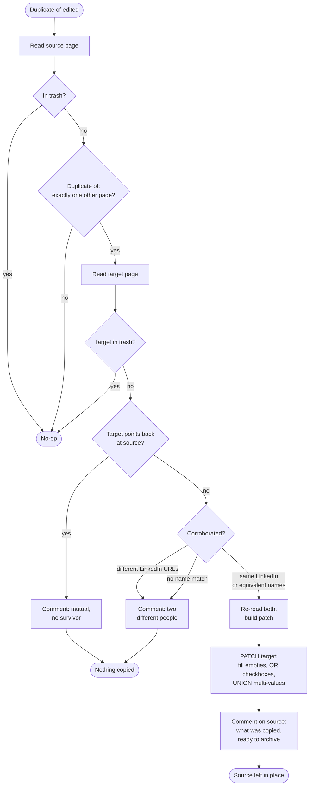

# Merge Duplicate Contacts

Merges a Notion Contact into the record its `Duplicate of` relation points at —
**only** when the two are corroborated as the same person, and **never** by deleting
anything.

Replaces the "Contact Merger" Notion Custom Agent, which was disabled on 2026-07-28.

## Trigger

Notion DB automation on **Contacts**, `Duplicate of` **edited** → this workflow's catch
URL. See `zap.json` for `trigger.webhook_url` — that's the URL the automation posts to,
*not* the internal `trigger_url`.

`Duplicate of` now means one thing only: *a person has confirmed these are the same
record.* No Zap writes it any more — `contact-emails-to-zapier-table` and
`luma-guest-registered-to-event-attendance` write `Possible duplicate of` instead.

**The automation payload carries only the page id — zero properties.** So the workflow
reads `Duplicate of` (and everything else) from a fresh page read. Anything that trusted
the payload would conclude the relation was empty and silently do nothing, which is a
failure mode with no error to notice. Notion also sends one empty delivery
(`{"querystring": {}}`) when the automation is first configured; that is handled as a
clean no-op rather than a failed run.

Wired and verified live on 2026-07-28 — see the Test section.

## Why it replaced an agent

The agent read `Duplicate of` as "merge these and delete one". Three of its failures
were not fixable by rewording its instructions:

1. **It fired on any edit, including a Zap's.** Both Zaps wrote `Duplicate of` as a
   review flag on a single shared email address. On 2026-07-28 a one-address collision
   between **Sachin Kolekar** (Knoxx Foods) and **Lionel Sim** (The AI Capitol) —
   unrelated people — made it merge the two records.
2. **Its `Secondary email` step SET the multi-select instead of appending.** The target
   lost addresses it already had; Sachin lost his own.
3. **It deleted the source without approval.** Leo Selie and a duplicate Lionel page
   went to the trash that way before anyone noticed.

Each of those is a semantic a prompt can only *ask* for. Here they're types and control
flow: a union cannot be forgotten, a guard cannot be talked around, and there is no
delete call to mis-fire.

## Flow



## Corroboration

A set `Duplicate of` is the *request*, not the evidence.

| Signal | Effect |
|---|---|
| Both have a LinkedIn URL, and they **differ** | **Hard decline.** Two real people — this beats a name match |
| Same LinkedIn profile slug | Merge |
| Equivalent names | Merge |
| Anything else | Decline, with a comment |

- **Name keys sort their tokens**, so "Sim Lionel" and "Lionel Sim" compare equal —
  Luma sends whatever the guest typed. Under two tokens the key is `""` and never
  matches: a lone "Grace" is far too weak to merge two records on.
- **A shared email domain is deliberately not a signal.** Colleagues share a work
  domain (Sachin and Minnie Dua are both `@knoxxfoods.com`) and strangers share
  consumer ones. This is the check that would have stopped 2026-07-28: Sachin and
  Lionel shared one address, no name match, and different LinkedIn profiles.
- Differing employers or email domains are **not** a disqualifier on their own —
  people change jobs.

## Copy rules

Source → target, and only ever additively:

| Property kind | Rule |
|---|---|
| `title`, `rich_text`, `number`, `select`, `status`, `date`, `url`, `email`, `phone_number`, `files` | Fill the target only when it is **empty**. Never overwrite |
| `checkbox` | OR — true if either record is true |
| `multi_select`, `people`, `relation` | **Union** of the target's current value and the source's |
| `formula`, `rollup`, `created_*`, `last_edited_*`, `unique_id`, `button`, `verification` | Skipped — Notion computes them and rejects the write |
| `Duplicate of`, `Duplicated by`, `Possible duplicate of`, `Possible duplicates` | **Never copied** |

Those four relations are excluded for two different reasons. The first pair is what
triggers this workflow, so copying it is a self-trigger by construction. The second is a
review queue — propagating one contact's unresolved questions onto another manufactures
the next false positive.

**A write that removes an existing value is always a bug.** Two consequences:

- A relation in a page read is capped at 25 entries and flagged `has_more`. Paging it is
  not optional — a union built from a truncated list would prune everything past the cap
  on write. If the full list can't be read, the property is **skipped** and says so in
  `skippedProperties`.
- The read and the PATCH live in **one** `ctx.step`, so a retry re-reads both pages
  rather than patching from state that has since moved.

## Nothing is deleted

The source stays exactly where it is. It gets a comment listing what was copied and
saying it's ready for a person to archive. If the source is **older** than the target,
the comment says so — the survivor may be the wrong way round, and that's a judgement
call, not a rule.

## Comments

One comment per `(source, target, outcome)`. The outcome is part of the marker
(`[merge-duplicate-contacts:merged]`, `:declined`, `:mutual`), which matters: a
per-*pair* marker meant a "declined" comment suppressed the later "merged" comment for
the same pair, so a merge that happened after someone fixed the names left no audit
trail and no ready-to-archive signal. Caught by the pre-publish test, not in production.

Silent by design (no comment, no changes): `Duplicate of` empty, self-referential, or
with more than one target; either page in the trash. Those are noise, not decisions
anyone needs to see.

## Writes go through a raw PATCH

`update_database_item` is not used. This workflow touches arbitrary properties, and that
action's cached schema omits recently-added ones — a `properties|||New Prop|||relation`
key that doesn't exist yet fails at run time. `PATCH /v1/pages/{id}` with a Notion
properties object sidesteps the cache entirely.

Raw `sdk.fetch` calls are billed (only Zapier Tables ops are free). A merge costs
roughly 5–8 requests: two page reads, any relation paging, one PATCH, one comment
listing, one comment write. Merges are rare, so this is not a hot path.

## Known limitations

- **Page content is not merged**, only properties. A source with body blocks needs those
  moved by hand before archiving.
- `files` properties are filled only when the target is empty, rather than unioned —
  appending externally-hosted files reliably is fiddly and no Contact currently needs it.
- A **third** record pointing at either half is not considered. Each run looks at one
  pair.
- The merge does not touch the email → page-id Zapier Table. That stays
  `contact-emails-to-zapier-table`'s job, driven by the `Secondary Email` edit this
  workflow's union produces.

## Test

Both paths write to real Notion — use throwaway contacts and archive them afterwards.

```bash
SOURCE_FILES="$(jq -n --rawfile workflow workflow.ts '{"workflow.ts": $workflow}')"
zapier-sdk --experimental run-durable "$SOURCE_FILES" \
  --dependencies '{"@zapier/zapier-sdk":"0.86.0","zod":"4.4.3"}' \
  --zapier-durable-version '0.9.1' \
  --connections '{"notion_wf":{"connectionId":"02b73654-15c8-85c3-b16a-07304d2beb17"}}' \
  --input '{"data":{"id":"<source-contact-page-id>"}}' \
  --private
```

Verified live on 2026-07-28 through the real Notion automation, after wiring:

| Case | Fixture | Result |
|---|---|---|
| Genuine duplicate | "ZZ Live Merge" → "Merge Live ZZ" | `merged: true` — `Job Title` and `Country` filled, `Mailing List` OR'd, `Bio` **not** overwritten, source left in place |
| Different people | Two contacts, different LinkedIn URLs | `merged: false` — *"different LinkedIn profiles (zz-live-one vs zz-live-two)"*, both records untouched |
| Config test delivery | Notion's empty `{"querystring": {}}` | Clean no-op, not a failed run |

Verified earlier the same day with `run-durable`, before publishing:

| Case | Fixture | Result |
|---|---|---|
| Different people | Two contacts, different names, different LinkedIn URLs | `merged: false` — *"different LinkedIn profiles (zz-alpha vs zz-beta)"*, comment posted |
| No usable identity | Both titles empty | Declined — conservative default, no merge |
| Genuine duplicate | "ZZ Same Person" → "Person Same ZZ" (reversed tokens) | `merged: true` — `Job Title` and `Country` filled, `Mailing List` OR'd, `Bio` **skipped** (target already set), `Name` skipped, all four duplicate relations never copied |
| Re-fire after merge | Same pair again | No-op patch, `Already merged` comment, nothing lost |

## Deploy

```bash
SOURCE_FILES="$(jq -n --rawfile workflow workflow.ts '{"workflow.ts": $workflow}')"
zapier-sdk --experimental publish-workflow-version <workflow-id> "$SOURCE_FILES" \
  --dependencies '{"@zapier/zapier-sdk":"0.86.0","zod":"4.4.3"}' \
  --zapier-durable-version '0.9.1' \
  --connections '{"notion_wf":{"connection_id":"02b73654-15c8-85c3-b16a-07304d2beb17"}}' \
  --trigger '{"selected_api":"WebHookCLIAPI@1.1.1","action":"hook_v2","params":{}}' \
  --json
```

Always pass `--trigger`; omitting it silently unclaims the trigger and the Zap stops
firing while still reporting itself enabled.
