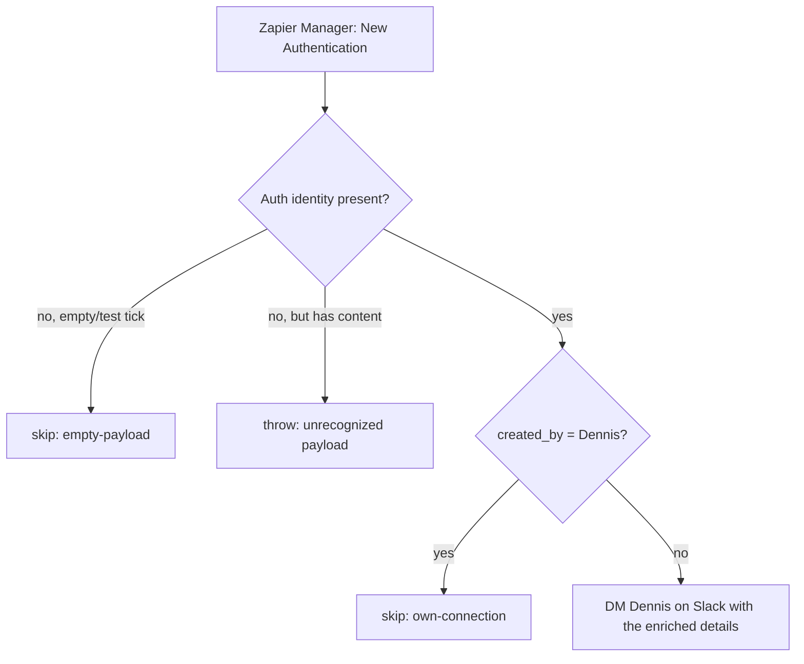

# new-authentication-alert

Migrated from the classic Zap **"New Authentication Alert"**.

When someone **other than Dennis** adds a connection (authentication) to the work.flowers Zapier account, this durable DMs Dennis on Slack — a security/awareness alert.

## Trigger

- **Zapier Manager — "New Authentication"** (`ZapierManagerCLIAPI@1.7.0` / `list_authentications`), a polling trigger, no auth (it monitors the account it runs under).
- `params.account` = `20491667` (the work.flowers account in Zapier Manager's namespace — note this is **not** the `20495893` catch-hook account id in `CLAUDE.md`).

## Logic

1. Extract the authentication record.
2. **"Not me":** skip if `created_by` is `dennis@work.flowers` (his own new connections are expected).
3. Otherwise DM `U07SZ8SA760` (Dennis) on Slack.

## The message (richer than the classic)

The classic alert showed only two lines and mislabeled the connection's account as "App":

```
*New Authentication*
App: peter@work.flowers        ← actually the connection label, not the app
Created by: peter@work.flowers
```

This version reads the **real app from `selected_api`** and adds the timestamp and auth id:

```
*🔐 New authentication added to the work.flowers Zapier account*
*App:* Google Calendar (`GoogleCalendarCLIAPI@1.16.0`)
*Connection:* peter@work.flowers
*Added by:* peter@work.flowers
*When:* 2026-09-15 06:09 UTC
*Auth ID:* 66263854
Review it at <https://zapier.com/app/assets/connections|Connections>.
```

The friendly app name is derived from `selected_api` (strip version + `CLIAPI`, split camelCase); the raw `selected_api` is always shown too, so numbered private apps (`App228555CLIAPI`) are never ambiguous. Lines with no value are omitted.

## Flow



## Maintenance notes

- **Unrecognized-payload posture: throw** (repo default). An empty/test tick skips.
- **Available record fields** (`list_authentications`): `id`, `title` (connection label), `selected_api` (versioned app impl id), `created_by`, `created_at`, `last_updated`. To enrich the message further, those are the fields to draw from.
- Slack flags are sent as `"yes"`/`"no"` strings (the repo's Slack convention), not booleans.
