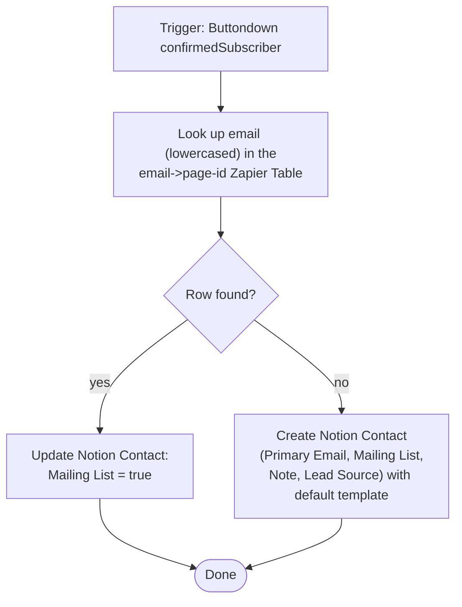

# new-buttondown-subscriber-update-in-notion

Buttondown confirmed-subscriber → Notion Contacts upsert. Marks the contact as on the
Mailing List if they already exist, or creates a new Contact if they don't.

**Status:** enabled on Zapier. Migrated from a classic Zapier UI Zap to a Durable via
the Zapier UI migration tool (2026-07-28), then had its Notion lookup step replaced
with a Zapier Table lookup in the same session.

## What it does

Looks up the subscriber's email in the email→page-id Zapier Table
(`01JYEPSEARXB2Z6BJRCMFGXBC2`, lowercased to match how the sibling
[`contact-emails-to-zapier-table`](../contact-emails-to-zapier-table/) workflow indexes
it). If a row matches, ticks the `Mailing List` checkbox on the contact it points at.
If not, creates a new Notion Contact (`Primary Email`, `Mailing List: true`,
`Note: "Newsletter sign-up"`, `Lead Source: "Newsletter Sign-up"`) with the Contacts
default template applied, falling back to a plain create if that data source ever
loses its default template.

## Workflow



## Trigger

Buttondown `confirmedSubscriber` (`ButtondownCLIAPI@2.0.4`), authenticated via
Buttondown connection `63486162`. Fires once a subscriber confirms via double opt-in.

## Why the Zapier Table instead of a direct Notion lookup

The original (and first-migrated) version queried Notion directly with a raw
`query_database_advanced` OR filter (`Primary Email` equals / `Secondary Email`
multi-select contains). That works, but every other contact-resolution workflow in
this repo ([`email-contact-page-zap`](../email-contact-page-zap/),
[`enrich-contact-records`](../enrich-contact-records/), the Luma guest workflows) has
moved to the shared Table instead — it's free (no Zapier task cost), and it already
indexes every Primary/Secondary email via the sibling sync workflow. Swapping this Zap
onto the same Table keeps contact resolution consistent across the repo instead of each
Zap re-implementing its own Notion filter.

## Known limitations

- **New contacts aren't written to the Table by this workflow.** The sibling
  `contact-emails-to-zapier-table` workflow (Notion DB automation on `Primary Email`/
  `Secondary Email` edited → webhook) is the Table's sole writer and picks up newly
  created contacts asynchronously. If Buttondown ever re-sends the same
  `confirmedSubscriber` event before that sync lands (webhook retry, rapid
  unsubscribe/resubscribe), the Table lookup misses again and this workflow creates a
  **second** Notion contact for the same email. The direct-Notion-lookup version didn't
  have this gap. Left as-is for now — `confirmedSubscriber` events are normally
  one-shot — but if duplicates show up, the fix is to also `TableCLIAPI.write.create_record`
  in the create branch, the way `email-contact-page-zap` does.
- **Table lookups are case-sensitive** (`exact` operator, verified live). The Table is
  indexed lowercase by the sibling sync workflow, so this workflow lowercases the
  lookup email before searching. The email written to the new Contact's `Primary Email`
  keeps whatever casing Buttondown sent.

## Connections

| Alias | App key | Connection | Connection id | Notes |
|---|---|---|---|---|
| `notioncliapi_connection` | `NotionCLIAPI` | work.flowers workspace | `50656433` (numeric) | Not the canonical `notion_wf` UUID (`02b73654-…`) used elsewhere in this repo — carried over from the classic Zap's connection. Verified live (2026-07-28) that it resolves the work.flowers Contacts data source correctly, not Knoxx. Left as-is since it works; repoint to the canonical UUID connection if this one is ever retired. |

## Test

```bash
SOURCE_FILES="$(jq -n --rawfile workflow workflow.ts '{"workflow.ts": $workflow}')"
zapier-sdk --experimental run-durable "$SOURCE_FILES" \
  --dependencies '{"zod":"4.3.6","@zapier/zapier-sdk":"0.70.2"}' \
  --zapier-durable-version '0.8.0' \
  --connections '{"notioncliapi_connection":{"connection_id":50656433}}' \
  --input '{"email_address":"test@example.test"}' \
  --private
```

Writes a real test contact to Notion — use a throwaway `@example.test` address and
clean up afterwards.

## Deploy

```bash
SOURCE_FILES="$(jq -n --rawfile workflow workflow.ts '{"workflow.ts": $workflow}')"
zapier-sdk --experimental publish-workflow-version 019fa804-6b6d-7890-987a-f390195bde3f "$SOURCE_FILES" \
  --dependencies '{"zod":"4.3.6","@zapier/zapier-sdk":"0.70.2"}' \
  --zapier-durable-version '0.8.0' \
  --connections '{"notioncliapi_connection":{"connection_id":50656433}}' \
  --app-versions '{"NotionCLIAPI":{"implementation_name":"NotionCLIAPI","version":"2.39.1"}}' \
  --trigger '{"selected_api":"ButtondownCLIAPI@2.0.4","action":"confirmedSubscriber","authentication_id":"63486162","params":{}}' \
  --enabled --json
```
