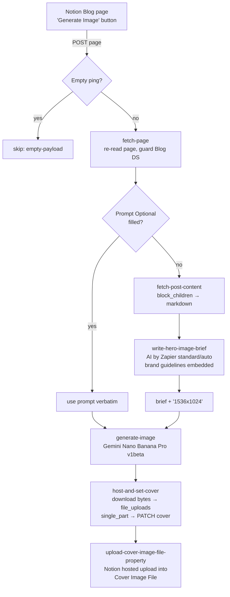

# notion-blog-post-to-hero-image

Durable that generates a brand-aligned hero image for a work.flowers **Blog** post and
attaches it twice: as the page **cover** (a Notion-hosted file) and in the
**Cover Image File** files property (what the Bullet site actually renders).

Replaces the classic Zap **"Generate Blog Post Image"** (webhook → paths →
Anthropic/Gemini → Notion). Cutover done 2026-08-14 — see below.

- **Workflow ID:** `019fffd7-8cfe-74dd-8b2a-db2d9519a86d` · account-visible · enabled
- **Trigger:** Webhooks by Zapier catch hook —
  `https://hooks.zapier.com/hooks/catch/20495893/CYY3ISPRRZdolTFm/`
  (this is the URL the Notion button POSTs to; the `trigger_url` in `zap.json` is Zapier-internal)
- **Editor:** https://zapier.com/durables-editor/019fffd7-8cfe-74dd-8b2a-db2d9519a86d

## Behaviour notes

- **Two prompt sources.** A filled `Prompt (Optional)` property wins and is passed to
  Gemini **verbatim** (the author controls sizing/style). Otherwise the post body is
  read as markdown and an AI step writes the image brief; the workflow appends
  `The image should be 1536x1024`. A page with neither body content nor a prompt
  **throws** — there is nothing to brief the model with.
- **The cover is a hosted file, not an external URL** (Dennis's request, 2026-08-14).
  The classic Zap's custom action (`ae:345724`) stored `external` URLs that rot when
  the Gemini link expires. This durable downloads the bytes (`sdk.fetch`, no
  connection — sandbox egress rule) and single_part-uploads them to Notion. The
  `Cover Image File` property is filled by Notion's `upload_file_to_data_source_item`
  action, which does its own hosted upload (a `file_upload` id attaches only once, so
  the cover's upload can't be reused).
- **Brand guidance lives in the prompt.** The classic Zap attached the
  "Colour & Design Guidelines" PDF as an Anthropic knowledge source; AI by Zapier has
  no knowledge sources, so the palette, the two house styles (editorial 2.5D /
  paper craft) and the exclusion list are embedded in
  [`notion-blog-post-to-hero-image-prompt.md`](notion-blog-post-to-hero-image-prompt.md),
  distilled from the `work-flowers-brand` hero-image-generation skill. Edit the
  markdown, then `node scripts/check-prompts.mjs --fix`.
- **Guards:** empty pings skip (catch URLs get poked during setup); a payload with
  content but no page id throws; a page outside the Blog data source throws rather
  than getting a cover slapped on it.
- **Gemini step returns only the image URL** — the raw action result can carry
  base64/binary fields that must never enter a durable step checkpoint
  (NUL bytes kill the run).

## AI step (repo rule: tier is the task cost)

`AICLIAPI get_completion`, built-in credentials, **`standard/auto`** (1x task). The
classic Zap used the raw Anthropic app on Dennis's own billing with Claude Opus 4.5;
this migration moves to AI by Zapier per repo convention.

Verified cases (re-run these before changing tier):

| Date | Input | Tier | Outcome |
| --- | --- | --- | --- |
| 2026-08-14 | "Your Zaps Finally Have an API" post body (5.3k chars markdown) | standard/auto | On-brand Style-A brief: correct hexes, halftone/ribbon signature elements, single warm accent, exclusions carried through. Judged equivalent in structure/specificity to the classic Opus output. |
| 2026-08-14 | Scratch page, 2-paragraph body, full durable run | standard/auto | End-to-end success: brief → image → hosted cover (859 KB) → property upload. |

## Cutover

Done 2026-08-14: the Blog database's **Generate Image** button property posts to this
durable's catch URL and the classic Zap "Generate Blog Post Image" is off (both
confirmed by Dennis, not machine-verifiable). Runs land in
[run history](https://zapier.com/durables-editor/019fffd7-8cfe-74dd-8b2a-db2d9519a86d).

## Tested

- 2026-08-14 `run-durable`: AI-brief path (scratch Blog page, cover `type: file`,
  property populated), `Prompt (Optional)` path (`promptSource: "notion-property"`),
  and empty-ping skip. Scratch page trashed afterwards.
